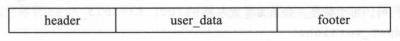
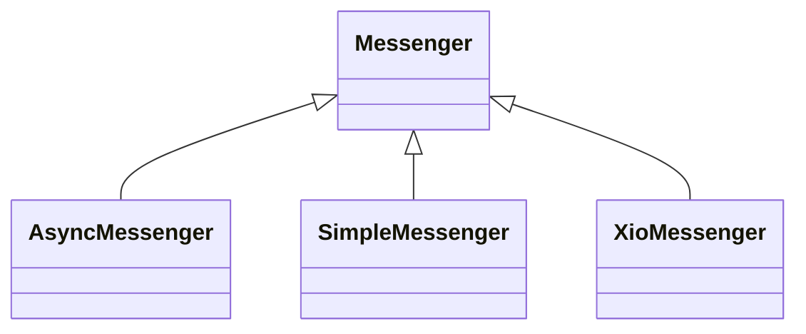

# 第三章 Ceph网络通信

[TOC]


## 3.1 Ceph网络通信框架

源码中三种网络实现方式：

- `Simple` 默认用于生产环境，比较简单和稳定；对于每个网络连接创建2各线程，一个专门接收，一个专门发送。
- `Async` 基于事件的I/O多路复用模式，处于试验阶段。
- `XIO` 使用开源的网络通信库accelio实现，处于试验阶段。

Ceph通过msg目录对上述三种实现方式进行抽象，实现接口与实现分离。

### 3.1.1 Message



*消息发送格式*

```c++
// 所有消息的基类
class Message : public RefCountedObject {
protected:
  ceph_msg_header  header;   // 消息头
  ceph_msg_footer  footer;   // 消息尾
  bufferlist       payload;  // "front" unaligned blob
  bufferlist       middle;   // "middle" unaligned blob
  bufferlist       data;     // data payload (page-alignment will be preserved where possible)
    
  utime_t recv_stamp;          // 开始接收数据的时间戳
  utime_t dispatch_stamp;      // dispatch的时间戳
  utime_t throttle_stamp;      // 获取throttle的slot的时间戳
  utime_t recv_complete_stamp; // 接收完成的时间戳
  ConnectionRef connection;    // 网络连接类
  uint32_t magic;              // 消息的魔术字
  bi::list_member_hook<> dispatch_q; // boost::intrusive需要的字段

protected:
  CompletionHook* completion_hook; // owned by Messenger
  Throttle *byte_throttler;
  Throttle *msg_throttler;
  uint64_t dispatch_throttle_size;
};
```

```c++
/* 消息头 */
struct ceph_msg_header {
	__le64 seq;       /* 序号 */
	__le64 tid;       /* 唯一id */
	__le16 type;      /* 消息类型 */
	__le16 priority;  /* 优先级 */
	__le16 version;   /* 消息编码的版本 */

	__le32 front_len; /* payload的长度 */
	__le32 middle_len;/* middle的长度 */
	__le32 data_len;  /* data的长度 */
	__le16 data_off;  /* 对象的数据偏移量 */


	struct ceph_entity_name src; /* 消息源 */

	/* 兼容旧代码 */
	__le16 compat_version;
	__le16 reserved;
	__le32 crc;       /* header crc32c */
} __attribute__ ((packed));
```

```c++
/* 消息尾 */
struct ceph_msg_footer {
	__le32 front_crc, middle_crc, data_crc; // crc校验码
	__le64  sig; // 消息的64位signature
	__u8 flags;  // 结束标志
} __attribute__ ((packed));
```

### 3.1.2 Connection

```c++
// 网络连接
struct Connection : public RefCountedObject {
  mutable Mutex lock;                         // 锁
  Messenger *msgr;
  RefCountedObject *priv;                     // 链接的私有数据
  int peer_type;                              // peer类型
  entity_addr_t peer_addr;                    // peer地址
  utime_t last_keepalive, last_keepalive_ack; // 最后发送keeplive时间，最后一次接收keepalive的ACK时间
private:
  uint64_t features; // 标志位
public:
  bool failed;       // 是否为lossy链接（无效链接）

  int rx_buffers_version;                           // 接收缓存区的版本
  map<ceph_tid_t,pair<bufferlist,int> > rx_buffers; // 接收缓冲区映射{key:消息标识，value:缓冲区+版本}
}
```

Connection提供了端(port)对端(port)的socket链接的封装。

### 3.1.3 Dispatcher

```c++
// 消息分发接口
class Dispatcher {
public:
  explicit Dispatcher(CephContext *cct_)
    : cct(cct_)
  {
  }
  virtual ~Dispatcher() { }
  virtual bool ms_can_fast_dispatch(Message *m) const { return false;}
  virtual bool ms_can_fast_dispatch_any() const { return false; }
  virtual void ms_fast_dispatch(Message *m) { assert(0); } // 快速分发
  virtual void ms_fast_preprocess(Message *m) {}
  virtual bool ms_dispatch(Message *m) = 0;                // 单个消息分发
  virtual void ms_handle_connect(Connection *con) {}
  virtual void ms_handle_fast_connect(Connection *con) {}
  virtual void ms_handle_accept(Connection *con) {}
  virtual void ms_handle_fast_accept(Connection *con) {}
  virtual bool ms_handle_reset(Connection *con) = 0;
  virtual void ms_handle_remote_reset(Connection *con) = 0;
  virtual bool ms_get_authorizer(int dest_type, AuthAuthorizer **a, bool force_new) { return false; }
  virtual bool ms_verify_authorizer(Connection *con,
				    int peer_type,
				    int protocol,
				    ceph::bufferlist& authorizer,
				    ceph::bufferlist& authorizer_reply,
				    bool& isvalid,
				    CryptoKey& session_key) { return false; }
protected:
  CephContext *cct;
};
```

Dispatcher是消息分发接口。

### 3.1.4 Messenger

```c++
class Messenger {
private:
  list<Dispatcher*> dispatchers;
  list <Dispatcher*> fast_dispatchers;

protected:
  entity_inst_t my_inst;
  int default_send_priority;
  bool started;
  uint32_t magic;
  int socket_priority;

public:
  CephContext *cct;
  int crcflags;
};
```

Messenger是整个网络抽象模块，定义了网络模块的基本API接口。



### 3.1.5 网络连接的策略

```c++
struct Policy {
    bool lossy;      // 是否启用：连接出错时删除
    bool server;     // 是否为服务端
    bool standby;    // 该连接是否处于等待状态
    bool resetcheck; // 是否启用：连接出错后重连
    
    // 流控操作
    Throttle *throttler_bytes;
    Throttle *throttler_messages;
    
    // 本地端的一些feature标志
    uint64_t features_supported;
    // 远程端需要的一些feature标志
    uint64_t features_required;
};
```

### 3.1.6 网络模块的使用

- Server程序分析（`test/messenger/simple_server.cc`）

  1. 创建一个Messenger的实例；

     ```c++
     messenger = Messenger::create(g_ceph_context, g_conf->ms_type,
     				      entity_name_t::MON(-1),
     				      "simple_server",
     				      0 /* nonce */);
     ```

  2. 设置Messenger属性；

     ```c++
     messenger->set_magic(MSG_MAGIC_TRACE_CTR);
     	messenger->set_default_policy(
     	  Messenger::Policy::stateless_server(CEPH_FEATURES_ALL, 0));
     ```

  3. bind服务端地址；

     ```c++
     r = messenger->bind(bind_addr);
     	if (r < 0)
     		goto out;
     
     common_init_finish(g_ceph_context);
     ```

  4. 创建Dispatcher并添加到Messenger；

     ```c++
     dispatcher = new SimpleDispatcher(messenger);
     
     messenger->add_dispatcher_head(dispatcher);
     ```

  5. 启动Messenger。

     ```c++
     messenger->start();
     messenger->wait();
     ```

- Client程序分析（`test/messenger/simple_client.cc`）

  1. 调用Messenger的函数create创建一个Messenger的实例；

     ```c++
     messenger = Messenger::create(g_ceph_context, g_conf->ms_type,
     				      entity_name_t::MON(-1),
     				      "client",
     				      getpid());
     ```

  2. 设置相关策略；

     ```c++
     messenger->set_magic(MSG_MAGIC_TRACE_CTR);
     messenger->set_default_policy(Messenger::Policy::lossy_client(0, 0));
     ```

  3. 创建Dispatcher类并添加，用于接收消息；

     ```c++
     dispatcher = new SimpleDispatcher(messenger);
     messenger->add_dispatcher_head(dispatcher);
     dispatcher->set_active();
     ```

  4. 启动消息；

     ```c++
     r = messenger->start();
     if (r < 0)
     	goto out;
     ```

  5. 开始发送请求，获取目标Server的连接先；

     ```c++
     conn = messenger->get_connection(dest_server);
     ```

  6. 通过Connection来发送请求消息。

     ```c++
     Message *m;
     for (msg_ix = 0; msg_ix < n_msgs; ++msg_ix) {
     	if (! n_dsize) {
     	    m = new MPing();
     	} else {
     	    m = new_simple_ping_with_data("simple_client", n_dsize);
     	}
     	conn->send_message(m);
     }
     ```


## 3.2 Simple实现

### 3.2.1 SimpleMessager

```c++
class SimpleMessenger : public SimplePolicyMessenger {
public:
  Accepter accepter;            // 用于接受客户端的链接请求
  DispatchQueue dispatch_queue; // 接收到的请求的消息分发队列
private:
  uint64_t nonce;
  Mutex lock;
  bool need_addr;
private:
  bool did_bind;                   // 是否绑定
  __u32 global_seq;                // 生成全局的消息seq
  ceph_spinlock_t global_seq_lock; // 用于保护global_seq
  ceph::unordered_map<entity_addr_t, Pipe*> rank_pipe; // 地址到pipe映射
  set<Pipe*> accepting_pipes;      // 正在处理的pipes
  set<Pipe*>      pipes;           // 所有的pipes
  list<Pipe*>     pipe_reap_queue; // 准备释放的pipes
  int cluster_protocol;            // 内部集群的协议版本
  Throttle dispatch_throttler;
  bool reaper_started, reaper_stop;
  Cond reaper_cond;
  Cond  wait_cond;

public:
  int timeout;
  ConnectionRef local_connection;
  uint64_t local_features;
} ;
```

### 3.2.2 Accepter

```c++
class Accepter : public Thread {
  SimpleMessenger *msgr;
  bool done;
  int listen_sd;  // 监听的端口
  uint64_t nonce;
};
```

### 3.2.3 DispatchQueue

```c++
class DispatchQueue {
  CephContext *cct;
  SimpleMessenger *msgr;
  mutable Mutex lock;
  Cond cond;

  PrioritizedQueue<QueueItem, uint64_t> mqueue; // 接收消息的优先队列（用于保存消息）

  set<pair<double, Message*> > marrival;        // 接收到的消息集合
  map<Message *, set<pair<double, Message*> >::iterator> marrival_map; // 消息->所在集合位置的映射
```

### 3.2.4 Pipe

```c++
class Pipe : public RefCountedObject {
    class Reader : public Thread {
      Pipe *pipe;
    public:
      explicit Reader(Pipe *p) : pipe(p) {}
      void *entry() { pipe->reader(); return 0; }
    } reader_thread; // 接收线程，用于接收数据

    class Writer : public Thread {
      Pipe *pipe;
    public:
      explicit Writer(Pipe *p) : pipe(p) {}
      void *entry() { pipe->writer(); return 0; }
    } writer_thread; // 发送线程，用于发送数据

    class DelayedDelivery: public Thread { // 用于故障注入测试
      Pipe *pipe;
      std::deque< pair<utime_t,Message*> > delay_queue;
      Mutex delay_lock;
      Cond delay_cond;
      int flush_count;
      bool active_flush;
      bool stop_delayed_delivery;
      bool delay_dispatching; // we are in fast dispatch now
      bool stop_fast_dispatching_flag; // we need to stop fast dispatching
  	};

  public:
    SimpleMessenger *msgr; // msg指针
    uint64_t conn_id;      // 分配给Pipe自己唯一的id

    char *recv_buf;           // 接收缓冲区
    size_t recv_max_prefetch; // 接收缓冲区一次预取的最大值
    size_t recv_ofs;          // 接收的偏移量
    size_t recv_len;          // 接受的长度

    enum {
      STATE_ACCEPTING,
      STATE_CONNECTING,
      STATE_OPEN,
      STATE_STANDBY,
      STATE_CLOSED,
      STATE_CLOSING,
      STATE_WAIT       // just wait for racing connection
    };

  private:
    int sd;                          // pipe对应的socked fd
    struct iovec msgvec[SM_IOV_MAX]; // 发送消息的iovec结构
#if !defined(MSG_NOSIGNAL) && !defined(SO_NOSIGPIPE)
    sigset_t sigpipe_mask;
    bool sigpipe_pending;
    bool sigpipe_unblock;
#endif

  public:
    int port;                 // 链接端口
    int peer_type;            // 链接对方的类型
    entity_addr_t peer_addr;  // 对方地址
    Messenger::Policy policy; // 策略
    
    Mutex pipe_lock;          // pipe锁
    int state;                // 当前链接的状态
    atomic_t state_closed;    // 如果非0，那么状态为STATE_CLOSED

    ceph::shared_ptr<AuthSessionHandler> session_security;

  protected:
    friend class SimpleMessenger;
    PipeConnectionRef connection_state;

    utime_t backoff;          // backoff的时间

    bool reader_running, reader_needs_join;
    bool reader_dispatching; /// reader thread is dispatching without pipe_lock
    bool notify_on_dispatch_done; /// something wants a signal when dispatch done
    bool writer_running;

    map<int, list<Message*> > out_q;  // 准备发送的消息优先队列
    DispatchQueue *in_q;              // 接收消息的DispatchQueue
    list<Message*> sent;              // 要发送的消息
    Cond cond;
    bool send_keepalive;
    bool send_keepalive_ack;
    utime_t keepalive_ack_stamp;
    bool halt_delivery;               // 如果pipe队列销毁，停止增加
    
    __u32 connect_seq, peer_global_seq;
    uint64_t out_seq;                 // 发送消息的序列号
    uint64_t in_seq, in_seq_acked;    // 接收到消息序号，ACK序号
  };
```

### 3.2.5 消息的发送

1. 当发送一个消息时，通过Messenger类，获取对应的Connection；

   ```c++
   conn = messenger->get_connection(dest_server);
   ```

2. 当获得一个Connection之后，调用Connection的发送函数来发送消息；

   ```c++
   conn->send_message(m);
   ```

3. 发送线程writer把消息发送出去。

   ```c++
   Message *m = _get_next_outgoing(&data);
   int rc = write_message(header, footer, blist);
   ```

### 3.2.6 消息的接收

1. 每个Pipe对应的线程Reader用于接收消息，入口为`Pipe::reader`；
2. 调用函数`in_q->fast_preprocess(m)`预处理消息；
3. 调用函数`in_q->can_fast_dispatch(m)`进行快速派发，如果不能快速派发，走下一步；
4. 如果不能快速派发，调用`in_q->enqueue(m, m->get_priority(), conn_id)`把接收到的消息加入到`mqueue`队列，由分发线程调用`ms_dispatch`处理。

### 3.2.7 错误处理

错误处理：

1. 关闭当前socket的连接；
2. 重新建立一个socket连接；
3. 重新发送没有接受到ACK应对的消息。
