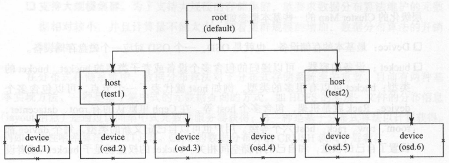
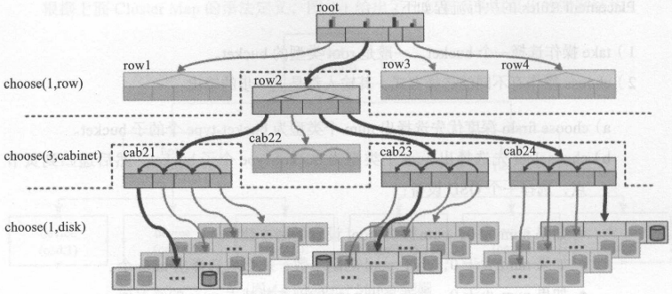
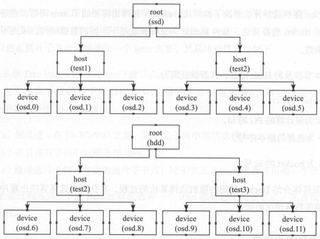
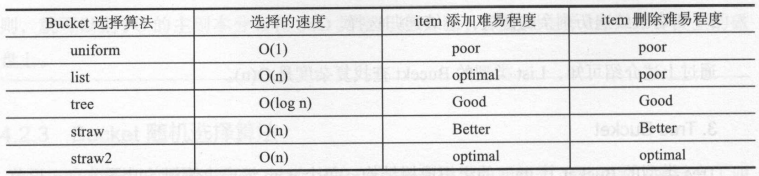
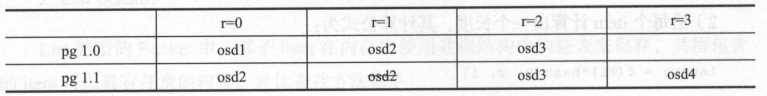

# 第四章 CRUSH数据分布算法

[TOC]


## 4.1 数据分布算法的挑战

存储系统面临的挑战：

- 数据分布和负载的均衡；
- 灵活应对集群伸缩；
- 支持大规模集群。

数据分布算法：

- 基于集中式的元数据查询：文件的分布信息（layout信息）是通过访问集中式元数据服务器获得（HDFS）；
- 基于分布式算法以计算获得（Ceph）。


## 4.2 CRUSH算法的原理

`CRUSH（Controlled Scalable Decentralized Placement of Replicated Data）算法`可控的，可扩展的，分布式的副本数据放置算法。

RADOS对象寻址过程中，PG映射到OSD列表过程：

$CRUSH(X) \rightarrow (OSDi, OSDj, OSDk)$

- $X$要计算的PG的`pg_id`；
- `Hierachical Cluster Map`为Ceph集群的拓扑结构；
- `Placement Rules`为选择策略。

### 4.2.1 层级化的Cluster Map

`机架感知（rack awareness）`通过规则定义，使得副本可以分布在不同的机架，不同的机房中，提供数据的安全性。

层级化Cluster Map基本概念：

- `Device` 最基本的存储设备，也就是OSD，一个OSD对应一个磁盘存储设备；
- `bucket` 设备的容器，可以递归的包含多个设备或者子类型的bucket。



*Cluster Map示例图*

### 4.2.2 Placement Rules

`Placement Rules`决定了一个PG的对象副本如何选择的规则，通过这些自定义的规则，用户可以设定副本在集群中的分布；格式如下：

```txt
tack(a)
choose
	choose firstn {num} type {bucket-type}
	chooseleaf firstn {num} type {bucket-type},
		If {num} == 0, choose pool-nyum-replicas buckets (all available).
		If {num} > 0 && < pool-num-replicas, choose that many buckets.
		If {num} < 0, it means pool-num-replicas - {num}.
Emit
```

1. take操作选择一个bucket（一般是root类型的bucket）；

2. choose操作使用上一步的输出作为输入：

   1. `choose firstn`深度优先选择出num个类型为`bucket-type`个的子bucket；
   2. `chooseleaf`先选择出num个类型为bucket-type个子bucket，然后递归到页节点，选择一个OSD设备：
      - 如果num==0：$pool设置的副本数$；
      - 如果num>0且num<pool的副本数：取$num$；
      - 如果num<0：取$绝对值(pool的副本数-num)$。

3. emit输出结果

   操作`chooseleaf firstn {num} type {bucket-type}`等效于以下操作：

   ```txt
   choose firstn {num} type {bucket-type}
   choose firstn 1 type osd
   ```

例1：



*三个副本分布在三个Cabinet中*

```txt
rule replicated_ruleset {
	ruleset 0
	type replicated
	min_size 1
	max_size 10
	step take root
	step choose firstn 1type row
	step choose firstn 3 type cabinet
	step choose first n 1 type osd
	step emit
}
```

例2：



*主副本分布在SSD上，其它副本分布在HDD上*

```txt
rule ssd-primary {
	ruleset 5
	type replicated
	min_size 5
	max_size 10
	step take ssd
	step chooseleaf firstn 1 type host
	step emit
	step take hdd
	step chooseleaf firstn -1 type host
	step emit
}
```

### 4.2.3 Bucket随机选择算法

Bucket随计算则算法解决了如何从Bucket中选择出需要的子item问题，定义了以下四种Bucket选择算法：



*Bucket选择算法对比*

冲突，失效和过载处理：

当通过Bucket选择算法选出一个OSD后，可能出现冲突（重复选择）或者过载的情况，导致OSD失效，需要通过hash函数重新选择：

$hash(x, r, i)$

- $x$ PG的id
- $r$ 选择的副本数
- $i$ Bucket的id

例：



*冲突选择过程示例*

1. `pg1.0` 根据副本$r$分别等于$0, 1, 2$来计算$hash(x, r, i)$，处理OSD列表${osd1, osd2, osd3}$；
2. `pg1.1` 根据同样的方法：在$R$等于0时选择了$osd2$，在$r$等于1时又选择了$osd2$，产生了冲突。这时用$r$分别等于$2, 3$来继续选择剩余的副本。最终$pg 1.1$选择出的OSD列表为${osd2, osd3, osd4}$。


## 4.3 代码实现分析

### 4.3.1 相关的数据结构

```c++
/*
 * 所有Cluster Map的静态bucket
 */
struct crush_map {
	struct crush_bucket **buckets; // 保存bucket的二维数组
	struct crush_rule **rules;     // 保存crush_rule的二维数组
    ...
}
```

*cursh_map*

```c++
/* Bucket信息 */
struct crush_bucket {
	__s32 id;        /* id（一般为负数） */
	__u16 type;      /* 类型（0：OSD设备） */
	__u8 alg;        /* 选择算法 */
	__u8 hash;       /* hash函数 */
	__u32 weight;    /* 权重 */
	__u32 size;      /* item的数量 */
	__s32 *items;    /* 记录在cursh_map中保存的item的数组下标 */

	/*
	 * 随机排序选择算法的一些Cache的参数
	 * 
	 */
	__u32 perm_x;  /* 要选择的x */
	__u32 perm_n;  /* 排列的总的元素 */
	__u32 *perm;   /* 排列组合的结果 */
};
```

*crush_bucket*

```c++
struct crush_rule {
	__u32 len;                       /* steps的数组长度 */
	struct crush_rule_mask mask;     /* ruleset相关的配置参数 */ 
	struct crush_rule_step steps[0]; /* 操作步 */ 
};
struct crush_rule_mask {
	__u8 ruleset;  /* 编号 */
	__u8 type;     /* 类型 */
	__u8 min_size; /* 最新size */
	__u8 max_size; /* 最大size */
};
struct crush_rule_step {
	__u32 op;   /* step操作步的操作码 */
	__s32 arg1; /* 如果是take：表示bucket的id；如果是select：选择的数量 */
	__s32 arg2; /* 如果是select：选择的类型 */
};
```

*crush_rule*

### 4.3.2 代码实现

```c++

/**
 * CRUSH算法的选择 
 * @map: the crush_map
 * @ruleno: ruleset的号
 * @x: 输入（一般为pg的id）
 * @result: 输出osd列表
 * @result_max: 输出osd列表的数量
 * @weight: 所有osd的权重，通过它来判断osd是否out
 * @weight_max: 所有osd的数量
 * @scratch: scratch vector for private use; must be >= 3 * result_max
 */
int crush_do_rule(const struct crush_map *map,
		  int ruleno, int x, int *result, int result_max,
		  const __u32 *weight, int weight_max,
		  int *scratch)
{
	...
}

```

*cursh_do_rule主要用于CRUSH算法的选择*

```c++
/**
 * 选择需要的副本数，并对选择的OSD做冲突检查
 * @map: the crush_map
 * @bucket: the bucket we are choose an item from
 * @x: crush input value
 * @numrep: the number of items to choose
 * @type: the type of item to choose
 * @out: pointer to output vector
 * @outpos: our position in that vector
 * @out_size: size of the out vector
 * @tries: number of attempts to make
 * @recurse_tries: number of attempts to have recursive chooseleaf make
 * @local_retries: localized retries
 * @local_fallback_retries: localized fallback retries
 * @recurse_to_leaf: true if we want one device under each item of given type (chooseleaf instead of choose)
 * @stable: stable mode starts rep=0 in the recursive call for all replicas
 * @vary_r: pass r to recursive calls
 * @out2: second output vector for leaf items (if @recurse_to_leaf)
 * @parent_r: r value passed from the parent
 */
static int crush_choose_firstn(const struct crush_map *map,
			       struct crush_bucket *bucket,
			       const __u32 *weight, int weight_max,
			       int x, int numrep, int type,
			       int *out, int outpos,
			       int out_size,
			       unsigned int tries,
			       unsigned int recurse_tries,
			       unsigned int local_retries,
			       unsigned int local_fallback_retries,
			       int recurse_to_leaf,
			       unsigned int vary_r,
			       unsigned int stable,
			       int *out2,
			       int parent_r)
{
    ...
}
```

*crush_bucket_firstn*

```c++
/* 根据不同类型的bucket，选择不同的算法来从bucket中选出item */
static int crush_bucket_choose(struct crush_bucket *in, int x, int r)
{
    ...
}
```

*crush_bucket_choose*

```c++
/** 用于straw类型的bucket的选择 */
/* @bucket  @x PGid  @r 副本数*/
static int bucket_straw_choose(struct crush_bucket_straw *bucket,
			       int x, int r)
{
    ...
}
```

*bucket_straw_choose*


## 4.4 对CRUSH算法的评价

CRUSH算法实质上是一种可分层确定性伪随机选择算法；

| 优点                                                         | 缺点                                                         |
| ------------------------------------------------------------ | ------------------------------------------------------------ |
| + 输入`元数据（cluster map, placement rule）`较少，可以应对大规模集群<br>+ 可以应对集群的扩容和缩容<br>+ 采用以概率为基础的统计上的均衡，在大规模集群中可以实现数据均衡 | - 在小规模集群中，会有一定的数据不均衡现象<br>- 增加新设备时，导致旧设备之间也有数据的迁移 |


## 4.5 本章小结