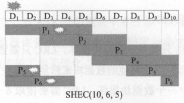
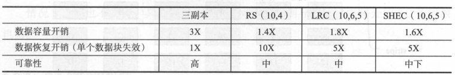
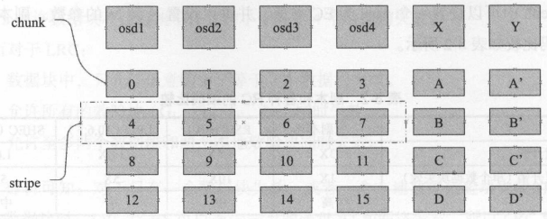

# 第八章 Ceph纠删码

[TOC]

## 8.1 EC的基本原理

`纠删码（Erasure Code, EC）`将写入的数据分成N份原始数据，通过这N份原始数据计算出M份校验数据，可以通过N+M份中任意N份数据块从而还原始数据。

## 8.2 EC的不同插件

评价EC算法的三个指标：

- 空间利用率；
- 数据可靠性；
- 恢复效率。

### 8.2.1 RS编码

RS（ReedSolomon）编码。

$RS(M, K)$

- $M$ 原始数据块数量；
- $K$ 校验数据块数量。

开源实现：

- Jerasure Ceph的默认编码方式
- ISA 仅支持Intel CPU

缺点：

- 在$N+K$个数据块中有任一块数据失效，都需要读取N块数据来恢复丢失的数据，开销较大；

### 8.2.2 LRC编码

`LRC编码` 将`校验块（parity block）`分为`全局校验块（global parity）`和`局部校验块（local reconstruction parity）`从而减少恢复数据的网络开销；其目标在于解决当单个磁盘失效后恢复过程的网络开销，公式如下：

$LRC(M, G, L)$

- $M$ 原始数据块数量；
- $G$ 全局校验块数量；
- $L$ 局部校验块数量。

编码过程：

把数据分成$M$个同等大小的数据块，通过该$M$个数据块计算出$G$份全局校验数据块；然后把$M$个数据块平均分成$L$组，每组计算出一个本地数据校验块，这样共有$L$个局部数据校验块。

例：

*LRC编码举例及其与RS的比较：总共有12个数据块，分别为$D_1 ~ D_{12}$。有两个本地数据校验块$L_1$和$L_2$，$L_1$为通过第一组数据块$D_1 ~ D_6$计算得到的本地校验数据块；$L_2$为第二组数据块$D_7 ~ D_12$计算而得到的本地校验数据块；有2个全局数据校验块$G_1$和$G_2$，它是通过所有数据块$D_1 ~ D_{12}$计算而来；对应RS编码，数据块为$D_1 ~ D_{12}$，计算出的校验块为$P_1 ~ P_4$。*

开销分析：

| 情况                                       | LRC恢复时所需数据块 | RS恢复时所需数据块 |
| ------------------------------------------ | ------------------- | ------------------ |
| 如果数据块$D_1 ~ D_{12}$只有一个数据块损坏 | 6                   | 12                 |
| 如果$L_1$或者$L_2$中一个数据块损坏         | 6                   | -                  |
| 如果$G_1, G_2$其中一个数据损坏             | 12                  | -                  |

最大允许失效的数据块数量：

| RS                                      | LRC                                                          |
| --------------------------------------- | ------------------------------------------------------------ |
| 允许数据块和校验块中任意 <= 4个数据失效 | - 允许任意 <= 2个数据块失效； - 允许所有的验证块（$G_1, G_2, L_1, L_2$）同时失效； - 允许至多两个数据块和两个本地校验块同时失效。 |

### 8.2.3 SHEC编码

$SHEC(K, M, L)$

- $K$ data chunk的数量；
- $M$ parity chunk的数量；
- $L$ 计算parity chunk时需要的data chunk数量。

最大允许失效的数据块数量：$\frac{M \times L}{K}$

*SHEC编码示意图*

### 8.2.4 EC和副本的比较

*副本和各种RC的编码比较*

- 在三副本的情况下，恢复效率和可靠性都比较高，缺点是数据容量开销较大；
- 对于EC的RS编码，和三副本比较，数据开销显著降低，以恢复效率和可靠性为代价；
- LRC编码以数据容量开销略高的代价，换取了数据恢复开销的显著降低；
- SHEC编码用可靠性换代价，在LRC的基础上进一步降低了容量开销。

## Ceph中EC的实现

### 8.3.1 Ceph中EC的基本概念

- `chunk` 一个数据块叫做data chunk，简称chunk，其大小为chunk_size设置的字节数；
- `stripe` 用于计算同一个校验块的一组数据块，称为data stripe；简称stripe，其大小为stripe_width，参与的数据块的数目为stripe_size；

概念之间的关系：

$stripe_width = chunk_size \times stripe_size$

*EC的分片示意图*

### 8.3.2 EC支持的写操作

| 支持的操作                                                   | 部分支持的操作                                               | 不支持的操作                                                 |
| ------------------------------------------------------------ | ------------------------------------------------------------ | ------------------------------------------------------------ |
| + `create object` 创建对象 + `remove object` 删除对象 + `write full` 写整个对象 | + `append write(stripe width aligned)` 追加写入（限定追加操作的其实偏移以`stripe_width`对齐） | - `overwrite` - `append write` 追加写入（写操作的起始偏移offset没有以`stripe_width`对齐）  |

### EC的回滚机制

当前版本（v10.2.1）的回滚机制

- 对于`create object`操作，直接删除该对象；
- 对于`remove object`操作，在执行时并不删除该对象，而是暂时保存该对象；如果需要回滚，就可以直接恢复；
- 对于`write Full`操作，暂时保留旧的对象，创建一个新的对象完成写操作；当需要回滚时，恢复旧的数据对象；
- 对于`append`操作，记录append时的size到PG日志中；当回滚时，对该对象做truncate操作即可。

## 8.4 EC的源代码分析

### 8.4.1 EC的写操作

### 8.4.2 EC的write_full

### 8.4.3 ECBacked

## 8.5 本章小结

