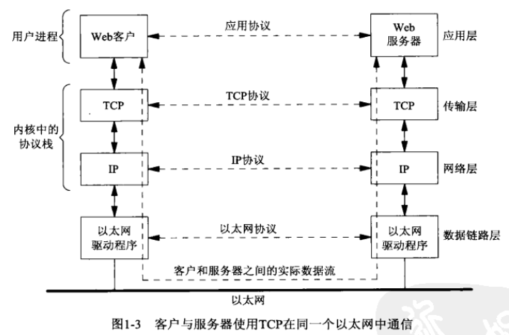
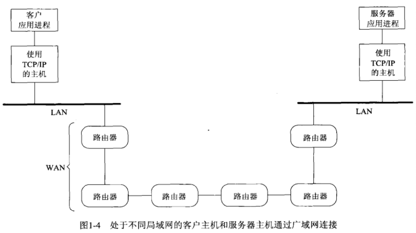
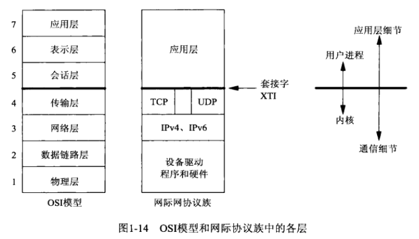
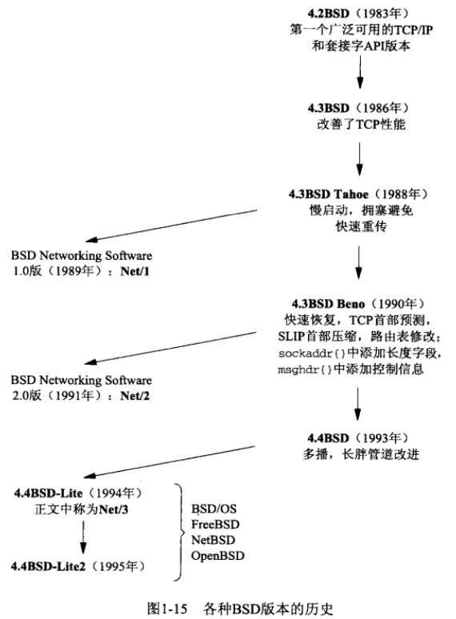
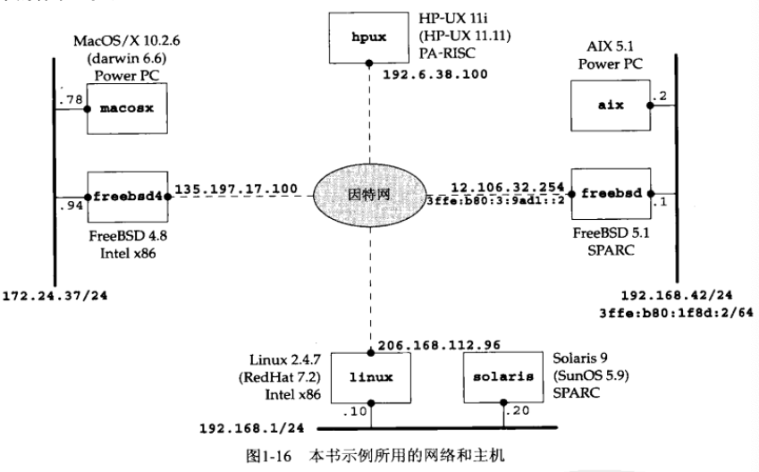

# 第一章 简介和TCP/IP

- [概述](#概述)
- [一个简单的时间获取客户程序](#一个简单的时间获取客户程序)
- [协议无关性](#协议无关性)
- [错误处理：包裹函数](#错误处理_包裹函数)
- [OSI模型](#OSI模型)
- [BSD网络支持历史](#BSD网络支持历史)
- [测试用网络及主机](#测试用网络及主机)
- [64位体系结构](#64位体系结构)


## 概述






## 一个简单的时间获取客户程序

```c
#include "unp.h"

int
main(int argc, char **argv)
{
    int sockfd, n;
    char recvline[MAXLINE + 1];
    struct sockaddr_in6 servaddr;

    if (argc != 2) 
        err_quit("usage: a.out <IPaddress>");
  	// 创建套接字,返回套接字描述符
    if ( (sockfd = socket(AF_INET6, SOCK_STREAM, 0)) < 0 ) 
        err_sys("socket error");

    bzero(&servaddr, sizeof(servaddr)); 													// 将servaddr清零
    servaddr.sin6_family = AF_INET6; 														 // 设置地址族
    servaddr.sin6_port = htons(13); 															// 设置端口，htons转换成二进制形式
    if (inet_pton(AF_INET6, argv[1], &servaddr.sin6_addr) <= 0) 	// 设置ip
        err_quit("inet_pton error for %s", argv[1]);
    if (connect(sockfd, (SA *) &servaddr, sizeof(servaddr)) < 0>)		// 建立连接
        err_sys("connect error");
		// 读一段MAXLINE大小的数据
    while ( (n = read(sockfd, recvline, MAXLINE)) > 0 ) {
        recvline[n] = 0;
        if (fputs(recvline, stdout) == EOF)
            err_sys("fputs error");
    }
    if (n < 0>)
        err_sys("read error");
    exit(0);
}
```


## 协议无关性

一个简单的时间获取服务器程序

```c
#include "unp.h"
#include <time.h>

int 
main(int argc, char **argv)
{
    int listenfd, connfd;
    struct sockaddr_in servaddr;
    char buf[MAXLINE];
    time_t ticks;

    listenfd = Socket(AF_INET, SOCK_STREAM, 0);

    bzero(&servaddr, sizeof(servaddr));
    servaddr.sin_family = AF_INET;
    servaddr.sin_addr.s_addr = htonl(INADDR_ANY);
    servaddr.sin_port = htons(13);
    
    Bind(listenfd, (SA *) &servaddr, sizeof(servaddr));
    
    Listen(listenfd, LISTENQ); // 监听套接字
    
    for ( ; ; ) {
      	// 接受并创建套接字（阻塞），返回套接字描述符
        connfd = Accept(listenfd, (SA *) NULL, NULL); 

        ticks = time(NULL);
        snprintf(buff, sizeof(buff), "%.24s\r\n", ctime(&ticks));
        Write(connfd, buff, strlen(buff));

        Close(connfd); 					// 关闭套接字
    }
}
```


## 错误处理_包裹函数

socket的包裹函数

```c
int
Socket(int family, int type, int protocol)
{
  int n;
  if ( (n = socket(family, type, protocol)) < 0 )
    err_sys("socket error");
  return(n);
}
```

pthread_mutex_lock的包裹函数

```c
void
Pthread_mutex_lock(pthread_mutex_t *mptr)
{
  int n;
  if ( (n = pthread_mutex_lock(mptr)) == 0 )
    return;
  errno = n;
  err_sys("pthread_mutex_lock error");
}
```

## OSI模型




## BSD网络支持历史




## 测试用网络及主机




## 64位体系结构

- ILP32: 32位Unix系统的编程模型
- LP64: 64位Unix系统的编程模型

ILP32和LP64模型保存不同数据类型所占用的位数比较

| 数据类型 | ILP32模型 | LP64模型 |
| -------- | --------- | -------- |
| char     | 8         | 8        |
| short    | 16        | 16       |
| int      | 32        | 32       |
| long     | 32        | 64       |
| 指针     | 32        | 64       |

