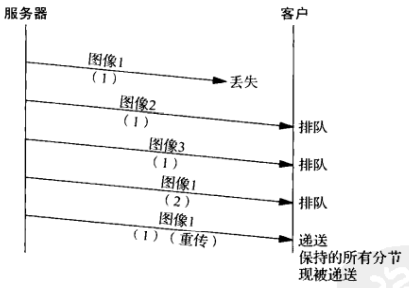
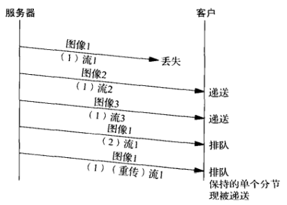
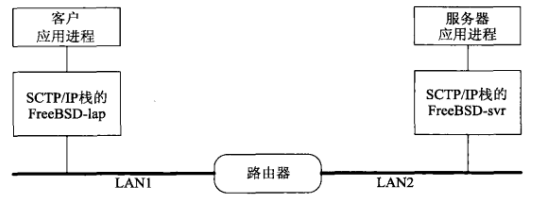

# 第十章 SCTP客户/服务器程序例子

[TOC]


## 10.1 概述


## 10.2 SCTP一到多式流分回射服务器程序：main函数

```c++
#include "unp.h"
int 
main(int argc, char **argv)
{
    int sock_fd, msg_flags;
    char readbuf[BUFFSIZE];
    struct sockaddr_in servaddr, cliaddr;
    struct sctp_sndrcvinfo sri;
    struct sctp_event_subscribe events;
    int stream_increment = 1;
    socklen_t len;
    size_t rd_sz;
    if (argc == 2)
        stream_increment = atoi(argv[1]);
    sock_fd = Socket(AF_INET, SOCK_SEQPACKET, IPPROTO_SCTP); // 创建一到多的SCTP套接字
    bzero(&servaddr, sizeof(servaddr));
    servaddr.sin_family = AF_INET;
    servaddr.sin_addr.s_addr = htonl(INADDR_ANY);
    servaddr.sin_port = htons(SERV_PORT);
    Bind(sock_fd, (SA *)&servaddr, sizeof(servaddr)); // 绑定地址
    bzero(&evnts, sizeof(evnts));
    evnts.sctp_data_io_event = 1; // 预定SCTP套接字通知
    Setsockopt(sock_fd, IPPROTO_SCTP, SCTP_EVENTS, &evnts, sizeof(evnts));
    Listen(sock_fd, LISTENQ); // 开启外来关联
    for (;;) {
        len = sizeof(struct sockaddr_in);
        rd_sz = Sctp_recvmsg(sock_fd, readbuf, sizeof(readbuf),
                             (SA *)&cliaddr, &len, &sri, &msg_flags); // 等待消息
        if (stream_increment) { // 增长流号
            sri.sinfo_stream++;
            if (sri.sinfo_stream >= 
                sctp_get_no_strms(sock_fd, (SA *)&cliaddr, len))
                sri.sinfo_stream = 0;
        }
        Sctp_sendmsg(sock_fd, readbuf, rd_sz,
                     (SA *)&cliaddr, len,
                     sri.sinfo_ppid,
                     sri.sinfo_flags, sri.sinfo_stream, 0, 0); // 发回响应
    }
}
```

*sctp/sctpserv01.c*


## 10.3 SCTP一到多式流分回射客户程序：main函数

```c++
#include "unp.h"
int 
main(int argc, char **argv)
{
    int sock_fd;
    struct sockaddr_in servaddr;
    struct sctp_event_subscribe evnts;
    int echo_to_all = 0;
    if (argc < 2)
        err_quit("Missing host argument - use '%s host [echo]'\n", argv[0]);
    if (argc > 2) {
        printf("Echoing messages to all streams\n");
        echo_to_all = 1;
    }
    sockfd = Socket(AF_INET, SOCK_SEQPACKET, IPPROTO_SCTP); // 创建套接字
    bzero(&servaddr, sizeof(servaddr));
    servaddr.sin_family = AF_INET;
    servaddr.sin_addr.s_addr = htonl(INADDR_ANY);
    servaddr.sin_port = htons(SERV_PORT);
    Inet_pton(AF_INET, argv[1], &servaddr.sin_addr); // 将服务器地址转换为数值格式
    bzero(&evnts, sizeof(evnts));
    evnts.sctp_data_io_event = 1; // 预定通知
    Setsocketopt(sock_fd, IPPROTO_SCTP, SCTP_EVENTS, &evnts, sizeof(evnts));
    if (echo_to_all == 0)
        sctpstr_cli(stdin, sock_fd, (SA*)&servaddr, sizeof(servaddr)); 
    else
        sctpstr_cli_echoall(stdin, sock_fd, (SA*)&servaddr,
                            sizeof(servaddr));
    Close(sock_fd);
    return(0);
}
```

*sctp/sctpclient01.c*


## 10.4 SCTP流分回射客户程序：sctpstr_cli函数

```c++
#include "unp.h"
void 
sctpstr_cli(FILE *fp, int sock_fd, struct sockaddr *to, socklen+t tolen)
{
    struct sockaddr_in peeraddr;
    struct sctp_sndrcvinfo sri;
    char sendline[MAXLINE], recvline[MAXLINE];
    socklen_t len;
    int out_sz, rd_sz;
    int msg_flags;
    bzero(&sri, szieof(sri));
    while (fgets(sendline, MAXLINE, fp) != NULL) {
        if (sendline[0] != '[') {
            printf("Error, line must be of the form '[streamnum]text'\n");
            continue;
        }
        sri.sinfo_stream = strtol(&sendline[1], NULL, 0);
        out_sz = strlen(sendline);
        Sctp_sendmsg(sock_fd, sendline, out_sz,
                     to, tolen, 0, 0, sri.sinfo_stream, 0, 0); // 发送消息
        len = sizeof(peeraddr);
        rd_sz = Sctp_recvmsg(sock_fd, recvline, sizeof(recvline),
                             (SA *)&peeraddr, &len, &sri, &msg_flags); // 阻塞接收消息
        printf("From str:%d seq:%d (assoc:0x%x):",
               sri.sinfo_stream, sri.sinfo_ssn, (u_int)sri.sinfo_assoc_id);
        printf("%.*s", rd_sz, recvline);
    }
}
```

*sctp/sctp_strcli.c*


## 10.5 探究头端阻塞



*在单个TCP连接上发送3幅图像*



*在3个SCTP流上发送3幅图像*

```c++
#include "unp.h"
#define SCTP_MAXLINE 800
void 
sctpstr_cli_echoall(FILE *fp, int sock_fd, struct sockaddr *to,
                    socklen_t tolen)
{
    struct sockaddr_in peeraddr;
    struct sctp_sndrcvinfo sri;
    char sendline[SCTP_MAXLINE], recvline[SCTP_MAXLINE];
    socklen_t len;
    int rd_sz, i, strsz;
    int msg_flags;
    bzero(sendline, sizeof(sendline));
    bzero(&sri, sizeof(sri));
    while (fgets(sendline, SCTP_MAXLINE - 9, fp) != NULL) {
        strsz = strlen(sendline);
        if (sendline[strsz - 1] == '\n') {
            sendline[strsz - 1] = '\0';
            strsz--;
        }
        for (i = 0; i < SERV_MAX_SCTP_STREAM; i++) {
            snprintf(sendline + strsz, sizeof(sendline) - strsz,
                     ".msg.%d", i);
            Sctp_sendmsg(sock_fd, sendline, sizeof(sendline),
                         to, tolen, 0, 0, i, 0, 0);
        }
        for (i = 0; i < SERV_MAX_SCTP_STRM; i++) {
            len = sizeof(peeraddr);
            rd_sz = Sctp_recvmsg(sock_fd, recvline, sizeof(recvline),
                                 (SA *)&peeraddr, &len, &sri, &msg_flags);
            printf("From str:%d seq:%d (assoc:0x%x):",
                   sri.sinfo_stream, sri.sinfo_ssn,
                   (u_int)sri.sinfo_assoc_id);
            printf("%.*s\n", rd_sz, recvline);
        }
    }
}
```

*sctp/sctp_strcliecho.c*

### 10.5.1 运行代码



*sctp/sctp_strcliecho2.c*

### 10.5.2 运行改动过的代码


## 10.6 控制流的数目

```c++
if (argc == 2)
    stream_increment = atoi(argv[1]);
sock_fd = Socket(AF_INET, SOCK_SEQPACKET, IPPROTO_SCTP);
bzero(&initm.sizeof(initm));
initm.sinit_num_ostreams = SERV_MORE_STRMS_SCTP;
Setsockopt(sock_fd, IPPROTO_SCTP, SCTP_INITMSG, &initm, sizeof(initm));
```

*sctp/sctpserv02.c*


## 10.7 控制终结

```c++
for (;;) {
    len = sizeof(struct sockaddr_in);
    rd_sz = Sctp_recvmsg(sock_fd, readbuf, sizeof(readbuf),
                         (SA *)&cliaddr, &len, &sri, &msg_flags);
    if (stream_increment) {
        sri.sinfo_stream++;
        if (sri.sinfo_stream >= 
            sctp_get_no_strms(sock_fd, (SA *)&cliaddr, len))
            sri.sinfo_stream = 0;
    }
    Sctp_sendmsg(sock_fd, readbuf, rd_sz,
                 (SA *)&cliaddr, len,
                 sri.sinfo_ppid,
                 (sri.sinfo_flags | MSG_EOF), sri.sinfo_stream, 0, 0);
}
```

*sctp/sctpserv03.c*

```c++
if (echo_to_all == 0)
    sctpstr_cli(stdin, sock_fd, (SA *)&servaddr, sizeof(servaddr));
else
    sctpstr_cli_echoall(stdin, sock_fd, (SA *)&servaddr,
                        sizeof(servaddr));
strcpy(byemsg, "goodbye");
Sctp_sendmsg(sock_fd, byemsg, strlen(byemsg),
             (SA *)&servaddr, sizeof(servaddr), 0, MSG_ABORT, 0, 0, 0);
Close(sock_fd);
```

*sctp/sctpclient02.c*


## 10.8 小结


