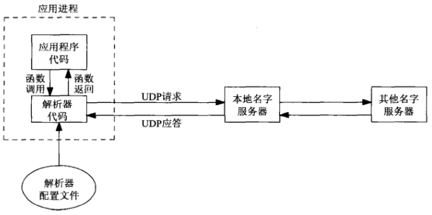
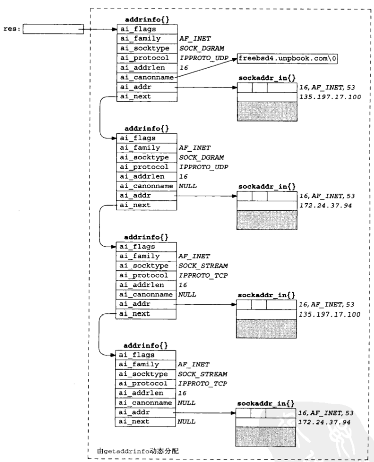
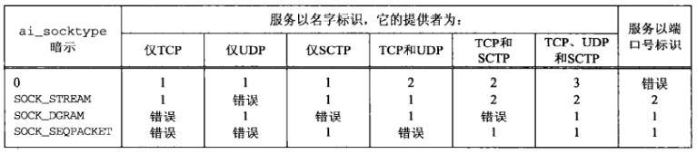

# 第十一章 名字与地址转换

[TOC]


## 11.1 概述


## 11.2 域名系统

`域名系统（Domain Name System, DNS）`主要用于主机名字与IP地址之间的映射。主机名既可以是一个简单名字，例如solaris；也可以是一个全限定域名（Fully Qualified Domain Name, FQDN），例如solaris.unpbook.com。

### 11.2.1 资源记录

DNS中的条目称为资源记录（resource record, RR），感兴趣的为以下几类：

- `A`把一个主机名映射成一个32位的IPv4地址。
- `AAAA`把一个主机名映射成一个128位的IPv6地址。
- `PTR`把IP地址映射成主机名。
- `MX`把一个主机指定作为给定主机的“邮件交换器”（mail exchanger）。
- `CNAME`为常用的服务指派CNAME记录。

### 11.2.2 解析器和名字服务器



*客户，解析器和名字服务器的典型关系*

如果应答的内容太长，超出了UDP消息的承载能力，本地名字服务器和解析器会自动切换到TCP。

### 11.2.3 DNS替代方法

DNS常用的替代方法：

- 静态主机文件（通常是`/etc/hosts`文件）；
- 网络信息系统（Network Information System, NIS）；
- 轻权目录访问协议（Lightweight Directory Access Protocol, LDAP）。


## 11.3 gethostyname函数

```c++
#include <netdb.h>
struct hostend *gethostbyname(const char *hostname);
```

- `hostname`域名

- `返回值`

  - 成功：返回hostent指针

    ```c++
    struct hostent {
        char  *h_name;
        char **h_aliases;
        int    h_addrtype;
        int    h_length;
        char **h_addr_list;
    }
    ```

  - 失败：返回NULL，并设置`<netdb.h>`中的全局变量`h_errno`为以下值之一：

    - HOST_NOT_FOUND；
    - TRY_AGAIN；
    - NO_RECOVERY；
    - NO_DATA。

根据域名查找主机地址，它执行的是对A记录的查询，所以只能返回IPv4地址。


*hostent结构和它所包含的信息*

例，为任意数目的命令行参数调用gethostbyname，并显示返回的所有信息：

```c++
#include "unp.h"
int main(int argc, char **argv)
{
    char *ptr, **pptr;
    char str[INET_ADDRSTRLEN];
    struct hostent *hptr;
    while (--argc > 0) {
        ptr = *++argv;
        if ((hptr = gethostbyname(ptr)) == NULL) {
            err_msg("gethostbyname error for host: %s: %s", 
                    ptr, hstrerror(h_errno));
            continue;
        }
        printf("official hostname: %s\n", hptr->h_name);
        for (pptr = hptr->h_aliases; *pptr != NULL; pptr++)
            printf("\talias: %s\n", *pptr);
        switch (hptr -> h_addrtype) {
            case AF_INET:
                pptr = hptr->h_addr_list;
                for (; *pptr != NULL; pptr++)
                    printf("\taddress: %s\n", 
                           Inet_ntop(hptr->h_addrtype, *pptr, str, sizeof(str)));
                break;
            default:
                err_ret("unknown address type");
                break;
        }
    }
    exit(0);
}
```


## 11.4 gethostbyaddr函数

```c++
#include <netdb.h>
struct hostent *gethostbyaddr(const char *addr, socklen_t len, int family);
```

- `addr`指向存放IPv4地址的某个in_addr结构的指针
- `len`结构的大小
- `family`地址类型，IPv4：AF_INET

根据二进制IP地址查询主机名。


## 11.5 getservbyname和getservbyport函数

```c++
#include <netdb.h>
struct servent *getservbyname(const char *servname, const char *protoname);
```

- `servname`服务名

- `protoname`协议名

- `返回值`

  ```c++
  struct servent {
      char  *s_name;
      char **s_aliases;
      int    s_port;
      char  *s_proto;
  };
  ```

根据给定名字查找相应服务。

```c++
#include <netdb.h>
struct servent *getservbyport(int port, const char *protoname);
```

- `port`端口号
- `protoname`协议名

根据给定端口号和可选协议查找相应服务。

例，使用gethostbyname和getservbyname：

```c++
#include "unp.h"
int main(int argc, char **argv)
{
    int sockfd, n;
    char recvline[MAXLINE + 1];
    struct sockaddr_in servaddr;
    struct in_addr **pptr;
    struct in_addr *inetaddrp[2];
    struct in_addr inetaddr;
    struct hostent *hp;
    struct servent *sp;
    if (argc != 3)
        err_quit("usage: daytimetcpcli1 <hostname> <service>");
    if ((hp = gethostbyname(argv[1])) == NULL) {
        if (inet_aton(argv[1], &inetaddr) == 0) {
            err_quit("hostname error for %s: %s", argv[1], hstrerror(h_errno));
        } else {
            inetaddrp[0] = &inetaddr;
            inetaddrp[1] = NULL;
            pptr = inetaddrp;
        }
    } else {
        pptr = (struct in addr **)hp->h_addr_list;
    }
    
    if ((sp = getservbyname(argv[2], "tcp")) == NULL)
        err_quit("getservbyname error for %s", argv[2]);
    for (; *pptr != NULL; pptr++) {
        sockfd = Socket(AF_INET, SOCK_STREAM, 0);
        bzero(&servaddr, sizeof(servaddr));
        servaddr.sin_family = AF_INET;
        servaddr.sin_port = sp->s_port;
        memcpy(&servaddr.sin_addr, *pptr, sizeof(struct in_addr));
        printf("trying %s\n", Sock_ntop((SA *)&servaddr, sizeof(servaddr)));
        if (connect(sockfd, (SA *)&servaddr, sizeof(servaddr)) == 0)
            break;
        err_ret("connect error");
        close(sockfd);
    }
    if (*pptr == NULL)
        err_quit("unable to connect");
    while ((n = Read(sockfd, recvline, MAXLINE)) > 0) {
        recvline[n] = 0;
        Fputs(recvline, stdout);
    }
    exit(0);
}
```


## 11.6 getaddrinfo函数

```c++
#include <netdb.h>
int getaddrinfo(const char *hostname, const char *service, 
                const struct addrinfo *hints, struct addrinfo **result);
```

- `hostname`主机名或地址串（IPv4：点分十进制；IPv6：十六进制数串）

- `service`服务名或十进制端口数串

- `hints`

  指向addrinfo结构的指针（可选），结构体中的以下成员可以被设置：

  - `ai_flags`
  - `ai_family`
  - `ai_socktype`
  - `ai_protocol`

- `result`

  指向成员为addrinfo的链表，在以下情况下，该链表的成员个数大于1个：

  - 如果与`hostname`参数关联的地址有多个，那么适用于所请求地址族（可通过hints结构的ai_family成员设置）的每个地址都返回一个对应的结构；
  - 如果`service`参数指定的服务支持多个套接字类型，那么每个套接字类型都可能返回一个对应的结构，具体取决于`hints`结构的`ai_socktype`成员。

  如果在`hints`结构中设置了AI_CANONNAME标志，那么本函数返回的第一个addrinfo结构的ai_canonname成员指向所查找主机的规范名字（通常是FQDN）。

  addrinfo定义：

  ```c++
  // netdb.h
  struct addrinfo {
      int ai_flags;
      int ai_family;
      int ai_socktype;
      int ai_protocol;
      socklen_t ai_addrlen;
      char *ai_canonname;
      struct sockaddr *ai_addr;
      struct addrinfo *ai_next;
  };
  ```

  `ai_flags`可用的标志值及其含义：

  | ai_flags值     | 含义                                                         |
  | -------------- | ------------------------------------------------------------ |
  | AI_PASSIVE     | 套接字将用于被动打开。                                       |
  | AI_CANONNAME   | 告知getaddrinfo函数返回主机的规范名字。                      |
  | AI_NUMERICHOST | 防止任何类型的名字到地址映射，hostname参数必须是一个地址串。 |
  | AI_NUMERICSERV | 防止任何类型的名字到服务映射，service参数必须是一个十进制端口号数串。 |
  | AI_V4MAPPED    | 如果同时指定ai_family成员的值为AF_INET6，那么如果没有可用的`AAAA`记录，就返回与`A`记录对应的IPv4映射的IPv6地址。 |
  | AI_ALL         | 如果同时指定AI_V4MAPPED标志，那么除了返回与AAAA记录对应的IPv6地址外，还返回与A记录对应的IPv4映射的IPv6地址。 |
  | AI_ADDRCONFIG  | 按照所在主机的配置选择返回地址类型，也就是只查找与所在主机回馈接口以外的网络接口配置的IP地址版本一致的地址。 |

- `返回值`

  - 成功：0
  - 失败

根据主机名和端口返回一个指向addrinfo结构链表的指针。



*getaddrinfo返回信息的实例*



*为每个IP地址返回的addrinfo结构的数目*

枚举getaddrinfo的一些常见输入：

- 指定hostname和service。

  对于TCP客户，在一个循环中针对每个返回的IP地址，逐一调用socket和connect，直到有一个连接成功，或者所有地址尝试完毕为止。

  对于UDP客户，由getaddrinfo填入的套接字地址结构用于调用sendto或connect。如果客户能够判定第一个地址看来不工作（通过在已连接的UDP套接字上收到出错消息，或者在未连接的套接字上经历消息接收超时），那么可以尝试其余的地址。

  **如果客户清楚自己只处理一种类型的套接字（例如Telnet和FTP客户只处理TCP，TFTP客户只处理UDP），那么应该把hints结构的ai_socktype成员设置成SOCK_STREAM或SOCK_DGRAM。**

- 只指定service而不指定hostname，同时在hints结构中指定AI_PASSIVE标志。

  返回的套接字地址结构中应含有一个值为INADDR_ANY（对于IPv4）或IN6ADDR_ANY_INIT（对于IPv6）的IP地址。

  TCP服务器将调用socket，bind和listen。如果服务器想要malloc另一个套接字地址结构以从accept获取客户的地址，那么返回的ai_addrlen值给出了这个套接字地址结构的大小。

  UDP服务器将调用socket，bind和recvfrom。如果服务器想要malloc另一个套接字地址结构以从recvfrom获取客户的地址，那么返回的ai_addrlen值给出了这个套接字地址结构的大小。

  **如果服务器清楚自己只处理一种类型的套接字，那么应该把hints结构的ai_socktype成员设置成SOCK_STREAM或SOCK_DGRAM。这样可以避免返回多个结构，其中可能出现错误的ai_socktype值。**


## 11.7 gai_strerror函数

TODO
