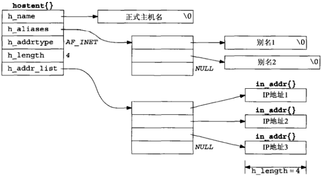
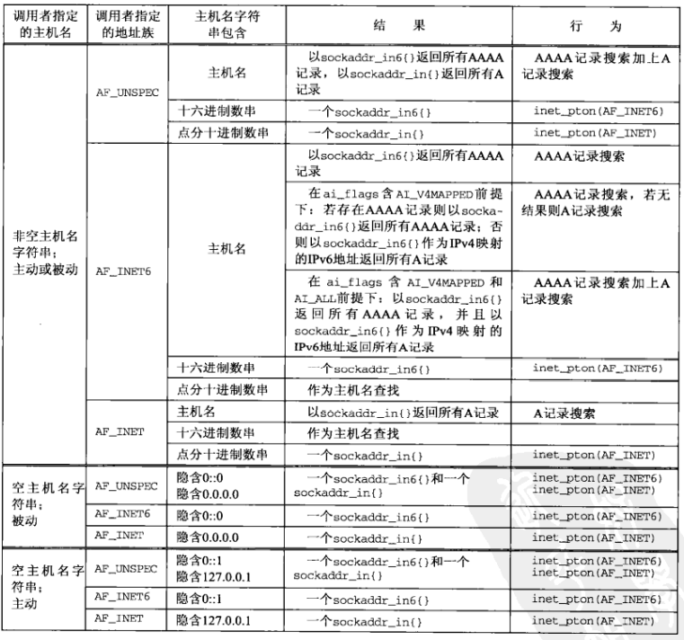

# 第十一章 名字与地址转换

[TOC]


## 11.1 概述


## 11.2 域名系统

`域名系统（Domain Name System, DNS）`主要用于主机名字与IP地址之间的映射。主机名既可以是一个简单名字，例如solaris；也可以是一个全限定域名（Fully Qualified Domain Name, FQDN），例如solaris.unpbook.com。

### 11.2.1 资源记录

DNS中的条目称为资源记录（resource record, RR），感兴趣的为以下几类：

- `A`把一个主机名映射成一个32位的IPv4地址。
- `AAAA`把一个主机名映射成一个128位的IPv6地址。
- `PTR`把IP地址映射成主机名。
- `MX`把一个主机指定作为给定主机的“邮件交换器”（mail exchanger）。
- `CNAME`为常用的服务指派CNAME记录。

### 11.2.2 解析器和名字服务器


*客户，解析器和名字服务器的典型关系*

如果应答的内容太长，超出了UDP消息的承载能力，本地名字服务器和解析器会自动切换到TCP。

### 11.2.3 DNS替代方法

DNS常用的替代方法：

- 静态主机文件（通常是`/etc/hosts`文件）；
- 网络信息系统（Network Information System, NIS）；
- 轻权目录访问协议（Lightweight Directory Access Protocol, LDAP）。


## 11.3 gethostyname函数

```c++
#include <netdb.h>
struct hostend *gethostbyname(const char *hostname);
```

- `hostname`域名

- `返回值`

  - 成功：返回hostent指针

    ```c++
    struct hostent {
        char  *h_name;
        char **h_aliases;
        int    h_addrtype;
        int    h_length;
        char **h_addr_list;
    }
    ```

  - 失败：返回NULL，并设置`<netdb.h>`中的全局变量`h_errno`为以下值之一：

    - HOST_NOT_FOUND；
    - TRY_AGAIN；
    - NO_RECOVERY；
    - NO_DATA。

根据域名查找主机地址，它执行的是对A记录的查询，所以只能返回IPv4地址。



*hostent结构和它所包含的信息*

例，为任意数目的命令行参数调用gethostbyname，并显示返回的所有信息：

```c++
#include "unp.h"
int main(int argc, char **argv)
{
    char *ptr, **pptr;
    char str[INET_ADDRSTRLEN];
    struct hostent *hptr;
    while (--argc > 0) {
        ptr = *++argv;
        if ((hptr = gethostbyname(ptr)) == NULL) {
            err_msg("gethostbyname error for host: %s: %s", 
                    ptr, hstrerror(h_errno));
            continue;
        }
        printf("official hostname: %s\n", hptr->h_name);
        for (pptr = hptr->h_aliases; *pptr != NULL; pptr++)
            printf("\talias: %s\n", *pptr);
        switch (hptr -> h_addrtype) {
            case AF_INET:
                pptr = hptr->h_addr_list;
                for (; *pptr != NULL; pptr++)
                    printf("\taddress: %s\n", 
                           Inet_ntop(hptr->h_addrtype, *pptr, str, sizeof(str)));
                break;
            default:
                err_ret("unknown address type");
                break;
        }
    }
    exit(0);
}
```


## 11.4 gethostbyaddr函数

```c++
#include <netdb.h>
struct hostent *gethostbyaddr(const char *addr, socklen_t len, int family);
```

- `addr`指向存放IPv4地址的某个in_addr结构的指针

- `len`结构的大小

- `family`地址类型，IPv4：AF_INET

- `返回值`

  成功：非空指针

  失败：NULL

根据二进制IP地址查询主机名。


## 11.5 getservbyname和getservbyport函数

```c++
#include <netdb.h>
struct servent *getservbyname(const char *servname, const char *protoname);
```

- `servname`服务名

- `protoname`协议名

- `返回值`

  成功：
  
  ```c++
  struct servent {
      char  *s_name;
      char **s_aliases;
      int    s_port;
      char  *s_proto;
  };
  ```
  
  失败：NULL

根据给定名字查找相应服务。

```c++
#include <netdb.h>
struct servent *getservbyport(int port, const char *protoname);
```

- `port`端口号

- `protoname`协议名

- `返回值`

  成功：非空指针；

  失败：NULL。

根据给定端口号和可选协议查找相应服务。

例，使用gethostbyname和getservbyname：

```c++
#include "unp.h"
int main(int argc, char **argv)
{
    int sockfd, n;
    char recvline[MAXLINE + 1];
    struct sockaddr_in servaddr;
    struct in_addr **pptr;
    struct in_addr *inetaddrp[2];
    struct in_addr inetaddr;
    struct hostent *hp;
    struct servent *sp;
    if (argc != 3)
        err_quit("usage: daytimetcpcli1 <hostname> <service>");
    if ((hp = gethostbyname(argv[1])) == NULL) {
        if (inet_aton(argv[1], &inetaddr) == 0) {
            err_quit("hostname error for %s: %s", argv[1], hstrerror(h_errno));
        } else {
            inetaddrp[0] = &inetaddr;
            inetaddrp[1] = NULL;
            pptr = inetaddrp;
        }
    } else {
        pptr = (struct in addr **)hp->h_addr_list;
    }
    
    if ((sp = getservbyname(argv[2], "tcp")) == NULL)
        err_quit("getservbyname error for %s", argv[2]);
    for (; *pptr != NULL; pptr++) {
        sockfd = Socket(AF_INET, SOCK_STREAM, 0);
        bzero(&servaddr, sizeof(servaddr));
        servaddr.sin_family = AF_INET;
        servaddr.sin_port = sp->s_port;
        memcpy(&servaddr.sin_addr, *pptr, sizeof(struct in_addr));
        printf("trying %s\n", Sock_ntop((SA *)&servaddr, sizeof(servaddr)));
        if (connect(sockfd, (SA *)&servaddr, sizeof(servaddr)) == 0)
            break;
        err_ret("connect error");
        close(sockfd);
    }
    if (*pptr == NULL)
        err_quit("unable to connect");
    while ((n = Read(sockfd, recvline, MAXLINE)) > 0) {
        recvline[n] = 0;
        Fputs(recvline, stdout);
    }
    exit(0);
}
```


## 11.6 getaddrinfo函数

```c++
#include <netdb.h>
int getaddrinfo(const char *hostname, const char *service, 
                const struct addrinfo *hints, struct addrinfo **result);
```

- `hostname`主机名或地址串（IPv4：点分十进制；IPv6：十六进制数串）

- `service`服务名或十进制端口数串

- `hints` 指向addrinfo结构的指针（可选），结构体中的以下成员可以被设置：

  - `ai_flags`
  - `ai_family`
  - `ai_socktype`
  - `ai_protocol`
  
- `result` 指向成员为addrinfo的链表，在以下情况下，该链表的成员个数大于1个：

  - 如果与`hostname`参数关联的地址有多个，那么适用于所请求地址族（可通过hints结构的ai_family成员设置）的每个地址都返回一个对应的结构；
  - 如果`service`参数指定的服务支持多个套接字类型，那么每个套接字类型都可能返回一个对应的结构，具体取决于`hints`结构的`ai_socktype`成员。
  
  如果在`hints`结构中设置了AI_CANONNAME标志，那么本函数返回的第一个addrinfo结构的ai_canonname成员指向所查找主机的规范名字（通常是FQDN）。

  addrinfo定义：

  ```c++
  // netdb.h
  struct addrinfo {
      int ai_flags;
      int ai_family;
      int ai_socktype;
      int ai_protocol;
      socklen_t ai_addrlen;
      char *ai_canonname;
      struct sockaddr *ai_addr;
      struct addrinfo *ai_next;
  };
  ```
  
  `ai_flags`可用的标志值及其含义：

  | ai_flags值     | 含义                                                         |
  | -------------- | ------------------------------------------------------------ |
  | AI_PASSIVE     | 套接字将用于被动打开。                                       |
  | AI_CANONNAME   | 告知getaddrinfo函数返回主机的规范名字。                      |
  | AI_NUMERICHOST | 防止任何类型的名字到地址映射，hostname参数必须是一个地址串。 |
  | AI_NUMERICSERV | 防止任何类型的名字到服务映射，service参数必须是一个十进制端口号数串。 |
  | AI_V4MAPPED    | 如果同时指定ai_family成员的值为AF_INET6，那么如果没有可用的`AAAA`记录，就返回与`A`记录对应的IPv4映射的IPv6地址。 |
  | AI_ALL         | 如果同时指定AI_V4MAPPED标志，那么除了返回与AAAA记录对应的IPv6地址外，还返回与A记录对应的IPv4映射的IPv6地址。 |
  | AI_ADDRCONFIG  | 按照所在主机的配置选择返回地址类型，也就是只查找与所在主机回馈接口以外的网络接口配置的IP地址版本一致的地址。 |
  
- `返回值`

  - 成功：0
  - 失败：非0

根据主机名和端口返回一个指向addrinfo结构链表的指针。


*getaddrinfo返回信息的实例*


*为每个IP地址返回的addrinfo结构的数目*

枚举getaddrinfo的一些常见输入：

- 指定hostname和service。

  对于TCP客户，在一个循环中针对每个返回的IP地址，逐一调用socket和connect，直到有一个连接成功，或者所有地址尝试完毕为止。

  对于UDP客户，由getaddrinfo填入的套接字地址结构用于调用sendto或connect。如果客户能够判定第一个地址看来不工作（通过在已连接的UDP套接字上收到出错消息，或者在未连接的套接字上经历消息接收超时），那么可以尝试其余的地址。

  **如果客户清楚自己只处理一种类型的套接字（例如Telnet和FTP客户只处理TCP，TFTP客户只处理UDP），那么应该把hints结构的ai_socktype成员设置成SOCK_STREAM或SOCK_DGRAM。**

- 只指定service而不指定hostname，同时在hints结构中指定AI_PASSIVE标志。

  返回的套接字地址结构中应含有一个值为INADDR_ANY（对于IPv4）或IN6ADDR_ANY_INIT（对于IPv6）的IP地址。

  TCP服务器将调用socket，bind和listen。如果服务器想要malloc另一个套接字地址结构以从accept获取客户的地址，那么返回的ai_addrlen值给出了这个套接字地址结构的大小。

  UDP服务器将调用socket，bind和recvfrom。如果服务器想要malloc另一个套接字地址结构以从recvfrom获取客户的地址，那么返回的ai_addrlen值给出了这个套接字地址结构的大小。

  **如果服务器清楚自己只处理一种类型的套接字，那么应该把hints结构的ai_socktype成员设置成SOCK_STREAM或SOCK_DGRAM。这样可以避免返回多个结构，其中可能出现错误的ai_socktype值。**


## 11.7 gai_strerror函数

```c++
#include <netdb.h>
const char *gai_strerror(int error);
```

- `error`错误ID

- `返回值`错误消息字符串描述符

  | 常值         | 说明                                        |
  | ------------ | ------------------------------------------- |
  | EAI_AGAIN    | 名字解析中临时失败                          |
  | EAI_BADFLAGS | ai_flags的值无效                            |
  | EAI_FAIL     | 名字解析中不可恢复地失败                    |
  | EAI_FAMILY   | 不支持ai_family                             |
  | EAI_MEMORY   | 内存分配失败                                |
  | EAI_NONAME   | hostname或service未提供，或者不可知         |
  | EAI_OVERFLOW | 用户参数缓冲区溢出（仅限getnameinfo()函数） |
  | EAI_SERVICE  | 不支持ai_socktype类型的service              |
  | EAI_SOCKTYPE | 不支持ai_socktype                           |
  | EAI_SYSTEM   | 在errno变量中由系统错误返回                 |

返回非0错误的字符串描述符。


## 11.8 freeaddrinfo函数

```c++
#include <netdb.h>
void freeaddrinfo(struct addrinfo *ai);
```

- `ai`一个指向addrinfo链表的指针

释放由getaddrinfo返回的存储空间。


## 11.9 getaddrinfo函数:IPv6

getaddrinfo函数及其行为和结果汇总：



**注意点**

- getaddrinfo在处理两个不同的输入：一个是套接字地址结构类型，调用者期待返回的地址结构符合这个类型；另一个是资源记录类型，在DNS或其他数据库中执行的查找符合这个类型。
- 由调用者在hints结构中提供的地址族指定调用者期待返回的套接字地址结构的类型。如果调用者指定AF_INET，getaddrinfo函数就不能返回任何sockaddr_in6结构；如果调用者指定AF_INET6，getaddrinfo函数就不能返回任何sockaddr_in结构。
- POSIX声称如果调用者指定AF_UNSPEC，那么getaddrinfo函数返回的是适用于指定主机名和服务名且适合任意协议族的地址。这就意味着如果某个主机既有AAAA记录又有A记录，那么AAAA记录将作为sockaddr_in6结构返回，A记录将作为sockaddr_in结构返回。在sockaddr_in6结构中作为IPv4映射的IPv6地址返回A记录没有任何意义，因为这么做没有提供任何额外信息：这些地址已在sockaddr_in结构中返回过了。
- POSIX的这个声明也意味着如果设置了AI_PASSIVE标志但是没有指定主机名，那么IPv6通配地址（IN6ADDR_ANY_INIT或0.0.0.0）应该作为sockaddr_in结构返回。
- 在hints结构的ai_family成员中指定的地址族以及在ai_flags成员中指定的AI_V4MAPPED和AI_ALL等标志决定了DNS中查找的资源记录类型（A和/或AAAA），也决定了返回地址的类型（IPv4，IPv6和/或IPv4映射的IPv6）。
- 主机名参数还可以是IPv6的十六进制数串或IPv4的点分十进制数串。这个数串的有效性取决于由调用者指定的地址族。如果指定AF_INET，那就不能接受IPv6的十六进制数串；如果指定AF_INET6，那就不能接受IPv4的点分十进制数串。然而如果指定的是AF_UNSPEC，那么这两种数串都可以接受，返回的是相应类型的套接字地址结构。


## 11.10 getaddrinfo函数:例子


## 11.11 host_serv函数

```c++
#include "unp.h"
struct addrinfo *host_serv(const char *hostname, const char *service, int family int socktype)
{
    int n;
    struct addrinfo hints, *res;
    
    bzero(&hints, sizeof(struct addrinfo));
    hints.ai_flags = AI_CONONNAME;
    hints.ai_family = family;
    hints.ai_socktype = socktype;
    
    if ((n = getaddrinfo(host, serv, &hints, &res)) != 0)
        return (NULL);
    return (res);
}
```


## 11.12 tcp_connect函数

```c++
#include "unp.h"
int tcp_connect(const char *host, const char *serv)
{
    int sockfd, n;
    struct addrinfo hints, *res, *ressave;
    bzero(&hints, sizeof(struct addrinfo));
    hints.ai_family = AF_UNSPEC;
    hints.ai_socktype = SOCK_STREAM;
    if ((n = getaddrinfo(host, serv, &hints, &res)) != 0)
        err_quit("tcp_connect error for %s, %s: %s", 
                 host, serv, gai_strerror(n));
    ressave = res;
    do {
        sockfd = socket(res->ai_family, res->ai_socktype, res->ai_protocol);
        if (sockfd < 0)
            continue;
        if (connect(sockfd, res->ai_addr, res->ai_addrlen) == 0)
            break;
        Close(sockfd);
    } while ((res = res->ai_next) != NULL);
    if (res == NULL)
        err_sys("tcp_connect error for %s %s", host, serv);
    freeaddrinfo(ressave);
    return (sockfd);
}
```

例：

```c++
// 用tcp_connect重新编写的时间获取客户程序
#include "unp.h"
int main(int argc, char **argv)
{
    int sockfd, n;
    char recvline[MAXLINE + 1];
    socklen_t len;
    struct sockaddr_storage ss;
    if (argc != 3)
        err_quit("usage: daytimetcpcli <hostname/IPaddress> <service/port#>");
    sockfd = Tcp_connect(argv[1], argv[2]);
    len = sizeof(ss);
    Getpeername(sockfd, (SA*)&ss, &len);
    printf("connected to %s\n", Sock_ntop_host((SA *)&ss, len));
    while ((n = Read(sockfd, recvline, MAXLINE)) > 0) {
        recvline[n] = 0;
        Fputs(recvline, stdout);
    }
    exit(0);
}
```


## 11.13 tcp_listen函数

```c++
#include "unp.h"
int tcp_listen(const char *host, const char *serv, socklen_t *addrlenp)
{
    int listenfd, n;
    const int on = 1;
    struct addrinfo hints, *res, *ressave;
    bzero(&hints, sizeof(struct addrinfo));
    hints.ai_flags = AI_PASSIVE;
    hints.ai_family = AF_UNSPEC;
    hints.ai_socktype = SOCK_STREAM;
    if ((n = getaddrinfo(host, serv, &hints, &res)) != 0)
        err_quit("tcp_listen error for %s, %s: %s",
                 host, serv, gai_strerror(n));
    ressave = res;
    do {
        listenfd = socket(res->ai_family, res->ai_socktype, res->ai_protocol);
        if (listenfd < 0)
            continue;
        Setsockopt(listenfd, SOL_SOCKET, SO_REUSEADDR, &on, sizeof(on));
        if (bind(listenfd, res->ai_addr, res->ai_addrlen) == 0)
            break;
        Close(listenfd);
    } while ((res = res->ai_next) != NULL);
    if (res == NULL)
        err_sys("tcp_listen error for %s, %s", host, serv);
    Listen(listenfd, LISTENQ);
    if (addrlenp)
        *addrlenp = res->ai_addrlen;
    freeaddrinfo(ressave);
    return(listenfd);
}
```

### 11.13.1 例:时间获取服务器程序

```c++
#include "unp.h"
#include <time.h>

int main(int argc, char **argv)
{
    int listenfd, connfd;
    socklen_t len;
    char buff[MAXLINE];
    time_t ticks;
    struct sockaddr_storage cliaddr;
    if (argc != 2)
        err_quit("usage: daytimetcpsrv1 <service or port#>");
    listenfd = Tcp_listen(NULL, argv[1], NULL);
    for (;;) {
        len = sizeof(cliaddr);
        connfd = Accept(listenfd, (SA *)&cliaddr, &len);
        printf("connection from %s\n", Sock_ntop((SA *)&cliaddr, len));
        ticks = time(NULL);
        snprintf(buf, sizeof(buff), "%.24\r\n", ctime(&ticks));
        Write(connfd, buff, strlen(buff));
        Close(connfd);
    }
}
```

### 11.13.2 例子:可指定协议的时间获取服务器程序

```c++
#include "unp.h"
#include <time.h>

int main(int argc, char **argv)
{
    int listenfd, connfd;
    socklen_t len;
    char buff[MAXLINE];
    time_t ticks;
    struct sockaddr_storage cliaddr;
    if (argc == 2)
        listenfd = Tcp_listen(NULL, argv[1], &addrlen);
    else if (argc == 3)
        listenfd = Tc_listen(argv[1], argv[2], &addrlen);
    else
        err_quit("usage: daytimetcpsrv2 [ <host> ] <service or port>");
    for (;;) {
        len = sizeof(cliaddr);
        connfd = Accept(listenfd, (SA *)&cliaddr, &len);
        printf("connection from %s\n", Sock_ntop((SA *)&cliaddr, len));
        ticks = time(NULL);
        snprintf(buf, sizeof(buff), "%.24s\r\n", ctime(&ticks));
        Write(connfd, buff, strlen(buff));
        Close(connfd);
    }
}
```


## 11.14 udp_client函数

```c++
#include "unp.h"
int udp_client(const char *host, const char *serv, SA **saptr, socklen_t *lenp)
{
    int sockfd, n;
    struct addrinfo hints, *res, *ressave;
    bzero(&hints, sizeof(struct addrinfo));
    hints.ai_family = AF_UNSPEC;
    hints.ai_socktype = SOCK_DGRAM;
    if ((n = getaddrinfo(host, serv, &hints, &res)) != 0)
        err_quit("udp_client error for %s, %s: %s",
                 host, serv, gai_strerror(n));
    ressave = res;
    do {
        sockfd = socket(res->ai_family, res->ai_socktype, res->ai_protocol);
        if (sockfd >= 0)
            break;
    } while((res = res->ai_next) != NULL);
    if (res == NULL)
        err_sys("udp_client error for %s, %s", host, serv);
    *saptr = Malloc(res->ai_addrlen);
    memcpy(*saptr, res->sa_addr, res->ai_addrlen);
    *lenp = res->ai_addrlen;
    freeaddrinfo(ressave);
    return (sockfd);
}
```

例：

```c++
// 协议无关时间获取客户程序
#include "unp.h"
int main(int argc, char **argv)
{
    int sockfd, n;
    char recvline[MAXLINE + 1];
    socklen_t salen;
    struct sockaddr *sa;
    if (argc != 3)
        err_quit("usage: daytimeudpcli1 <hostname/IPaddress> <service/port#>");
    sockfd = Udp_client(argv[1], argv[2], (void **)&sa, &salen);
    printf("sending to %s\n", Sock_ntop_host(sa, salen));
    Sendto(sockfd, "", 1, 0, sa, salen);
    n = Recvfrom(sockfd, recvline, MAXLINE, 0, NULL, NULL);
    recvline[n] = '\0';
    Fputs(recvline, stdout);
    exit(0);
}
```


## 11.15 udp_connect函数

```c++
#include "unp.h"
int udp_connect(const char *host, const char *serv)
{
    int sockfd, n;
    struct addrinfo hints, *res, *ressave;
    bzero(&hints, sizeof(struct addrinfo));
    hints.ai_family = AF_UNSPEC;
    hints.ai_socktype = SOCK_DGRAM;
    if ((n = getaddrinfo(host, serv, &hints, &res)) != 0)
        err_quit("udp_connect error for %s, $s: %s",
                 host, serv, gai_strerror(n));
    ressave = res;
    do {
        sockfd = socket(res->ai_family, res->ai_socktype, res->ai_protocol);
        if (sockfd < 0)
            continue;
        if (connect(sockfd, res->ai_addr, res->ai_addrlen) == 0)
            break;
        Close(sockfd);
    } while ((res = res->ai_next) != NULL);
    if (res == NULL)
        err_sys("udp_connect error for %s, %s", host, serv);
    freeaddrinfo(ressave);
    return (sockfd);
}
```


## 11.16 udp_server函数

```c++
#include "unp.h"
int udp_server(const char *host, const char *serv, socklen_t *addrlenp)
{
    int sockfd, n;
    struct addrinfo hints, *res, *ressave;
    bzero(&hitns, sizeof(struct addrinfo));
    hints.ai_flags = AI_PASSIVE;
    hints.ai_family = AF_UNSPEC;
    hints.ai_socktype = SOCK_DGRAM;
    if ((n = getaddrinfo(host, serv, &hints, &res)) != 0)
        err_quit("udp_server error for %s, %s: %s", 
                 host, serv, gai_strerror(n));
    ressave = res;
    do {
        sockfd = socket(res->ai_family, res->ai_socktype, res->ai_protocol);
        if (sockfd < 0)
            continue;
        if (bind(sockfd, res->ai_addr, res->ai_addrlen) == 0)
            break;
        Close(sockfd);
    } while((res = res->ai_next) != NULL);
    if (res == NULL)
        err_sys("udp_server error for %s, %s", host, serv);
    if (addrlenp)
        *addrlenp = res->ai_addrlen;
    freeaddrinfo(ressave);
    return (sockfd);
}
```

例：

```c++
// 协议无关时间获取服务器程序
#include "unp.h"
#include <time.h>
int main(int argc, char **argv)
{
    int sockfd;
    ssize_t n;
    char buff[MAXLINE];
    time_t ticks;
    socklen_t len;
    struct sockaddr_storage cliaddr;
    if (argc == 2)
        sockfd = Udp_server(NULL, argv[1], NULL);
    else if (argc == 3)
        sockfd = Udp_server(argv[1], argv[2], NULL);
    else
        err_quit("usage: daytimeudpsrv [ <host> ] <service or port>");
    for (;;) {
        len = sizeof(cliaddr);
        n = Recvfrom(sockfd, buff, MAXLINE, 0, (SA *)&cliaddr, &len);
        printf("datagram from %s\n", Sock_ntop((SA *)&cliaddr, len));
        ticks = time(NULL);
        snprintf(buf, sizeof(buff), "%.24s\r\n", ctime(&ticks));
        Sendto(sockfd, buff, strlen(buff), 0, (SA *)&cliaddr, len);
    }
}
```


## 11.17 getnameinfo函数

```c++
#include <netdb.h>
int getnameinfo(const struct sockaddr *sockaddr, socklen_t addrlen,
                char *host, socklen_t hostlen,
                char *serv, socklen_t servlen, int flags);
```

- `sockaddr`套接字地址

- `addrlen`套接字地址长度

- `host`用于返回的主机字符串

- `hostlen`主机字符串长度

- `serv`用于返回的服务字符串

- `servlen`服务字符串长度

- `flags`标志信息

  | 标志            | 说明                             |
  | --------------- | -------------------------------- |
  | NI_DGRAM        | 数据报服务                       |
  | NI_NAMEREQD     | 若不能从地址解析出名字则返回错误 |
  | NI_NOFQDN       | 只返回FQDN的主机名部分           |
  | NI_NUMERICHOST  | 以数串格式返回主机字符串         |
  | NI_NUMERICSCOPE | 以数串格式返回范围标识字符串     |
  | NI_NUMERICSERV  | 以数串格式返回服务字符串         |
  
- `返回值`

  成功：0

  失败：非0

返回套接字地址的主机（字符串）和服务（字符串）。


## 11.18 可重入函数

在一个普通UNIX进程中发生重入问题的条件是：从它的主控制流中和某个信号处理函数中同时调用gethostbyname或gethostbyaddr。当这个调用信号处理函数被调用时，该进程的主控制流被暂停以执行信号处理函数。例：

```c++
main()
{
    struct hostent *hptr;
    ...
    signal(SIGALRM, sig_alrm);
    ...
    hptr = gethostbyname(...);
    ...
}
void sig_alrm(int signo)
{
    struct hostent *hptr;
    ...
    hptr = gethostbyname(...);
    ...
}
```

如果主控制流被暂停时正处于执行gethostbyname期间，且信号处理函数随后调用gethostbyname，那么该host变量将被重用，因为该进程中只存在该变量的单个副本。这样一来，原先由主控制流计算出的值被重写成了由当前信号处理函数调用计算出的值。

**注意：**

- 因历史原因，gethostbyname, gethostbyaddr, getservbyname和getservbyport这4个函数不可重入，因为它们都返回指向同一个静态结构的指针。
- inet_pton和inet_ntop总是可重入的。
- 因历史原因，inet_ntoa是不可重入的，不过支持线程的一些实现提供了使用线程特定数据的可重入版本。
- getaddrinfo可重入的前提是由它调用的函数都可重入，即它应该调用可重入版本的gethostbyname（以解析主机名）和getservbyname（以解析服务名）。本函数返回的结果全部存放在动态分配内存空间的原因之一就是允许它可重入。
- getnameinfo可重入的前提是由它调用的函数都可重入，即它应该调用可重入版本的gethostbyaddr（以反向解析主机名）和getservbyport（以反向解析服务名）。它的2个结果字符串（分别为主机名和服务名）由调用者分配存储空间，从而允许它可重入。


## 11.19 gethostbyname_r和gethostbyaddr_r函数

把不可重入函数改为可重入函数的方法：

- 把由不可重入函数填写并返回静态结构的做法，修改为由调用者分配再由可重入函数填写结构。
- 由可重入函数调用malloc以动态分配内存空间。

```c++
// Solaris 2.x用于从名字到地址和从地址到名字进行解析的可重入函数
#include <netdb.h>
struct hsotent *gethostbyname_r(const char *hostname, struct hsotent *result, 
                                char *buf, int buflen, int *h_errnop);
struct hostent *gethostbyaddr_r(const char *addr, int len, int type,
                                struct hostent *result,
                                char *buf, int buflen, int *h_errnop);
```


## 11.20 作废的IPv6地址解析函数

### 11.20.1 RES_USE_INET6常值

### 11.20.2 gethostbyname2函数

```c++
#include <sys/socket.h>
#include <netdb.h>
struct hostent *gethostbyname2(const char *name, int af);
```

### 11.20.3 getipnodebyname函数

```c++
#include <sys/socket.h>
#include <netdb.h>
struct hostent *getipnodebyname(const char *name, int af, int flags, int *error_num);
```


## 11.21 其他网络相关信息

四类网络相关信息：

| 信息 | 数据文件       | 结构     | 键值查找函数                     |
| ---- | -------------- | -------- | -------------------------------- |
| 主机 | /etc/hosts     | hostent  | githostbyaddr, gethostbyname     |
| 网络 | /etc/networks  | netent   | getnetbyaddr, getnetbynane       |
| 协议 | /etc/protocols | protoent | getprotobyname, getprotobynumber |
| 服务 | /etc/services  | servent  | getservbyname, getservbyport     |


## 11.22 小结

