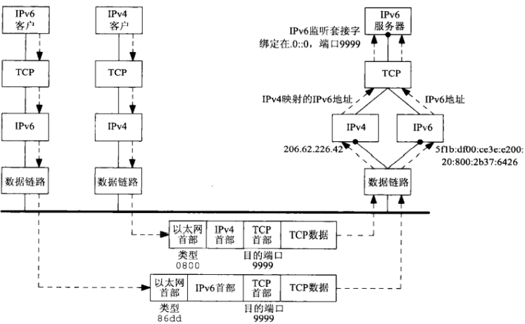
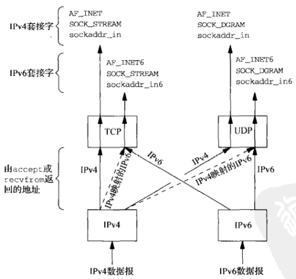

# 第十二章 IPv4与IPv6的互操作性

[TOC]


## 12.1 概述


## 12.2 IPv4客户与IPv6服务器



*双栈主机上的IPv6服务器为IPv4和IPv6客户服务*

1. IPv6服务器启动后创建一个IPv6监听套接字，我们假定服务器把通配地址绑定到该套接字。
2. IPv4客户调用gethostbyname找到服务器主机的一个A记录。
3. 客户调用connect，导致客户机发送一个IPv4 SYN到服务器主机。
4. 服务器主机接收这个目的地为IPv6监听套接字的IPv4 SYN，设置一个标志指示本连接应使用IPv4映射的IPv6地址，然后响应以一个IPv4 SYN/ACK。该连接建立后，由accept返回给服务器的地址就是这个IPv4映射的IPv6地址。
5. 当服务器主机往这个IPv4映射的IPv6地址发送TCP分节时，其IP栈产生目的地址为所映射IPv4地址的IPv4载送数据包。因此，客户和服务器之间的所有通信都是用IPv4的再送数据报。
6. 除非服务器显式检查这个IPv6地址是不是一个IPv4映射的IPv6地址，否则它永远不知道自己是在与一个IPv4客户通信。这个细节由双协议栈处理。同样地，IPv4客户也不知道自己是在与一个IPv6服务器通信。



*根据接收套接字类型处理收到的IPv4数据报或IPv6数据报*

- 如果收到一个目的地为某个IPv4套接字的IPv4数据报，无需任何特殊处理。
- 如果收到一个目的地为某个IPv6套接字的IPv6数据包，无需任何特殊处理。
- 如果收到一个目的地为某个IPv6套接字的IPv4数据包，那么内核把与该数据报的源IPv4地址对应的IPv4映射的IPv6地址作为由accept（TCP）或recvfrom（UDP）返回的对端IPv6地址（反之，无法把一个IPv6地址表示成一个IPv4地址）。

IPv4和IPv6客户与服务器互操作性总结：

|                        | IPv4服务器-IPv4单栈主机（纯A） | IPv6服务器IPv6单栈主机（纯AAAA） | IPv4服务器双栈主机（A和AAAA） | IPv6服务器双栈主机（A和AAAA） |
| ---------------------- | ------------------------------ | -------------------------------- | ----------------------------- | ----------------------------- |
| IPv4客户，IPv4单栈主机 | IPv4                           | （无）                           | IPv4                          | IPv4                          |
| IPv6客户，IPv6单栈主机 | （无）                         | IPv6                             | （无）                        | IPv6                          |
| IPv4客户，双栈主机     | IPv4                           | （无）                           | IPv4                          | IPv4                          |
| IPv6客户，双栈主机     | IPv4                           | IPv6                             | （取决于客户选择的地址）      | IPv6                          |


## 12.4 IPv6地址测试宏

```c++
#include <netinet/in.h>
// 7个测试IPv6地址的基本类型的函数
int IN6_IS_ADDR_UNSPECIFIED(const struct in6_addr *aptr);
int IN6_IS_ADDR_LOOPBACK(const struct in6_addr *aptr);
int IN6_IS_ADDR_MULTICAST(const struct in6_addr *aptr);
int IN6_IS_ADDR_LINKLOCAL(const struct in6_addr *aptr);
int IN6_IS_ADDR_SITELOCAL(const struct in6_addr *aptr);
int IN6_IS_ADDR_V4MAPPED(const struct in6_addr *aptr);
int IN6_IS_ADDR_V4COMPAT(const struct in6_addr *aptr);

// 5个测试IPv6多播地址范围的函数
int IN6_IS_ADDR_MC_NODELOCAL(const struct in6_addr *aptr);
int IN6_IS_ADDR_MC_LINKLOCAL(const struct in6_addr *aptr);
int IN6_IS_ADDR_MC_SITELOCAL(const struct in6_addr *aptr);
int IN6_IS_ADDR_ORGLOCAL(const struct in6_addr *aptr);
int IN6_IS_ADDR_GLOBAL(const struct in6_addr *aptr);
```


## 12.5 源代码可移植性


## 12.6 小结

