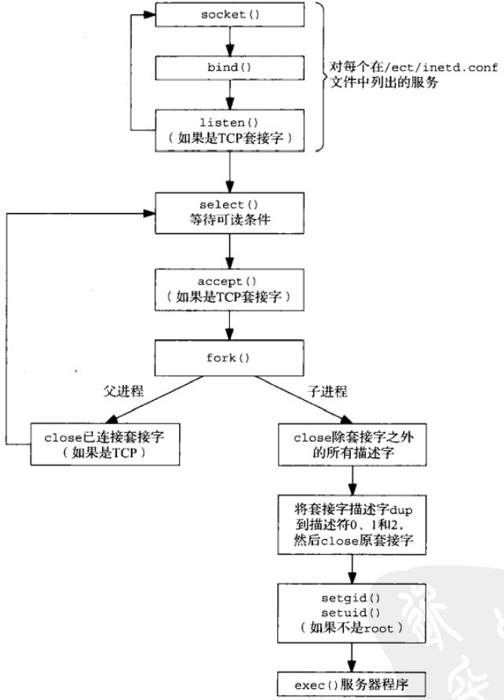
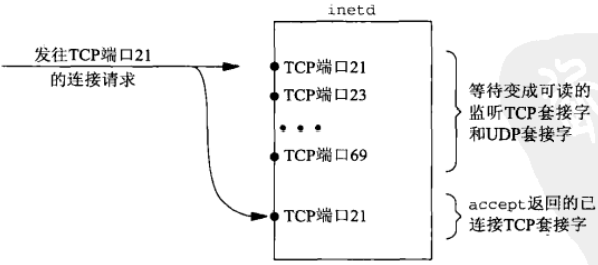
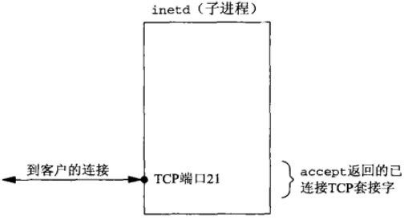
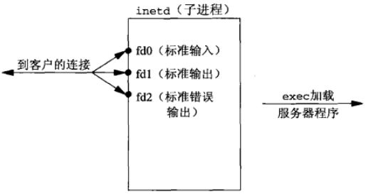

# 第十三章 守护进程和inetd超级服务器

[TOC]


## 13.1 概述


## 13.2 syslogd守护进程

源自Berkeley的syslogd实现在启动时执行以下步骤：

1. 读取配置文件；
2. 创建一个Unix域数据报套接字，给它捆绑路径名`/var/run/log`（在某些系统上是`/dev/log`）；
3. 创建一个UDP套接字，给他捆绑端口514（syslog服务使用的端口号）。
4. 打开路径名`/dev/klog`。


## 13.3 syslog函数

```c++
#include <syslog.h>
void syslog(int priority, const char *message, ...);
```

- `priority`优先级

  由level和faility组合而成：

  | level       | 值   | 说明                         |
  | ----------- | ---- | ---------------------------- |
  | LOG_EMERG   | 0    | 系统不可用（最高优先级）     |
  | LOG_ALERT   | 1    | 必须立即采取行动             |
  | LOG_CRIT    | 2    | 临界信息                     |
  | LOG_ERR     | 3    | 出错条件                     |
  | LOG_WARNING | 4    | 警告条件                     |
  | LOG_NOTICE  | 5    | 正常然而重要的条件（默认值） |
  | LOG_INFO    | 6    | 通告消息                     |
  | LOG_DEBUG   | 7    | 调试级消息（最低优先级）     |

  | facility     | 说明                     |
  | ------------ | ------------------------ |
  | LOG_AUTH     | 安全/授权消息            |
  | LOG_AUTHPRIV | 安全/授权消息（私用）    |
  | LOG_CRON     | cron守护进程             |
  | LOG_DAEMON   | 系统守护进程             |
  | LOG_FTP      | FTP守护进程              |
  | LOG_KERN     | 内核消息                 |
  | LOG_LOCAL0   | 本地使用                 |
  | LOG_LOCAL1   | 本地使用                 |
  | LOG_LOCAL2   | 本地使用                 |
  | LOG_LOCAL3   | 本地使用                 |
  | LOG_LOCAL4   | 本地使用                 |
  | LOG_LOCAL5   | 本地使用                 |
  | LOG_LOCAL6   | 本地使用                 |
  | LOG_LOCAL7   | 本地使用                 |
  | LOG_LPR      | 行式打印机系统           |
  | LOG_MAIL     | 邮件系统                 |
  | LOG_NEWS     | 网络新闻系统             |
  | LOG_SYSLOG   | 由syslogd内部产生的消息  |
  | LOG_USER     | 任意的用户级消息（默认） |
  | LOG_UUCP     | UUCP系统                 |

- `message`格式化字符串；

从守护进程中登记（复制读）消息。

```c++
#include <syslog.h>
void openlog(const char *ident, int options, int facility);
void closelog(void);
```

- `ident`由syslog冠于每个日志消息之前的字符串（通常是程序名）；

- `options`可选项

  | options    | 说明                                            |
  | ---------- | ----------------------------------------------- |
  | LOG_CONS   | 若无法发送到syslogd守护进程则登记到控制台。     |
  | LOG_NDELAY | 不延迟打开，立即创建套接字。                    |
  | LOG_PERROR | 既发送到syslogd守护进程，又登记到标准错误输出。 |
  | LOG_PID    | 随每个日志消息登记进程ID。                      |

- `facility`

打开/关闭日志（调用openlog时，默认不会立即创建Unix域套接字，在首次调用syslog时才创建，通过设置LOG_NDELAY可以修改此操作）。


## 13.4 daemon_init函数

```c++
#include "unp.h"
#include <syslog.h>
#define MAXFD 64
extern int daemon_proc;
int 
daemon_init(const char *pname, int facility)
{
    int i;
    pid_t pid;
    fi ((pid = Fork()) < 0) // 创建子进程
        return (-1);
    else if (pid)
        _exit(0);
    // child 1 continues...
    if (setsid() < 0) // 创建一个新session，将当前进程变为session的头进程，脱离控制终端
        return (-1);
    Signal(SIGHUP, SIG_IGN); // 忽略SIGHUP信号
    if ((pid = Fork())) < 0
		return (-1);
    else if(pid)
        _exit(0);
    // child 2 continues...
    daemon_proc = 1; // 为错误处理函数设置标识
    chdir("/");      // 变更工作目录到根目录
    // 关闭所有打开的描述符
    for (i = 0; i < MAXFD; i++)
        close(i);
    // 将stdin, stdout, stderr重定向到/dev/null
    open("/dev/null", O_RDONLY);
    open("/dev/null", O_RDWR);
    open("/dev/null", O_RDWR);
    openlog(panme, LOG_PID, facility); // 使用syslogd处理错误
    return (0);
}
```

*将普通进程转化为守护进程*

```c++
#include "unp.h"
#include <time.h>
int 
main(int argc, char **argv)
{
    int listenfd, connfd;
    socklen_t addrlen, len;
    struct sockaddr *cliaddr;
    char buff[MAXLINE];
    time_t ticks;
    if (argc < 2 || argc > 3)
        err_quit("usage: daytimetcpsrv2 [ <hsot> ] <service or port>");
    daemon_init(argv[0], 0);
    if (argc == 2)
        listenfd = Tcp_listen(NULL, argv[1], &addrlen);
    else
        listenfd = Tcp_listen(argv[1], argv[2], &addrlen);
    cliaddr = Malloc(addrlen);
    for (;;) {
        len = addrlen;
        connfd = Accept(listenfd, cliaddr, &len);
        err_msg("connection from %s", Sock_ntop(cliaddr, len));
        ticks = time(NULL);
        snprintf(buff, sizeof(buff), "%.24s\r\n", ctime(&ticks));
        Write(connfd, buff, strlen(buff));
        Close(connfd);
    }
}
```

*使用daemon_init函数示例*


## 13.5 inetd守护进程

| 字段                     | 说明                                     |
| ------------------------ | ---------------------------------------- |
| service-name             | 必须在`/etc/services`文件中定义          |
| socket-type              | stream（TCP）或dgram（UDP）              |
| protocol                 | 必须在/etc/protocols文件中定义：tcp或udp |
| wait-flag                | 对于TCP一般为nowait，对于UDP一般为wait   |
| login-name               | 来自/etc/passwd的用户名，一般为root      |
| server-program           | 调用exec指定的完整路径名                 |
| server-program-arguments | 调用exec指定的命令行参数                 |

*inetd.conf文件中的字段*



*inetd的工作流程*



*目标为TCP端口21的连接请求到达时的inetd描述符*



*子进程中的inetd描述符*



*dup2后子进程中的inetd描述符*


## 13.6 daemon_inetd函数

```c++
#include "unp.h"
#include <syslog.h>
extern int daemon_proc;
void 
daemon_inetd(const char *pname, int facility)
{
    daemon_proc = 1;
    openlog(pname, LOG_PID, facility);
}
```

*daemon_inetd函数：守护进程化由inetd运行的进程*

```c++
#include "unp.h"
#include <time.h>
int 
main(int argc, char **argv)
{
    socklen_t len;
    struct sockaddr *cliaddr;
    char buff[MAXLINE];
    time_t ticks;
    daemon_inetd(argv[0], 0);
    cliaddr = Malloc(sizeof(struct sockaddr_storage));
    len = sizeof(struct sockaddr_storage);
    Getpeername(0, cliaddr, &len);
    err_msg("connection from %s", Sock_ntop(cliaddr, len));
    ticks = time(NULL);
    snprintf(buff, sizeof(buff), "%.24s\r\n", ctime(&ticks));
    Write(0, buff, strlen(buff));
    Close(0);
    exit(0);
}
```

*可由inetd启动的协议无关时间获取服务器程序*


## 13.7 小结

