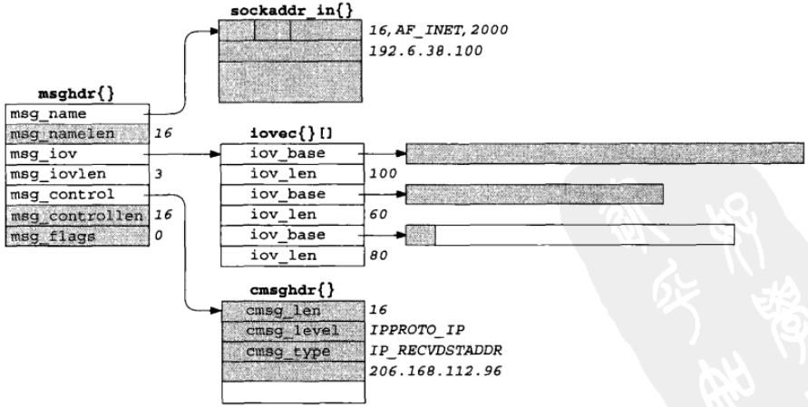

# 第14章 高级I/O函数

[TOC]


## 14.1 概述


## 14.2 套接字超时

设置套接字I/O操作超时的方法：

- 调用alarm，在指定超时期满时产生SIGALRM信号。
- 在select中阻塞等待I/O，以此代替直接阻塞在read或write调用上。
- 使用较新的SO_RCVTIMEO和SO_SNDTIMEO套接字选项。

### 14.2.1 使用SIGALRM为connect设置超时

```c++
// 带超时的connect
#include "unp.h"
static void connect_alarm(int);
int connect_timeo(int sockfd, const SA *saptr, socklen_t salen, int nsec)
{
    Sigfunc *sigfunc;
    int n;
    sigfunc = Signal(SIGALRM, connect_alarm);
    if (alarm(nsec) != 0) // 设置报警时钟
        err_msg("connect_timeo: alarm was already set");
    if ((n = connect(sockfd, saptr, salen)) < 0) { // 调用connect
        close(sockfd);
        if (errno == EINTR)
            errno = ETIMEDOUT;
    }
    alarm(0); // 关闭本进程的报警时钟
    Signal(SIGALRM, sigfunc); // 恢复原来的信号处理函数不
    return (n);
}
static void connect_alarm(int signo)
{
    return;
}
```

### 14.2.2 使用SIGALRM为recvfrom设置超时

```c++
#include "unp.h"
static void sig_alrm(int);
void
dg_cli(FILE *fp, int sockfd, const SA *pservaddr, socklen_t servlen)
{
    int n;
    char sendline[MAXLINE], recvline[MAXLINE + 1];
    Signal(SIGALRM, sig_alrm); // 设置信号处理函数
    while (Fgets(sendline, MAXLINE, fp) != NULL) {
        Sendto(sockfd, sendline, strlen(sendline), 0, pservaddr, servlen);
        alarm(5); // 设置5秒超时
        if ((n = recvfrom(sockfd, recvline, MAXLINE, 0, NULL, NULL)) < 0) {
            if (errno == EINTR)
                fprintf(stderr, "socket timeout\n");
            else
                err_sys("recvfrom error");
        } else {
            alarm(0);
            recvline[n] = 0;
            Fputs(recvline, stdout);
        }
    }
}
static void
sig_alrm(int signo)
{
    return;
}
```

*使用alarm超时recvfrom的dg_cli函数*

### 14.2.3 使用select为recvfrom设置超时

```c++
#include "unp.h"
int
readable_timeo(int fd, int sec)
{
    fd_set rset;
    struct timeval tv;
    FD_ZERO(&rset);
    FD_SET(FD, &rset);
    tv.tv_sec = sec;
    tv.tv_usec = 0;
    return (select(fd+1, &rset, NULL, NULL, &tv)); // 出错：-1，超时：0
}
```

*readable_timeo函数：等待一个描述符变为可读*

```c++
#include "unp.h"
void
dg_cli(FILE *fp, int sockfd, const SA *pservaddr, socklen_t servlen)
{
    int n;
    char sendline[MAXLINE], recvline[MAXLINE + 1];
    while (Fgets(sendline, MAXLINE, fp) != NULL) {
        Sendto(sockfd, sendline, strlen(sendline), 0, pservaddr, servlen);
        if (Readable_timeo(sockfd, 5) == 0) {
            fprintf(stderr, "socket timeout\n");
        } else {
            n = Recvfrom(sockfd, recvline, MAXLINE, 0, NULL, NULL);
            recvline[n] = 0;
            Fputs(recvline, stdout);
        }
    }
}
```

*调用redable_timeo设置超时的dg_cli函数*

### 14.2.4 使用SO_RCVTIMEO套接字选项为recvfrom设置超时

```c++
#include "unp.h"
void 
dg_cli(FILE *fp, int sockfd, const SA *pservaddr, socklen_t servlen)
{
    int n;
    char sendline[MAXLINE], recvline[MAXLINE + 1];
    struct timeval tv;
    tv.tv_sec = 5;
    tv.tv_usec = 0;
    Setsockopt(sockfd, SOL_SOCKET, SO_RCVTIMEO, &tv, sizeof(tv));
    while (Fgets(sendline, MAXLINE, fp) != NULL) {
        Sendto(sockfd, sendline, strlen(sendline), 0, pservaddr, servlen);
        n = recvfrom(sockfd, recvline, MAXLINE, 0, NULL, NULL);
        if (n < 0) {
            if (errno == EWOULDBLOCK) { // I/O操作超时
                fprintf(stderr, "socket timeout\n");
                continue;
            } else
                err_sys("recvfrom error");
        }
        recvline[n] = 0;
        Fputs(recvline, stdout);
    }
}
```

*使用SO_RCVTIMEO套接字选项设置超时的dg_cli函数*


## 14.3 recv和send函数

```c++
#include <sys/socket.h>
ssize_t recv(int sockfd, void *buff, size_t nbytes, int flags);
ssize_t send(int sockfd, const void *buff, size_t nbytes, int flags);
```

- `flags`标志

  | flags         | 说明               | recv | send |
  | ------------- | ------------------ | ---- | ---- |
  | MSG_DONTROUTE | 绕过路由表查找     |      | Y    |
  | MSG_DONTWAIT  | 仅本操作非阻塞     | Y    | Y    |
  | MSG_OOB       | 发送或接收带外数据 | Y    | Y    |
  | MSG_PEEK      | 窥看外来消息       | Y    |      |
  | MSG_WAITALL   | 等待所有数据       | Y    |      |

  详细说明：

  - `MSG_DONTROUTE`告知内核目的主机在某个直接连接的本地网络上，因而无需执行路由表查找。

  - `MSG_DONTWAIT`在无需打开相应套接字的非阻塞标志的前提下，把单个I/O操作临时指定为非阻塞，接着执行I/O操作，然后关闭非阻塞标志。

  - `MSG_OOB`对于send，本标志指明即将发送带外数据；对于recv，本标志指明即将读入的是带外数据而不是普通数据。

  - `MSG_PEEK`适用于recv和recvfrom，它允许我们查看已可读取的数据，而且系统不在recv或recvfrom返回后丢弃这些数据。

  - `MSG_WAITALL`告知内核不要再尚未读入请求数目的字节之前让一个读操作返回。如果系统支持本标志，我们就可以省掉readn函数，替之以宏：

    ```c++
    #define readn(fd, ptr, n) recv(fd, ptr, n, MSG_WAITALL)
    ```

    即使指定了MSG_WAITALL，如果发生下列情况之一：

    1. 捕获一个信号；
    2. 连接被终止；
    3. 套接字发生一个错误，相应的读函数仍有可能返回比所请求字节数要少的数据。


## 14.4 readv和writev函数

```c++
#include <sys/uio.h>
ssize_t readv(int filedes, const struct iovec *iov, int iovcnt);
ssize_t writev(int filedes, const struct iovec *iov, int iovcnt);
```

- `filedes` 

- `iov`指向iovec结构数组的指针

  POSIX要求在头文件`<sys/uio.h>`中定义`IOV_MAX`常值来标识结构数组的容量，至少要为16；但是其实际值取决于具体实现：4.3BSD和Linux最多允许1024个，HP-UX最多允许2100个。

  iovec的定义如下：

  ```c++
  struct iovec {
      void *iov_base;
      size_t iov_len;
  }
  ```

- `iovcnt` iovec结构数组的元素数量

- `返回值`

  - 成功：读入/写出的字节数；
  - 失败：-1。

*读入/写出一个或多个缓冲区，这些操作分别称为`分散读（scatter read）`和`集中写（gather write）`，因为来自读操作的输入数据被分散到多个应用缓冲区中，而来自多个应用缓冲区的输出数据则被集中提供给单个写操作。*


## 14.5 recvmsg和sendmsg函数

```c++
#include <sys/socket.h>
ssize_t recvmsg(int sockfd, struct msghdr *msg, int flags);
ssize_t sendmsg(int sockfd, struct msghdr *msg, int flags);
```

- `sockfd`套接字

- `msg`

  ```c++
  struct msghdr {
      void         *msg_name;       // 接收者/发送者的协议地址
      socklen_t     msg_namelen;    // 协议地址长度
      struct iovec *msg_iov;        // 输入/输出缓冲区数组
      int           msg_iovlen;     // 缓冲区数组长度
      void         *msg_control;    // 辅助数据的位置（可选）
      socklen_t     msg_controllen; // 辅助数据的大小（可选）
      int           msg_flags;      // 消息标志
  };
  ```

- `flags`标志

  | 标志                                                         | 由内核检查send, sendto或sendmsg函数的flags参数 | 由内核检查recv, recvfrom或recvmsg函数的flags参数 | 由内核通过recvmsg函数的msg_flags结构参数成员返回 |
  | ------------------------------------------------------------ | ---------------------------------------------- | ------------------------------------------------ | ------------------------------------------------ |
  | MSG_DONTROUTE<br>MSG_DONTWAIT<br>MSG_PEEK<br>MSG_WAITALL     | Y<br>Y                                         | <br>Y<br>Y<br>Y                                  |                                                  |
  | MSG_EOR<br>MSG_OOB                                           | Y<br>Y                                         | <br>Y                                            | Y<br>Y                                           |
  | MSG_BCAST<br>MSG_MCAST<br>MSG_TRUNC<br>MSG_CTRUNC<br>MSG_NOTIFICATION |                                                |                                                  | Y<br>Y<br>Y<br>Y<br>Y                            |

  详细说明：

  - `MSG_BCAST` 返回条件是本数据报作为链路层广播收取或者其目的IP地址是一个广播地址。与IP_RECVD_STADDR套接字选项相比，本标志是用于判定一个UDP数据报是否发往某个广播地址的更好方法。
  - `MSG_MCAST`本标志随BSD/OS引入，相对较新。它的返回条件是本数据报作为链路层多播收取。
  - `MG_TRUNC`本标志的返回条件是本数据报被截断，也就是说，内核预备返回的数据超过进程事先分配的空间（所有iov_len成员之和）。
  - `MSG_CTRUNC`本标志的返回条件是本数据报的辅助数据被截断，也就是说，内核预备返回的辅助数据超过进程事先分配的空间（msg_controllen）。
  - `MSG_EOR`本标志的返回条件数据结束一个逻辑记录。TCP不使用本标志，因为它是一个字节流协议。
  - `MSG_OOB`本标志绝不为TCP带外数据返回。它用于其它协议族。
  - `MSG_NOTIFICATION`本标志由SCTP接收者返回，指示读入的消息是一个事件通知，而不是数据消息。


*对一个UDP套接字调用recvmsg时的数据结构*



*recvmsg返回时对上图的更新*

5组I/O函数的比较：

| 函数             | 任何描述符 | 仅套接字描述符 | 单个读/写缓冲区 | 分散/集中 读/写 | 可选标志 | 可选对端地址 | 可选控制信息 |
| ---------------- | ---------- | -------------- | --------------- | --------------- | -------- | ------------ | ------------ |
| read, write      | Y          |                | Y               |                 |          |              |              |
| readv, writev    | Y          |                |                 | Y               |          |              |              |
| recv, send       |            | Y              | Y               |                 | Y        |              |              |
| recvfrom, sendto |            | Y              | Y               |                 | Y        | Y            |              |
| recvmsg, sendmsg |            | Y              |                 | Y               | Y        | Y            | Y            |


## 14.6 辅助数据

辅助数据用途的总结：

| 协议   | cmsg_level   | cmsg_type                                                    | 说明                                                         |
| ------ | ------------ | ------------------------------------------------------------ | ------------------------------------------------------------ |
| IPv4   | IPPROTO_IP   | IP_RECVDSTADDR<br>IP_RECVIF                                  | 随UDP数据报接收目的地址<br>随UDP数据报接收接口索引           |
| IPv6   | IPPROTO_IPv6 | IPV6_DSTOPTS<br>IPV6_HOPLIMIT<br>IPV6_HOPOPTS<br>IPV6_NEXTHOP<br>IPV6_PRTINFO<br>IPV6_RTHDR<br>IPV6_TCLASS | 指定/接收目的地选项<br>指定/接收跳限<br>接收/接收步跳选项<br>指定下一跳地址<br>指定/接收分组信息<br>指定/接收路由首部<br>指定/接收分组流通类别 |
| Unix域 | SOL_SOCKET   | SCM_RIGHTS<br>SCM_CREDS                                      | 发送/接收描述符<br>发送/接收用户凭证                         |

辅助数据由一个或多个辅助数据对象（ancillary data object）构成，每个对象以一个定义在头文件`<sys/socket.h>`中的`cmsghdr`结构开头：

```c++
struct cmsghdr {
    socklen_t cmsg_len;
    int       cmsg_level;
    int       cmsg_type;
};
```


*包含两个辅助数据对象的辅助数据*


*用在Unix域套接字上的cmsghdr结构*

头文件`<sys/socket.h>`中定义了以下5个宏，以简化对辅助数据的处理：

```c++
#include <sys/socket.h>
#include <sys/param.h>
// 返回：指向第一个cmsghdr结构的指针，若无辅助数据则为NULL
struct cmsghdr *CMSG_FIRSTHDR(struct msghdr *mhdrptr);
// 返回：指向下一个cmsghdr结构的指针，若不再有辅助数据对象则为NULL
struct cmsghdr *CMSG_NXTHDR(struct msghdr *mhdrptr, struct cmsghdr *cmsgptr);
// 返回：指向与cmsghdr结构关联的数据的第一个字节的指针
unsigned char *CMSG_DATA(struct cmsghdr *cmsgptr);
// 返回：给定数据量下存放到cmsg_len中的值
unsigned int CMSG_LEN(unsigned int length);
// 返回：给定数据量下一个辅助数据对象总的大小
unsigned int CMSG_SPACE(unsigned int length);
```


## 14.7 排队的数据量

获悉一个套接字上已排队的数据量的技术：

- 如果获悉已排队数据量的目的在于避免读操作阻塞在内核中（因为没有数据可读时我们还有其它事情可做），那么可以使用非阻塞式I/O。
- 如果我们既想查看数据，又想数据仍然留在接收队列中以供本进程其他部分稍后读取，那么可以使用`MSG_PEEK`标志。
- 一些实现支持ioctl的FIONREAD命令。该命令的第三个ioctl参数是指向某个整数的一个指针，内核通过该整数返回的值就是套接字接收队列的当前字节数。该值是已排队字节的总和，对于UDP套接字而言包括所有已排队的数据报。


## 14.8 套接字和标准I/O

```c++
#include "unp.h"
void 
str_echo(int sockfd)
{
    char line[MAXLINE];
    FILE *fpin, *fpout;
    fpin = Fdopen(sockfd, "r");  // 输入流
    fpout = Fdopen(sockfd, "w"); // 输出流
    while (Fgets(line, MAXLINE, fpin) != NULL)
        Fputs(line, fpout);
}
```

*重写成改用标准I/O的str_echo函数*

标准I/O函数库执行以下三类缓冲：

- `完全缓冲（fully buffering）`意味着只在出现下列情况时才发生I/O：

  1. 缓冲区满；
  2. 进程显式调用fflush；
  3. 进程调用exit终止自身；

  标准I/O缓冲区的通常大小为8192字节。

- `行缓冲（line buffering）`意味着只在出现下列情况时才发生I/O：

  1. 碰到一个换行符；
  2. 进程调用fflush；
  3. 进程调用exit种植自身。

- `不缓冲（unbuffering）`意味着每次调用标准I/O输出函数都发生I/O。

标准I/O函数库的大多数Unix实现如下规则：

- 标准错误输出总是不缓冲；
- 标准输入和标准输出完全缓冲，除非它们指代终端设备（这种情况下它们行缓冲）；
- 所有其它I/O流都是完全缓冲，除非他们指代终端设备（这种情况下它们行缓冲）。

**避免在套接字上使用标准I/O函数库！！！**


## 14.9 高级轮询技术

### 14.9.1 /dev/poll接口

```c++
struct dvpoll {
    struct pollfd* dp_fds;     // 缓冲区
    int            dp_nfds;    // 缓冲区大小
    int            dp_timeout; // 超时时长（ms）
}
```

```c++
#include "unp.h"
#include <sys/devpoll.h>
void 
str_cli(FILE *fp, int sockfd)
{
    int stdineof;
    char buf[MAXLINE];
    int n;
    int wfd;
    struct pollfd pollfd[2];
    struct dvpoll dopoll;
    int i;
    int result;
    wfd = Open("/dev/pool", O_RDWR, 0);
    pollfd[0].fd = fileno(fp);
    pollfd[0].events = POLLIN;
    pollfd[0].revents = 0;
    pollfd[1].fd = sockfd;
    pollfd[1].events = POLLIN;
    pollfd[1].revents = 0;
    Write(wfd, pollfd, sizeof(struct pollfd) * 2);
    stdineof = 0;
    for (;;) {
        // block until /dev/poll says something is ready
        dopoll.dp_timeout = -1;
        dopoll.dp_nfds = 2;
        dopoll.dp_fds = pollfd;
        result = Ioctl(wfd, DP_POLL, &dopoll);
        // loop through ready file descriptors
        for (i = 0; i < result; i++) {
            if (dopoll.dp_fds[i].fd == sockfd) {
                // socket is readable
                if ((n = Read(sockfd, buf, MAXLINE)) == 0) {
                    if (stdineof == 1)
                        return;
                    else
                        err_quit("str_cli: server terminated prematurely");
                }
                Write(fileno(stdout), buf, n);
            } else {
                // input is readable
                if ((n = Read(fileno(fp), buf, MAXLINE)) == 0) {
                    stdineof = 1;
                    Shutdown(sockfd, SHUT_WR);
                    continue;
                }
                Writen(sockfd, buf, n);
            }
        }
    }
}
```

*使用/dev/poll的str_cli函数*

### 14.9.2 kqueue接口

```c++
#include <sys/types.h>
#include <sys/event.h>
#include <sys/time.h>
int kqueue(void);
int kevent(int kq, const struct kevent *changelist, int nchanges,
           struct kevent *evenlist, int nevents,
           const struct timespec *timeout);
void EV_SET(struct kevent *kev, uintptr_t ident, short filter,
            u_short flags, u_int fflags, intptr_t data, vlid *udata);
```

```c++
struct kevent {
    uintptr_t ident;
    short     filter;
    u_short   flags;
    u_int     fflags;
    intptr_t  data;
    void     *udata;
};
```

| flags                                                        | 说明                                                         | 更改                       | 返回   |
| ------------------------------------------------------------ | ------------------------------------------------------------ | -------------------------- | ------ |
| EV_ADD<br>EV_CLEAR<br>EV_DELETE<br>EV_DISABLE<br>EV_ENABLE<br>EV_ONESHOT | 增设事件；自动启用，除非同时指定EV_DISABLE<br>用户获取后复位事件状态<br>删除事件<br>禁用事件但不删除<br>重新启用先前禁用的事件<br>触发一次后删除事件 | Y<br>Y<br>Y<br>Y<br>Y<br>Y |        |
| EV_EOF<br>EV_ERROR                                           | 发生EOF条件<br>发生错误：errno值在data成员中                 |                            | Y<br>Y |

| filter        | 说明                     |
| ------------- | ------------------------ |
| EVFILT_AIO    | 异步I/O事件              |
| EVFILT_PROC   | 进程exit，fork或exec事件 |
| EVFILT_READ   | 描述符可读，类似select   |
| EVFILT_SIGNAL | 收到信号                 |
| EVFILT_TIMER  | 周期性或一次性的定时器   |
| EVFILT_VNODE  | 文件修改和删除事件       |
| EVFILT_WRITE  | 描述符可写，类似select   |

```c++
#include "unp.h"
void 
str_cli(FILE *fp, int sockfd)
{
    int kq, i, n, nev, stdineof = 0, isfile;
    char buf[MAXLINE];
    struct kevent kev[2];
    struct timespec ts;
    struct stat st;
    isfile = ((fstat(fileno(fp), &st) == 0) &&
              (st.st_mode & S_IFMT) == S_IFREG); // 判定文件指针是否指向文件
    EV_SET(&key[0], fileno(fp), EVFILT_READ, EV_ADD, 0, 0, NULL); // 设置kevent
    EV_SET(&kev[1], sockfd, EVFILT_READ, EV_ADD, 0, 0, NULL);
    kq = Kqueue();
    ts.tv_sec = ts.tv_nsec = 0;
    kevent(kq, kev, 2, NULL, 0, &ts); // 设置过滤器
    for (;;) {
        nev = kevent(kq, NULL, 0, kev, 2, NULL); // 阻塞
        for (i = 0; i < nev; i++) { // 遍历事件
            if (kev[i].ident == sockfd) { // 可读
                if ((n = Read(sockfd, buf, MAXLINE)) == 0) {
                    if (stdineof == 1)
                        return;
                    else
                        err_quit("str_cli: server terminated prematurely");
                }
                Write(fileno(stdout), buf, n);
            }
            if (kev[i].ident == fileno(fp)) {
                n = Read(fileno(fp), buf, MAXLINE);
                if (n > 0)
                    Writen(sockfd, buf, n);
                if (n == 0 || (isfile && n == key[i].data)) {
                    stdineof = 1;
                    Shutdown(sockfd, SHUT_WR);
                    kev[i].flags = EV_DELETE;
                    kevent(kq, &kev[i], 1, NULL, 0, &ts);
                    continue;
                }
            }
        }
    }
}
```

*使用kqueue的str_cli函数*

### 14.9.3 建议


## 14.10 T/TCP: 事务目的TCP


*最小T/TCP事务的时间戳*


## 14.11 小结

