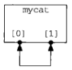
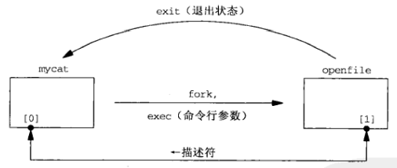

# 第十五章 Unix域协议

[TOC]


## 15.1 概述

使用Unix域套接字的理由：

1. 在源自Berkeley的实现中，Unix域套接字往往比通信两端位于同一个主机的TCP套接字快出一倍。
2. Unix域套接字可用于在同一个主机上的不同进程之间传递描述符。
3. Unix域套接字较新的实现把客户的凭证提供给服务器，从而能够提供额外的安全检查措施。


## 15.2 Unix域套接字地址结构

```c++
struct sockaddr_un {
    sa_family_t sun_family;
    char        sun_path[104];
};
```

*<sys/un.h>中定义的Unix域套接字地址结构*

```c++
TODO
```

*unixdomain/unixbind.c*


## 15.3 socketpair函数

```c++
#include <sys/socket.h>
int socketpair(int family, int type, int protocol, int sockfd[2]);
```

- `family`协议族（必须为AF_LOCAL）
- `type`类型（为SOCK_STREAM或SOCK_DGRAM中的一个）
- `protocol`协议（必须为0）
- `sockfd`用于返回新创建的套接字描述符
- 返回值
  - 成功：非0
  - 失败：-1

*创建两个随后连接起来的套接字*


## 15.4 套接字函数


## 15.5 Unix域字节流客户/服务器程序

```c++
TODO
```

*unixdomain/unixstrserv01.c*

```c++
TODO
```

*unixdomain/unixstrcli01.c*


## 15.6 Unix域数据报客户/服务器程序

```c++
TODO
```

*unixdomain/unixdgserv01.c*

```c++
TODO
```

*unixdomain/unixdgcli01.c*


## 15.7 描述符传递



*使用socketpair创建流管道后的mycat进程*



*启动执行openfile程序后的mycat进程*

```c++
TODO
```

*unixdomain/mycat.c*

```c+
TODO
```

*unixdomain/myopen.c*

```c++
TODO
```

*lib/read_fd.c*

```c++
TODO
```

*unixdomain/openfile.c*

```c++
TODO
```

*lib/write_fd.c*


## 15.8 接收发送者的凭证

```c++
struct cmsgcred {
    pid_t cmcred_pid;
    uid_t cmcred_uid;
    uid_t cmcred_euid;
    gid_t cmcred_gid;
    short cmcred_ngroups;             // >= 1
    gid_t cmcred_groups[CMGROUP_MAX]; // CMGROUP_MAX一般为16
};
```

*FreeBSD在头文件<sys/socket.h>中定义的cmsgcred结构传递凭证*

```c++
TODO
```

*unixdomain/readcred.c*

```c++
TODO
```

*unixdomain/strecho.c*


## 15.9 小结


