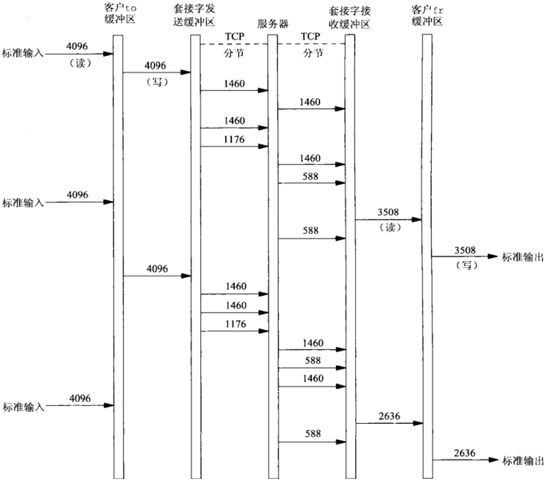
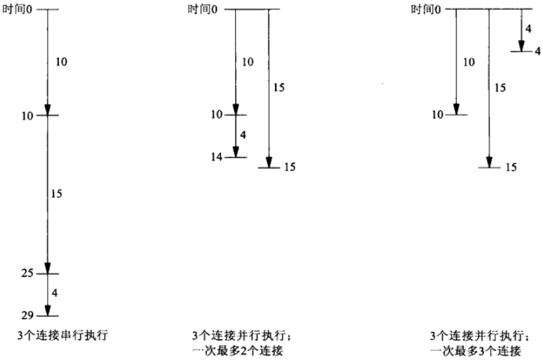

# 第十六章 非阻塞式I/O

[TOC]


## 16.1 概述


## 16.2 非阻塞读和写：str_cli函数（修订版）


*容纳从标准输入到套接字的数据的缓冲区*


*容纳从套接字到标准输出的数据的缓冲区*

```c++
#include "unp.h"
void 
str_cli(FILE *fp, int sockfd)
{
    int maxfdp1, val, stdineof;
    ssize_t n, nwritten;
    fd_set rset, wset;
    char to[MAXLINE], fr[MAXLINE];
    char *toiptr, *tooptr, *friptr, *froptr;
    val = Fcntl(sockfd, F_GETFL, 0);
    Fcntl(STDIN_FILENO, F_SETFL, val | O_NONBLOCK);  // 设置描述符非阻塞
    val = Fcntl(STDIN_FILENO, F_GETFL, 0);
    Fcntl(STDIN_FILENO, F_SETFL, val | O_NONBLOCK);  // 设置描述符非阻塞
    val = Fcntl(STDOUT_FILENO, F_GETFL, 0);
    Fcntl(STDOUT_FILENO, F_SETFL, val | O_NONBLOCK); // 设置描述符非阻塞
    toiptr = tooptr = to;
    friptr = froptr = fr;
    stdineof = 0;
    maxfdp1 = max(max(STDIN_FILENO, STDOUT_FILENO), sockfd) + 1; // 初始化缓冲区指针
    for (;;) {
        FD_ZERO(&rset); // 置零读缓冲区
        FD_ZERO(&wset); // 置零写缓冲区
        if (stdineof == 0 && toiptr < &to[MAXLINE])
            FD_SET(STDIN_FILENO, &rset);
        if (friptr < &fr[MAXLINE])
            FD_SET(sockfd, &rset);
        if (tooptr != toiptr)
            FD_SET(sockfd, &wset);
        if (froptr != friptr)
            FD_SET(STDOUT_FILENO, &wset);
        Select(maxfdp1, &rset, &wset, NULL, NULL); // 调用select，等待条件为真
        if (FD_ISSET(STDIN_FILENO, &rset)) {
            if ((n = read(STDIN_FILENO, toiptr, &to[MAXLINE] - toiptr)) < 0) { // 从标准输入读
                if (errno != EWOULDBLOCK) // 忽略EWOULDBLOCK错误
                    err_sys("read error on stdin");
            } else if (n == 0) { // 读结束
                fprintf(stderr, "%s: EOF on stdin\n", gf_time());
                stdineof = 1;
                if (tooptr == toiptr)
                    Shutdown(sockfd, SHUT_WR);
            } else {
                fprintf(stderr, "%s: read %d bytes from stdin\n", gf_time(),
                       n);
                toiptr += n;
                FD_SET(sockfd, &wset);
            }
        }
        if (FD_ISSET(sockfd, &rset)) { // 从套接字读
            if ((n = read(sockfd, friptr, &fr[MAXLINE] - friptr)) < 0) {
                if (errno != EWOULDBLOCK)
                    err_sys("read error on socket");
            } else if (n == 0) {
                fprintf(stderr, "%s: EOF on socket\n", gf_time());
                if (stdineof)
                    return;
                else
                    err_quit("str_cli: server terminated prematurely");
            } else {
                fprintf(stderr, "%s: read %d bytes from socket\n",
                        gf_time(), n);
                friptr += n;
                FD_SET(STDOUT_FILENO, &wset);
            }
        }
        if (FD_ISSET(STDOUT_FILENO, &wset) && ((n = friptr - froptr) > 0)) { // 写到标准输出
            if ((nwritten = write(STDOUT_FILENO, froptr, n)) < 0) {
                if (errno != EWOULDBLOCK)
                    err_sys("write error to stdout");
            } else { // 写成功
                fprintf(stderr, "%s: wrote %d bytes to stdout\n",
                        gf_time(), nwritten);
                froptr += nwritten;
                if (froptr == friptr)
                    froptr = friptr = fr;
            }
        }
        if (FD_ISSET(sockfd, &wset) && ((n = toiptr - tooptr) > 0)) { // 写到套接字
            if ((nwritten = write(sockfd, tooptr, n)) < 0) {
                if (errno != EWOULDBLOCK)
                    err_sys("write error to socket");
            } else {
                fprintf(stderr, "%s: wrote %d bytes to socket\n",
                        gf_time(), nwritten);
                tooptr += nwritten;
                if (tooptr == toiptr) {
                    toiptr = tooptr = to;
                    if (stdineof)
                        Shutdown(sockfd, SHUT_WR);
                }
            }
        }
    }
}
```

*非阻塞式I/O读写*



*非阻塞式I/O例子的时间线*

### 16.2.1 str_cli的较简单版本


*使用两个进程的str_cli函数*

```c++
#include "unp.h"
void 
str_cli(FILE *fp, int sockfd)
{
    pid_t pid;
    char  sendline[MAXLINE], recvline[MAXLINE];
    if ((pid = Fork()) == 0) {
        while (Readline(sockfd, recvline, MAXLINE) > 0)
            Fputs(recvline, stdout);
        kill(getppid(), SIGTERM);
        exit(0)
    }
    // parent: stdin -> server
    while (Fgets(sendline, MAXLINE, fp) != NULL)
        Writen(sockfd, sendline, strlen(sendline));
    Shutdown(sockfd, SHUT_WR);
    pause();
    return;
}
```

*使用fork的str_cli函数*

### 16.2.2 str_cli执行时间


## 16.3 非阻塞connect

非阻塞connect的用途：

- 把三路握手叠加在其它处理上；
- 同时建立多个连接；
- 可以给select指定一个时间限制，能够缩短connect的超时。


## 16.4 非阻塞connect:时间获取客户程序

```c++
#include "unp.h"
int 
connect_nonb(int sockfd, const SA *saptr, socklen_t salen, int nsec)
{
    int flags, n, error;
    socklen_t len;
    fd_set rset, wset;
    struct timeval tval;
    flgas = Fcntl(sockfd, F_GETFL, 0);
    Fcntl(sockfd, F_SETFL, flags | O_NONBLOCK);
    error = 0;
    if ((n = connect(sockfd, saptr, salen)) < 0)
        if (errno != EINPROGRESS)
            return (-1);
    // Do whatever we wang while the connect is taking place.
    if (n == 0)
        goto done;
    FD_ZERO(&rset);
    FD_SET(sockfd, &rset);
    wset = rset;
    tval.tv_sec = nsec;
    tval.tv_usec = 0;
    if ((n = Select(sockfd+1, &rset, &wset, NULL, 
                    nsec ? &tval : NULL)) == 0) {
        close(sockfd);
        errno = ETIMEDOUT;
        return (-1);
    }
    if (FD_ISSET(sockfd, &rset) || FD_ISSET(sockfd, &wset)) {
        len = sizeof(error);
        if (getsockopt(sockfd, SOL_SOCKET, SO_ERROR, &error, &len) < 0)
            return (-1);
    } else
        err_quit("select error: sockfd not set");
done:
    Fcntl(sockfd, F_SETFL, flags);
    if (error) {
        close(sockfd);
        errno = error;
        return (-1);
    }
    return (0);
}
```

*发起一个非阻塞connect*

对于一个正常的阻塞式套接字，如果其上的connect调用在TCP三路握手完成前被中断；假设被中断的connect调用不由内核自动重启，那么它将返回EINTR。我们不能再次调用connect等待未完成的连接继续完成。这样做将导致返回EADDRINUSE错误。


## 16.5 非阻塞connect:Web客户程序



*并行建立多个连接*


*完成第一个连接后并行操作多个连接*

```c++
#include "unp.h"
#define MAXFILES 20
#define SERV    "80"
struct file { // 定义文件结构
    char *f_name;
    char *f_host;
    int   f_fd;
    int   f_flags;
} file[MAXFILES];
#define F_CONNECTION 1
#define F_READING    2
#define F_DONE       4
#define GET_CMD     "GET %s HTTP/1.0\r\n\r\n"
// 定义全局变量
int    nconn, nfiles, nlefttoconn, nlefttoread, maxfd;
fd_set rset, wset;
// 定义全局函数
void home_page(const char * const char *);
void start_connect(struct file *);
void write_get_cmd(struct file *);
```

*web.h*

```c++
#include "web.h"
int 
main(int argc, char **argv)
{
    int i, fd, n, maxnconn, flags, error;
    char buf[MAXLINE];
    fd_set rs, ws;
    if (argc < 5)
        err_quit("usage: web <#conns> <hostname> <homepage> <file1> ...");
    maxnconn = atoi(argv[1]);
    nfils = min(argc - 4, MAXFILES);
    for (i = 0; i < nfiles; i++) {
        file[i].f_name = argv[i + 4];
        file[i].f_host = argv[2];
        file[i].f_flags = 0;
    }
    printf("nfiles = %d\n", nfiles);
    home_page(argv[2], argv[3]);
    FD_ZERO(&rset); // 初始化读描述符集
    FD_ZERO(&wset); // 初始化写描述符集
    maxfd = -1;
    nlefttoread = nlefttoconn = nfiles;
    nconn = 0;
    while (nlefttoread > 0) {
        while (nconn < maxnconn && nlefttoconn > 0) { // 尽可能发起连接
            // find a file to read
            for (i = 0; i < nfiles; i++)
                if (file[i].f_flags == 0)
                    break;
            if (i == nfiles)
                err_quit("nlefttoconn = %d but nothing found", nlefttoconn);
            start_connect(&file[i]);
            nconn++;
            nlefttoconn--;
        }
        rs = rset;
        ws = wset;
        n = Select(maxfd + 1, &rs, &ws, NULL, NULL); // select等待事件发生
        for (i = 0; i < nfiles; i++) { // 处理所有就绪的描述符
            flags = file[i].f_flags;
            if (flags == 0 || flags & F_DONE)
                continue
            fd = file[i].f_fd;
            if (flags & F_CONNECTING &&
                (FD_ISSET(fd, &rs) || FD_ISSET(fd, &ws))) {
                n = sizeof(error);
                if (getsockopt(fd, SOL_SOCKET, SO_ERROR, &error, &n) < 0 ||
                    error != 0) {
                    err_ret("nonblocking connect failed for %s",
                            file[i].f_name);
                }
                // connection established
                printf("connection established for %s\n", file[i].f_name);
                FD_CLR(fd, &wset); // no more writeability test
                write_get_cmd(&file[i]); // write the GET command
            } else if (flags & F_READING && FD_ISSET(fd, &rs)) { // 检查描述符是否有数据
                if ((n = Read(fd, buf, sizeof(buf))) == 0) {
                    printf("end-of-file on %s\n", file[i].f_name);
                    Close(fd);
                    file[i].f_flags = F_DONE;
                    FD_CLR(fd, &rset);
                    nconn--;
                    nlefttoread--;
                } else {
                    printf("read %d bytes from %s\n", n, file[i].f_name);
                }
            }
        }
    }
    exit(0);
}
```

*web.c*

```c++
#include "web.h"
void 
home_page(const char *host, const char *fname)
{
    int fd, n;
    char line[MAXLIN];
    fd = Tcp_connect(host, SERV); // 与服务器建立连接
    n = snprintf(line, sizeof(line), GET_CMD, fname);
    Writen(fd, line, n); // 发出HTTP GET
    for (;;) {
        if ((n = Read(fd, line, MAXLINE)) == 0)
            break;
        printf("read %d bytes of home page\n", n);
        // do whatever with data
    }
    printf("end-of-file on home page\n");
    Close(fd);
}
```

*home_page.c*

```c++
#include "web.h"
void 
start_connect(struct file *fptr)
{
    int fd, flags, n;
    struct addrinfo *ai;
    ai = Host_serv(fptr->f_host, SERV, 0, SOCK_STREAM);
    fd = Socket(ai->ai_family, ai->ai_socktype, ai->ai_protocol);
    fptr->f_fd = fd;
    printf("start_connect for %s, fd %d\n", fptr->f_name, fd);
    // Set socket nonblocking
    flags = Fcntl(fd, F_GETFL, 0);
    Fcntl(fd, F_SETFL, flags | O_NONBLOCK); // 设置套接字非阻塞
    // 发起非阻塞连接
    if ((n = connect(fd, ai->ai_addr, ai->ai_addrlen)) < 0) {
        if (errno != EINPROGRESS)
            err_sys("nonblocking connect error");
        fptr->f_flags = F_CONNECTING;
        FD_SET(fd, &rset);
        FD_SET(fd, &wset);
        if (fd > maxfd)
            maxfd = fd;
    } else if (n >= 0)       // 连接完成
        write_get_cmd(fptr); // write() the GET command
}
```

*start_connect.c*

```c++
#include "web.h"
void 
write_get_cmd(struct file *fptr)
{
    int n;
    char line[MAXLINE];
    n = snprintf(line, sizeof(line), GET_CMD, fptr->f_name);
    Writen(fptr->f_fd, line, n);
    printf("wrote %d bytes for %s\n", n fptr->f_name);
    fptr->f_flags = F_READING; // 设置读标记
    FD_SET(fptr->f_fd, &rset);
    if (fptr->f_fd > maxfd)
        maxfd = fptr->f_fd;
}
```

*write_get_cmd.c*


*各个同时连接数的时钟时间*


## 16.6 非阻塞accept

```c++
#include "unp.h"
int 
main(int argc, char **argv)
{
    int sockfd;
    struct linger ling;
    struct sockaddr_in servaddr;
    if (argc != 2)
        err_quit("usage: tcpcli <IPaddress>");
    sockfd = Socket(AF_INET, SOCK_STREAM, 0);
    bzero(&servaddr, sizeof(servaddr));
    servaddr.sin_family = AF_INET;
    servaddr.sin_port = htons(SERV_PORT);
    Inet_pton(AF_INET, argv[1], &servaddr.sin_addr);
    Connect(sockfd, (SA *)&servaddr, sizeof(servaddr));
    ling.l_onoff = 1;
    ling.l_linger = 0;
    Setsockopt(sockfd, SOL_SOCKET, SO_LINGER, &ling, sizeof(ling)); // 设置连接被关闭时发送一个RST
    Close(sockfd);
    exit(0);
}
```

*建立连接并发送一个RST的TCP回射客户程序*


## 16.7 小结

