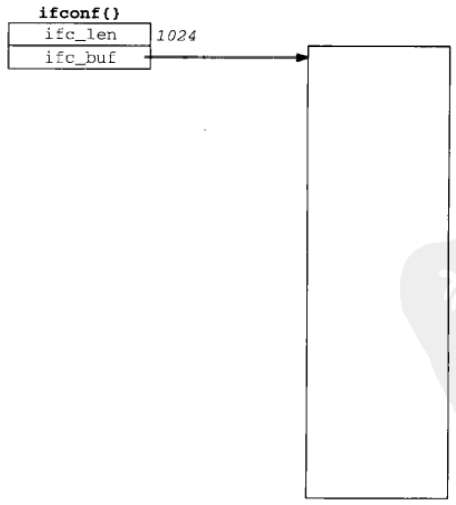
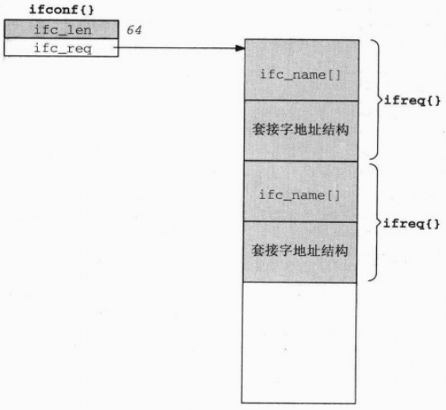

# 第17章 ioctl操作

[TOC]


## 17.1 概述


## 17.2 ioctl函数

```c++
#include <unistd.h>
int ioctl(int fd, int request, ...);
```

- `fd`套接字

- `request`请求

  | 类别   | request                                                      | 说明                                                         | 数据类型                                                     |
  | ------ | ------------------------------------------------------------ | ------------------------------------------------------------ | ------------------------------------------------------------ |
  | 套接字 | SIOCATMARK<br>SIOCSPGRP<br>SIOCGPGRP                         | 是否位于带外标记<br>设置套接字地进程ID或进程组ID<br>获取套接字地进程ID或进程组ID | int<br>int<br>int                                            |
  | 文件   | FIONBIO<br>FIOASYNC<br>FIONREAD<br>FIOSETOWN<br>FIOGETOWN    | 设置/清除非阻塞式I/O标志<br>设置/清除信号驱动异步I/O标志<br>获取接收缓冲区中地字节数<br>设置文件地进程ID或进程组ID<br>获取文件地进程ID或进程组ID | int<br>int<br>int<br>int<br>int                              |
  | 接口   | SIOCGIFCONF<br>SIOCSIFADDR<br>SIOCGIFADDR<br>SIOCSIFFLAGS<br>SIOCGIFFLAGS<br>SIOCSIFDSTADDR<br>SIOCGIFDSTADDR<br>SIOCGIFBRDADDR<br>SIOCSIFBRDADDR<br>SIOCGIFNETMASK<br>SIOCSIFNETMASK<br>SIOCGIMETRIC<br>SIOCSIMETRIC<br>SIOCGIFMTU<br>SIOCxxx | 获取所有接口地列表<br>设置接口地址<br>获取接口地址<br>设置接口标志<br>获取接口标志<br>设置点到点地址<br>获取点到点地址<br>获取广播地址<br>设置广播地址<br>获取子网掩码<br>设置子网掩码<br>获取接口的测度<br>设置接口的测度<br>获取接口MTU<br>（还有很多：取决于实现） | struct ifconf<br>struct ifreq<br>struct ifreq<br>struct ifreq<br>struct ifreq<br>struct ifreq<br>struct ifreq<br>struct ifreq<br>struct ifreq<br>struct ifreq<br>struct ifreq<br>struct ifreq<br>struct ifreq<br>struct ifreq<br>struct ifreq |
  | ARP    | SIOCSARP<br>SIOCGARP<br>SIOCDARP                             | 创建/修改ARP表项<br>获取ARP表项<br>删除ARP表项               | struct arpreq<br>struct arpreq<br>struct arpreq              |
  | 路由   | SIOCADDRT<br>SIOCDELRT                                       | 增加路径<br>删除路径                                         | struct rtentry<br>struct rtentry                             |
  | 流     | I_xxx                                                        | 略                                                           | 略                                                           |

- `返回值`

  成功：0
  
  失败：-1

影响由fd引用的一个打开的文件。


## 17.3 套接字操作

- SIOCATMARK 如果本套接字的读指针当前位于带外标记，那就通过由第三个参数指向的整数返回一个非0值；否则返回一个0值。
- SIOCGPGRP 通过由第三个参数指向的整数返回本套接字的进程ID或进程组ID，该ID指定针对本套接字的SIGIO或SIGURG信号的接收进程。
- SIOCSPGRP 把本套接字的进程ID或进程组ID设置成由第三个参数指向的整数，该ID指定针对本套接字的SIGIO或SIGURG信号的接收进程。本请求和fcntl的F_SETOWN命令等效。


## 17.4 文件操作

- FIONBIO 根据ioctl的第三个参数指向一个0值或非0值，可清除或设置本套接字的非阻塞式I/O标志。本请求和O_NONBLOCK文件状态标志等效，而可以通过fcntl的F_SETFL命令清除或设置该标志。
- FIOASYNC 根据ioctl的第三个参数指向一个0值或非0值，可清除或设置针对本套接字的信号驱动异步I/O标志，它决定是否收取针对本套接字的异步I/O信号（SIGIO）。本请求和O_ASYNC文件状态标志等效，而可以通过fcntl的F_SETFL命令清除或设置该标志。
- FIONREAD 通过由ioctl的第三个参数指向的整数返回当前在本套接字接收缓冲区中的字节数。本特性同样适用于文件，管道和终端。
- FIOSETOWN 对于套接字和SIOCSPGRP等效。
- FIOGETOWN 对于套接字和SIOCGPGRP等效。


## 17.5 接口配置

```c++
struct ifconf {
    lint ifc_len;
    union {
        caddr_t ifcu_buf;
        struct  ifreq *ifcu_req;
    } ifc_ifcu;
};
#define ifc_buf ifc_ifcu.ifcu_buf
#define ifc_req ifc_ifcu.ifcu_req
#define IFNAMSIZ 16
struct ifreq {
    char ifr_name[IFNAMSIZ];
    union {
        struct  sockaddr ifru_addr;
        struct  sockaddr ifru_dstaddr;
        struct  sockaddr ifru_broadaddr;
        short   ifru_flags;
        int     ifru_metric;
        caddr_t ifru_data;
    } ifr_ifru;
};
#define ifr_addr      ifr_ifru.ifru_addr
#define ifr_dstaddr   ifr_ifru.ifru_dstaddr
#define ifr_broadaddr ifr_ifru.ifru_broadaddr
#define ifr_flags     ifr_ifru.ifru_flags
#define ifr_metric    ifr_ifru.ifru_metric
#define ifr_data      ifr_ifru.ifru_data
```

*用于接口类各个ioctl请求的ifconf结构和ifreq结构*



*SIOCGIFCONF前ifconf结构的初始化结果*



*SIOCGIFCONF返回的值*


## 17.6 get_ifi_info函数

```c++
/* Our own head for the programs that need interface configuration info.
   Include this file, instead of "unp.h" */
#ifndef __unp_ifi_h
#define __unp_ifi_h
#include "unp.h"
#include <net/if.h>
#define IFI_NAME 16
#define IFI_HADDR 8
struct ifi_info {
    char ifi_name[IFI_NAME];
    short ifi_index;
    short ifi_mtu;
    u_char ifi_haddr[IFI_HADDR];
    u_short ifi_hlen;
    short ifi_flags;
    short ifi_myflags;
    struct sockaddr *ifi_addr;
    struct sockaddr *ifi_brdaddr;
    struct sockaddr *ifi_dstaddr;
    struct ifi_info *ifi_next;
};
#define IFI_ALLAS 1
/* function prototypes */
struct ifi_info *get_ifi_info(int, int);
struct ifi_info *Get_ifi_info(int, int);
void free_ifi_info(struct ifi_info *);
#endif 
```

*unpifi.h头文件*

```c++
#include "unpifi.h"
int 
main(int argc, char **argv)
{
    struct ifi_info *ifi, *ifihead;
    struct sockaddr *sa;
    u_char *ptr;
    int i, family, doaliases;
    if (argc != 3)
        err_quit("usage: prifinfo <inet4|inet6> <doaliases>");
    if (strcmp(argv[1], "inet4") == 0)
        family = AF_INET;
    else if (strcmp(argv[1], "inet6") == 0)
        family = AF_INET6;
    else
        err_quit("invalid <address-family>");
    doaliases = atoi(argv[2]);
    for (ifihead = ifi = Get_ifi_info(family, doaliases);
         ifi != NULL; ifi = ifi->ifi_next) {
        printf("%s: ", ifi->ifi_name);
        if (ifi->ifi_index != 0)
            printf("(%d) ", ifi->ifi_index);
        printf("<");
        if (ifi->ifi_flags & IFF_UP)          printf("UP ");
        if (ifi->ifi_flags & IFF_BROADCAST)   printf("BCAST ");
        if (ifi->ifi_flags & IFF_MULTICAST)   printf("MCAST ");
        if (ifi->ifi_flags & IFF_LOOPBACK)    printf("LOOP ");
        if (ifi->ifi_flags & IFF_POINTOPOINT) printf("P2P ");
        printf(">\n");
        if ((i = ifi->ifi_hlen) > 0) {
            ptr = ifi->ifi_haddr;
            do {
                ptinrf("%s%x", (i == ifi->ifi_hlen) ? " " : ":", *ptr++);
            } while(--i > 0);
            printf("\n");
        }
        if (ifi->ifi_mtu != 0)
            printf(" MTU: %d\n", ifi->ifi_mtu);
        if ((sa = ifi_addr) != NULL)
            printf(" MTU: %d\n", Sock_ntop_host(sa, sizeof(*sa)));
        if ((sa = ifi->ifi_brdaddr) != NULL)
            printf(" broadcast addr: %s\n", 
                   Sock_ntop_host(sa, sizeof(*sa)));
        if ((sa = ifi->ifi_dstaddr) != NULL)
            printf(" destination addr: %s\n", 
                   Sock_ntop_host(sa, sizeof(*sa)));
    }
    free_ifi_info(ifihead);
    exit(0);
}
```

*调用get_ifi_info函数的prifinfo程序*

```c++
#include "unpifi.h"
struct ifi_info * 
get_ifi_info(int family, int doaliases)
{
    struct ifi_info *ifi, *ifihead, **ifipnext;
    int sockfd, len, lastlen, flags, myflags, idx = 0, hlen = 0;
    char *ptr, *buf, lastname[IPNAMSIZ], *cptr, *haddr, *sdlname;
    struct ifconf ifc;
    struct ifreq *ifr, ifrcopy;
    struct sockaddr_in *sinptr;
    struct sockaddr_in6 *sin6ptr;
    sockfd = Socket(AF_INET, SOCK_DGRAM, 0);
    lastlen = 0;
    len = 100 * sizeof(struct ifreq); // initial buffer size guess
    for (;;) { // 循环发送SIOCGIFCONF请求
        buf = Malloc(len); // 动态分配缓冲区
        ifc.ifc_len = len;
        ifc.ifc_buf = buf;
        if (ioctl(sockfd, SIOCGIFCONF, &ifc) < 0) {
            if (errno != EINVAL || lastlen != 0) // 缓冲区容量不够
                err_sys("ioctl error");
        } else {
            if (ifc.ifc_len == lastlen) // ioctl调用返回成功
                break;
            lastlen = ifc.ifc_len;
        }
        len += 10 * sizeof(struct ifreq); // 缓冲区扩增
        free(buf);
    }
    ifihead = NULL; // 初始化链表指针
    ifipnext = &ifihead;
    lastname[0] = 0;
    adlname = NULL;
    for (ptr = buf; ptr < buf + ifc.ifc_len; ) {
        ifr = (struct ifreq *)ptr;
#ifdef HAVE_SOCKADDR_SA_LEN
        len = max(sizeof(struct sockaddr), ifr->ifr_addr.sa_len);
#else
        switch(ifr->ifr_addr.sa_family) {
#ifdef IPV6
            case AF_INET6:
                len = sizeof(struct sockaddr_in6);
                break;
#endif
            case AF_INET:
            default:
                len = sizeof(struct sockaddr);
                break;
        }
#endif // HAVE_SOCKADDR_SA_LEN
        ptr += sizeof(ifr->ifr_name) + len;
#ifdef HAVE_SOCKADDR_DL_STRUCT // 处理AF_LINK
        // assumes that AP_LINK precedes AF_INET or AF_INET6
        if (ifr->ifr_addr.sa_family == AF_LINK) {
            struct sockaddr_dl *sdl = (struct sockaddr_dl *)&ifr->ifr_addr;
            sdlname = ifr->ifr_name;
            idx = sdl->sdl_index;
            haddr = sdl->sdl_data + sdl->sdl_nlen;
            hlen = sdl->sdl_alen;
        }
#endif
        if (ifr->ifr_addr.sa_family != family)
            continue;
        myflags = 0;
        if ((cptr = strchr(ifr->ifr_name, ':')) != NULL)
            *cptr = 0;
        if (strncmp(lastname, ifr->ifr_name, IFNAMSIZ) == 0) { // 处理别名
        	if(doaliases == 0)
                continue;
            myflags = IFI_ALIAS;
        }
        memcpy(lastname, ifr->ifr_name, IFNAMSIZ);
        ifrcopy = *ifr;
        Ioctl(sockfd, SIOCGIFFLAGS, &ifrcopy);
        flags = ifrcopy.ifr_flags; // 获取接口标志
        if ((flags & IFF_UP) == 0)
            continue;
        ifi = Calloc(1, sizeof(struct ifi_info)); // 分配并初始化ifi_info结构
        *ifipnext = ifi;
        ifipnext = &ifi->ifi_next;
        ifi->ifi_flags = flags;
        ifi->ifi_myflags = myflags;
 #if defined(SIOCGIFMTU) && defined(HAVE_STRUCT_IFREQ_IFR_MTU)
        Ioctl(sockfd, SIOCGIFMTU, &ifrcopy);
        ifi->ifi_mtu = ifrcopy.ifr_mtu;
 #else
        ifi->ifi_mtu = 0;
 #endif
        memcpy(ifi->ifi_name, ifr->ifr_name, IFI_NAME);
        ifi->ifi_name[IFI_NAME-1] = '\0';
        // If the sockaddr_dl is from a different interface, ignore it
        if (sdlname == NULL || strcmp(sdlname, ifr->ifr_name) != 0)
            idx = hlen = 0;
        ifi->ifi_index = idx;
        ifi->ifi_hlen = hlen;
        if (ifi->ifi_hlen > IFI_HADDR)
            ifi->ifi_hlen - IFI_HADDR;
        if (hlen)
            memcpy(ifi->ifi_haddr, haddr, ifi->ifi_hlen);
        switch(ifr->ifr_addr.sa_family) {
            case AF_INET:
                sinptr = (struct sockaddr_in *) &ifr->ifr_addr;
                ifi->ifi_addr = Calloc(1, sizeof(struct sockaddr_in));
                memcpy(ifi->ifi_addr, sinptr, sizeof(struct sockaddr_in)); // 复制ip地址
#ifdef SIOCGIFBRDADDR
                if (flags & IFF_BROADCAST) {
                    Ioctl(sockfd, SIOCGIFBRDADDR, &ifrcopy);
                    sinptr = (struct sockaddr_in *) *ifrcopy.ifr_broadaddr;
                    ifi->ifi_brdaddr = Calloc(1, sizeof(struct sockaddr_in));
                    memcpy(ifi->ifi_brdaddr, sinptr, sizeof(struct sockaddr_in));
                }
# endif
#ifdef SIOCGIFDSTADDR
                if (flags & IFF_POINTOPOINT) {
                    Ioctl(sockfd, SIOCGIFDSTADDR, &ifrcopy);
                    sinptr = (struct sockaddr_in *)&ifrcopy.ifr_dstaddr;
                    ifi->ifi_dstaddr = Colloc(1, sizeof(struct sockaddr_in));
                    memcpy(ifi->ifi_dstaddr, sinptr, sizeof(struct sockaddr_in));
                }
#endif
                break;
            case AF_INET6:
                sin6ptr = (struct sockaddr_in6 *)&ifr->ifr_addr;
                ifi->ifi_addr = Calloc(1, sizeof(struct sockaddr_in6));
                memcpy(ifi->ifi_addr, sin6ptr, sizeof(struct sockaddr_in6));
#ifdef SIOCGIFDSTADDR
                if (flags & IFF_POINTOPOINT) {
                    Ioctl(sockfd, SIOCGIFDSTADDR, &ifrcopy);
                    sin6ptr = (struct sockaddr_in6 *)&ifrcopy.ifr_dstaddr;
                    ifi->ifi_dstaddr = Calloc(1, sizeof(struct sockaddr_in6));
                    memcpy(ifi->ifi_dstaddr, sin6ptr,
                           sizeof(struct sockaddr_in6));
                }
#endif
                break;
            default:
                break;
        }
    }
    free(buf);
    return (ifihead);
}
void 
free_ifi_info(struct ifi_info *ifihead) // 释放get_ifi_info动态分配的内存空间
{
    struct ifi_info *ifi, *ifinext;
    for (ifi = ifihead; ifi != NULL; ifi = ifinext) {
        if (ifi->ifi_addr != NULL)
            free(ifi->ifi_addr);
        if (ifi->ifi_brdaddr != NULL)
            free(ifi->ifi_brdaddr);
        if (ifi->ifi_dstaddr != NULL)
            free(ifi->ifi_dstaddr);
        ifinext = ifi->ifi_next;
        free(ifi);
    }
}
```

*创建一个网际网套接字*


## 17.7 接口操作

接口请求：

- SIOCGIFADDR 在ifr_addr成员中返回单播地址。
- SIOCSIFADDR 用ifr_addr成员设置接口地址。这个接口的初始化函数也被调用。
- SIOCGIFFLAGS 在ifr_flags成员中返回接口标志。这些标志的名字格式为IFF_xxx，在<net/if.h>头文件中定义。
- SIOCSIFFLAGS 用ifr_flags成员设置接口标志。
- SIOCGIFDSTADDR 在ifr_dstaddr成员中返回点到点地址。
- SIOCSIFDSTADDR 用ifr_dstaddr成员设置点到点地址。
- SIOCGIFBRDADDR 在ifr_broadaddr成员中返回广播地址。应用进程必须首先获取接口标志，然后发出正确的请求：对于广播接口为SIOCGIFBRDADDR，对于点到点接口为SIOCGIFDSTADDR。
- SIOCSIFBRDADDR 用ifr_broadaddr成员设置广播地址。
- SIOCGIFNETMASK 在ifr_addr成员中返回子网掩码。
- SIOCSIFNETMASK 用ifr_addr成员设置子网掩码。
- SIOCGIFMETRIC 用ifr_metric成员返回接口测度。
- SIOCSIFMETRIC 用ifr_metric成员设置接口的路由测度。


## 17.8 ARP高速缓存操作

```c++
struct arpreq {
    struct sockaddr arp_pa;
    struct sockaddr arp_ha;
    int             arp_flags;
};
#define ATF_INUSE 0x01
#define ATF_COM   0x02
#define ATF_PERM  0x04
#define ATF_PUBL  0x08
```

*ARP高速缓存类ioctl请求所用的arpreq结构*

操纵ARP高速缓存的ioctl请求：

- SIOCSARP 把一个新的表项加到ARP高速缓存，或者修改其中已经存在的一个表项。其中arp_pa是一个含有IP地址的网际网套接字地址结构，arp_ha则是一个通用套接字地址结构，它的sa_family值为AF_UNSPEC, sa_data中含有硬件地址。ATF_PERM和ATF_PUBL这两个标志也可以由应用程序指定。另外两个标志（ATF_INUSE和ATF_COM）则由内核设置。
- SIOCDARP 从ARP高速缓存中删除一个表项。调用者指定要删除表项的网际网地址。
- SIOCGARP 从ARP高速缓存中获取一个表项。调用者指定网际网地址，相应的硬件地址随标志一起返回。

```c++
#include "unpifi.h"
#include <net/if_arp.h>
int 
main(int argc, char **argv)
{
    int sockfd;
    struct ifi_info *ifi;
    unsigned char *ptr;
    struct arpreq arpreq;
    struct sockaddr_in *sin;
    sockfd = Socket(AF_INET, SOCK_DGRAM, 0);
    for (ifi = get_ifi_info(AF_INET, 0); ifi != NULL; ifi = ifi->ifi_next) { // 遍历地址
        printf("%s: ", Sock_ntop(ifi->ifi_addr, sizeof(struct sockaddr_in))); // 输出地址
        sin = (struct sockaddr_in *) &arpreq.arp_pa;
        memcpy(sin, ifi->ifi_addr, sizeof(struct sockaddr_in));
        if (ioctl(sockfd, SIOCGARP, &arpreq) < 0) { // 发出ioctl请求
            err_ret("ioctl SIOCGARP");
            continue;
        }
        ptr = &arpreq.arp_ha.sa_data[0]; // 硬件地址
        printf("%x:%x:%x:%x:%x:%x\n", *ptr, *(ptr+1),
               *(ptr+2), *(ptr+3), *(ptr+4), *(ptr+5));
    }
    exit(0);
}
```

*输出一个主机的硬件地址*


## 17.9 路由表操作

- SIOCADDRT 往路由表中增加一个表项
- SIOCDELRT 从路由表中删除一个表项


## 17.10 小结

用于网络编程的ioctl命令可划分为6类：

- 套接字操作；
- 文件操作；
- 接口操作；
- ARP表操作；
- 路由表操作；
- 流系统。