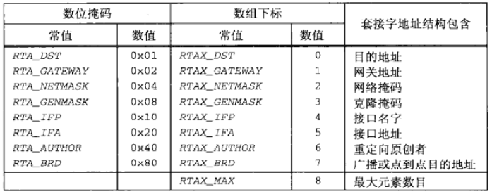
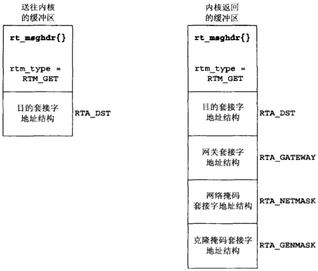
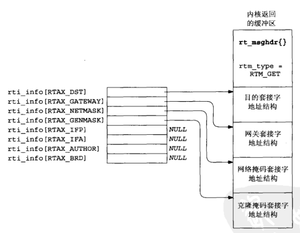
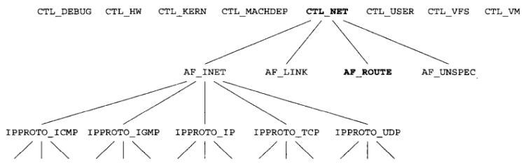
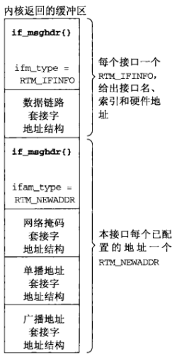

# 第十八章 路由套接字

[TOC]


## 18.1 概述


## 18.2 数据链路套接字地址结构

```c++
struct sockaddr_dl {
    uint8_t     sdl_len;
    sa_family_t sdl_family;
    uint16_t    sdl_index;
    uint8_t     sdl_type;
    uint8_t     sdl_nlen;
    uint8_t     sdl_alen;
    uint8_t     sdl_slen;
    char        sdl_data[12];
};
```

*数据链路套接字地址结构*


## 18.3 读和写

| 消息类型       | 去往内核？ | 来自内核？ | 说明                           | 结构类型          |
| -------------- | ---------- | ---------- | ------------------------------ | ----------------- |
| RTM_ADD        | Y          | Y          | 增加路径                       | rt_msghdr         |
| RTM_CHANGE     | Y          | Y          | 改动网关，测度或标志           | rt_msghdr         |
| RTM_DELADDR    |            | Y          | 地址正被删离接口               | ifa_msghdr        |
| RTM_DELETE     | Y          | Y          | 删除路径                       | rt_msghdr         |
| RTM_DELMADDR   |            | Y          | 多播地址正被删离接口           | ifma_msghdr       |
| RTM_GET        | Y          | Y          | 报告测度及其它路径信息         | rt_msghdr         |
| RTM_IFANNOUNCE |            | Y          | 接口正被增至或删离系统         | if_announcemsghdr |
| RTM_IFINFO     |            | Y          | 接口正在开工，停工等           | if_msghdr         |
| RTM_LOCK       | Y          | Y          | 锁住给定的测度                 | rt_msghdr         |
| RTM_LOSING     |            | Y          | 内核怀疑路径即将失效           | rt_msghdr         |
| RTM_MISS       |            | Y          | 地址查找失败                   | rt_msghdr         |
| RTM_NEWADDR    |            | Y          | 地址正被增至接口               | ifa_msghdr        |
| RTM_NEWMADDR   |            | Y          | 多播地址正被增至接口           | ifma_msghdr       |
| RTM_REDIRECT   |            | Y          | 内核被告知使用另外的路径       | rt_msghdr         |
| RTM_RESOLVE    |            | Y          | 请求把目的地址解析成链路层地址 | rt_msghdr         |

*通过路由套接字交换的消息类型*

```c++
struct rt_msghdr {
    u_short rtm_msglen;
    u_char  rtm_version;
    u_char  rtm_type;
    u_short rtm_index;
    int     rtm_flags;
    int     rtm_addrs;
    pid_t   rtm_pid;
    int     rtm_seq;
    int     rtm_errno;
    int     rtm_use;
    u_long  rtm_inits;
    struct rt_metrics rtm_rmx;
};
struct if_msghdr {
    u_short ifm_msglen;
    u_char  ifm_version;
    u_char  ifm_type;
    int     ifm_addrs;
    int     ifm_flags;
    u_short ifm_index;
    struct if_data ifm_data;
};
struct ifa_msghdr {
    u_short ifam_msglen;
    u_char  ifam_version;
    u_char  ifam_type;
    int     ifam_addrs;
    int     ifam_flags;
    u_short ifam_index;
    int     ifam_metric;
};
struct ifma_msghdr {
    u_short ifmam_msglen;
    u_char  ifmam_version;
    u_char  ifmam_type;
    int     ifmam_addrs;
    int     ifmam_fags;
    u_short ifmam_index;
};
struct if_announcemsghdr {
    u_short ifan_msglen;
    u_char  ifan_version;
    u_char  ifan_type;
    u_short ifan_index;
    char    ifan_name[IFNAMSIZ];
    u_short ifan_what;
};
```

*路由消息返回的三种结构*



*在路由消息中用于指称套接字地址结构的常值*



*RTM_GET命令通过路由套接字与内核交换的数据*

```c++
#include "unproute.h"
#define BUFLEN (sizeof(struct rt_msghdr) + 512)
// sizeof(struct sockaddr_in6) * 8 = 192
#define SEQ 9999
int 
main(int argc, char **argv)
{
    int sockfd;
    char *buf;
    pid_t pid;
    ssize_t n;
    struct rt_msghdr *rtm;
    struct sockaddr *sa, *rti_info[RTAX_MAX];
    struct sockaddr_in *sin;
    if (argc != 2)
        err_quit("usage: getrt <IPaddress>");
    sockfd = Socket(AF_ROUTE, SOCK_RAW, 0);
    buf = Calloc(1, BUFLEN);
    rtm = (struct rt_msghdr *)buf;
    rtm->rtm_msglen = sizeof(struct rt_msghdr) + sizeof(struct sockaddr_in);
    rtm->rtm_version = RTM_VERSION;
    rtm->rtm_type = RTM_GET;
    rtm->rtm_addrs = RTA_DST;
    rtm->rtm_pid = pid = getpid();
    rtm->rtm_seq = SEQ;
    sin = (struct sockaddr_in *)(rtm + 1);
    sin->sin_len = sizeof(struct sockaddr_in);
    sin->sin_family = AF_INET;
    Inet_pton(AF_INET, argv[1], &sin->sin_addr);
    Write(sockfd, rtm, rtm->rtm_msglen); // 写消息到内核并read应答
    do {
        n = Read(sockfd, rtm, BUFLEN);
    } while (rtm->rtm_type != RTM_GET || rtm->rtm_seq != SEQ ||
             rtm->rtm_pid != pid);
    rtm = (struct rt_msghdr *)buf;
    sa = (struct sockaddr *)(rtm + 1);
    get_rtaddrs(rtm->rtm_addrs, sa, rti_info);
    if ((sa = rti_info[RTAX_DST]) != NULL)
        printf("dest: %s\n", sock_ntop_host(sa, sa->sa_len));
    if ((sa = rti_info[RTAX_GETEWAY]) != NULL)
        printf("getway: %s\n", sock_ntop_host(sa, sa->sa_len));
    if ((sa = rti_info[RTAX_NETMASK]) != NULL)
        printf("netmask: %s\n", sock_masktop(sa, sa->sa_len));
    if ((sa = rti_info[RTAX_GENMASK]) != NULL)
        printf("genmask: %s\n", sock_masktop(sa, sa->sa_len));
    exit(0);
}
```

*通过路由套接字发出RTM_GET命令的程序的后半部分*



*get_rtaddrs函数填写的rti_info结构*

```c++
#include "unproute.h"
/*
 * Round up 'a' to next multiple of 'size', which must be a power of 2
  */
#define ROUNDUP(a, size) (((a) & ((size) - 1)) ? (1 + ((a) | ((size) - 1))) : (a))
/*
 * Step to next socket address structure;
 * if sa_len is 0, assume it is sizeof(u_long).
 */
#define NEXT_SA(ap) ap = (SA *) \ // 步入下一个套接字地址结构
	((caddr_t)ap + (ap->sa_len ? ROUNDUP(ap->sa_len, sizeof(u_long)) : \
	                                sizeof(u_long)))
void 
get_rtaddrs(int addrs, SA *sa, SA **rti_info)
{
    int i;
    for (i = 0; i < RTAX_MAX; i++) { // 遍历8个可能的指针
        if (addrs & (1 << i)) {
            rti_info[i] = sa;
            NEXT_SA(sa);
        } else
            rti_info[i] = NULL;
    }
}
```

*构造指向路有消息中各个套接字地址结构的指针数组*

```c++
#include "unproute.h"
const char * 
sock_masktop(SA *sa, socklen_t salen)
{
    static char str[INET6_ADDRSTRLEN];
    unsigned char *ptr = &sa->sa_data[2];
    if (sa->sa_len == 0)
        return ("0.0.0.0");
    else if(sa->sa_len == 5)
        snprintf(str, sizeof(str), "%d.0.0.0", *ptr);
    else if(sa->sa_len == 6)
        snprintf(str, sizeof(str), "%d.%d.0.0", *ptr, *(ptr+1));
    else if(sa->sa_len == 7)
        snprintf(str, sizeof(str), "%d.%d.%d.0", *ptr, *(ptr+1), 
                 *(ptr+2));
    else if (sa->sa_len == 8)
        snprintf(str, sizeof(str), "%d.%d.%d.%d", 
                 *ptr, *(ptr + 1), *(ptr+2), *(ptr+3));
    else
        snprintf(str, sizeof(str), "(unknown mask, len = %d, family = %d)",
                 sa->sa_len, sa->sa_family);
    return (str);
}
```

*把一个掩码的值转换成它的表达格式*


## 18.4 sysctl操作

```c++
#include <sys/param.h>
#include <sys/sysctl.h>
int sysctl(int *name, u_int namelen, void *oldp, size_t *oldlenp,
           void *newp, size_t newlen);
```

- `name`名字（整数数组）

  - AF_INET：获取或设置影响网际网协议的变量。

  - AF_LINK：获取或设置链路层信息（如：PPP接口的数目）。

  - AF_ROUTE：返回路由表或接口列表的信息

    sysctl在AF_ROUTE域返回的信息：

    | name[] | 返回IPv4路由表 | 返回IPv4 ARP高速缓存 | 返回IPv6路由表 | 返回接口清单  |
    | ------ | -------------- | -------------------- | -------------- | ------------- |
    | 0      | CTL_NET        | CTL_NET              | CTL_NET        | CTL_NET       |
    | 1      | AF_ROUTE       | AF_ROUTE             | AF_ROUTE       | AF_ROUTE      |
    | 2      | 0              | 0                    | 0              | 0             |
    | 3      | AF_INET        | AF_INET              | AF_INET6       | 0             |
    | 4      | NET_RT_DUMP    | NET_RT_FLAGS         | NET_RT_DUMP    | NET_RT_IFLIST |
    | 5      | 0              | RTF_LLINFO           | 0              | 0             |

  - AF_UNSPEC：获取或设置一些套接字层变量（如：套接字发送或接收缓冲区的最大大小）。

- `namelen`数组长度

- `oldp`供内核存放名字的缓冲区

  可能包含以下信息：

  1. NET_RT_DUMP：返回由name[3]指定的地址族的路由表。如果所指定的地址族为0，那么返回所有地址族的路由表。
  2. NET_RT_FLAGS：返回由name[3]指定的地址族的路由表，但是仅限于带标示与由name[5]指定的标志相匹配的路由表项。路由表中所有ARP高速缓存表项均设置了RTF_LLINFO标志位。
  3. NET_RT_IFLIST：返回所有已配置接口的信息。

- `oldlenp`供内核存放名字的缓冲区大小

- `newp`缓冲区

- `newlen`缓冲区大小

- `返回值`

  成功：0
  
  失败：-1

检查路由表和接口列表，创建路由套接字。



*sysctl名字的分层排列*

```c++
#include "unproute.h"
#include <netinet/udp.h>
#include <netinet/ip_var.h>
#include <netinet/udp_var.h>
int 
main(int argc, char **argv)
{
    int mib[4], val;
    size_t len;
    mib[0] = CTL_NET;
    mib[1] = AF_INET;
    mib[2] = IPPROTO_UDP;
    mib[3] = UDPCTL_CHECKSUM;
    len = sizeof(val);
    sysctl(mib, 4, &val, &len, NULL, 0);
    printf("udp checksum flag: %d\n", val);
    exit(0);
}
```

*检查UDP校验和是否开启*



*由sysctl的CTL_NET/AF_ROUTE/NET_RT_IFLIST命令返回的信息*


## 18.5 get_ifi_info函数

```c++
#include "unproute.h"
char * 
net_rt_iflist(int family, int flags, size_t *lenp)
{
    int mib[6];
    char *buf;
    mib[0] = CTL_NET;
    mib[1] = AF_ROUTE;
    mib[2] = 0;
    mib[3] = family;
    mib[4] = NET_RT_IFLIST;
    mib[5] = flags;
    if (sysctl(mib, 6, NULL, lenp, NULL, 0) < 0)
        return (NULL);
    if ((buf = malloc(*lenp)) == NULL) // 动态分配缓冲区
        return (NULL);
    if (sysctl(mib, 6, buf, lenp, NULL, 0) < 0) {
        free(buf);
        return (NULL);
    }
    return (buf);
}
```

*调用sysctl返回接口列表*

```c++
#include "unpifi.h"
#include "unproute.h"
struct ifi_info *
get_ifi_info(int family, int doaliases)
{
    int flags;
    char *buf, *next, *lim;
    size_t len;
    struct if_msghdr   *ifm;
    struct ifa_msghdr  *ifam;
    struct sockaddr    *sa, *rti_info[RTAX_MAX];
    struct sockaddr_dl *sdl;
    struct ifi_info    *ifi, *ifisave, *ifihead, **ifipnext;
    buf = Net_rt_iflist(family, 0, &len);
    ifihead = NULL;
    ifipnext = &ifihead;
    lim = buf + len;
    for (next = buf; next < lim; next += ifm->ifm_msglen) {
        ifm = (struct if_msghdr *)next;
        if (ifm->ifm_type == RTM_IFINFO) {
            if ( ((flags = ifm->ifm_flags) & IFF_UP) == 0)
                continue;
            sa = (struct sockaddr *)(ifm + 1);
            get_rtaddrs(ifm->ifm_addrs, sa, rti_info);
            if ( (sa = rti_info[RTAX_IFP]) != NULL) {
                ifi = Calloc(1, sizeof(struct ifi_info));
                *ifipnext = ifi;
                ifipnext = &ifi->ifi_next;
                ifi->ifi_flags = flags;
                if (sa->sa_family == AF_LINK) {
                    sdl = (struct sockaddr_dl *)sa;
                    ifi->ifi_index = sdl->sdl_index;
                    if(sdl->sdl_nlen > 0)
                        snprintf(ifi->ifi_name, IFI_NAME, "%*s",
                                 sdl->sdl_nlen, &sdl->sdl_data[0]);
                    else
                        snprintf(ifi->ifi_name, IFI_NAME, "index %d",
                                 sdl->sdl_index);
                    if ((ifi->ifi_hlen = sdl->sdl_alen) > 0)
                        memcpy(ifi->ifi_haddr, LLADDR(sdl),
                               min(IFI_HADDR, sdl->sdl_alen));
                }
            }
        } else (ifm->ifm_type == RTM_NEWADDR) {
            if (ifi->ifi_addr) {
                if (doaliases == 0)
                    continue;
                /* we have a new IP addr for existing interface */
                ifisave = ifi;
                ifi = Calloc(1, sizeof(struct ifi_info));
                *ifipnext = ifi;
                ifipnext = &ifi->ifi_next;
                ifi->ifi_flags = ifisave->ifi_flags;
                ifi->ifi_index = ifisave->ifi_index;
                ifi->ifi_hlen = ifisave->ifi_hlen;
                memcpy(ifi->ifi_name, ifisave->ifi_name, IFI_NAME);
                memcpy(ifi->ifi_haddr, ifisave->ifi_haddr, IFI_HADDR);
            }
            ifam = (struct ifa_msghdr *)next;
            sa = (struct sockaddr *)(ifam + 1);
            get_rtaddrs(ifam->ifam_addrs, sa, rti_info);
            if ((sa = rti_info[RTAX_IFA]) != NULL) {
                ifi->ifi_addr = Calloc(1, sa->sa_len);
                memcpy(ifi->ifi_addr, sa, sa->sa_len);
            }
            if ((flags & IFF_BROADCAST)&&(sa = rti_info[RTAX_BRD]) != NULL) {
                ifi->ifi_brdaddr = Calloc(1, sa->sa_len);
                memcpy(ifi->ifi_brdaddr, sa, sa->sa_len);
            }
            if ((flags & IFF_POINTOPOINT) &&
                (sa = rti_info[RTAX_BRD]) != NULL) {
                ifi->ifi_dstaddr = Calloc(1, sa->sa_len);
                memcpy(ifi->ifi_dstaddr, sa, sa->sa_len);
            }
        } else
            err_quit("unexpected message type %d", ifm->ifm_type);
    }
    /* "ifihead" points to the first structure in the linked list */
    return (ifihead);
}
```

*get_ifi_info函数*


## 18.6 接口名字和索引函数

```c++
#include <net/if.h>
unsigned int if_nametoindex(const char *ifname);
char *if_indextoname(unsigned int ifindex, char *ifname);
struct if_nameindex *if_nameindex(void);
void if_freenameindex(struct if_nameindex *ptr);

struct if_nameindex {
    unsigned int if_index;
    char        *if_name;
};
```

- `ifname`大小为IFNAMESIZ的缓冲区
- `ifindex`索引
- `ptr` 指向if_nameindex结构数组的指针

接口索引 -> 接口名字 / 接口名字 -> 接口索引； 获取 / 释放 if_nameindex结构体数组。

### 18.6.1 if_nametoindex函数

```c++
#incldue "unpifi.h"
#include "unproute.h"
unsigned int 
if_nametoindex(const char *name)
{
    unsigned int idx, namelen;
    char *buf, *next, *lim;
    size_t len;
    struct if_msghdr *ifm;
    struct sockaddr *sa, *rti_info[RTAX_MAX];
    struct sockaddr_dl *sdl;
    if ( (buf = net_rt_iflist(0, 0, &len)) == NULL)
        return(0);
    namelen = strlen(name);
    lim = buf + len;
    for (next = buf; next < lim; next += ifm->ifm_msglen) {
        ifm = (struct if_msghdr *)next;
        if (ifm->ifm_type == RTM_IFINFO) {
            sa = (struct sockaddr *)(ifm + 1);
            get_rtaddrs(ifm->ifm_addrs, sa, rti_info);
            if ( (sa = rti_info[RTAX_IFP]) != NULL) {
                if (sa->sa_family == AF_LINK) {
                    sdl = (struct sockaddr_dl *) sa;
                    if (sdl->sdl_nlen == namelen
                        && strncmp(&sdl->sdl_data[0], name, 
                                   sdl->sdl_nlen) == 0) {
                        idx = sdl->sdl_index;
                        free(buf);
                        return (idx);
                    }
                }
            }
        }
    }
    free(buf);
    return(0);
}
```

*给定接口名字返回其接口索引*

### 18.6.2 if_indextoname函数

```c++
#include "unpifi.h"
#include "unproute.h"
char * 
if_indextoname(unsigned int idx, char *name)
{
    char *buf, *next, *lim;
    size_t len;
    struct if_msghdr *ifm;
    struct sockaddr *sa, *rti_info[RTAX_MAX];
    struct sockaddr_dl *sdl;
    if ((buf = net_rt_iflist(0, idx, &len)) == NULL)
        return (NULL);
    lim = buf + len;
    for (next = buf; next < lim; next += ifm->ifm_msglen) {
        ifm = (struct if_msghdr *)next;
        if (ifm->ifm_type == RTM_IFINFO) {
            sa = (struct sockaddr *)(ifm + 1);
            get_rtaddrs(ifm->ifm_addrs, sa, rti_info);
            if ((sa = rti_info[RTAX_IFP]) != NULL) {
                if (sa->sa_family == AF_LINK) {
                    sdl = (struct sockaddr_dl *) sa;
                    if (sdl->sdl_index == idx) {
                        int slen = min(IFNAMSIZ - 1, sdl->sdl_nlen);
                        strncpy(name, sdl->sdl_data, slen);
                        name[slen] = 0;
                        free(buf);
                        return(name);
                    }
                }
            }
        }
    }
    free(buf);
    return(NULL);
}
```

给定接口索引返回其接口名字。

### 18.6.3 if_nameindex函数

```c++
#include "unpifi.h"
#include "unproute.h"
struct if_nameindex * 
if_nameindex(void)
{
    char *buf, *next, *lim;
    size_t len;
    struct if_msghdr *ifm;
    struct sockaddr *sa, *rti_info[RTAX_MAX];
    struct sockaddr_dl *sdl;
    struct if_nameindex *result, *ifptr;
    char *nameptr;
    if ((buf = net_rt_iflist(0, 0, &len)) == NULL)
        return(NULL);
    if ((result = malloc(len)) == NULL) /* overestimate */
        return(NULL);
    ifptr = result;
    namptr = (char *)result + len;
    lim = buf + len;
    for (next = buf; next < lim; next += ifm->ifm_msglen) {
        ifm = (struct if_msghdr *)next;
        if (ifm->ifm_type == RTM_ININFO) {
            sa = (struct sockaddr *)(ifm + 1);
            get_rtaddrs(ifm->ifm_addrs, sa, rti_info);
            if ((sa = rti_info[RTAX_IFP]) != NULL) {
                if (sa->sa_family == AF_LINK) {
                    sdl = (struct sockaddr_dl *)sa;
                    namptr -= sdl->sdl_nlen + 1;
                    strncpy(namptr, &sdl->sdl_data[0], sdl->sdl_nlen);
                    namptr[sdl->sdl_nlen] = 0;
                    ifptr->if_name = namptr;
                    ifptr->if_index = sdl->sdl_index;
                    ifptr++;
                }
            }
        }
    }
    ifptr->if_name = NULL;
    ifptr->if_index = 0;
    free(buf);
    return(result);
}
```

*返回所有的接口名字和索引*

### 18.6.4 if_freenameindex函数

```c++
void 
if_freenameindex(struct if_nameindex *ptr)
{
    free(ptr);
}
```

*释放由if_nameindex分配的内存空间*


## 18.7 小结

