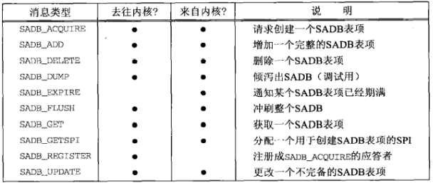
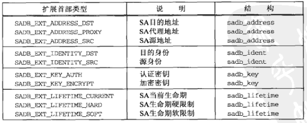
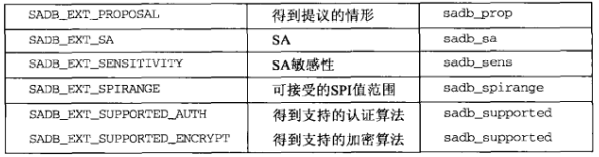
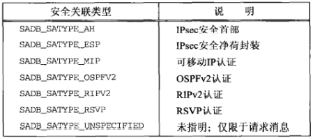
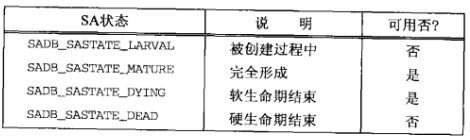
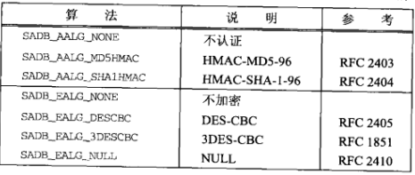
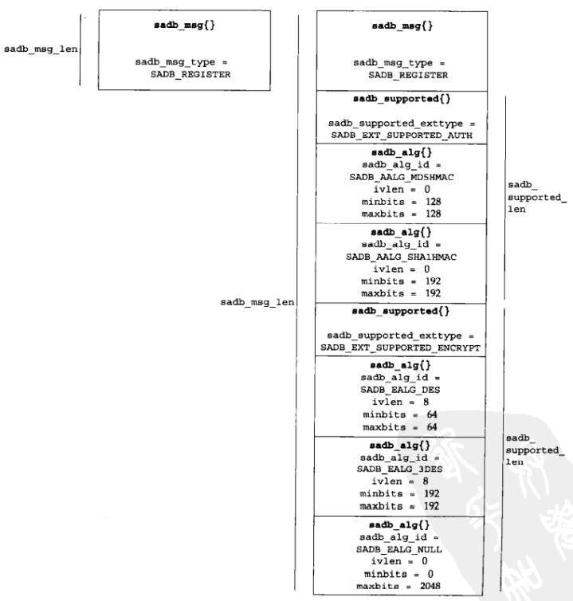

# 第十九章 密钥管理套接字

[TOC]


## 19.1 概述

密钥管理套接字支持以下类型的操作：

- 通过写出到密钥管理套接字，进程可以往内核以及打开着密钥管理套接字的所有其他进程发送消息。
- 通过从密钥管理套接字读入，进程可以自内核（或其他进程）接收消息。
- 进程可以往内核发送一个倾泻（dumping）请求消息，内核作为应答倾泻出当前的SADB。


## 19.2 读和写

```c++
struct sadb_msg {
    u_int8_t  sadb_msg_version;
    u_int8_t  sadb_msg_type;
    u_int8_t  sadb_msg_errno;
    u_int8_t  sadb_msg_satype;
    u_int16_t sadb_msg_len;
    u_int16_t sadb_msg_reserved;
    u_int32_t sadb_msg_seq;
    u_int32_t sadb_msg_pid;
};
```



*通过密钥管理套接字交换的消息类型*





*PF_KEY扩展类型*


## 19.3 倾泻安全关联数据库



*SA类型*

```c++
TODO
```

*通过密钥管理套接字发出SADB_DUMP命令的程序*


## 19.4 创建静态安全关联

SADB_ADD消息的扩展：

- SA（必须）
- 地址（必须）
- 密钥（必须）
- 生命期（可选）
- 身份（可选）
- 敏感性（可选）

```c++
struct sadb_sa {
    u_int16_t sadb_sa_len;     // 
    u_int16_t sadb_sa_exttype; // 
    u_int32_t sadb_sa_spi;     // 
    u_int8_t  sadb_sa_replay;  // 
    u_int8_t  sadb_sa_state;   // 
    u_int8_t  sadb_sa_auth;    // 
    u_int8_t  sadb_sa_encrypt; // 
    u_int32_t sadb_sa_flags;   // 
};
```

*SA扩展*



*SA的可能状态*



*认证和加密算法*

```c++
struct sadb_address {
    u_int16_t sadb_address_len;
    u_int16_t sadb_address_exttype;
    u_int8_t  sadb_address_proto;
    u_int8_t  sadb_address_prefixlen;
    u_int16_t sadb_address_reserved;
};
```

*地址扩展*

```c++
struct sadb_key {
    u_int16_t sadb_key_len;
    u_int16_t sadb_key_exttype;
    u_int16_t sadb_key_bits;
    u_int16_t sadb_key_reserved;
};
```

*密钥扩展*

```c++
struct sadb_lifetime {
    u_int16_t sadb_lifetime_len;
    u_int16_t sadb_lifetime_exttype;
    u_int32_t sadb_lifetime_allocations;
    u_int64_t sadb_lifetime_bytes;
    u_int64_t sadb_lifetime_addtime;
    u_int64_t sadb_lifetime_usetime;
};
```

*生命期扩展*

```c++
TODO
```

*key/add.c*


## 19.5 动态维护安全关联

```c++
struct sadb_supported {
    u_int16_t sadb_supported_len;
    u_int16_t sadb_supported_exttype;
    u_int32_t sadb_supported_reserved;
};
struct sadb_alg {
    u_int8_t sadb_alg_id;
    u_int8_t sadb_alg_ivlen;
    u_int16_t sadb_alg_minbits;
}
```

*受支持算法扩展*



*内核为SADB_REGISTER请求返回的应答*

```c++
TODO
```

*key/register.c*


## 19.6 小结

