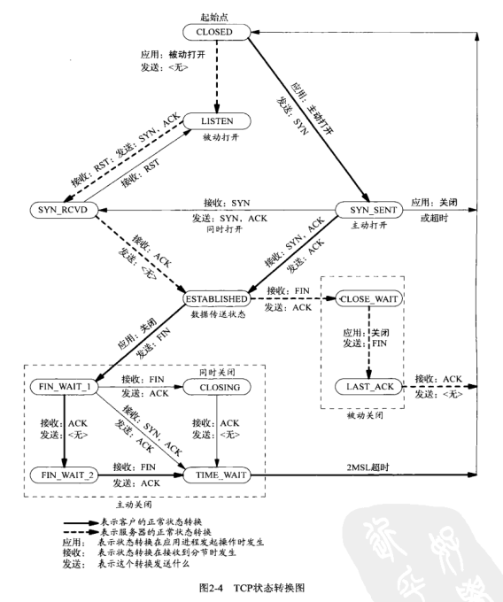

# 第二章 传输层:TCP,UDP和SCTP

- [概述](#概述)
- [总图](#总图)
- [用户数据报协议(UDP)](#用户数据报协议(UDP))
- [TCP](#TCP)
  - [三次握手](#三次握手)
  - [tcp选项](#tcp选项)
  - [tcp连接终止](#tcp连接终止)
  - [tcp状态转移图](#tcp状态转移图)
  - [观察分组](#观察分组)
- [TIME_WAIT状态](#TIME_WAIT状态)
- [SCTP](#SCTP)
  - [四路握手](#四路握手)
  - [关联终止](#关联终止)
  - [SCTP状态转移图](#SCTP状态转移图)
  - [观察分组](#观察分组)
- [端口号](#端口号)
  - [套接字对](#套接字对)
- [TCP端口号与并发服务器](#TCP端口号与并发服务器)
- [缓冲区大小及限制](#缓冲区大小及限制)
  - [TCP输出](#TCP输出)
  - [UDP输出](#UDP输出)
  - [SCTP输出](#SCTP输出)
- [标准因特网服务](#标准因特网服务)
- [常见因特网应用的协议使用](#常见因特网应用的协议使用)
- [总结](#总结)

## 概述

- UDP（用户数据报协议）:缺乏可靠性，不保证顺序到达也不保证到达后数据不改变；
- TCP(传输控制协议):流协议，可靠；
- SCTP(流控制传输协议):在连接之间提供多个流；而不是像tcp一样只有一个流；支持多个ip地址;

## 总图

## 用户数据报协议(UDP)

UDP提供无连接(connectionless)的服务。

一个UDP客户可以用同一个UDP套接字给不同的服务器发送数据报。

一个UDP服务器可以用同一个UDP套接字从若干个不同的客户接受数据报。

## TCP

### 三次握手

### tcp选项
每一个SYN可以含有多个TCP选项。下面是常用的TCP选项:
- MSS选项。发送SYN的TCP一端使用本选项通告对端它的最大分节点大小(maximum segment size),也就是它在本连接的每个TCP分节中愿意接受的最大数据量。发送端TCP使用接收端的MSS值作为所发送分节的最大大小。
- 窗口规模选项。TCP连接任何一端能够通告对端的最大窗口大小是65535(目前更新到了1GB)，因为在TCP首部中相应的字段占16位。
- 时间戳选项。这个选项对于高速网络连接是必要的，它可以防止由失而复得的分组可能造成的数据损坏。

### tcp连接终止

### tcp状态转移图

### 观察分组

## TIME_WAIT状态

TIME_WAIT状态有2个存在的理由:
- 可靠地实现TCP全双工连接的终止；
- 允许老的重复分节在网络中消逝；

## SCTP

### 四路握手

### 关联终止

### SCTP状态转移图

### 观察分组

## 端口号

IANA(the Internet Assigned Numbers Authority, 因特网已分配数值权威机构)维护者一个端口号分配状况的清单。端口被划分为以下3段:
- 众所周知的端口(0~1023)。这些端口由IANA分配和控制。可能的话，相同端口就分配给TCP,UDP和SCTP的同一给定服务。
- 已登记的端口(1024~49151)。这些端口不受IANA控制，不过由IANA登记并提供他们的使用情况清单，以方便整个群体。
- 动态/私用的端口(49152~65535)。俗称临时端口。

### 套接字对
一个TCP连接的套接字对(sock pair)是一个定义该连接的2个端点的四元组:本地IP地址，本地TCP端口号，外地IP地址，外地TCP端口号。套接字对唯一标识一个网络上的每个TCP连接。就SCTP而言，一个关联由一组本地IP地址，一个本地端口，一组外地IP地址，一个外地端口标识。在2个端点均非多宿这一最简单的情形下，SCTP与TCP所用的四元组套接字对一致。然而在某个关联的任何一个端点为多宿的情形下，同一个关联可能需要多个四元组标识（这些四元组的IP地址各不相同，但端口号是一样的）。

标识每个端口的2个值（IP地址和端口号）通常称为要给套接字。

## TCP端口号与并发服务器

## 缓冲区大小及限制

下面我们将介绍一些影响IP数据报大小的限制:
- IPv4数据报的最大大小是65535字节，包括IPv4首部。总长16位；
- IPv6数据包的最大大小是65575字节，包括40字节的IPv6首部。总长14位；
- 许多网络有一个可由硬件规定的MTU（最大传输单元，默认1500）；
- 在2个主机之间的路径最小的MTU称为路径MTU(path MTU).1500字节的以太网MTU是当今常见的路径MTU。两个主机之间相反的两个方向上路径MTU可以不一致，因为在因特网中路由选择往往是不对称的，也就是说从A到B的路径与从B到A的路径可以不相同；
- 当一个IP数据报将从某个接口送出时，如果他的大小超过相应链路的MTU，IPV4和IPV6都将执行分片(fragmentation)。
- IPV4首部的"不分片"(don't fragment)即DF位若被设置，那么不管是发送这些数据报的主机还是转发他们的路由器，都不允许对他们分片。
- IPV4和IPV6都定义了最小重组缓冲区大小(minimum reassembly buffer size),它是IPV4或IPV6的任何实现都必须保证支持的最小数据报大小。
- TCP有一个MSS(maximum segment size, 最大分节大小)，用于向端TCP通告对端在每个分节中能发送的最大TCP数据量。
- SCTP基于到对端所有地址发现的最小路径MTU保持一个分片点。这个最小MTU大小用于把较大的用户消息分割成较小的能够以单个IP数据报发送的若干片段。SCTP_MAXSEG套接字选项可以影响该值，使得用户能够请求一个更小的分片点。

### TCP输出

### UDP输出

### SCTP输出

## 标准因特网服务

大多数实现提供的标准TCP/IP服务:
|名字|TCP端口|UDP端口|RFC|说明|
|:--|:--|:--|:--|:--|
|echo(回射)|7|7|862|服务器返回客户发送的数据|
|discard(丢弃)|9|9|863|服务器废弃客户发送的数据|
|daytime(时间获取)|13|13|867|服务器返回直观可读的日期和时间|
|chargen(字符生成)|19|19|864|TCP服务器发送连续的字符流，直到客户终止连接。UDP服务器则每当客户发送一个数据报就返送一个包含随机数量(0~512)字符的数据报|
|time(流逝时间获取)|37|37|868|服务器返回一个32位二进制数值表示的时间。这个数值表示从1900年1月1日子时(UTC时间)以来所流逝的秒数|

## 常见因特网应用的协议使用

| 因特网应用                                                   | IP        | ICMP   | UDP                   | TCP                             | SCTP                  |
| ------------------------------------------------------------ | --------- | ------ | --------------------- | ------------------------------- | --------------------- |
| ping traceroute                                           |           | Y Y |  Y                 |                                 |                       |
| OSPF（路由协议） RIP（路由协议） BGP（路由协议）       | Y   |        |  Y              |   Y                       |                       |
| BOOTP（引导协议） DHCP（引导协议） NTP（时间协议） TFTP（低级FTP） SNMP（网络管理） |           |        | Y Y Y Y Y |                                 |                       |
| SMTP（电子邮件） Telnet（远程登录） SSH（安全的远程登录） FTP（文件传送） HTTP（Web） NNTP（网络新闻） LPR（远程打印） |           |        |                       | Y Y Y Y Y Y Y |                       |
| DNS（域名系统） NFS（网络文件系统） Sun RPC（远程过程调用） DCE RPC（远程过程调用） |           |        | Y Y Y Y      | Y Y Y Y                |                       |
| IUA（IP之上的ISDN） M2UA/M3UA（SS7电话信令） H.248（媒体网关控制） H.323（IP电话） SIP（ip电话） |           |        |   Y Y Y   |   Y Y Y             | Y Y Y Y Y |

## 总结

- UDP是一个简单，不可靠，无连接的协议，而TCP是一个复杂，可靠，面向连接的协议。SCTP组合了这两个协议的一些特性，并提供了TCP所不具备的额外特性。尽管绝大多数因特网应用(Web, Telnet, FTP和电子邮件)使用TCP，但这3个协议对传输层都是必要的。
- TCP使用三路握手建立连接，使用四分组交换序列终止连接。当一个TCP连接被建立时，他从CLOSED状态转换到ESTABLISHED状态；当该连接被终止时，他又回到CLOSED状态。一个TCP连接可处于11种状态之一，其状态转换图给出了一种状态转换到另一种状态的规则。
- TCP的TIME_WAIT状态一直是一个造成网络编程人员混淆的来源。存在这一状态是为了实现TCP的全双工连接终止（即处理最终那个ACK丢失的情形），并允许老的重复分节从网络中消逝。
- SCTP使用四路握手建立关联；使用三分组交换序列终止关联。当一个SCTP关联被建立时，他从CLOSED状态转换到ESTABLISHED状态；当该关联被终止时，它又回到CLOSED状态。一个SCTP关联可处于8种状态之一，其状态转换图给出从一种状态转换到另一种状态的规则。SCTP不想TCP那样需要TIME_WAIT状态，因为他使用了验证标记。