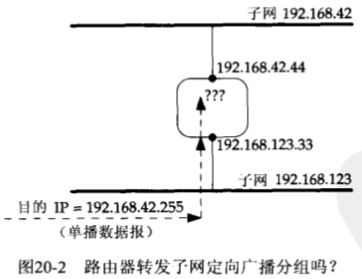
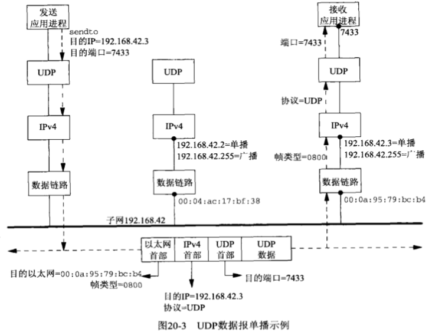
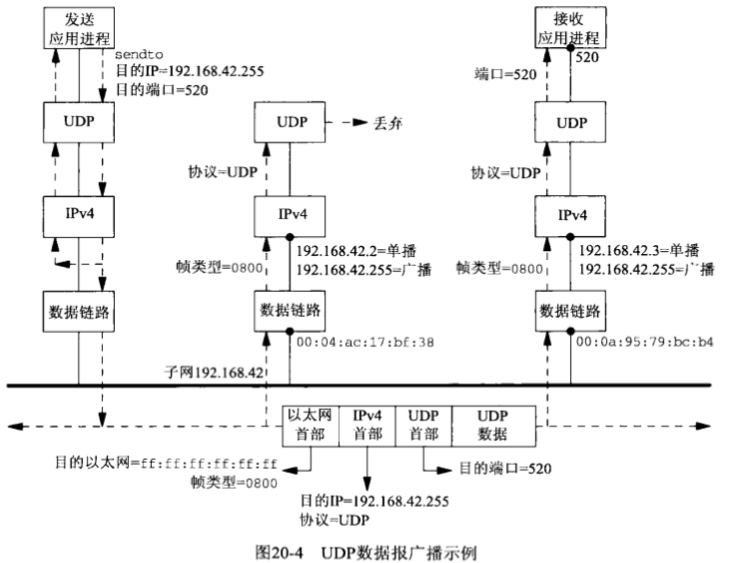

# 广播


## 概述

不同的寻址方式：

| 类型 | IPv4 | IPv6 | TCP    | UDP  | 所标识接口数 | 递送到接口数 |
| ---- | ---- | ---- | ------ | ---- | ------------ | ------------ |
| 单播 | Y    | Y    | Y      | Y    | 一个         | 一个         |
| 任播 | Y    | Y    | 尚没有 | Y    | 一组         | 一组中的一个 |
| 多播 | 可选 | Y    |        | Y    | 一组         | 一组中的全体 |
| 广播 | Y    |      |        | Y    | 全体         | 全体         |

1. 多播支持在IPv4中是可选的，在IPv6中却是必需的；
2. IPv6不支持广播。使用广播的任何IPv4应用程序一旦移植到IPv6就必须改用多播重新编写；
3. 广播和多播要求用于UDP或原始IP，它们不能用于TCP；


## 广播地址



广播地址：

- 子网定向广播地址：`{子网ID, -1}`。
- 受限广播地址：`{-1, -1}`或`255.255.255.255`。路由器从不转发目的地址为`255.255.255.255`的IP数据报。


## 单播和广播的比较

- 单播

  

- 广播

  


## 使用广播的dg_cli函数

```c
#include "unp.h"
static void recvfrom_alarm(int);
void
dg_cli(FILE *fp, int sockfd, const SA *pservaddr, socklen_t servlen)
{
  int n;
  const int on = 1;
  char sendline[MAXLINE], recvline[MAXLINE + 1];
  socklen_t len;
  struct sockaddr *preply_addr;
  preply_addr = Malloc(servlen);
  Setsockopt(sockfd, SOL_SOCKET, SO_BROADCAST, &on, sizeof(on));
  Signal(SIGALRM, recvfrom_alarm);
  while (Fgets(sendline, MAXLINE, fp) != NULL) {
    Sendto(sockfd, sendline, strlen(sendline), 0, pservaddr, servlen);
    alarm(5);
    for ( ; ; ) {
      len = servlen;
      n = recvfrom(sockfd, recvline, MAXLINE, 0, preply_addr, &len);
      if (n < 0) {
        if (errno == EINTR)
          break;
        else
          err_sys("recvfrom error");
      } else {
        recvline[n] = 0;
        printf("from %s:%s", Sock_ntop_host(preply_addr, len), recvline);
      }
    }
  }
  free(preply_addr);
}

static void
recvfrom_alarm(int signo)
{
  return;
}
```


## 竞争状态

### 阻塞和解阻塞信号

```c
#include "unp.h"
static void recvfrom_alarm(int);
void
dg_cli(FILE *fp, int sockfd, const SA *pservaddr, socklen_t servlen)
{
  int n;
  const int on = 1;
  char sendline[MAXLINE], recvline[MAXLINE + 1];
  sigset_t sigset_alrm;
  socklen_t len;
  struct sockaddr *preply_addr;
  preply_addr = Malloc(servlen);
  Setsockopt(sockfd, SOL_SOCK, SO_BROADCAST, &on, sizeof(on));
  Sigemptyset(&sigset_alrm);
  Sigaddset(&sigset_alrm, SIGALRM);
  Signal(SIGALRM, recvfrom_alarm);	// 解阻塞信号
  while (Fgets(sendline, MAXLINE, fp) != NULL) {
    Sendto(sockfd, sendline, strlen(sendline), 0, pservaddr, servlen);
    alarm(5);
    for ( ; ; ) {
      len = servlen;
      Sigprocmask(SIG_UNBLOCK, &sigset_alrm, NULL);
      n = recvfrom(sockfd, recvline, MAXLINE, 0, preply_addr, &len);
      Sigprocmask(SIG_BLOCK, &sigset_alrm, NULL); // 再次阻塞
      if (n < 0) {
        if (errno == EINTR)
          break;
        else
          err_sys("recvfrom error");
      } else {
        recvline[n] = 0;
        printf("from %s:%s", Sock_ntop_host(preply_addr, len), recvline);
      }
    }
  }
  free(preply_addr);
}
static void
recvfrom_alarm(int signo)
{
  return;
}
```

### 用pselect阻塞和解阻塞信号

```c
#include "unp.h"
static void recvfrom_alarm(int);
void
dg_cli(FILE *fp, int sockfd, const SA *pservaddr, socklen_t servlen)
{
  int n;
  const int on = 1;
  char sendline[MAXLINE], recvline[MAXLINE + 1];
  fd_set rset;
  sigset_t sigset_alrm, sigset_empty;
  socklen_t len;
  struct sockaddr *preply_addr;
  preply_addr = Malloc(servlen);
  Setsockopt(sockfd, SOL_SOCKET, SO_BROADCAST, &on, sizeof(on));
  FD_ZERO(&rset);
  Sigemptyset(&sigset_empty);
  Sigemptyset(&sigset_alarm);
  Sigaddset(&sigset_alrm, SIGALRM);
  Signal(SIGALRM, recvfrom_alarm);
  while (Fgets(sendline, MAXLINE, fp) != NULL) {
    Sendto(sockfd, sendline, strlen(sendline), 0, pservaddr, servlen);
    Sigprocmask(SIG_BLOCK, &sigset_alrm, NULL);
    alarm(5);
    for ( ; ; ) {
      FD_SET(sockfd, &rset);
      n = pselect(sockfd+1, &rset, NULL, NULL, NULL, &sigset_empty);
      if (n < 0) {
        if (errno == EINTR)
          break;
        else
          err_sys("pselect error");
      } else if (n != 1)
        err_sys("pselect error: returned %d", n);
      len = servlen;
      n = Recvfrom(sockfd, recvline, MAXLINE, 0, preply_addr, &len);
      recvline[n] = 0;
      printf("from %s:%s", Sock_ntop_host(preply_addr, len), recvline);
    }
  }
  free(preply_addr);
}
static void
recvfrom_alarm(int signo)
{
  return;
}
```

### 使用sigsetjmp和siglongjmp

```c
#include "unp.h"
#include <setjmp.h>
static void recvfrom_alarm(int);
static sigjmp_buf jmpbuf;
void
dg_cli(FILE *fp, int sockfd, const SA *pservaddr, socklen_t servlen)
{
  int n;
  const int on = 1;
  char sendline[MAXLINE], recvline[MAXLINE + 1];
  socklen_t len;
  struct sockaddr *preply_addr;
  preply_addr = Malloc(servlen);
  Setsockopt(sockfd, SOL_SOCKET, SO_BROADCAST, &on, sizeof(on));
  Signal(SIGALRM, recvfrom_alarm); // 处理SIGALRM并调用siglongjmp
  while (Fgets(sendline, MAXLINE, fp) != NULL) {
    Sendto(sockfd, sendline, strlen(sendline), 0, pservaddr, servlen);
    alarm(5);
    for ( ; ; ) {
      // 直接调用sigsetjmp时，它在建立跳转缓冲区后返回0。
      if (sigsetjmp(jmpbuf, 1) != 0)
        break;
      len = servlen;
      n = Recvfrom(sockfd, recvline, MAXLINE, 0, preply_addr, &len);
      recvline[n] = 0;
      printf("from %s: %s", Sock_ntop_host(preply_addr, len), recvline);
    }
  }
  free(preply_addr);
}
static void
recvfrom_alarm(int signo)
{
  siglongjmp(jmpbuf, 1);
}
```

### 使用从信号处理函数到主控函数的IPC

```c
#include "unp.h"
static void recvfrom(int);
static int pipefd[2];
void
dg_cli(FILE *fp, int sockfd, const SA *pservaddr, socklen_t servlen)
{
  int n, maxfdp1;
  const int on = 1;
  char sendline[MAXLINE], recvline[MAXLINE + 1];
  fd_set rset;
  socklen_t len;
  struct sockaddr *preply_addr;
  preply_addr = Malloc(servlen);
  Setsockop(sockfd, SOL_SOCKET, SO_BROADCAST, &on, sizeof(on));
  Pipe(pipefd); // 创建一个普通的Unix管道，返回2个描述符
  maxfdp1 = max(sockfd, pipefd[0]) + 1;
  FD_ZERO(&rset);
  Signal(SIGALRM, recvfrom_alarm);
  while (Fgets(sendline, MAXLINE, fp) != NULL) {
    Sendto(sockfd, sendline, strlen(sendline), 0, pservaddr, servlen);
    alarm(5);
    for ( ; ; ) {
      FD_SET(sockfd, &rset);
      FD_SET(pipefd[0], &rset);
      if ( (n = select(maxfdp1, &rset, NULL, NULL, NULL)) < 0 ) {
        if (errno == EINTR)
          continue;
        else
          err_sys("select error");
      }
      if (FD_ISSET(sockfd, &rset)) {
        len = servlen;
        n = Recvfrom(sockfd, recvline, MAXLINE, 0, preply_addr, &len);
        recvline[n] = 0;
        printf("from %s: %s", Sock_ntop_host(preply_addr, len), recvline);
      }
      if (FD_ISSET(pipefd[0], &rset)) {
        Read(pipefd[0], &n, 1);
        break;
      }
    }
  }
  free(preply_addr);
}
static void
recvfrom_alarm(int signo)
{
  Write(pipefd[1], "", 1);
  return;
}
```

