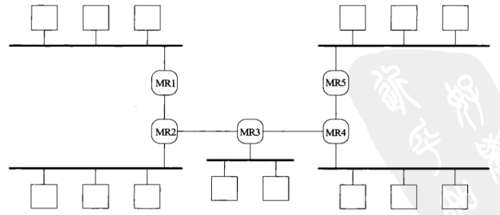

# 第二十一章 多播

[TOC]


## 21.1 概述


## 21.2 多播地址

### 21.2.1 IPv4的D类地址


*IPv4和IPv6多播地址到以太网地址的映射*

IPv4的D类地址（从`224.0.0.0`到`239.255.255.255`）是IPv4多播地址；D类地址的低序28位构成多播组ID（group ID），整个32位地址则称为组地址（group address）。

特殊的IPv4多播地址：

- `224.0.0.1`所有主机（all-hosts）组；子网上所有具有多播能力的结点必须在所有具有多播能力的接口上加入该组。
- `224.0.0.2`所有路由组（all-routers）组；子网上所有多播路由器必须在所有具有多播能力的接口上加入该组。

### 21.2.2 IPv6多播地址


*IPv6多播地址格式*

特殊的IPv6多播地址：

- `ff01::1`和`ff02::1`是所有节点（all-nodes）组；子网上所有具有多播能力的节点必须在所有具有多播能力的接口上加入该组。类似于IPv4的`224.0.0.1`多播地址，但多播是IPv6的一个组成部分，这与IPv4不同。
- `ff01::2`, `ff02::2`和`ff05::2`是所有路由器（all-routers）组；子网上所有多播路由器必须在所有具有多播能力的接口上加入该组，类似于IPv4的`224.0.0.2`多播地址。

### 21.2.3 多播地址的范围

已经分配给范围字段的值：

- 1：接口局部的（interface-local）
- 2：链路局部的（link-local）
- 4：管区局部的（admin-local）
- 5：网点局部的（site-local）
- 8：组织机构局部的（organization-local）
- 14：全球或全局的（global）


*IPv4和IPv6多播地址范围*

### 21.2.4 多播会话

流式多媒体应用中，一个多播地址和一个传输层端口的组合称为一个会话（session）。


## 21.3 局域网上多播和广播的比较


*UDP数据包多播示例*


## 21.4 广域网上的多播



*用5个多播路由器互连的5个局域网*


*广域网上5个主机加入一个多播组*


*广域网上发送多播分组*


## 21.5 源特定多播


## 21.6 多播套接字选项


*组成员无关多播套接字选项*


*组成员相关多播套接字选项*

- IP_ADD_MEMBERSHIP, IPV6_JOIN_GROUP和MCAST_JOIN_GROUP

  在一个指定的本地接口上加入一个不限源的多播组，可以多次加入多播组，不过每次加入的必须是不同的多播地址，或者是在不同接口上的同一多播地址。

- IP_DROP_MEMBERSHIP, IPV6_LEAVE_GROUP和MCAST_LEAVE_GROUP

  离开指定的本地接口上不限源的多播组。

- IP_BLOCK_SOURCE和MCAST_BLOCK_SOURCE

  对于一个所指定的本地接口上已存在的一个不限源的多播组，在本套接字上阻塞接收来自某个源的多播分组；可以用于忽略来自无赖发送进程的分组流通。

- IP_UNBLOCK_SOURCE和MCAST_UNBLOCK_SOURCE

  开通一个先前被阻塞的源。

- IP_ADD_SOURCE_MEMBERSHIP和MCAST_JOIN_SOURCE_GROUP

  在一个指定的本地接口上加入一个特定于源的多播组。

- IP_DROP_SOURCE_MEMBERSHIP和MCAST_LEAVE_SOURCE_GROUP

  在一个指定的本地接口上离开一个特定于源的多播组。

- IP_MULTICAST_IF和IPV6_MULTICAST_IF

  指定通过本套接字发送的多播数据报的外出接口。

- IP_MULTICAST_TTL和IPV6_MULTICAST_HOPS

  给外出的多播数据报设置IPv4的TTl或IPv6的跳限。如果不指定，这两个版本就都默认为1，从而把多播数据报限制在本地子网。

- IP_MULTICAST_LOOP和IPV6_MULTICAST_LOOP

  开启或禁止多播数据报的本地回环。


## 21.7 mcast_join和相关函数

```c++
#include "unp.h"
// 加入一个不限源的多播组
int mcast_join(int sockfd, const struct sockaddr *grp, socklen_t grplen,
               const char *ifname, u_int ifindex);

// 离开一个不限源的多播组
int mcast_leave(int sockfd, const struct sockaddr *grp, socklen_t grplen);

// 阻塞接收从定单播源到给定多播组的数据报
int mcast_block_source(int sockfd,
                       const struct sockaddr *src, socklen_t srclen,
                       const struct sockaddr *grp, socklen_t grplen);

// 开通从给定单播源到给定多播组的数据报接收
int mcast_unblock_source(int sockfd, 
                         const struct sockaddr *src, socklen_t srclen,
                         const struct sockaddr *grp, socklen_t grplen);

// 加入一个特定于源的多播组
int mcast_join_source_group(int sockfd,
                            const struct sockaddr *src, socklen_t srclen,
                            const struct sockaddr *grp, socklen_t grplen,
                            const char *ifname, u_int ifindex);

// 离开一个特定于源的多播组
int mcast_leave_source_group(int sockfd, 
                             const struct sockaddr *src, socklen_t srclen,
                             const struct sockaddr *grp, socklen_t grplen);

// 设置外出多播数据报的默认接口索引
int mcast_set_if(int sockfd, const char *ifname, u_int ifindex);

// 把回馈套接字选项设置为1或0
int mcast_set_loop(int sockfd, int flag);

// 设置IPv4的TTL或IPv6的跳限
int mcast_set_ttl(int sockfd, int ttl);

// 返回？
int mcast_get_if(int sockfd);

// 返回？
int mcast_get_loop(int sockfd);

// 返回？
int mcast_get_ttl(int sockfd);
```

### 21.7.1 例子: mcast_join函数

```c++
#include "unp.h"
#include <net/if.h>
int 
mcast_join(int sockfd, const SA *grp, socklen_t grplen,
           const char *ifname, u_int ifindex)
{
#ifdef MCAST_JOIN_GROUP
    struct group_req req;
    if (ifindex > 0) { // 处理索引
        req.gr_interface = ifindex;
    } else if (ifname != NULL) {
        if ((req.gr_interface = if_nametoindex(ifname)) == 0) {
            errno = ENXIO;
            return(-1);
        }
    } else
        req.gr_interface = 0;
    if (grplen > sizeof(req.gr_group)) {
        errno = EINVAL;
        return -1;
    }
    memcpy(&req.gr_group, grp, grplen); // 复制地址
    return (setsockopt(sockfd, family_to_level(grp->sa_family),
                       MCAST_JOIN_GROUP, &req, sizeof(req))); // 执行组加入操作
#else
    switch (grp->sa_family) {
        case AF_INET: {
            struct ip_mreq mreq;
            struct ifreq ifreq;
            memcpy(&mreq.imr_multiaddr,
                   &((const struct sockaddr_in *)grp)->sin_addr,
                   sizeof(struct in_addr));
            if (ifindex > 0) { // 处理索引
                if (if_indextoname(ifindex, ifreq.ifr_name) == NULL) {
                    errno = ENXIO;
                    return(-1);
                }
                goto doioctl;
            } else if (ifname != NULL) { // 处理名字
                strncpy(ifreq.ifr_name, ifname, IFNAMSIZ); // 复制接口名字到ifreq
              doioctl:
                if (ioctl(sockfd, SIOCGIFADDR, &ifreq) < 0) // 发出SIOCGIFADDR请求
                    return (-1);
                memcpy(&mreq.imr_interface,
                       &((struct sockaddr-in *) &ifreq.ifr_addr)->sin_addr,
                       sizeof(struct in_addr)); // 复制IPv4单播地址
            } else
                mreq.imr_interface.s_addr = htonl(INADDR_ANY); // 设置接口地址为通配地址
            return (setsockopt(sockfd, IPPROTO_IP, IP_ADD_MEMBERSHIP,
                               &mreq, sizeof(mreq))); // 执行组加入操作
        }
#ifdef IPV6
        case AF_INET6: {
            struct ipv6_mreq mreq6;
            memcpy(&mreq6.ipv6mr_multiaddr,
                   &((const struct sockaddr_in6 *)grp)->sin6_addr,
                   sizeof(struct in6_addr)); // 复制套接字地址的IPv6多播地址
            if (ifindex > 0) {
                mreq6.ipv6mr_interface = ifindex;
            } else if (ifname != NULL) {
                if ((mreq6.ipv6mr_interface = if_nametoindex(ifname)) == 0) {
                    errno = ENXIO;
                    return(-1);
                }
            } else
                mreq6.ipv6mr_interface = 0;
            return(setsockopt(sockfd, IPPROTO_IPV6, IPV6_JOIN_GROUP,
                              &mreq6, sizeof(mreq6))); // 加入组
        }      
#endif
        default:
            errno = EAFNOSUPPORT;
            return(-1);
    }
#endif
}
```

*加入一个多播组：IP无关套接字*

### 21.7.2 例子: mcast_set_loop函数

```c++
#include "unp.h"
int 
mcast_set_loop(int sockfd, int onoff)
{
    switch (sockfd_to_family(sockfd)) {
        case AF_INET: {
            u_char flag;
            flag = onoff;
            return(setsockopt(sockfd, IPPROTO_IP, IP_MULTICAST_LOOP,
                              &flag, sizeof(flag)));
        }
#ifdef IPV6
        case AF_INET6: {
            u_int flag;
            flag = onoff;
            return(setsockopt(sockfd, IPPROTO_IPV6, IPV6_MULTICAST_LOOP,
                              &flag, sizeof(flag)));
        }
#endif
        default:
            errno = EAFNOSUPPORT;
            
    }
}
```

*设置多播回馈选项*


## 21.8 使用多播的dg_cli函数


## 21.9 接收IP多播基础设施会话声明

SAP（Session Announcement Protocol，会话声明协议）。

SDP（Session Description Protocol，会话描述协议）。

```c++
#include "unp.h"
#define SAP_NAME "sap.mcast.net" 
#define SAP_PORT "9875"
void loop(int, socklen_t);
int 
main(int argc, char **argv)
{
    int sockfd;
    const int on = 1;
    socklen_t salen;
    struct sockaddr *sa;
    if (argc == 1)
        sockfd = udp_client(SAP_NAME, SAP_PORT, (void **)&sa, &salen); // 根据域名和端口查找地址
    else if(argc == 4)
        sockfd = udp_client(argv[1], argv[2], (void **)&sa, &salen);
    else
        err_quit("usage: mysdr <mcast-addr> <port#> <interface-name>");
    Setsockopt(sockfd, SOL_SOCKET, SO_REUSEADDR, &on, sizeof(on));
    Bind(sockfd, sa, salen); // 绑定端口
    Mcast_join(sockfd, sa, salen, (argc == 4) ? argv[3] : NULL, 0); // 加入多播组
    loop(sockfd, salen); // 轮询读取并显示声明
    exit(0);
}
```

*SAP/SDP声明接收程序的main函数*

```c++
#include "mysdr.h"
void 
loop(int sockfd, socklen_t salen)
{
    socklen_t len;
    ssize_t n;
    char *p;
    struct sockaddr *sa;
    struct sap_packet {
        uint32_t sap_header;        // SAP首部
        uint32_t sap_src;           // 源地址
        char     sap_data[BUFSIZE]; // 声明
    } buf;
    sa = Malloc(salen);
    for (;;) { // 读入UDP数据报，输出发送者和内容
        len = salen;
        n = Recvfrom(sockfd, &buf, sizeof(buf) - 1, 0, sa, &len); // 读UDP数据报
        ((char *)&buf)[n] = 0;
        buf.sap_header = ntohl(buf.sap_header);
        printf("From %s hash 0x%04x\n", Sock_ntop(sa, len),
               buf.sap_header & SAP_HASH_MASK);
        if (((buf.sap_header & SAP_VERSION_MASK) >> SAP_VERSION_SHIFT) > 1) {
            err_msg("... version field not 1 (0x%08x)", buf.sap_header);
            continue;
        }
        if (buf.sap_header & SAP_IPV6) {
            err_msg("... IPV6");
            continue;
        }
        if (buf.sap_header & (SAP_DELETE|SAP_ENCRYPTED|SAP_COMPRESSED)) {
            err_msg("... can't parse this packet type (0x%08x)",
                    buf.sap_header);
            continue;
        }
        p = buf.sap_data + ((buf.sap_header & SAP_AUTHLEN_MASK)
                           >> SAP_AUTHLEN_SHIFT); // 跳过可能存在任何认证数据和分组内容类型
        if (strcmp(p, "application/sdp") == 0)
            p += 16;
        printf("%s\n", p);
    }
}
```

*接收并显示SAP/SDP声明的循环*


## 21.10 发送和接收

```c++
#include "unp.h"
void recv_all(int, socklen_t);
void send_all(int, SA *, socklen_t);
int 
main(int argc, char **argv)
{
    int sendfd, recvfd;
    const int on = 1;
    socklen_t salen;
    struct sockaddr *sasend, *sarecv;
    if (argc != 3)
        err_quit("usage: sendrecv <IP-multicast-address> <port#>");
    sendfd = Udp_client(argv[1], argv[2], (void **)&sasend, &salen); // 创建发送套接字
    recvfd = Socket(sasend->sa_family, SOCK_DGRAM, 0); // 创建接收套接字
    Setsockopt(recvfd, SOL_SOCKET, SO_REUSEADDR, &on, sizeof(on)); // 允许多实例同时运行
    sarecv = Malloc(salen);
    memcpy(sarecv, sasend, salen);
    Bind(recvfd, sarecv, salen); // 绑定套接字
    Mcast_join(recvfd, sasend, salen, NULL, 0); // 加入多播组
    Mcast_set_loop(sendfd, 0); // 禁止回馈
    if (Fork() == 0)
        recv_all(recvfd, salen);
    send_all(sendfd, sasend, salen);
}
```

*创建套接字，fork，再启动发送进程与接收进程*

```c++
#include "unp.h"
#include <sys/utsname.h>
#define SENDRATE 5
void 
send_all(int sendfd, SA *sadest, socklen_t salen)
{
    char len[MAXLINE];
    struct utsname myname;
    if (uname(&myname) < 0) // 获得主机名
        err_sys("uname error");
    snprintf(line, sizeof(line), "%s, %d\n", myname.nodename, getpid());
    for (;;) {
        Sendto(sendfd, line, strlen(line), 0, sadest, salen); // 发送数据报
        sleep(SENDRATE);
    }
}
```

*每5秒钟发送一个多播数据报*

```c++
#include "unp.h"
void 
recv_all(int recvfd, socklen_t salen)
{
    int n;
    char line[MAXLINE + 1];
    socklen_t len;
    struct sockaddr *safrom;
    safrom = Malloc(salen); // 分配套接字地址结构
    for (;;) {
        len = salen;
        n = Recvfrom(recvfd, line, MAXLINE, 0, safrom, &len); // 读数据报
        line[n] = 0;
        printf("from %s: %s", Sock_ntop(safrom, len), line);
    }
}
```

*接收到达所加入组的所有多播数据报*


## 21.11 SNTP: 简单网络时间协议

```c++
#define JAN_1970 2208988800UL
struct l_fixedpt {
    uint32_t int_part;
    uint32_t fraction;
};
struct s_fixedpt {
    uint16_t int_part;
    uint16_t fraction;
};
struct ntpdata {
    u_char status;
    u_char stratum;
    u_char ppoll;
    int    precision:8;
    struct s_fixedpt distance;
    struct s_fixedpt dispersion;
    uint32_t refid;
    struct l_fixedpt reftime;
    struct l_fixedpt org;
    struct l_fixedpt rec;
    struct l_fixedpt xmt;
};
#define VERSION_MASK   0x38
#define MODE_MASK      0x07
#define MODE_CLIENT    3
#define MODE_SERVER    4
#define MODE_BROADCAST 5
```

*ntp.h头文件：NTP分组格式与定义*

```c++
#include "sntp.h"
int 
main(int argc, char **argv)
{
    int sockfd;
    char buf[MAXLINE];
    ssize_t n;
    socklen_t salen, len;
    struct ifi_info *ifi;
    struct sockaddr *mcastsa, *wild, *from;
    struct timeval now;
    if (argc != 2)
        err_quit("usage: ssntp <IPaddress>");
    sockfd = Udp_client(argv[1], "ntp", (void **)&mcastsa, &salen); // 获得多播IP地址
    wild = Malloc(salen);
    memcpy(wild, mcastsa, salen);
    sock_set_wild(wild, salen);
    Bind(sockfd, wild, salen); // 绑定套接字
#ifdef MCAST
    /* obtain interface list and process each one */
    for (ifi = Get_ifi_info(mcastsa->sa_family, 1); ifi != NULL; // 获得接口列表
         ifi = ifi->ifi_next) {
        if (ifi->ifi_flag & IFF_MULTICAST) {
            Mcast_join(sockfd, mcastsa, salen, ifi->ifi_name, 0); // 加入多播组
            printf("joined %s on %s\n", 
                   Sock_ntop(mcastsa, salen), ifi->ifi_name);
        }
    }
#endif
    from = Malloc(salen);
    for (;;) {
        len = salen;
        n = Recvfrom(sockfd, buf, sizeof(buf), 0, from, &len);
        Gettimeofday(&now, NULL);
        sntp_proc(buf, n, &now); // 处理NTP分组
    }
}
```

*main函数*

```c++
#include "sntp.h"
void 
sntp_proc(char *buf, ssize_t n, struct timeval *nowptr)
{
    int version, mode;
    uint32_t nsec, useci;
    double usecf;
    struct timeval diff;
    struct ntpdata *ntp;
    if (n < (ssize_t)sizeof(struct ntpdata)) {
        printf("\npacket too small: %d bytes\n", n);
        return;
    }
    ntp = (struct ntpdata *)buf;
    version = (ntp->status & VERSION_MASK) >> 3;
    mode = ntp->status & MODE_MASK;
    printf("\nv%d, mode %d, strat %d, ", version, mode, ntp->stratum);
    if (mode == MODE_CLIENT) {
        printf("client\n");
        return;
    }
    nsec = ntohl(ntp->xmt.int_part) - JAN_1970;
    useci = ntohl(ntp->xmt.fraction);
    usecf = useci;
    usecf /= 4294967296.0;
    useci = usecf * 1000000.0;
    diff.tv_sec = nowptr->tv_sec - nsec;
    if ((diff.tv_usec = nowptr->tv_usec - useci) < 0) {
        diff.tv_usec == 1000000;
        diff.tv_sec--;
    }
    useci = (diff.tv_sec * 1000000) + diff.tv_usec;
    printf("clock difference = %d usec\n",)
}
```

*sntp_proc函数：处理SNTP分组*


## 21.12 小结

