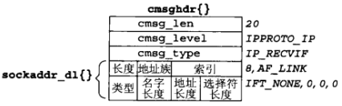
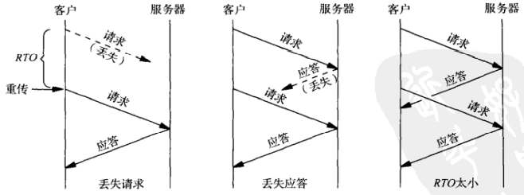

# 第22章 高级UDP套接字编程

[TOC]


## 22.1 概述


## 22.2 接收标志,目的IP地址和接口索引

```c++
#include "unp.h"
#include <sys/param.h>

ssize_t
recvfrom_flags(int fd, void *ptr, size_t nbytes, int *flagsp,
               SA *sa, socklen_t *salenptr, struct unp_in_pktinfo *pktp)
{
  struct msghdr msg;
  struct iovec iov[1];
  ssize_t n;
#ifdef HAVE_MSGHDR_MSG_CONTROL
  struct cmsghdr *cmptr;
  union {
    struct cms ghdr cm;
    char control[CMSG_SPACE(sizeof(struct in_addr)) + 
                 CMSG_SPACE(sizeof(struct unp_in_pktinfo))];
  } control_un;
  msg.msg_control = control_un.control;
  msg.msg_controllen = sizeof(control_un.control);
  msg.msg_flags = 0;
#else
  bzero(&msg, sizeof(msg));
#endif
  msg.msg_name = sa;
  msg.msg_namelen = *salenptr;
  iov[0].iov_base = ptr;
  iov[0].iov_len = nbytes;
  msg.msg_iov = iov;
  msg.msg_iovlen = 1;
  if( (n = recvmsg(fd, &msg, *flagsp)) < 0)
      return(n);
  *salenptr = msg.msg_namelen;
  if (pktp)
      bzero(pktp, sizeof(struct unp_in_pktinfo));
#ifndef HAVE_MSGHDR_MSG_CONTROL
    *flagsp = 0;
    return(n);
#else
    *flagsp = msg.msg_flags;
    if (msg.msg_controllern < sizeof(struct cmsghdr) ||
        (msg.msg_flag & MSG_CTRUNC) || pktp == NULL)
        return(n);
    for (cmptr = CMSG_FIRSTHDR(&msg); cmptr != NULL; 
         cmptr = CMSG_NXTHDR(&msg, cmptr)) {
#ifdef IP_RECVDSTADDR
        if (cmptr->cmsg_level == IPPROTO_IP &&
            cmptr->cmsg_type == IP_RECVDSTADDR) {
            memcpy(&pktp->ipi_addr, CMSG_DATA(cmptr),
                   sizeof(struct in_addr));
            continue;
        }
#endif
#ifdef IP_RECVIF
        if (cmptr->cmsg_level == IPPROTO_IP && cmptr->cmsg_type == IP_RECVIF) {
            struct sockaddr_dl *sdl;
            sdl = (struct sockaddr_d *) CMSG_DATA(cmptr);
            pktp->ipi_ifindex = sdl->sdl_index;
            continue;
        }
#endif
        err_quit("unknown ancillary data, len = %d, level = %d, type = %d",
                 cmptr->cmsg_len, cmptr->cmsg_level, cmptr->cmsg_type);
    }
    return(n);
#endif
}
```

*advio/recvfromflags.c*

```c++
#include "unpifi.h"
#undef MAXLINE
#define MAXLINE 20
void 
dg_echo(int sockfd, SA *pcliaddr, socklen_t clilen)
{
    int flags;
    const int on = 1;
    socklen_t len;
    ssize_t n;
    char mesg[MAXLINE], str[INET6_ADDRSTRLEN], ifname[IFNAMSIZ];
    struct in_addr in_zero;
    struct unp_in_pktinfo pktinfo;
#ifdef IP_RECVDSTADDR
    if (setsockopt(sockfd, IPPROTO_IP, IP_RECVDSTADDR, &on, sizeof(on)) < 0)
        err_ret("setsockopt of IP-RECVDSTADDR")；
#endif
#ifdef IP_RECVIF
    if (setsockopt(sockfd, IPPROTO_IP, IP_RECVIF, &on, sizeof(on)) < 0)
        err_ret("setsockopt of IP_RECVIF");
#endif
    bzero(&in_zero, sizeof(struct in_addr));
    for (;;) {
        len = clilen;
        flags = 0;
        n = Recvfrom_flags(sockfd, mesg, MAXLINE, &flags,
                           pcliaddr, &len, &pktinfo);
        print("%d-byte datagram from %s", n, Sock_ntop(pcliaddr, len));
        if (memcmp(&pktinfo.ipi_addr, &in_zero, sizeof(in_zero)) != 0)
            printf(", to %s", Inet_ntop(AF_INET, &pktinfo.ipi_addr,
                                        str, sizeof(str)));
        if (pktinfo.ipi_ifindex > 0)
            printf(", recv i/f = %s",
                   if_indextoname(pktinfo.ipi_ifindex, ifname));
#ifdef MSG_TRUNC
        if (flags & MSG_TRUNC)
            printf("(datagram truncated)");
#endif
#ifdef MSG_CTRUNC
        if (flags & MSG_CTRUNC)
            printf("(control info truncated)");
#endif
#ifdef MSG_BCAST
        if (flags & MSG_BCAST)
            printf("(broadcast)");
#endif
#ifdef MSG_MCAST
        if (flags & MSG_MCAST)
            printf("(multicast)");
#endif
        printf("\n");
        sendto(sockfd, mesg, n, 0, pcliaddr, len);
    }
}
```

*advio/dgechoaddr.c*



*IP_RECVIF返回的辅助数据对象*


## 22.3 数据报截断

当到达的一个UDP数据报超过应用进程提供的缓冲区容量时，有以下3种处理方式：

1. 丢弃超出部分的字节并向应用进程返回`MSG_TRUNC`标志。本处理方式要求应用进程调用recvmsg以接收这个标志。
2. 丢弃超出部分的字节但不告知应用进程这个事实。
3. 保留超出部分的字节并在同一套接字上后续的读操作中返回它们。


## 22.4 何时用UDP代替TCP

- 对于广播或多播应用程序必须使用UDP。
- 对于简单的请求-应答应用程序可以使用UDP。
- 对于海量数据传输不应该使用UDP。


## 22.5 给UDP应用增加可靠性

如果想要让请求-应答式应用程序使用UDP，那么必须在客户程序中增加以下特性：

1. 超时和重传：用于处理丢失的数据报。
2. 序列号：供客户验证一个应答是否匹配相应的请求。



*重传定时器期满时的3种情形*

Karn算法：

- 即使测得一个RTT，也不用它更新估算因子，因为我们不知道其中的应答对应哪次重传的请求。
- 既然应答在重传定时器期满前到达，（可能指数回退过的）当前RTO将继续用于下一个分组。只有当我们收到未重传过的某个请求的一个应答时，我们才更新RTT估算因子并重新计算RTO。

例：

```c++
#include "unp.h"
ssize_t dg_send_recv(int, const void *, size_t, void *, size_t, 
                     const SA *, socklen_t);
void 
dg_cli(FILE *fp, int sockfd, const SA *pservaddr, socklen_t servlen)
{
    ssize_t n;
    char sendline[MAXLINE], recvline[MAXLINE + 1];
    while (fgets(sendline, MAXLINE, fp) != NULL) {
        n = dg_send_recv(sockfd, sendline, strlen(sendline),
                         recvline, MAXLINE, pservaddr, servlen);
        recvline[n] = 0;
        fputs(recvline, stdout);
    }
}
```

*rtt/dg_cli.c*

```c++
#include "unprtt.h"
#include <setjmp.h>
#define RTT_DEBUG
static struct rtt_info rttinfo;
static int rttinit = 0;
static struct msghdr msgsend, msgrecv;
static struct hdr {
    uint32_t seg;
    uint32_t ts;
} sendhdr, recvhdr;
static void sig_alrm(int signo);
static sigjmp_buf jmpbuf;
ssize_t 
dg_send_recv(int fd, const void *outbuff, size_t outbytes,
             void *inbuff, size_t inbytes,
             const SA *destaddr, socklen_t destlen)
{
    ssize_t n;
    struct iovec iovsend[2], iovrecv[2];
    if (rttinit == 0) {
        rtt_init(&rttinfo);
        rttinit = 1;
        rtt_d_flag = 1;
    }
    sendhdr.seg++;
    msgsend.msg_name = destaddr;
    msgsend.msg_namelen = destlen;
    msgsend.msg_iov = iovsend;
    msgsend.msg_iovlen = 2;
    iovsend[0].iov_base = &sendhdr;
    iovsend[0].iov_len = sizeof(struct hdr);
    iovsend[1].iov_base = outbuff;
    iovsend[1].iov_len = outbytes;
    
    msgrecv.msg_name = NULL;
    msgrecv.msg_namelen = 0;
    msgrecv.msg_iov = iovrecv;
    msgrecv.msg_iovlen = 2;
    iovrecv[0].iov_base = &recvhdr;
    iovrecv[0].iov_len = &recvhdr;
    iovrecv[1].iov_base = inbuff;
    iovrecv[1].iov_len = inbytes;
    signal(SIGALRM, sig_alrm);
    rtt_newpack(&rttinfo);
 sendagain:
    sendhdr.ts = rtt_ts(&rttinfo);
    sendmsg(fd, &msgsend, 0);
    TODO
}
```

*rtt/dg_send_recv.c*

