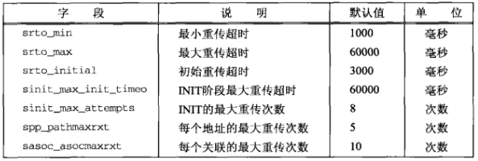

# 第二十三章 高级SCTP套接字编程

[TOC]


## 23.1 概述


## 23.2 自动关闭的一到多式服务器程序

自动关闭允许SCTP端点指定某个关联可以保持空闲的最大秒钟数。关联在任何方向上都没有用户数据在传输时就认为它是空闲的。如果关联的控件事件超过它的最大允许事件，该关联就由SCTP实现自动关闭。

```c++
TODO
```

*sctp/sctpserv04.c*


## 23.3 部分递送

当应用进程要求SCTP传输过大的消息时，SCTP可能采取部分递送措施。

```c++
TODO
```

*sctp/sctp_pdapircv.c*


## 23.4 通知

```c++
TODO
```

*sctp/sctp_displayevents.c*

```c++
TODO
```

*sctp/sctpserv06.c*


## 23.5 无序的数据

SCTP指定MSG_UNORDERED标志发送的消息没有顺序限制，一到达对端就能被递送。无序的数据可以在任何SCTP流中发送，不用赋予流序列号。

```c++
TODO
```

*sctp/sctp_strcli_un.c*


## 23.6 捆绑地址子集

SCTP提供新的sctp_bindx函数调用允许应用进程捆绑多个地址（**注意：所有这些地址必须使用相同的端口**）。

```c++
TODO
```

*sctp/sctp_bindargs.c*

```c++
TODO
```

*sctp/sctpserv07.c*


## 23.7 确定对端和本端地址信息

```c++
TODO
```

*sctp/sctpclient04*

```c++
TODO
```

*sctp/sctp_strcli1.c*

```c++
TODO
```

*sctp/sctp_check_notify.c*

```c++
TODO
```

*sctp/sctp_print_addrs.c*


## 23.8 给定IP地址找出关联ID

```c++
TODO
```

*sctp/sctp_addr_to_associd.c*


## 23.9 心搏和地址不可达

SCTP的心搏机制默认开启。

```c++
TODO
```

*sctp/sctp_modify_hb.c*


## 23.10 关联剥离

一到多式接口相比一到一式接口存在以下优势：

- 只需维护单个描述符。
- 允许编写简单的迭代服务器程序。
- 允许应用进程在四路握手的第三个和第四个分组发送数据，只需使用sendmsg或sctp_sendmsg隐式建立关联就行。
- 无需跟踪传输状态。也就是说应用进程只需在套接字描述符上执行一个接收调用就可以接收消息，之前不必执行传统的connect或accept调用。

```c++
TODO
```

*sctp/sctpserv_fork.c*


## 23.11 定时控制



*SCTP中控制定时的字段*


## 23.12 何时改用SCTP代替TCP

SCTP的优点：

- SCTP直接支持多宿。
- 可以消除头端阻塞。
- 保持应用层消息边界。
- 提供无序消息服务。
- 有些SCTP实现提供部分可靠服务。
- SCTP以一到一式接口提供了从TCP到SCTP的简易已知手段。
- SCTP提供TCP的许多特性。
- SCTP提供许多供应用进程配置和调整传输服务，以便基于关联匹配其需求的挂钩。

SCTP不提供以下TCP特性：

- 半关闭状态。
- 紧急数据。


## 23.13 小结

