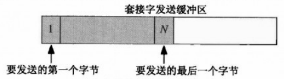
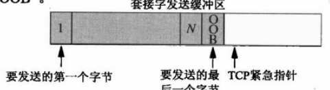
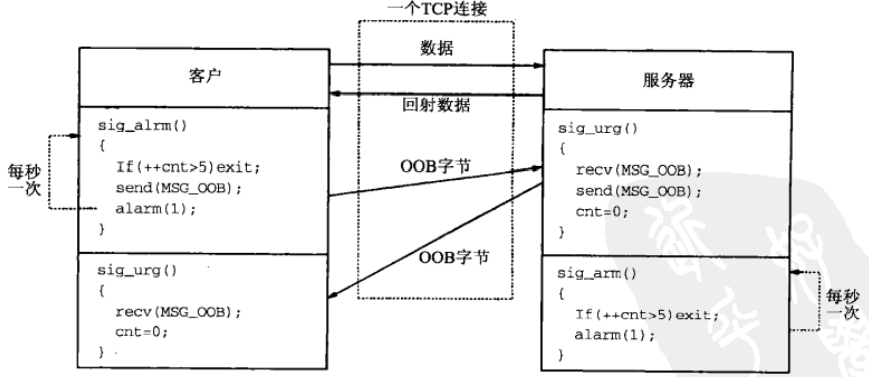

# 第二十四章 带外数据

[TOC]


## 24.1 概述


## 24.2 TCP带外数据



*含有待发送数据的套接字发送缓冲区*



*应用进程写入1字节带外数据后的套接字发送缓冲区*

### 24.2.1 使用SIGURG的简单例子

```c++
#include "unp.h"
int 
main(int argc, char **argv)
{
    int sockfd;
    if (argc != 3)
        err_quit("usage: tcpsend01 <host> <port#>");
    sockfd = Tcp_connect(argv[1], argv[2]);
    Write(sockfd, "123", 3);
    printf("wrote 3 bytes of normal data\n");
    sleep(1);
    Send(sockfd, "4", 1, MSG_OOB);
    printf("wrote 1 byte of OOB data\n");
    sleep(1);
    Write(sockfd, "56", 2);
    printf("wrote 2 bytes of normal data\n");
    sleep(1);
    Send(sockfd, "7", 1, MSG_OOB);
    printf("wrote 1 byte of OOB data\n");
    sleep(1);
    Write(sockfd, "89", 2);
    printf("wrote 2 bytes of normal data\n");
    sleep(1);
    exit(0);
}
```

*oob/tcpsend01.c*

```c++
#include "unp.h"
int listenfd, connfd;
void sig_urg(int);
int 
main(int argc, char **argv)
{
    int n;
    char buff[100];
    if (argc == 2)
        listenfd = Tcp_listen(NULL, argv[1], NULL);
    else if (argc == 3)
        listenfd = Tcp_listen(argv[1], argv[2], NULL);
    else
        err_quit("usage: tcprecv01 [<host>]<port#>");
    connfd = Accept(listenfd, NULL, NULL);
    Signal(SIGURG, sig_urg);
    Fcntl(connfd, F_SETOWN, getpid());
    for (;;) {
        if ((n = Read(connfd, buff, sizeof(buff)-1)) == 0) {
            printf("received EOF\n");
            exit(0);
        }
        buff[n] = 0;
        printf("read %d bytes: %s\n", n, buff);
    }
}
void 
sig_urg(int signo)
{
    int n;
    char buff[100];
    printf("SIGURG received\n");
    n = Recv(connfd, buff, sizeof(buff) - 1, MSG_OOB);
    buff[n] = 0;
    printf("read %d OOB byte: %s\n", n, buff);
}
```

*oob/tcprecv01.c*

### 24.2.2 使用select的简单例子

```c++
#include "unp.h"
int 
main(int argc, char **argv)
{
    int listenfd, connfd, n;
    char buff[100];
    fd_set rset, xset;
    if (argc == 2)
        listenfd = Tcp_listen(NULL, argv[1], NULL);
    else if (argc == 3)
        listenfd = Tcp_listen(argv[1], argv[2], NULL);
    else
        err_quit("usage: tcprecv02 [<host>]<port#>");
    connfd = Accept(listenfd, NULL, NULL);
    FD_ZERO(&rset);
    FD_ZERO(&xset);
    for (;;) {
        FD_SET(connfd, &rset);
        FD_SET(connfd, &xset);
        Select(connfd + 1, &rset, NULL, &xset, NULL);
        if (FD_ISSET(connfd, &xset)) {
            n = Recv(connfd, buff, sizeof(buff)-1, MSG_OOB);
            buff[n] = 0;
            printf("read %d OOB byte: %s\n", n, buff);
        }
        if (FD_ISSET(connfd, &rset)) {
            if ((n = Read(connfd, buff, sizeof(buff) - 1)) == 0) {
                printf("received EOF\n");
                exit(0);
            }
            buff[n] = 0;
            printf("read %d bytes: %s\n", n, buff);
        }
    }
}
```

*oob/tcprecv02.c*

```c++
#include "unp.h"
int 
main(int argc, char **argv)
{
    int listenfd, connfd, n, justreadoob = 0;
    char buff[100];
    fd_set rset, xset;
    if (argc == 2)
        listenfd = Tcp_listen(NULL, argv[1], NULL);
    else if(argc == 3)
        listenfd = Tcp_listen(argv[1], argv[2], NULL);
    else
        err_quit("usage: tcprecv03 [<host>]<port#>");
    connfd = Accept(listenfd, NULL, NULL);
    FD_ZERO(&rset);
    FD_ZERO(&xset);
    for (;;) {
        FD_SET(connfd, &rset);
        if (justreadoob == 0)
            FD_SET(connfd, &xset);
        Select(connfd + 1, &rset, NULL, &xset, NULL);
        if (FD_ISSET(connfd, &xset)) {
            n = Recv(connfd, buff, sizeof(buff) - 1, MSG_OOB);
            buff[n] = 0;
            printf("read %d OOB byte: %s\n", n, buff);
            justreadoob = 1;
            FD_CLR(connfd, &xset);
        }
        if (FD_ISSET(connfd, &rset)) {
            if ((n = Read(connfd, buff, sizeof(buff) - 1)) == 0) {
                printf("received EOF\n");
                exit(0);
            }
            buff[n] = 0;
            printf("read %d bytes: %s\n", n, buff);
            justreadoob = 0;
        }
    }
}
```

*oob/tcprecv03.c*


## 24.3 sockatmark函数

```c++
#include <sys/socket.h>
int sockatmark(int sockfd);
```

- `sockfd`套接字描述符
- `返回值`
  - 1：处于带外标记
  - 0：不处于带外标记
  - -1：失败

*确定套接字是否处于带外标记*

```c++
#include "unp.h"
int 
sockatmark(int fd)
{
    int flag;
    if (ioctl(fd, SIOCATMARK, &flag) < 0)
        return(-1);
    return(flag != 0);
}
```

*lib/sockatmark.c*

### 24.3.1 例子

```c++
#include "unp.h"
int 
main(int argc, char **argv)
{
    int sockfd;
    if (argc != 3)
        err_quit("usage: tcpsend04 <host> <port#>");
    sockfd = Tcp_connect(argv[1], argv[2]);
    Write(sockfd, "123", 3);
    printf("wrote 3 bytes of normal data\n");
    Send(sockfd, "4", 1, MSG_OOB);
    printf("wrote 1 byte of OOB data\n");
    Write(sockfd, "5", 1);
    printf("wrote 1 byte of normal data\n");
    exit(0);
}
```

*oob/tcpsend04.c*

```c++
#include "unp.h"
int 
main(int argc, char **argv)
{
    int listenfd, connfd, n, on=1;
    char buff[100];
    if (argc == 2)
        listenfd = Tcp_listen(NULL, argv[1], NULL);
    else if (argc == 3)
        listenfd = Tcp_listen(argv[1], argv[2], NULL);
    else
        err_quit("usage tcprecv04 [<host>]<port#>");
    Setsockopt(listenfd, SOL_SOCKET, SO_OOBINLINE, &on, sizeof(on));
    connfd = Accept(listenfd, NULL, NULL);
    sleep(5);
    for (;;) {
        if (Sockatmark(connfd))
            printf("at OOB mark\n");
        if ((n = Read(connfd, buff, sizeof(buff) - 1)) == 0) {
            printf("received EOF\n");
            exit(0);
        }
        buff[n] = 0;
        printf("read %d bytes: %s\n", n, buff);
    }
}
```

*oob/tcprecv04.c*

### 24.3.2 例子

```c++
#include "unp.h"
int 
main(int argc, char **argv)
{
    int sockfd, size;
    char buff[16384];
    if (argc != 3)
        err_quit("usage: tcpsend05 <host> <port#>");
    sockfd = Tcp_connect(argv[1], argv[2]);
    size = 32768;
    Setsockopt(sockfd, SOL_SOCKET, SO_SNDBUF, &size, sizeof(size));
    Write(sockfd, buff, 16384);
    printf("wrote 16384 bytes of normal data\n");
    sleep(5);
    Send(sockfd, "a", 1, MSG_OOB);
    printf("wrote 1 byte of OOB data\n");
    Write(sockfd, buff, 1024);
    printf("wrote 1024 bytes of normal data\n");
    exit(0);
}
```

*oob/tcpsend05.c*

```c++
#include "unp.h"
int listenfd, connfd;
void sig_urg(int);
int 
main(int argc, char **argv)
{
    int size;
    if (argc == 2)
        listenfd = Tcp_listen(NULL, argv[1], NULL);
    else if (argc == 3)
        listenfd = Tcp_listen(argv[1], argv[2], NULL);
    else
        err_quit("usage: tcprecv05 [<host>]<port#>");
    size = 4096;
    Setsockopt(listenfd, SOL_SOCKET, SO_RECVBUF, &size, sizeof(size));
    connfd = Accept(listenfd, NULL, NULL);
    Signal(SIGURG, sig_urg);
    Fcntl(connfd, F_SETOWN, getpid());
    for (;;)
        pause();
}
void 
sig_urg(int signo)
{
    int n;
    char buff[2048];
    printf("SIGURG received\n");
    n = Recv(connfd, buff, sizeof(buff) - 1, MSG_OOB);
    buff[n] = 0;
    printf("read %d OOB byte\n", n);
}
```

*oob/tcprecv05.c*

### 24.3.3 例子

```c++
#include "unp.h"
int 
main(int argc, char **argv)
{
    int sockfd;
    if (argc != 3)
        err_quit("usage: tcpsend06 <host> <port#>");
    sockfd = Tcp_connect(argv[1], argv[2]);
    Write(sockfd, "123", 3);
    printf("wrote 3 bytes of normal data\n");
    Send(sockfd, "4", 1, MSG_OOB);
    printf("wrote 1 byte of OOB data\n");
    Write(sockfd, "5", 1);
    printf("wrote 1 byte of normal data\n");
    Send(sockfd, "6", 1, MSG_OOB);
    printf("wrote 1 byte of OOB data\n");
    Write(sockfd, "7", 1);
    printf("wrote 1 byte of normal data\n");
    exit(0);
}
```

*oob/tcpsend06.c*


## 24.4 TCP带外数据小结


## 24.5 客户/服务器心搏函数



*使用带外数据的客户/服务器心搏机制*

```c++
#include "unp.h"
static int servfd;
static int nsec;
static int maxnprobes;
static int nprobes;
static void sig_urg(int), sig_alrm(int);
void 
heartbeat_cli(int servfd_arg, int nsec_arg, int maxnprobes_arg)
{
    servfd = servfd_arg;
    if ((nsec = nsec_arg) < 1)
        nsec = 1;
    if ((maxnprobes = maxnprobes_arg) < nsec)
        maxnprobes = nsec;
    nprobes = 0;
    Signal(SIGURG, sig_urg);
    Fcntl(servfd, F_SETOWN, getpid());
    Signal(SIGALRM, sig_alrm);
    alarm(nsec);
}
static void 
sig_urg(int signo)
{
    int n;
    char c;
    if ((n = recv(servfd, &c, 1, MSG_OOB)) < 0) {
        if (errno != EWOULDBLOCK)
            err_sys("recv error");
    }
    nprobes = 0;
    return;
}
static void 
sig_alrm(int signo)
{
    if (++nprobes > maxnprobes) {
        fprintf(stderr, "server is unreachable\n");
        exit(0);
    }
    Send(servfd, "1", 1, MSG_OOB);
    alarm(nsec);
    return;
}
```

*oob/heartbeatcli.c*

```c++
#include "unp.h"
static int servfd;
static int nsec;
static int maxnalarms;
static int nprobes;
static void sig_urg(int), sig_alrm(int);
void 
heartbeat_serv(int servfd_arg, int nsec_arg, int maxnalarms_arg)
{
    servfd = servfd_arg;
    if ((nsec = nsec_arg) < 1)
        nsec = 1;
    if ((maxnalarms = maxnalarms_arg) < nsec)
        maxnalarms = nsec;
    Signal(SIGURG, sig_urg);
    Fcntl(servfd, F_SETOWN, getpid());
    Signal(SIGALRM, sig_alrm);
    alarm(nsec);
}
static void 
sig_urg(int signo)
{
    int n;
    char c;
    if ((n = recv(servfd, &c, 1, MSG_OOB)) < 0) {
        if (errno != EWOULDBLOCK)
            err_sys("recv error");
    }
    Send(servfd, &c, 1, MSG_OOB);
    nprobes = 0;
    return;
}
static void 
sig_alrm(int signo)
{
    if (++nprobes > maxnalarms) {
        printf("no probes from client\n");
        exit(0);
    }
    alarm(nsec);
    return;
}
```

*oob/heartbeatserv.c*


## 24.6 小结

