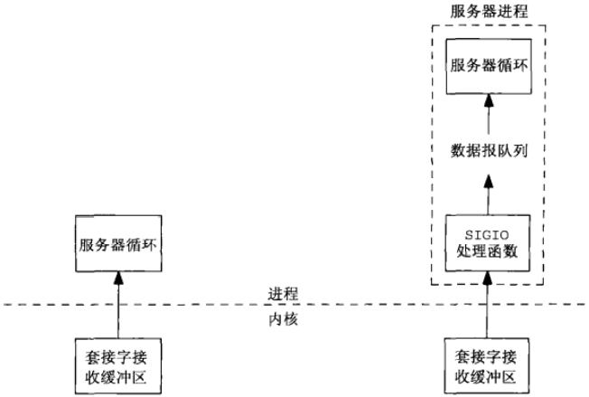
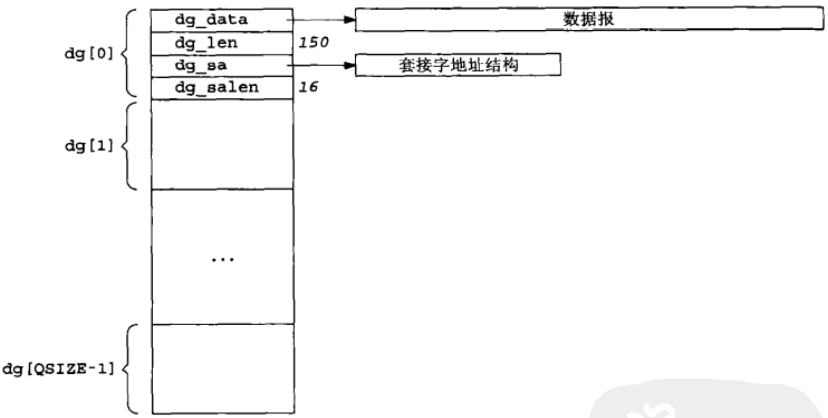

# 第25章 信号驱动式I/O

[TOC]


## 25.1 概述

信号驱动式I/O是指进程预先告知内核，使得当某个描述符上发生某事时，内核使用信号通知相关进程。


## 25.2 套接字的信号驱动式I/O

针对一个套接字使用信号驱动式I/O（SIGIO）要求进程执行以下3个步骤：

1. 建立SIGIO信号的信号处理函数；
2. 设置该套接字的属主，通常使用fcntl的F_SETOWN命令设置；
3. 开启该套接字的信号驱动式I/O，通常通过使用fcntl的F_SETFL命令打开O_ASYNC标志完成。

### 25.2.1 对于UDP套接字的SIGIO信号

SIGIO信号在发生以下事件时产生：

- 数据报到达套接字；
- 套接字上发生异步错误。

### 25.2.2 对于TCP套接字的SIGIO信号

- 监听套接字上某个连接请求已经完成；
- 某个断连请求已经发起；
- 某个断连请求已经完成；
- 某个连接之半已经关闭；
- 数据到达套接字；
- 数据已经从套接字发送走（即输出缓冲区有空闲空间）；
- 发生某个异步错误。



*构建一个UDP服务器的两种方式*


## 25.3 使用SIGIO的UDP回射服务器程序



*用于存放所收取数据报及其套接字地址结构的数据结构*

```c++
#include "unp.h"
static int sockfd;
#define QSIZE 8
#define MAXDG 4096
typedef struct {
    void *dg_data;
    size_t dg_len;
    struct sockaddr *dg_sa;
    socklen_t dg_salen;
} DG;
static DG dg[QSIZE];
static long cntread[QSIZE+1];
static int iget;
static int iput;
static socklen_t clilen;
static void sig_io(int);
static void sig_hup(int);

void 
dg_echo(int sockfd_arg, SA *pcliaddr, socklen_t clilen_arg)
{
    int i;
    const int on = 1;
    sigset_t zeromask, newmask, oldmask;
    sockfd = sockfd_arg;
    clilen = clilen_arg;
    for (i = 0; i < QSIZE; i++) {
        dg[i].dg_data = Malloc(MAXDG);
        dg[i].dg_sa = Malloc(clilen);
        dg[i].dg_salen = clilen;
    }
    iget = iput = nqueue = 0;
    Signal(SIGHUP, sig_hup); // 建立信号处理函数并设置套接字标志
    Signal(SIGIO, sig_io);
    Fcntl(sockfd, F_SETOWN, getpid());
    Ioctl(sockfd, FIOASYNC, &on);
    Ioctl(sockfd, FIONBIO, &on);
    Sigemptyset(&zeromask); // 初始化信号集
    Sigemptyset(&oldmask);
    Sigemptyset(&nemake);
    Sigaddset(&newmask, SIGIO);
    Sigprocmask(SIG_BLOCK, &newmask, &oldmask); // 阻塞SIGIO并等待有事可做
    for (;;) {
        while (nqueue == 0)
            sigsuspend(&zeromask);
        // 解阻塞SIGIO并发送应答
        Sigprocmask(SIG_SETMASK, &oldmask, NULL);
        Sendto(sockfd, dg[iget].dg_data, dg[iget].dg_len, 0,
               dg[iget].dg_sa, dg[iget].dg_salen);
        if (++iget >= QSIZE)
            iget = 0;
        // 阻塞SIGIO
        Sigprocmask(SIG_BLOCK, &newmask, &oldmask);
        nqueue--;
    }
}
static void 
sig_io(int signo)
{
    ssize_t len;
    int     nread;
    DG     *ptr;
    for (nread = 0; ; ) {
        if (nqueue >= QSIZE) // 队列溢出
            err_quit("receive overflow");
        ptr = &dg[input];
        ptr->dg_salen = clilen;
        len = recvfrom(sockfd, ptr->dg_data, MAXDG, 0,
                       ptr->dg_sa, &ptr->dg_salen); // 读入数据
        if (len < 0) {
            if (errno == EWOULDBLOCK)
                break;
            else
                err_sys("recvfrom error");
        }
        ptr->dg_len = len;
        nread++;
        nqueue++;
        if (++iput >= QSIZE) // 溢出置零
            iput = 0;
    }
    cntread[nread]++;
}
static void 
sig_hup(int signo)
{
    int i;
    for (i = 0; i <= QSIZE; i++)
        printf("cntread[%d] = %ld\n", i, cntread[i]);
}
```

*dg_echo函数：服务器主处理循环*


## 25.4 小结

信号驱动式I/O就是让内核在套接字上发生“某事”时使用SIGIO信号通知进程。

- 对于已连接TCP套接字，可以导致这种通知的条件为数众多，反而使得这个特性几近无用；
- 对于监听TCP套接字，这种通知发生在有一个新连接已准备好接收之时。
- 对于UDP套接字，这种通知意味着或者到达一个数据报，或者到达一个一部错误，这两种情况下我们都调用recvfrom。
