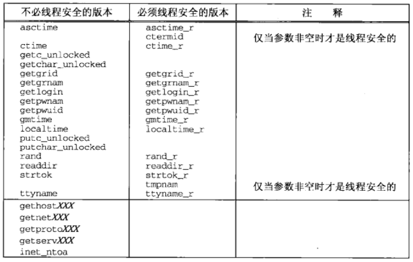
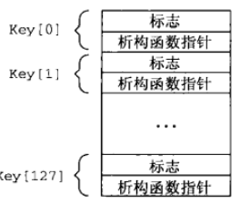
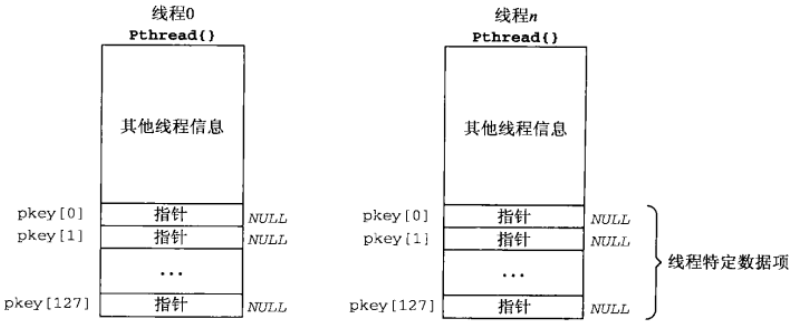
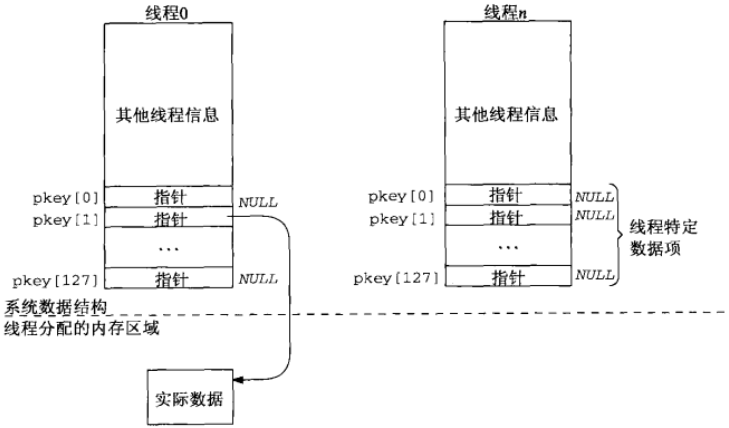
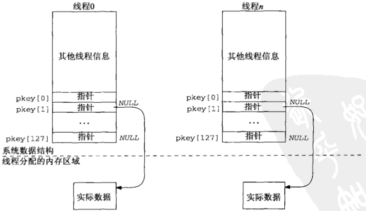

# 第26章线程

[TOC]


## 26.1 概述


## 26.2 基本线程函数：创建和终止

### 26.2.1 pthread_create函数

```c++
#include <pthread.h>
int pthread_create(pthread_t *tid, const pthread_attr_t *attr, void *(*func)(void *), void *arg);
```

- `tid`返回的线程ID

- `attr`属性

- `func`执行函数

- `arg`执行函数的参数

- `返回值`

  - 成功：0
  - 失败：错误码

创建线程。

### 26.2.2 pthread_join函数

```c++
#include <pthread.h>
int pthread_join(pthread_t *tid, void **status);
```

- `tid`线程ID
- `status`线程返回值
- `返回值`
  - 成功：0
  - 失败：错误码

等待线程终止。

### 26.2.3 pthread_self函数

```c++
#include <pthread.h>
pthread_t pthread_self(void);
```

获得当前线程的ID。

### 26.2.4 pthread_detach函数

```c++
#include <pthread.h>
int pthread_detach(pthread_t tid);
```

- `tid`线程ID
- `返回值`
  - 成功：0
  - 失败：错误码

把指定的线程转变为脱离状态。

### 26.2.5 pthread_exit函数

```c++
#include <pthread.h>
void pthread_exit(void *status);
```

- `status`

让线程终止。

  

## 26.3 使用线程的str_cli函数


*使用线程重新编写str_cli*

```c++
#include "unpthread.h"
void *copyto(void *);
static int sockfd;
static FILE *fp;
void 
str_cli(FILE *fp_arg, int sockfd_arg)
{
    char recvline[MAXLINE];
    pthread_t tid;
    sockfd = sockfd_arg;
    fp = fp_arg;
    pthread_create(&tid, NULL, copyto, NULL); // 创建线程
    while (Readline(sockfd, recvline, MAXLINE) > 0) // 输出
        Fputs(recvline, stdout);
}
void * 
copyto(void *arg) // 复制文本到套接字
{
    char sendline[MAXLINE];
    while(Fgets(sendline, MAXL;INE, fp) != NULL)
        Writen(sockfd, sendline, strlen(sendline));
    Shutdown(sockfd, SHUT_WR);
    return (NULL);
    // return (i.e., thread terminates) when EOF on stdin
}
```


## 26.4 使用线程的TCP回射服务器程序

```c++
#include "unpthread.h"
static void *doit(void *);
int 
main(int argc, char **argv)
{
    int listenfd, connfd;
    pthread_t tid;
    socklen_t addrlen, len;
    struct sockaddr *cliaddr;
    if (argc == 2)
        listenfd = Tcp_listen(NULL, argv[1], &addrlen);
    else if (argc == 3)
        lsitenfd = Tcp_listen(argv[1], argv[2], &addrlen);
    else
        err_quit("usage: tcpserv01 [ <host> ] <service or port>");
    cliaddr = Malloc(addrlen);
    for (;;) {
        len = addrlen;
        connfd = Accept(listenfd, cliaddr, &len);
        Pthread_create(&tid, NULL, &doit, (void *)connfd); // 每个连接配一个线程
    }
}
static void * 
doit(void *arg)
{
    pthread_detach(pthread_self());
    str_echo((int)arg);
    Close((int) arg);
    return (NULL);
}
```

*使用线程的TCP回射服务器程序*

### 26.4.1 给新线程传递参数

```c++
#include "unpthread.h"
static void *doit(void *);
int 
main(int argc, char **argv)
{
    int listenfd, *iptr;
    thread_t tid;
    socklen_t addrlen, len;
    struct sockaddr *cliaddr;
    if (argc == 2)
        listenfd = Tcp_listen(NULL, argv[1], *addrlen);
    else if (argc == 3)
        listenfd = Tcp_listen(argv[1], argv[2], &addrlen);
    else
        err_quit("usage: tcpserv01 [ <host> ] <service or port>");
    cliaddr = Malloc(addrlen);
    for (;;) {
        len = addrlen;
        iptr = Malloc(sizeof(int)); // 开辟新的内存，防止多个线程公用同一个值
        *iptr = Accept(listenfd, cliaddr, &len);
        Pthread_create(&tid, NULL, &doit, iptr);
    }
}
static void * 
doit(void *arg)
{
    int connfd;
    connfd = *((int *)arg);
    free(arg);
    Pthread_detach(pthread_self());
    str_echo(connfd);
    Close(connfd);
    return (NULL);
}
```

### 26.4.2 线程安全函数



*线程安全函数*


## 26.5 线程特定数据



*线程特定数据的可能实现*



*系统维护的关于每个线程的信息*



*把malloc到的内存区和线程特定数据指针相关联*



*线程$n$初始化它的线程特定数据后的数据结构*

```c++
#include <pthread.h>
int pthread_once(pthread_once_t *onceptr, void (*init)(void));
```

- `onceptr`调用记录指针
- `init`初始化函数

确保init函数只被调用一次。

```c++
#include <pthread.h>
int pthread_key_create(pthread_key_t *keyptr, void (*destructor)(void *value));
```

- `keyptr`返回创建的键
- `destructor`键析构器

创建一个key。

```c++
#include <pthread.h>
void *pthread_getspecific(pthread_key_t key); // 返回：指向线程特定数据的指针（可空）
int pthread_setspecific(pthread_key_t key, const void *value); // 返回：错误码
```

- `key`键
- `value`值

根据键设置/获取值。

```c++
#include "unpthread.h"
static pthread_key_t rl_key;
static pthread_once_t rl_once = PTHREAD_ONCE_INIT;
static void 
readl;ine_destructor(void *ptr) // 析构函数
{
    free(ptr);
}
static void 
readline_once(void) // 一次性函数
{
    Pthread_key_create(&rl_key, readl;ine_destructor);
}
typedef struct { // Rline结构
    int   rl_cnt;
    char *rl_bufptr;
    char  rl_buf[MAXLINE];
} Rline;
static ssize_t 
my_read(Rline *tsd, int fd, char *ptr)
{
    if (tsd->rl_cnt <= 0) {
      again:
        if ((tsd->rl_cnt = read(fd, tsd->rl_buf, MAXLINE)) < 0) {
            if (errno == EINTR)
                goto again;
            return (-1);
        } else if (tsd->rl_cnt == 0)
            return (0);
        tsd->rl_bufptr = tsd->rl_buf;
    }
    tsd->rl_cnt--;
    *ptr = *tsd->rl_bufptr++;
    return(1);
}
ssize_t 
readline(int fd, void *vptr, size_t maxlen)
{
    size_t n, rc;
    char c, *ptr;
    Rline *tsd;
    Pthread_once(&rl_once, readl;ine_once); // 分配线程特定数据
    if ((tsd = pthread_getspecific(rl_key)) == NULL) {
        tsd = Calloc(1, sizeof(Rline)); // init to 0
        Pthread_setspecific(rl_key, tsd); // 设置线程特定数据指针
    }
    ptr = vptr;
    for (n = 1; n < maxlen; n++) {
        if ((rc = my_read(tsd, fd, &c)) == 1) {
            *ptr++ = c;
            if (c == '\n')
                break;
        } else if (rc == 0) {
            *ptr = 0;
            return (n - 1);
        } else 
            return (-1);
    }
    *ptr = 0;
    return (n);
}
```

*使用线程特定数据的readline函数*


## 26.6 Web客户与同时连接

```c++
#include "unpthread.h"
#include <thread.h>
#define MAXFILES 20
#define SERV "80"
struct file {
    char     *f_name;
    char     *f_host;
    int       f_fd;
    int       f_flags;
    pthread_t f_tid;
} file[MAXFILES];
#define F_CONNECTING 1
#define F_READING    2
#define F_DONE       4
#define GET_CMD      "GET %s HTTP/1.0\r\n\r\n"
int nconn, nfiles,nlefttoconn, nlefttoread;
void *do_get_read(void *);
void home_page(const char *, const char *);
void write_get_cmd(struct file *);
int 
main(int argc, char **argv)
{
    int i, n, maxnconn;
    pthread_t tid;
    struct file *fptr;
    if (argc < 5)
        err_quit("usage: web <#conns> <IPaddr> <homepage> file1 ...");
    maxnconn = atoi(argv[1]);
    nfiles = min(argc - 4, MAXFILES);
    for (i = 0; i < nfiles; i++) {
        file[i].f_name = argv[i + 4];
        file[i].f_host = argv[2];
        file[i].f_flags = 0;
    }
    printf("nfiles = %d\n", nfiles);
    home_page(argv[2], argv[3]);
    nlefttoread = nlefttoconn = nfiles;
    nconn = 0;
    while(nlefttoread > 0) {
        while (nconn < maxnconn && nlefttoconn > 0) { // 尽可能创建另一个线程
            // find a file to read
            for (i = 0; i < nfiles; i++)
                if (file[i].f_flags == 0)
                    break;
            if (i == nfiles)
                err_quit("nlefttoconn = %d but nothing found", nlefttoconn);
            file[i].f_flags = F_CONNECTING;
            Pthread_create(&tid, NULL, &do_get_read, &file[i]);
            file[i].f_tid = tid;
            nconn++;
            nlefttoconn--;
        }
        if ((n = thr_join(0, &tid, (void **)&fptr)) != 0) // 等待任何一个线程终止
            errno = n, err_sys("thr_join error");
        nconn--;
        nlefttoread--;
        printf("thread id %d for %s done\n", tid, fptr->f_name);
    }
    exit(0);
}
void * 
do_get_read(void *vptr)
{
    int fd, n;
    char line[MAXLINE];
    struct file *fptr;
    fptr = (struct file *)vptr;
    fd = Tcp_connect(fptr->f_host, SERV); // 创建TCP套接字并建立连接
    fptr->f_fd = fd;
    printf("do_get_read for %s, fd %d, thread %d\n", 
           fptr->f_name, fd, fptr->f_tid);
    write_get_cmd(fptr); // 向服务器写出请求
    // 读取服务器的应答
    for (;;) {
        if ((n = Read(fd, line, MAXLINE)) == 0)
            break;
        printf("read %d bytes from %s\n", n, fptr->f_name);
    }
    printf("end-of-file on %s\n", fptr->f_name);
    Close(fd);
    fptr->f_flags = F_DONE;
    return (fptr);
}
```


## 26.7 互斥锁

```c++
#include "unpthread.h"
#define NLOOP 5000
int counter;
void *doit(void *);
int 
main(int argc, char **argv)
{
    pthread_t tidA, tidB;
    Pthread_create(&tidA, NULL, &doit, NULL);
    Pthread_create(&tidB, NULL, &doit, NULL);
    // wait for both threads to terminate
    Pthread_join(tidA, NULL);
    Pthread_join(tidB, NULL);
    exit(0);
}
void * 
doit(void *vptr)
{
    int i, val;
    /*
     * Each thread fetches, prints, and increments the counter NLOOP times.
     * The values of the counter should increse monotonically.
     */
    for (i = 0; i < NLOOP; i++) {
        val = counter;
        printf("%d: %d\n", pthread_self(), val + 1);
        counter = val + 1;
    }
    return (NULL);
}
```

*两个线程**不正确**地递增一个全局变量*

```c++
#include <pthread.h>
int pthread_mutex_lock(pthread_mutex_t *mptr);
int pthread_mutex_unlock(pthread_mutex_t *mptr);
```

- `mptr`互斥量

给互斥量加/解锁。

```c++
#include "unpthread.h"
#define NLOOP 5000
int counter;
pthread_mutex_t counter_mutex = PTHREAD_MUTEX_INITIALIZER;
void *doit(void *);
int 
main(int argc, char **argv)
{
    pthread_t tidA, tidB;
    Pthread_create(&tidA, NULL, &doit, NULL);
    Pthread_create(&tidB, NULL, &doit, NULL);
    // wait for both threads to terminate
    Pthread_join(tidA, NULL);
    Pthread_join(tidB, NULL);
    exit(0);
}
void * 
doit(void *vptr)
{
    int i, val;
    /*
     * Each thread fetches, prints, and increments the counter NLOOP times.
     * The value of the counter should increase monotonically.
     */
    for (i = 0; i < NLOOP; i++) {
        Pthread_mutex_lock(&counter_mutex);
        val = counter;
        printf("%d: %d\n", pthread_self(), val + 1);
        counter = val + 1;
        Pthread_mutex_unlock(&counter_mutex);
    }
    return (NULL);
}
```

*使用互斥锁版本的：两个线程递增一个全局变量*


## 26.8 条件变量

```c++
#include <pthread.h>
int pthread_cond_wait(pthread_cond_t *cptr, pthread_mutex_t *mptr);
int pthread_cond_signal(pthread_cond_t *cptr);
```

- `cptr`条件变量（信号）
- `mptr`互斥量
- `返回值`
  - 成功：0
  - 失败：错误码

等待/唤醒条件变量上**单个线程**。

```c++
#include <pthread.h>
int pthread_cond_timedwait(pthread_cond_t *cptr, pthread_kmutex_t *mptr, 
                           const struct timespec *abstime);
int pthread_cond_broadcast(pthread_cond_t *cptr);
```

- `cptr`条件变量
- `mptr`互斥量
- `abstime`等待时间（绝对时间，即1970.01.01UTC事件以来的秒数和纳秒数）
- `返回值`
  - 成功：0
  - 失败：错误码

等待/唤醒条件变量上**所有线程**。


## 26.9 Web客户与同时连接（续）


## 26.10 小结

