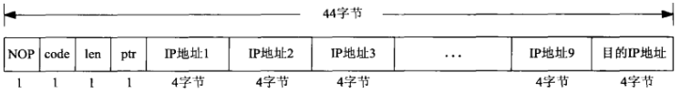
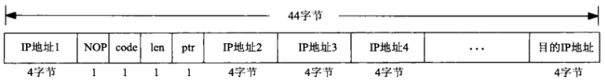
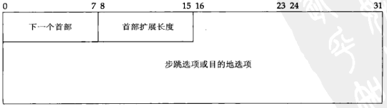
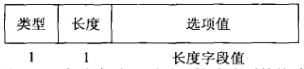
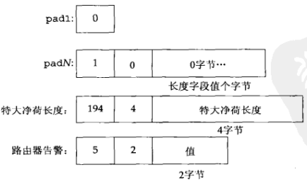
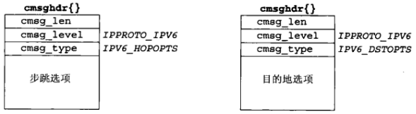
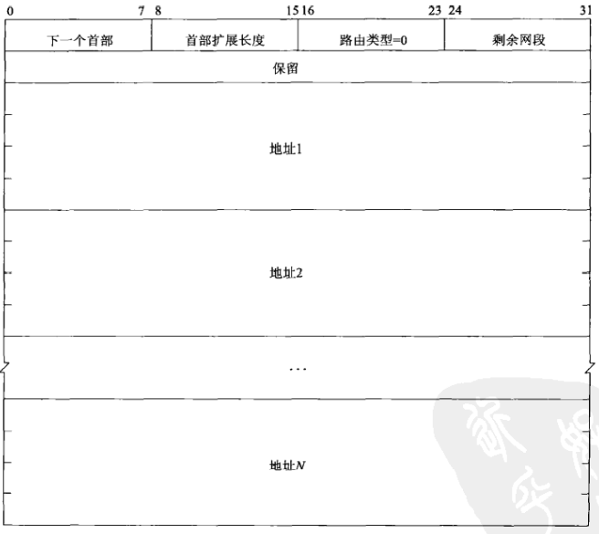
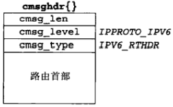

# IP选项

[TOC]


## 27.1 概述


## 27.2 IPv4选项

IPv4选项字段最长为40字节，定义了10种不同的选项：

- `NOP(no-operation)`。单字节选项。
- `EOL(end-of-list)` 单字节选项，终止选项的处理。
- `LSSR(loose source and record route)`。
- `SSRR(strict source and record route)` 。
- `Timestamp`
- `Record route`
- `Basic security` （已作废）
- `Extended security` （已作废）
- `Stream identifier` （已作废）
- `Router alert` 这是在RFC 2113 [Katz 1997]中叙述的一种选项。包含该选项的IP数据报要求所有转发路由器都查看其内容。


## 27.3 IPv4源路径选项

`源路径（source route）`是由IP数据报的发送者指定的一个IP地址列表。

IPv4源路径称为`源和记录路径（source and record routes，SSR，其中LSSR表示宽松的选项，SSRR表示严格的选项）`。



*向内核传递的源路径*

```c++
#include "unp.h"
#include <netinet/in_systm.h>
#include <netinet/ip.h>
static u_char *optr;
static u_char *lenptr;
static int ocnt;
u_char * 
inet_srcrt_init(int type) // 分配一个最大长度（44字节）的缓冲区并清零
{
    optr = Malloc(44);
    bzero(optr, 44);
    ocnt = 0;
    *optr+= = IPOPT_NOP;
    *optr++ = type ? IPOPT_SSRR : IPOPT_LSRR;
    lenptr = optr++;
    *optr++ = 4;
    return(optr - 4);
}
int 
inet_srcrt_add(char *hostptr)
{
    int len;
    struct addrinfo *ai;
    struct sockaddr_in *sin;
    if (ocnt > 9) // 检查溢出
        err_quit("too many source routers with: %s", hostptr);
    ai = Host_serv(hostptr, NULL, AF_INET, 0); // 转换主机名或点分十进制数串
    sin = (struct sockaddr_in *)ai->ai_addr;
    memcpy(optr, &sin->sin_addr, sizeof(struct in_addr));
    freeaddrinfo(ai);
    optr += sizeof(struct in_addr);
    ocnt++;
    len = 3 + (ocnt * sizeof(struct in_addr));
    *lenptr = len;
    return(len + 1);
}
void 
inet_srcrt_print(u_char *ptr, int len) // 显示一个接收源路径
{
    u_char c;
    char str[INET_ADDRSTRLEN];
    struct in_addr hopl;
    memcpy(&hopl, ptr, sizeof(struct in_addr)); // 保存缓冲区中第一个IP地址
    ptr += sizeof(struct in_addr); 
    while ((c = *ptr++) == IPOPT_NOP); // 跳过后跟的任何NOP
    if (c == IPOPT_LSRR)
        printf("received SSRR: ");
    else if (c == IPOPT_SSRR)
        printf("received SSRR: ");
    else {
        printf("received option type %d\n", c);
        return;
    }
    printf("%s ", Inet_ntop(AF_INET, &hop1, str, sizeof(str)));
    len = *ptr++ - sizeof(struct in_addr);
    ptr++;
    while (len > 0) {
        printf("%s ", Inet_ntop(AF_INET, ptr, str, sizeof(str)));
        ptr += sizeof(struct in_addr);
        len -= sizeof(struct in_addr);
    }
    printf("\n");
}
```

*ipopts/sourceroute.c*



*getsockopt返回的源路径选项格式*

```c++
#define MAX_IPOPTLEN 40
struct ipoption {
    struct in_addr ipopt_dst;
    char           ipopt_list[MAX_IPOPTLEN];
};
```

*上图所示的格式在<netinet/ip_var.h>头文件中定义*

### 27.3.1 例子

```c++
#include "unp.h"
int 
main(int argc, char **argv)
{
    int c, sockfd, len = 0;
    u_char *ptr = NULL;
    struct addrinfo *ai;
    if (argc < 2)
        err_quit("usage: tcpcli01 [ -[gG] <hostname> ... ] <hostname>");
    opterr = 0;
    while ((c = getopt(argc, argv, "gG")) != -1) {
        switch (c) {
            case 'g':
                if (ptr)
                    err_quit("can't use both -g and -G");
                ptr = inet_srcrt_init(0); // 初始化源路径
                break;
            case 'G':
                if (ptr)
                    err_quit("can't use both -g and -G");
                ptr = inet_srcrt_init(1);
                break;
            case '?':
                err_quit("unrecognized option: %c", c);
        }
    }
    if (ptr)
        while (optind < argc - 1)
            len = inet_srcrt_add(argv[optind++]); // 把中间地址加到源路径中
    else if (optind < argc - 1)
        err_quit("need -g or -G to specify route");
    if (optind != argc - 1)
        err_quit("missing <hostname>");
    ai = Host_serv(argv[optind], SERV_PORT_STR, AF_INET, SOCK_STREAM);
    sockfd = Socket(ai->ai_family, ai->ai_socktype, ai->ai_protocol);
    if (ptr) {
        len = inet_srcrt_add(argv[optind]);
        Setsockopt(sockfd, IPPROTO_IP, IP_OPTIONS, ptr, len);
        free(ptr);
    }
    Connect(sockfd, ai->ai_addr, ai->ai_addrlen);
    str_cli(stdin, sockfd);
    exit(0);
}
```

*ipopts/tcpcli01.c*

### 27.3.2 删除所收取的源路径


## 27.4 IPv6扩展首部

IPv6首部可以后跟如下几种可选的扩展首部（extention header）：

- 步跳选项（hop_by_hop options）
- 目的地选项（destination options）
- 路径首部（routing header）
- 分片首部（fragmentation header）
- 认证首部（authentication header, AH）
- 安全净荷封装（encapsulating security payload, ESP）


## 27.5 IPv6步跳选项和目的地选项



*步跳选项和目的地选项的格式*



*个体步跳选项或目的地选项的格式*

- `类型（type）` 8bit，用于指定选项值类型

  | 高序前2位                                                    | 高序第3位                                                  | 低序5位                                 |
  | ------------------------------------------------------------ | ---------------------------------------------------------- | --------------------------------------- |
  | - 00 跳过本选项，继续处理本首部。<br>- 01 丢弃本分组。<br>- 00 丢弃本分组，并且不论本分组的目的地址是否为一个多播地址，均发送一个ICMP参数问题类型2错误给发送者。<br>- 00 丢弃本分组，并且只在本分组的目的地址不是一个多播地址的前期下，发送一个ICMP参数问题类型2错误给发送者 | - 0 选项数据在途中无变化。<br>- 1 选项数据在途中可能变化。 | 指定选项本身，需要与高序前3位共同标识。 |

- `长度（length）`指定选项值的长度（不包括`类型`和`长度`字段长）

- `选项值（value）`



*IPv6步跳选项*



*步跳选项和目的地选项的辅助数据对象*

```c++
#include <netinet/in.h>
int inet6_opt_init(void *extbuf, socklen_t extlen); // 返回容纳一个空扩展首部所需的字节数，若出错则为-1
int inet6_opt_append(void *extbuf, socklen_t extlen, 
                     int offset, uint8_t type, socklen_t len,
                     uint8_t align, void **databufp); // 返回添加指定的个体选项后更新的扩展首部总长度，若出错则为-1
int inet6_opt_finish(void *extbuf, socklen_t extlen, int offset); // 结束一个扩展首部的设置，添加填充使得总长度为8的倍数，若出错则为-1
int inet6_opt_set_val(void *databuf, int offset,
                      const void *val, socklen_t vallen); // 把给定的选项值复制到由inet6_opt_append返回的数据缓冲区中
```

- `extbuf`扩展缓冲区
- `extlen`扩展缓冲区长（8的倍数）
- `offset`缓冲区偏移量，必须是某个inet6_opt_init或inet6_opt_append调用的返回值
- `type`选项类型
- `len`选项长度
- `align`对齐要求（不需要显式指定）
- `databufp`用于返回指向所添加选项值的填写位置的一个指针
- `val`复制到选项值缓冲区中的值
- `vallen`复制到选项值缓冲区中的值长度

```c++
#include <netinet/in.h>
int inet6_opt_next(const void *extbuf, socklen_t extlen, int offset,
                   uint8_t *typep, socklen_t *lenp, void **databuf); // 处理缓冲区中的下一个选项
int inet6_opt_find(const void *extbuf, socklen_t extlen, int offset,
                   uint8_t type, socklen_t *lenp, void **databufp); // 处理缓冲区中的指定的选项
int inet6_opt_get_val(const void *databuf, int offset, 
                      void *val, socklen_t vallen); // 从选项值中抽取数据
```

- `extbuf`缓冲区
- `extlen`缓冲区长度
- `offset`缓冲区的偏移量
- `typep`游动选项的类型
- `lenp`游动选项的长度
- `databuf`游动选项的值
- `val`复制到选项值缓冲区中的值
- `vallen`复制到选项值缓冲区中的值长度


## 27.6 IPv6路由首部



*IPv6路由首部*



*IPv6路由首部的辅助数据对象*

```c++
#include <netinet/in.h>
socklen_t inet6_rth_space(int type, int segments);
```

- `type`类型
- `segments`网段总数
- `返回值`
  
  成功：字节数（正数）
  
  失败：0

返回容纳一个指定类型和网段总数的路由首部所需的字节数。

```c++
#include <netinet/in.h>
void *inet6_rth_init(void *rthbuf, socklen_t rthlen, 
                     int type, int segments);
```

- `rthbuf`缓冲区
- `rthlen`缓冲区长度
- `type`类型
- `segments`网段总数
- `返回值`
  
  成功：指向缓冲区的指针
  
  失败：NULL

初始化指定的缓冲区，以容纳一个类型为type值且网段总数为segments值的路由首部。

```c++
#include <netinet/in.h>
int inet6_rth_add(void *rthbuf, const struct in6_addr *addr);
```

- `rthbuf`缓冲区
- `addr`地址
- `返回值`
  
  成功：0
  
  失败：-1

把由addr指向的IPv6地址加到构建中的路由首部的末尾。

```c++
#include <netinet/in.h>
int inet6_rth_reverse(const void *in, void *out);
```

- `in`传入缓冲区
- `out`返回缓冲区
- `返回值`
  
  成功：0
  
  失败：-1

根据in中存放的接收路由首部创建一个新的路由首部，并放入out中（in和out可以为同一个缓冲区）。

```c++
#include <netinet/in.h>
int inet6_rth_seqments(const void *rthbuf);
```

- `rthbuf`存放路由首部的缓冲区
- `返回值`
  
  成功：网段数目
  
  失败：-1

返回路由首部中的网段数目。

```c++
#include <netinet/in.h>
struct in6_addr *inet6_rth_getaddr(const void *rthbuf, int index);
```

- `rthbuf`缓冲区
- `index`索引
- `返回值`
  
  成功：指向IPv6地址的指针
  
  失败：NULL

返回由rthbuf所指路由首部中索引号为index的那个IPv6地址。

```c++
#include "unp.h"
int 
main(int argc, char **argv)
{
    int c, sockfd, len = 0;
    u_char *ptr = NULL;
    void *rth;
    struct addrinfo *ai;
    if (argc < 2)
        err_quit("usage: udpcli01 [ <hsotname> ... ] <hostname>");
    if (argc > 2) {
        int i;
        len = Inet6_rth_space(IPV6_RTHDR_TYPE_0, argc-2); // 确定创建路由首部需要的空间
        ptr = Malloc(len);
        Inet6_rth_init(ptr, len, IPV6_RTHDR_TYPE_0, argc-2); // 初始化缓冲区
        for (i = 1; i < argc - 1; i++) {
            ai = Host_serv(argv[i], NULL, AF_INET6, 0); // 转成数值格式
            Inet6_rth_add(ptr,
                          &((struct sockaddr_in6 *)ai->ai_addr)->sin6_addr);
        }
    }
    ai = Host_serv(argv[argc-1], SERV_PORT_STR, AF_INET6, SOCK_DGRAM); // 查找地址（数值格式）
    sockfd = Socket(ai->ai_family, ai->ai_socktype, ai->ai_protocol);
    if (ptr) {
        Setsockopt(sockfd, IPPROTO_IPV6, IPV6_RTHDR, ptr, len); // 设置IPV6_RTHDR并调用工作者函数
        free(ptr);
    }
    dg_cli(stdin, sockfd, ai->ai_addr, ai->ai_addrlen);
    exit(0);
}
```

*指定一个源路径的IPv6 UDP客户程序*

```c++
#include "unp.h"
void 
dg_echo(int sockfd, SA *pcliaddr, socklen_t clilen)
{
    int n;
    char mesg[MAXLINE];
    int on;
    char control[MAXLINE];
    struct msghdr msg;
    sgruct cmsghdr *cmsg;
    struct iovec iov[1];
    on = 1;
    Setsockopt(sockfd, IPPROTO_IPV6, IPV6_RECVRTHDR, &on, sizeof(on)); 
    bzero(&msg, sizeof(msg));
    iov[0].iov_base = mesg;
    msg.msg_name = pcliaddr;
    msg.msg_iov = iov;
    msg.msg_iovlen = 1;
    msg.msg_control = control;
    for (;; ){
        msg.msg_namelen = clilen;
        msg.msg_controllen = sizeof(control);
        iov[0].iov_len = MAXLINE;
        n = Recvmsg(sockfd, &msg, 0);
        for (cmsg = CMSG_FIRSTHDR(&msg); cmsg != NULL;
             cmsg = CMSG_NXTHDR(&msg, cmsg)) { // 寻找并处理路由首部
            if (cmsg->cmsg_level == IPPROTO_IPV6 &&
                cmsg->cmsg_type == IPV6_RTHDR) {
                inet6_srcrt_print[CMSG_DATA(cmsg)];
                inet6_rth_reverse(CMSG_DATA(cmsg), CMSG_DATA(cmsg)); // 逆转源路径
            }
        }
        iov[0].iov_len = n;
        Sendmsg(sockfd, &msg, 0);
    }
}
```

*显示并逆转IPv6源路径的dg_echo函数*

```c++
#include "unp.h"
void 
inet6_srcrt_print(void *ptr)
{
    int i, segments;
    char str[INET6_ADDRSTRLEN];
    segments = Inet6_rth_segments(ptr); // 确定源路径中的网段数
    printf("received source route: ");
    for (i = 0; i < segments; i++) // 遍历网段
        printf("%s ", Inet_ntop(AF_INET6, Inet6_rth_getaddr(ptr, i),
                                str, sizeof(str)))；
    printf("\n");
}
```

*显示一个IPv6接收源路径的inet6_srcrt_print函数*


## 27.7 IPv6粘附选项

作为辅助数据使用sendmsg和recvmsg发送和接收的7中辅助数据对象：

- IPv6分组信息：in6_pktinfo结构或者包含目的地址和外出接口索引，或者包含源地址和到达接口索引。
- 外出跳限或接收跳限。
- 下一跳地址。只能发送不能接收。
- 外出流通类别或接收流通类别。
- 步跳选项。
- 目的地选项。
- 路由首部。


## 27.8 历史性IPv6高级API


## 27.9 小结

