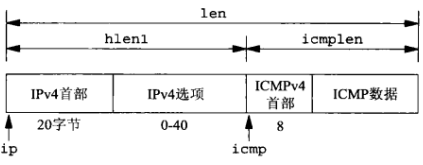

# 第二十八章 原始套接字

[TOC]


## 28.1 概述

原始套接字提供普通的TCP和UDP套接字所不提供的以下能力：

- 进程可以读与写ICMPv4，IGMPv4和ICMPv6等分组。
- 进程可以读写内核不处理其协议字段的IPv4数据报。
- 进程还可以使用IP_HDRINCL套接字选项自行构造IPv4首部。


## 28.2 原始套接字创建

创建原始套接字步骤：

1. 把第二个参数指定为SOCK_RAW并调用socket函数，以创建一个原始套接字；第三个参数（协议）通常不为0。

   例：

   ```c++
   int sockfd;
   sockfd = socket(AF_INET, SOCK_RAW, protocol);
   ```

2. 可以在原始套接字上开启IP_HDRINCL套接字选项。

   例：

   ```c++
   const int on = 1;
   if (setsockopt(sockfd, IPPROTO_IP, IP_HDRINCL, &on, sizeof(on)) < 0)
       // 出错处理
   ```

3. 可以在原始套接字上调用bind函数，用于设置从这个原始套接字发送的所有数据报的源IP地址（只在IP_HDRINCL套接字选项未开启的前提下）。

4. 可以在这个原始套接字上调用connect函数，用于设置外地地址。


## 28.3 原始套接字输出

原始套接字的输出遵循以下规则：

- 普通输出通过调用sendto或sendmsg并指定目的IP地址完成。如果套接字已经连接，那么也可以调用write，writev或send。

- 如果IP_HDRINCL套接字选项未开启，那么由进程让内核发送的数据的起始地址指的是IP首部之后的第一个字节，因为内核将构造IP首部并把它置于来自进程的数据之前。内核把所构造IPv4首部的协议字段设置成来自socket调用的第三个参数。

- 如果IP_HDRINCL套接字选项已开启，那么由进程让内核发送的数据的起始地址指的是IP首部的第一个字节。进程调用输出函数写出的数据量必须包括IP首部的大小。整个IP首部由进程构造。

  注意事项：

  1. IPv4标识字段可置为0，从而告知内核设置该值；
  2. IPv4首部校验和字段总是由内核计算并存储；
  3. IPv4选项字段是可选的。

- 内核会对超出外出接口MTU的原始分组执行分片。

### 28.3.1 IPv6的差异

IPv6原始套接字与IPv4相比存在如下差异：

- 通过IPv6原始套接字发送和接受的协议首部中的所有字段均采用网络字节序；
- IPv6不存在与IPv4的IP_HDRINCL套接字选项类似的东西。通过IPv6原始套接字无法读入或写出完整的IPv6分组（包括IPv6首部和任何扩展首部）。IPv6首部的几乎所有字段以及所有扩展首部都可以通过套接字选项或辅助数据由应用进程指定或获取。如果应用进程需要读入或写出完整的IPv6数据报，那就必须使用数据链路访问。
- IPv6原始套接字的校验和处理存在差异。

### 28.3.2 IPV6_CHECKSUM套接字选项

对于其他IPv6原始套接字（不是以IPPROTO_ICMPV6为第三个参数调用socket创建的那些原始套接字），进程可以使用一个套接字选项告知内核是否计算并存储外出分组中的校验和，且验证接收分组中的校验和。该选项默认关闭，可以通过以下代码开启：

```c++
int offset = 2;
if (setsockopt(sockfd, IPPROTO_IPV6, IPV6_CHECKSUM, 
               &offset, sizeof(offset)) < 0)
    // 出错处理
```


## 28.4 原始套接字输入

内核把接收到的IP数据报传递到原始套接字规则：

- 接收到的UDP分组和TCP分组和TCP分组绝不传递到任何原始套接字。
- 大多数ICMP分组在内核处理完其中的ICMP消息后传递到原始套接字。
- 所有IGMP分组在内核完成处理其中的IGMP消息后传递到原始套接字。
- 内核不认识其协议字段的所有IP数据报传递到原始套接字。
- 如果某个数据报以片段形式到达，那么在它的所有片段均到达且重组出该数据报之前，不传递任何片段分组到原始套接字。

内核对每个原始套接字均执行以下3个测试，只有这3个测试结果为真，内核才把接收到的数据报地送到这个套接字：

- 如果创建这个原始套接字时制定了非0的协议参数（socket的第三个参数），那么接收到的数据报的协议字段必须匹配该值，否则该数据报不递送到这个套接字。
- 如果这个原始套接字已由bind调用绑定了某个本地IP地址，那么接收到的数据报的目的IP地址必须匹配这个绑定地址，否则该数据报不递送到这个套接字。
- 如果这个原始套接字已由connect调用指定了某个外地IP地址，那么接收到的数据报的源IP地址必须匹配这个已连接地址，否则该数据报不递送到这个套接字。

```c++
#include <netinet/icmp6.h>
void ICMP6_FILTER_SETPASSALL(struct icmp6_filter *filt); // 指定所有消息类型都传递到应用进程
void ICMP6_FILTER_SETBLOCKALL(struct icmp6_filter *filt); // 指定不传递任何消息类型
void ICMP6_FILTER_SETPASS(int msgtype struct icmp6_filter *filt); // 放行某个指定消息类型到应用进程的传递
void ICMP6_FILTER_SETBLOCK(int msgtype, struct icmp6_filter *filt); // 阻止某个指定消息类型的传递
int ICMP6_FILTER_WILLPASS(int msgtype, const struct icmp6_filter *filt); // 判断消息类型是否被过滤器放行
int ICMP6_FILTER_WILLBLOCK(int msgtype, const struct icmp6_filter *filt);// 判断消息类型是否被过滤器阻止
```


## 28.5 ping程序


*ICMPv4和ICMPv6回射请求和回射应答消息的格式*


*我们的ping程序中各个函数的概貌*

```c++
TODO
```

*ping/ping.h*

```c++
TODO
```

*ping/main.c*

```c++
TODO
```

*ping/readloop.c*

```c++
TODO
```

*lib/tv_sub.c*

```c++
TODO
```

*ping/proc_v4.c*

```c++
TODO
```

*ping/init_v6.c*

```c++
TODO
```

*ping/proc_v6.c*

```c++
TODO
```

*ping/sig_alrm.c*

```c++
TODO
```

*ping/send_v4.c*

```c++
TODO
```

*libfree/in_cksum.c*

```c++
TODO
```

*ping/send_v6.c*



*处理ICMPv4应答涉及的首部，指针和长度*


## 28.6 traceroute程序


*处理ICMPv4错误涉及的首部，指针和长度*


*处理ICMPv6错误涉及的首部，指针和长度*

```c++
TODO
```

*traceroute/trace.h*

```c++
TODO
```

*traceroute/main.c*

```c++
TODO
```

*traceroute/traceloop.c*

```c++
TODO
```

*traceroute/recv_v4.c*

```c++
TODO
```

*traceroute/sig_alrm.c*

```c++
TODO
```

*traceroute/recv_v6.c*

```c++
TODO
```

*traceroute/icmpcode_v6.c*


## 28.7 一个ICMP消息守护程序


*icmpd守护进程：初始创建的套接字*


*应用进程创建自身的UDP套接字和到icmp的Unix域连接*


*应用进程跨Unix域连接把UDP套接字传递给icmpd*


*从ICMPv4和ICMPv6错误映射到icmpd_errno*

```c++
TODO
```

*icmpd/unpicmpd.h*

### 28.7.1 使用icmpd的UDP回射客户程序

```c++
TODO
```

*icmpd/dgcli01.c*

### 28.7.2 UDP回射客户程序运行例子

### 28.7.3 icmpd守护进程

```c++
TODO
```

*icmpd/icmpd.h*

```c++
TODO
```

*icmpd/icmpd.c*

```c++
TODO
```

*icmpd/readable_listen.c*

```c++
TODO
```

*icmpd/readable_conn.c*

```c++
TODO
```

*icmpd/readable_v4.c*

```c++
TODO
```

*icmpd/readable_v6.c*


## 28.8 小结

原始套接字提供以下3个能力：

- 进程可以读写ICMPv4，IGMPv4和ICMPv6等分组。
- 进程可以读写内核不处理其协议字段的IP数据报。
- 进程可以自行构造IPv4首部，通常用于诊断目的。


