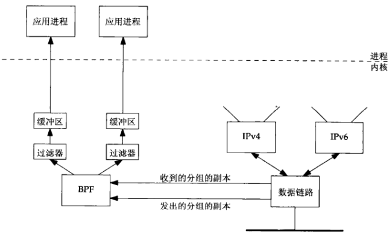
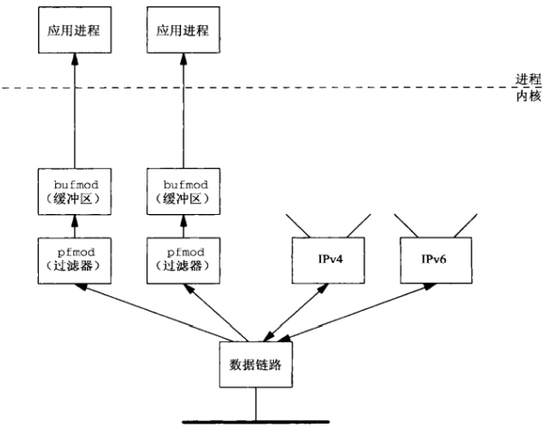
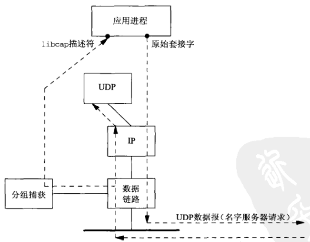
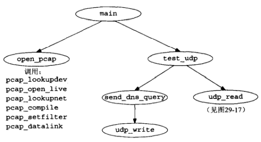
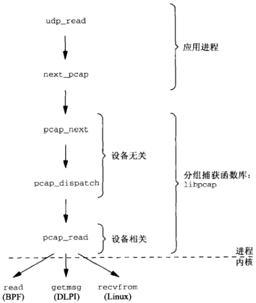

# 第二十九章 数据链路访问

[TOC]


## 29.1 概论

数据链路层访问功能：

- 能够监视由数据链路层接收的分组，使得诸如tcpdump之类的程序能够在普通计算机系统上运行，而无需使用专门的硬件设备来监视分组。
- 能够作为普通应用进程而不是内核的一部分运行某些程序。


## 29.2 BPF: BSD分组过滤器



*使用BPF截获分组*

BPF使用以下技术来降低开销：

- BPF过滤在内核中进行，以次把从BPF到应用进程的数据复制量减少到最小。
- 由BPF传递到应用进程的只是每个分组的一段定长部分，这个长度称为`捕获长度（capture length）`或`快照长度（snapshot length, snaplen）`。
- BPF为每个应用进程分别缓冲数据，只有当缓冲区已满或读超时（read timeout）期满时缓冲区中的数据才复制到应用进程。


## 29.3 DLPI:数据链路提供者接口

SVR4通过数据链路提供者接口（Datal;ink Provider Interface, DLPI）提供数据链路访问。



*使用DLPI，pfmod和bufmod捕获分组*


## 29.4 Linux: SOCK_PACKET和PF_PACKET

Linux的数据链路访问方法相比BPF和DLPI存在如下差别：

- Linux方法不提供内核缓冲，而且只有较新的方法才能提供内核过滤。
- Linux较旧的方法不提供针对设备的过滤。


## 29.5 libpcap: 分组捕获函数库

libpcap是访问操作系统所提供的分组捕获机制的分组捕获函数库，它是与实现无关的。


## 29.6 libnet:分组构造与输出函数库

libnet函数库提供构造任意协议的分组并将其输出到网络中的接口。它以实现无关的方式提供原始套接字访问方式和数据链路访问方式。


## 29.7 检查UDP的校验和字段



*检查某个名字服务器是否开启UDP校验和的应用程序*



*udpcksum程序中的函数汇总*



*从分组捕获函数库读入分组的相关函数调用*

```c++
#include "unp.h"
#include <pcap.h>
#include <netinet/in_system.h>
#include <netinet/in.h>
#include <netinet/ip.h>
#include <netinet/ip_var.h>
#include <netinet/udp.h>
#include <netinet/udp_var.h>
#include <net/if.h>
#include <netinet/if_ether.h>
#define TTL_OUT 64
/* declare global variables */
extern struct sockaddr *dest, *local;
extern socklen_t destlen, locallen;
extern int datalink;
extern char *device;
extern pcap_t *pd;
extern int rawfd;
extern int snaplen;
extern int verbose;
extern int zerosum;
/* function prototypes */
void  cleanup(int);
char *next_pcap(int *);
void  open_output(void);
void  open_pcap(void);
void  send_
void
void
struct udpiphdr *
```

*udpcksum/udpcksum.h*

```c++
#include "udpcksum.h"
/* DefinE global variables */
struct sockaddr *dest, *local;
struct sockaddr_in locallookup;
socklen_t destlen, locallen;
int datalink;
char *device;
pcap_t *pd;
int rawfd;
int snaplen = 200;
int verbose;
int zerosum;
static void usage(const char *);
int 
main(int argc, char *argv[])
{
    int c, lopt = 0;
    char *ptr, localname[1024], *localport;
    struct addrinfo *aip;
    opterr = 0;
    while ((c = getopt(argc, argv, "oi:l:v")) != -1) {
        switch (c) {
            case '0': // 不设置UDP校验和就发送UDP查询
                zerosum = 1;
                break;
            case 'i': // 指定接收服务器的应答接口
                device = optarg;
                break;
            case '1': // 指定源IP和端口
                if ((ptr = strrchr(optarg, '.')) == NULL)
                    usage("invalid - 1 option");
                *ptr++ = 0;
                localport = ptr;
                strncpy(localname, optarg, sizeof(localname));
                lopt = 1;
                break;
            case 'v':
                verbose = 1;
                break;
            case '?':
                usage("unrecognized option");
        }
    }
    if (optind != argc-2)
        usage("missing <host> and/or <serv>");
    /* convert destination anme and service */
    aip = Host_serv(argv[optind], argv[optind+1], AF_INET, SOCK_DGRAM);
    dest = aip->ai_addr;
    destlen = aip->ai_addrlen;
    /*
     * Need local IP address for source IP address for UDP datagrams.
     * Can't specify 0 and let IP choose, as we need to know it for 
     * the pseudoheader to calculate the UDP checksum.
     * If -1 option supplied, then use those values; otherwise,
     * connect a UDP socket to the destination to determine the right
     * source address.
     */
    if (lopt) {
        /* convert local name and service */
        aip = Host_serv(localname, localport, AF_INET, SOCK_DGRAM);
        local = api->ai_addr;
        locallen = aip->ai_addrlen;
    } else {
        int s;
        s = Socket(AF_INET, SOCK_DGRAM, 0);
        Connect(s, dest, destlen);
        /* kernel chooses correct local address for dest */
        locallen = sizeof(locallookup);
        local = (struct sockaddr *)&locallookup;
        Getsockname(s, local, &locallen);
        if (locallookup.sin_addr.s_addr == htonl(INADDR_ANY))
            err_quit("Can't determine local address - use -l\n");
        close(s);
    }
    open_output(); // 创建原始套接字并开启IP_HDRINCL
    open_pcap(); // 打开分组捕获设备
    setuid(getuid()); // 重设用户ID
    Signal(SIGTERM, cleanup);
    Signal(SIGINT, cleanup);
    Signal(SIGHUP, cleanup);
    test_udp();
    cleanup(0);
}
```

*udpcksum/main.c*

```c++
#include "udpcksum.h"
#define CMD "udp and src host %s and src port %d"
void 
open_pcap(void)
{
    uint32_t localnet, netmask;
    char cmd[MAXLINE], errbuf[PCAP_ERRBUF_SIZE],
         str1[INET_ADDRSTRLEN], str2[INET_ADDRSTRLEN];
    struct bpf_program fcode;
    if (device == NULL) {
        if ((device = pcap_lookupdev(errbuf)) == NULL) // 选择分组捕获设备
            err_quit("pcap_lookup: %s", errbuf);
    }
    printf("device = %s\n", device);
    /* hardcode: promisc=0, to_ms=500 */
    if ((pd = pcap_open_live(device, snaplen, 0, 500, errbuf)) == NULL) // 打开设备
        err_quit("pcap_open_live: %s", errbuf);
    if (pcap_lookupnet(device, &localnet, &netmask, errbuf) < 0) // 返回分组捕获设备的IP和子网掩码
        err_quit("pcap_lookupnet: %s", errbuf);
    if (verbose)
        printf("localnet = %s, netmask = %s\n",
               Inet_ntop(AF_INET, &localnet, str1, sizeof(str1)),
               Inet_ntop(AF_INET, &netmask, str2, sizeof(str2)));
    snprintf(cmd, sizeof(cmd), CMD,
             Sock_ntop_host(dest, destlen),
             ntohs(sock_get_port(dest, destlen)));
    if (verbose)
        printf("cmd = %s\n", cmd);
    if (pcap_compile(pd, &fcode, cmd, 0, netmask) < 0) // 编译分组过滤器
        err_quit("pcap_compile: %s", pcap_geterr(pd));
    if (pcap_setfilter(pd, &fcode) < 0) // 装载过滤器程序
        err_quit("pcap_setfilter: %s", pcap_geterr(pd));
    if ((datalink = pcap_datalink(pd)) < 0) // 确定数据链路类型
        err_quit("pcap_datalink: %s", pcap_geterr(pd));
    if (verbose)
        printf("datalink = %d\n", datalink);
}
```

*udpcksum/pcap.c*

```c++
#include "udpcksum.h"
#include <setjmp.h>
static sigjmp_buf jmpbuf;
static int canjump;
void 
sig_alrm(int signo)
{
    if (canjump == 0)
        return;
    siglongjmp(jmpbuf, 1);
}
void 
test_udp(void)
{
    volatile int nsent = 0, timeout = 3;
    struct udpiphdr *ui;
    Signal(SIGALRM, sig_alrm);
    if (sigsetjmp(jmpbuf, 1)) {
        if (nsent >= 3) // 3次请求无响应
            err_quit("no response");
        printf("timeout\n");
        timeout *= 2;
    }
    canjump = 1;
    send_dns_query(); // 发送DNS查询
    nsent++;
    alarm(timeout);
    ui = udp_read(); // 读入应答
    canjump = 0;
    alarm(0);
    if (ui->ui_sum == 0)
        printf("UDP cheksums off\n");
    else
        printf("UDP checksums on\n");
    if (verbose)
        printf("received UDP checksum = %x\n", ntohs(ui->ui_sum));
}
```

*udpcksum/udpcksum.c*

```c++


void
send_dns_query(void)
{
    size_t nbytes;
    char *buf, *ptr;
    buf = Malloc(sizeof(struct udpiphdr) + 100);
    ptr = buf + sizeof(struct udpiphdr); // 构造DNS查询
    *((uint16_t *)ptr) = htons(1234);
    ptr += 2;
    *((uint16_t *)ptr) = htons(0x0100);
    ptr += 2;
    *((uint16_t *)ptr) = htons(1);
    ptr += 2;
    *((uint16_t *)ptr) = 0;
    ptr += 2;
    *((uint16_t *)ptr) = 0;
    ptr += 2;
    *((uint16_t *)ptr) = 0;
    ptr += 2;
    memcpy(ptr, "\001a\014root-servers\003net\000", 20);
    ptr += 20;
    *((uint16_t *)ptr) = htons(1);
    ptr += 2;
    *((uint16_t *)ptr) = htons(1);
    ptr += 2;
    nytes = (ptr - buf) - sizeof(struct udpiphdr);
    udp_write(buf, nbytes);
    if (verbose)
        printf("send: %d bytes of data\n", nbytes);
}
```

*udpcksum/senddnsquery-raw.c*

```c++

int rawfd; // 声明原始套接字描述符
void 
open_output(void)
{
    int on = 1;
    /*
     *
     *
     *
     */
    rawfd = Socket(dest->fa_family, SOCK_RAW, 0);
    Setsockopt(rawfd, IPPROTO_IP, IP_HDRINCL, &on, sizeof(on));
}
```

*udpcksum/udpwrite.c*

```c++
TODO
```

*udpcksum/udpread.c*

```c++
TODO
```

*udpcksum/cleanup.c*

### 29.7.1 例子

### 29.7.2 libnet输出函数

```c++
TODO
```

*udpcksum/senddnsquery-libnet.c*


## 29.8 小结


