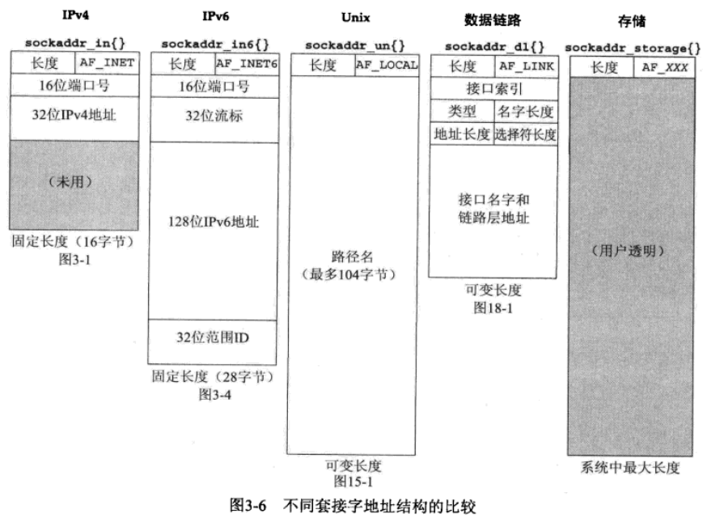
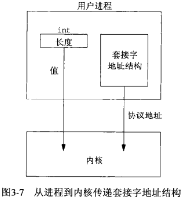
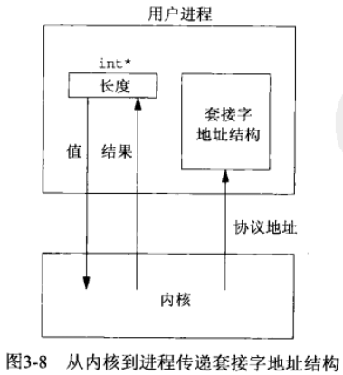
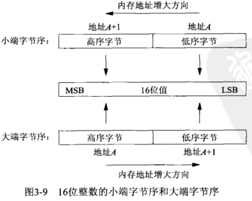
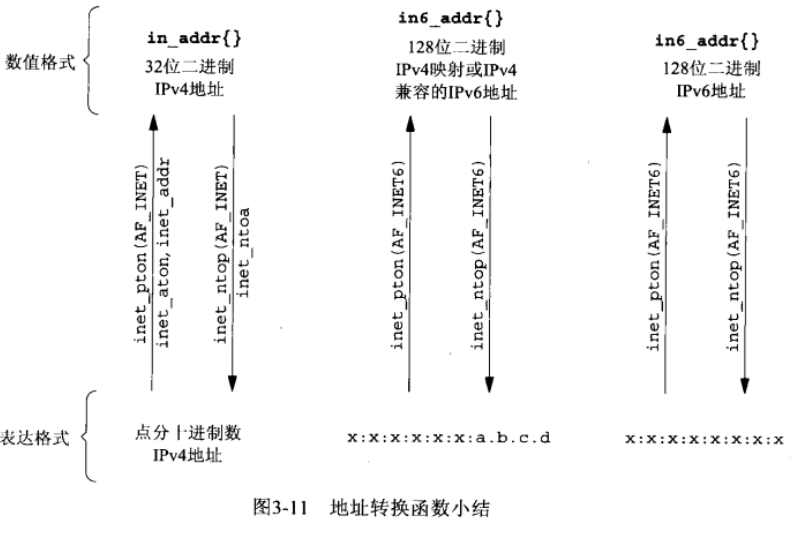

# 第三章 套接字编程简介
- [套接字地址结构](#套接字地址结构)
  - [IPV4套接字地址结构](#IPV4套接字地址结构)
  - [通用套接字地址结构](#通用套接字地址结构)
  - [IPV6套接字地址结构](#IPV6套接字地址结构)
  - [新的通用套接字地址结构](#新的通用套接字地址结构)
  - [套接字地址结构的比较](#套接字地址结构的比较)
- [值结果参数](#值结果参数)
- [字节排序函数](#字节排序函数)
  - [确定主机字节序的程序](#确定主机字节序的程序)
  - [主机字节序与网络字节序的转换](#主机字节序与网络字节序的转换)
- [字节操纵函数](#字节操纵函数)
- [int_aton, inet_addr和inat_ntoa函数](#int_aton和inet_addr和inat_ntoa函数)
- [inet_pton和inet_ntop函数](#inet_pton和inet_ntop函数)


## 套接字地址结构

### IPV4套接字地址结构

头文件 `netinet/in.h`

```c
struct in_addr {
    in_addr_t s_addr; // 至少32位无符号整数类型
};
struct sockaddr_in {
    uint8_t         sin_len; 		// 长度字段
    sa_family_t     sin_family; // 地址族; 任何无符号整数类型
    in_port_t       sin_port; 	// TCP或UDP端口; 至少16位的无符号整数类型
    struct in_addr  sin_addr;
    char 						sin_zero[8];
};
```

POSIX规范要求的数据类型

| 数据类型                                                     | 说明                                                         | 头文件                                                       |
| ------------------------------------------------------------ | ------------------------------------------------------------ | ------------------------------------------------------------ |
| int8_t<br>uint8_t<br>int16_t<br>uint16_t<br>int32_t<br>uint32_t | 带符号的8位整数<br>无符号的8位整数<br>带符号的16位整数<br>无符号的16位整数<br>带符号的32位整数<br>无符号的32位整数 | <sys/types.h><br><sys/types.h><br><sys/types.h><br><sys/types.h><br><sys/types.h><br><sys/types.h> |
| sa_family_t<br>sockle_t                                      | 套接字地址结构的地址族<br>套接字地址结构的长度，一般为uint32_t | <sys/socket.h><br><sys/socket.h>                             |
| in_addr_t<br>in_port_t                                       | IPv4地址，一般为uint32_t<br>TCP或UDP端口，一般为uint16_t     | <netinet/in.h><br><netinet/in.h>                             |

### 通用套接字地址结构

头文件 `sys/socket.h`

```c
struct sockaddr {
    uint8_t     sa_len;
    sa_family_t sa_family;
    char        sa_data[14];
};
```

### IPV6套接字地址结构

头文件 `netinet/in.h`

```c
struct in6_addr {
    uint8_t s6_addr[16];
};
#defie SIN6_LEN
struct sockaddr_in6 {
    uint8_t         sin6_len;
    sa_family_t     sin6_family;
    in_port_t       sin6_port;
    uint32_t        sin6_flowinfo;
    struct in6_addr sin6_addr;
    uint32_t        sin6_scope_id;
}
```

- 如果系统支持套接字地址结构中的长度字段，那么SIN6_LEN常值必须定义
- IPv6的地址族是AF_INET6，而IPv4的地址族是AF_INET
- 结构中字段的先后顺序做过编排，使得如果sockaddr_in6结构本身是64位对齐的，那么128位的sin6_addr字段也是64位对齐的。在一些64位处理器上，如果64位数据存储在某个64位边界位置，那么对它的访问将得到优化处理。
- Sin6_flowinfo字段分成2个字段:
  - 低序20位是流标(flow label)
  - 高序12位保留
- 对于具备范围的地址(scoped address), sin6_scope_id字段标识其范围(scope)，最常见的是链路局部地址(link-local address)的接口索引(interface index)

### 新的通用套接字地址结构

头文件 `netinet/in.h`

```c
struct sockaddr_storage { // 存储套接字地址结构
    uint8_t     ss_len;
    sa_family_t ss_family;
};
```

### 套接字地址结构的比较



## 值结果参数

从进程到内核传递套接字地址结构的函数:

- bind
- connect
- sendto



从内核到进程传递套接字地址结构的函数:

- accept
- recvfrom
- getsockname
- getpeername




## 字节排序函数



### 确定主机字节序的程序
```c
#include "unp.h"
int
main (int argc, char **argv)
{
    union {
        short   s;
        char    c[sizeof(short)]  ;
    } un;
    un.s = 0x0102;
    printf("%s: ", CPU_VENDOR_OS);
    if (sizeof(short) == 2) {
        if (un.c[0] == 1 && un.c[1] == 2)
            printf("big-endian\n");
        else if (un.c[0] == 2 && un.c[1] == 1)
            printf("little-endian\n");
        else
            printf("unknown\n");
    } else
        printf("sizeof(short) = %d\n", sizeof(short));
    exit(0);
}
```

### 主机字节序与网络字节序的转换

头文件 `netinet/in.h`

```c++
/*主机字节序转网络字节序*/
uint16_t htons(uint16_t host16bitvalue);
uint32_t htonl(uint32_t host32bitvalue);

/*网络字节序转主机字节序*/
uint16_t ntohs(uint16_t net16bitvalue);
uint32_t ntohl(uint32_t net32bitvalue);
```


## 字节操纵函数

头文件 `strings.h`

- `void bzero(void *dest, size_t nbytes)` 设置字符串的值为0
  - dest: 被设置的字符串
  - nbytes: 要设置的字节数
- `void bcopy(const void *src, void *dest, size_t nbytes)` 复制字符串
  - src: 源字符串
  - dest: 目标字符串
  - nbytes: 要复制的数量
- `int bcmp(const void *ptr1, const void *ptr2, size_t nbytes)` 比较字符串
  - ptr1: 字符串1
  - ptr2: 字符串2
  - nbytes: 要比较的字符长度

头文件 `string.h`

- `void *memset(void *dest, int c, size_t len)` 设置字符串为指定值

  - dest: 被设置的字符串
  - c: 要设置的值
  - len: 要设置的字节数

- `void *memcpy(void *dest, const void *src, size_t nbytes)` 复制字符串

  - dest: 目标字符串
  - src: 源字符串
  - nbytes: 要复制的字节数

  **注意：当dest和src重叠时，memcpy操作结果无法预料**

- `int memcmp(const void *ptr1, const void *ptr2, size_t nbytes)` 比较字符串

  - ptr1: 字符串1
  - ptr2: 字符串2
  - nbytes: 要比较的字符串长度


## int_aton和inet_addr和inat_ntoa函数

头文件 `arpa/inet.h`

- `int inet_aton(const char *strptr, struct in_addr *addrptr)` 将c字符串转换成一个32位的网络字节序二进制值

  - strptr: 需要转换的c字符串
  - addrptr: 用来存储网络字节序二进制值的指针

- ~~`in_addr_t inet_addr(const char *strptr)` 将c字符串转换成一个32位的网络字节序二进制值~~

  - strptr:

  **注意:**

  **1. 地址255.255.255.255不能由该函数处理; **

  **2. 函数出错时返回-1,其它函数一般返回无符号值**

- `char *inet_ntoa(struct in_addr inaddr)` 将32位的网络字节序二进制IPv4地址转换成相应的点分十进制字符串。

  - inaddr:

  **返回值所指向的字符串驻留在静态内存中，改函数不可重入！！！**


## inet_pton和inet_ntop函数

头文件 `arpa/inet.h`

- `int inet_pton(int family, const char *strptr, void *addrptr)`将字符串格式转换到二进制格式

  - family: 地址族; AF_INET/AF_INET6
  - strptr: 字符串格式
  - addrptr: 二进制格式

- `const char *inet_ntop(int family, const void *addrptr, char *strptr, size_t len)` 将二进制格式转换到字符串格式

  - family: 地址族; AF_INET/AF_INET6
  - addrptr: 二进制格式
  - strptr: 字符串格式，不允许为空

  - len: 表达式长度

    `netinet/in.h`中有定义:

    - INET_ADDRSTRLEN 16: IPv4地址
    - INET6_ADDRSTRLEN 46: IPv6地址



IPv4版本的inet_pton实现

```c
int
inet_pton(int family, const char *strptr, void *addrptr)
{
  if (family == AF_INET) {
    struct in_addr in_val;
    if (inet_aton(strptr, &in_val)) {
      memcpy(addrptr, &in_val, sizeof(struct in_addr));
      return (1);
    }
    return (0);
  }
}
```

IPv4版本的int_ntop实现

```c++
const char *
inet_ntop(int family, const void *addrptr, char *strptr, size_t len)
{
  const u_char *p = (const u_char *) addrptr;
  if (family == AF_INET) {
    char temp[INET_ADDRSTRLEN];
    snprintf(temp, sizeof(temp), "%d.%d.%d.%d", p[0], p[1], p[2], p[3]);
    if (strlen(temp) >= len) {
      errno = ENOSPC;
      return (NULL);
    }
    strcpy(strptr, temp);
    return (strptr);
  }
  errno = EAFNOSUPPORT;
  return (NULL);
}
```

