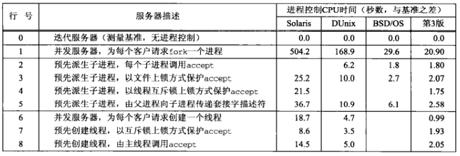
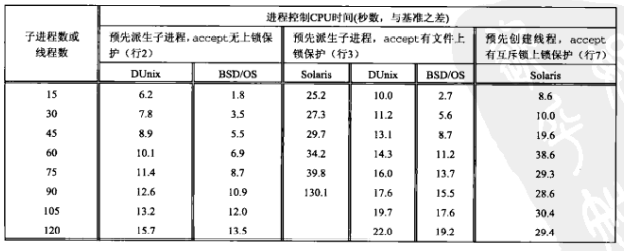
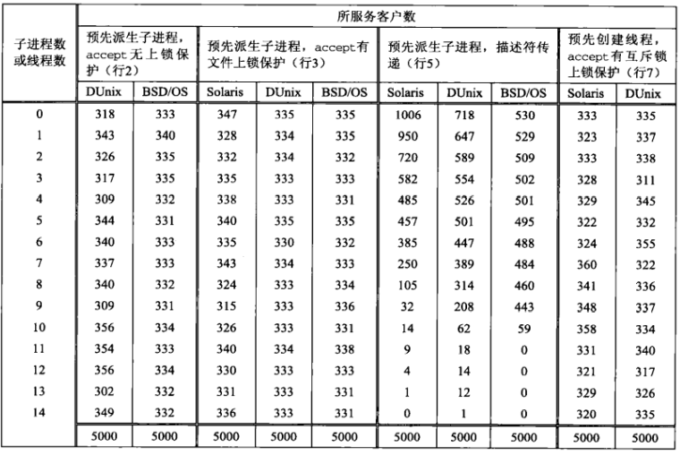
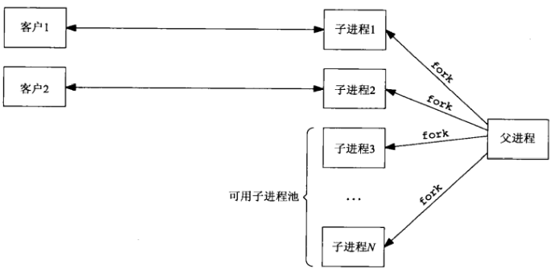
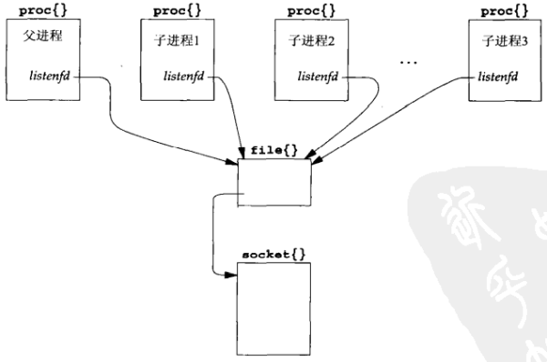
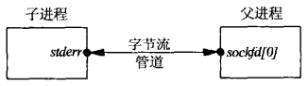
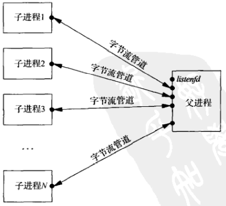

# 第三十章 客户/服务器程序设计范式

[TOC]


## 30.1 概述



*本章所讨论各个范式服务器的测时结果比较*



*过多子进程或线程对服务器CPU时间的影响*



*15个子进程或线程中每一个所服务的客户数的分布*


## 30.2 TCP客户程序设计范式


## 30.3 TCP测试用客户程序

```c++
TODO
```

*用于测试各个范式服务器的TCP客户程序*


## 30.4 TCP迭代服务器程序


## 30.5 TCP并发服务器程序，每个客户一个子进程

```c++
TODO
```

*server/serv01.c*

```c++
TODO
```

*server/pr_cpu_time.c*

```c++
TODO
```

*server/web_child.c*


## 30.6 TCP预先派生子进程服务器程序，accept无上锁保护



*服务器预先派生子进程*

```c++
TODO
```

*server/serv02.c*

```c++
TODO
```

*server/child02.c*

### 30.6.1 4.4BSD上的实现



*proc, file和socket这三个结构之间的关系*

### 30.6.2 子进程过多的影响

### 30.6.3 连接在子进程中的分布

```c++
TODO
```

*在共享内存中分配一个数组的meter函数*

### 30.6.4 select冲突


## 30.7 TCP预先派生子进程服务器程序，accept使用文件上锁保护

```c++
TODO
```

*server/lock_fcntl.c*

### 30.7.1 子进程过多的影响

### 30.7.2 连接在子进程中的分布


## 30.8 TCP预先派生子进程服务器程序，accept使用线程上锁保护

```c++
TODO
```

*server/lock_pthread.c*


## 30.9 TCP预先派生子进程服务器程序，传递描述符

```c++
typedef struct {
    pid_t child_pid;
    int   child_pipefd;
    int   child_status;
    long  child_count;
} Child;
Child *cptr;
```

*Child结构*



*父子进程各自关闭一端后的字节流管道*



*所有子进程都派生之后的各个字节流管道*

```c++
TODO
```

*server/child05.c*

```c++
TODO
```

*server/serv05.c*


## 30.10 TCP并发服务器程序，每个客户一个线程

```c++
TODO
```

*server/serv06.c*


## 30.11 TCP预先创建线程服务器程序，每个线程各自accept

```c++
TODO
```

*server/pthread07.h*

```c++
TODO
```

*server/serv07.c*


## 30.12 TCP预先创建线程服务器程序，主线程统一accept

```c++
TODO
```

*server/pthread08.h*

```c++
TODO
```

*server/serv08.c*


## 30.13 小结

- 当系统负载较轻时，没来一个客户请求现场派生一个子进程为之服务的传统并发服务器程序模型就足够了。
- 相比传统的每个客户fork一次的设计范式，预先创建一个子进程池或一个线程池的设计范式能够把进程控制CPU时间降低10倍或以上。
- 某些实现允许多个子进程或线程阻塞在同一个accept调用中，另一些实现却要求包绕accept调用安置某种类型的锁加以保护。文件上锁或Pthread互斥锁上锁都可以使用。
- 让所有子进程或线程自行调用accept通常比让父进程或主线程独自调用accept并把描述符传递给子进程或线程来的简单而快速。
- 让所有子进程或线程阻塞在同一个accept调用中币让它们阻塞在同一个select调用中更可取。
- 使用线程通常远快于使用进程。