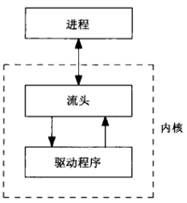
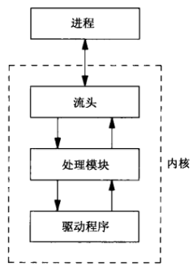
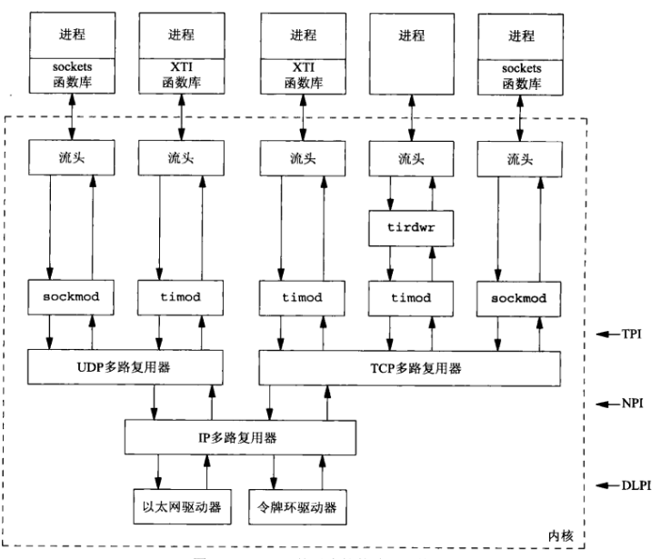
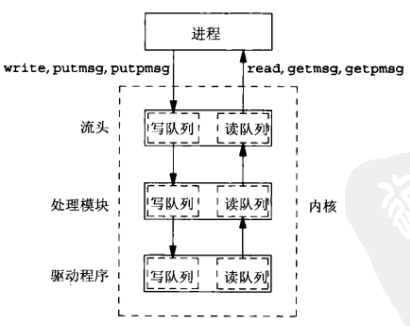
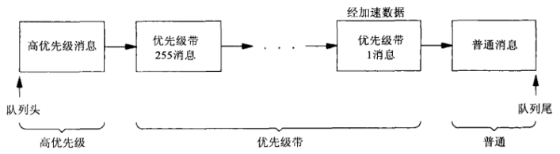
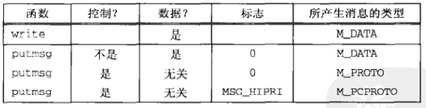

# 第三十一章 流

[TOC]


## 31.1 概述


## 31.2 概貌



*一个进程和一个驱动程序之间的某个流*



*压入一个处理模块的某个流*



*TCP/IP基于流的某种可能的实现*



*流中每个部件至少有一对队列*



*一个队列中的流消息基于优先级的排序*



*由write和putmsg产生的流消息类型*


## 31.3 getmsg和putmsg函数

```c++
#include <stropts.h>
int getmsg(int fd, struct strbuf *ctlptr, struct strbuf *dataptr, int *flagsp);
int putmsg(int fd, const struct strbuf *ctlptr, const struct strbuf *dataptr, int flags);

struct strbuf {
    int   maxlen;
    int   len;
    char *buf;
};
```

- `fd`文件描述符

- `ctlptr`控制信息

- `dataptr`数据

- `flagsp`标志

  | flagsp   | 说明         |
  | -------- | ------------ |
  | 0        | 普通消息     |
  | RS_HIPRI | 高优先级消息 |

接收/发送控制信息和数据。


## 31.4 getpmsg和putpmsg函数

```c++
#include <stropts.h>
int getpmsg(int fd, struct strbuf *ctlptr, struct strbuf *dataptr, int *bandp, int *flagsp);
int putpmsg(int fd, const struct strbuf *ctlptr, const struct strbuf *dataptr, int band, int flags);
```

- `fd`文件描述符
- `ctlptr`控制信息
- `dataptr`数据
- `bandp`优先级带
- `flagsp`标志

接收/发送带优先级的控制信息和数据。


## 31.5 ioctl函数

```c++
#include <stropts.h>
int ioctl(int fd, int request, ...);
```


## 31.6 TPI：传输提供者接口

```c++
#include "unpxti.h"
#include <sys/stream.h>
#include <sys/tihdr.h>
void tpi_bind(int, const void *, size_t);
void tpi_connect(int, const void *, size_t);
ssize_t tpi_read(int, void *, size_t);
void tpi_close(int);
```

*streams/tpi_daytime.h*

```c++
#include "tpi_daytime.h"
int 
main(int argc, char **argv)
{
    int fd, n;
    char recvline[MAXLINE + 1];
    struct sockaddr_in myaddr, servaddr;
    if (argc != 2)
        err_quit("usage: tpi_daytime <IPaddress>");
    fd = Open(XTI_TCP, O_RDWR, 0); // 打开传输设备:/dev/tcp
    /* bind any local address */
    bzero(&myaddr, sizeof(myaddr));
    myaddr.sin_family = AF_INET;
    myaddr.sin_addr.s_addr = htonl(INADDR_ANY);
    myaddr.sin_port = htons(0);
    tpi_bind(fd, &myaddr, sizeof(struct sockaddr_in));
    /* fill in server's address */
    bzero(&servaddr, sizeof(servaddr));
    servaddr.sin_family = AF_INET;
    servaddr.sin_port = htons(13);
    Inet_pton(AF_INET, argv[1], &servaddr.sin_addr);
    tpi_connect(fd, &servaddr, sizeof(struct sockaddr_in)); // 建立连接
    for (;;) { // 从服务器读入数据，复制至标准输出
        if ((n = tpi_read(fd, recvline, MAXLINE)) <= 0) {
            if (n == 0)
                break;
            else
                err_sys("tpi_read error");
        }
        recvline[n] = 0;
        fputs(recvline, stdout);
    }
    tpi_close(fd);
    exit(0);
}
```

*streams/tpi_daytime.c*

```c++
#include "tpi_daytime.h"
void 
tpi_bind(int fd, const void *addr, size_t addrlen)
{
    struct {
        struct T_bind_req msg_hdr;
        char              addr[128];
    } bind_req;
    struct {
        struct T_bind_ack msg_hdr;
        char              addr[128];
    } bind_ack;
    struct strbuf ctlbuf;
    struct T_error_ack *error_ack;
    int flags;
    bind_req.msg_hdr.PRIM_type = T_BIND_REQ;
    bind_req.msg_hdr.ADDR_length = addrlen;
    bind_req.msg_hdr.ADDR_offset = sizeof(struct T_bind_req);
    bind_req.msg_hdr.CONIND_number = 0;
    memcpy(bind_req.addr, addr, addrlen);
    ctlbuf.len = sizeof(struct T_bind_req) + addrlen;
    ctlbuf.buf = (char *)&bind_req;
    Putmsg(fd, &ctlbuf, NULL, 0);
    ctlbuf.maxlen = sizeof(bind_ack);
    ctlbuf.len = 0;
    ctlbuf.buf = (char *)&bind_ack;
    flags = RS_HIPRI;
    Getmsg(fd, &ctlbuf, NULL, &flags); // 读入高优先级消息
    if (ctlbuf.len < (int)sizeof(long))
        err_quit("bad length from getmsg");
    switch(bind_ack.msg_hdr.PRIM_type) {
        case T_BIND_ACK:  // 捆绑成功
            return;
        case T_ERROR_ACK: // 收到的是完整的消息
            if (ctlbuf.len < (int)sizeof(struct T_error_ack))
                err_quit("bad length for T_ERROR_ACK");
            error_ack = (struct T_error_ack *)&bind_ack.msg_hdr;
            err_quit("T_ERROR_ACK from bind (%d, %d)",
                     error_ack->TLI_error, error_ack->UNIX_error);
        default:
            err_quit("unexpected message type: %d", bind_ack.msg_hdr.PRIM_type);
    }
}
```

*streams/tpi_bind.c*

```c++
#include "tpi_daytime.h"
void 
tpi_connect(int fd, const void *addr, size_t addrlen)
{
    struct {
        struct T_conn_req msg_hdr;
        char              addr[128];
    } conn_req;
    struct {
        struct T_conn_con msg_hdr;
        char              addr[128];
    } conn_con;
    struct strbuf ctlbuf;
    union T_primitives rcvbuf;
    struct T_error_ack *error_ack;
    struct T_discon_ind *discon_ind;
    int flags;
    conn_req.msg_hdr.PRIM_type = T_CONN_REQ;
    conn_req.msg_hdr.DEST_length = addrlen;
    conn_req.msg_hdr.DEST_offset = sizeof(struct T_conn_req);
    conn_req.msg_hdr.OPT_length = 0;
    conn_req.msg_hdr.OPT_offset = 0;
    memcpy(conn_req.addr, addrlen);
    ctlbuf.len = sizeof(struct T_conn_req) + addrlen;
    ctlbuf.buf = (char *)&conn_req;
    Putmsg(fd, &ctlbuf, NULL, 0);
    ctlbuf.maxlen = sizeof(union T_primitives);
    ctlbuf.len = 0;
    ctlbuf.buf = (char *)&rcvbuf;
    flags = RS_HIPRI;
    Getmsg(fd, &ctlbuf, NULL, &flags); // 接收消息
    if (ctlbuf.len < (int)sizeof(long))
        err_quit("tpi_connect: bad length from getmsg");
    switch(rcvbuf.type) {
        case T_OK_ACK:    // 连接建立且已经启动
            break;
        case T_ERROR_ACK: // 早先已经给出
            if (ctlbuf.len < (int)sizeof(struct T_error_ack))
                err_quit("tpi_connect: bad length for T_ERROR_ACK");
            error_ack = (struct T_error_ack *)&rcvbuf;
            err_quit("tpi_connect: T_ERROR_ACK from conn (%d, %d)",
                     error_ack->TLI_error, error_ack->UNIX_error);
        default:
            err_quit("tpi_connect: unexpected message type: %d", rcvbuf.type);
    }
    ctlbuf.maxlen = sizeof(conn_con);
    ctlbuf.len = 0;
    ctlbuf.buf = (char *)&conn_con;
    flags = 0;
    Getmsg(fd, &ctlbuf, NULL, &flags);
    if (ctlbuf.len < (int)sizeof(long))
        err_quit("tpi_connect2: bad length from getmsg");
    switch(conn_con.msg_hdr.PRIM_type) {
        case T_CONN_CON:
            break;
        case T_DISCON_IND:
            if（ctlbuf.len < (int)sizeof(struct T_discon_ind)）
                err_quit("tpi_connect2: bad length fro T_DISCON_IND");
            discon_id = (struct T_discon_ind *)&conn_con.msg_hdr;
            err_quit("tpi_connect2: T_DISCON_IND from conn (%d)",
                     discon_ind->DISCON_reason);
        default:
            err_quit("tpi_connect2: unexpected message type: %d",
                     conn_con.msg_hdr.PRIM_type);
    }
}
```

*streams/tpi_connect.c*

```c++
#include "tpi_daytime.h"
ssize_t 
tpi_read(int fd, void *buf, size_t len)
{
    struct strbuf ctlbuf;
    struct strbuf datbuf;
    union T_primitives rcvbuf;
    int flags;
    ctlbuf.maxlen = sizeof(union T_primitives);
    ctlbuf.buf = (char *)&rcvbuf;
    datbuf.maxlen = len;
    datbuf.buf = buf;
    datbuf.len = 0;
    flags = 0;
    Getmsg(fd, &ctlbuf, &datbuf, &flags);
    if (ctlbuf.len >= (int)sizeof(long)) {
        if (rcvbuf.type == T_DATA_IND)
            return(datbuf.len);
        else if (rcvbuf.type == T_ORDREL_IND)
            return(0);
        else
            err_quit("tpi_read: unexpected type %d", rcvbuf.type);
    } else if (ctlbuf.len == -1)
        return(datbuf.len);
    else
        err_quit("tpi_read: bad length from getmsg");
}
```

*streams/tpi_read.c*

```c++
#include "tpi_daytime.h"
void 
tpi_close(int fd)
{
    struct T_ordrel_req ordrel_req;
    struct strbuf ctlbuf;
    ordrel_req.PRIM_type = T_ORDERL_REQ;
    ctlbuf.len = sizeof(struct T_ordrel_req);
    ctlbuf.buf = (char *)&ordrel_req;
    Putmsg(fd, &ctlbuf, NULL, 0); // 发送
    Close(fd);
}
```

*stream/tpi_close.c*


## 31.7 小结

1. 雨水多，影响小麦生长
2. 小麦播种受疫情印象，错过了最佳播种时间
3. 疫情管理导致农民耕种活动受影响
4. 交通运输受阻，饲料价格上涨

