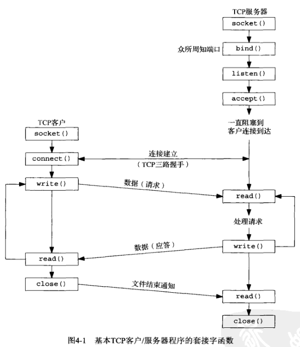
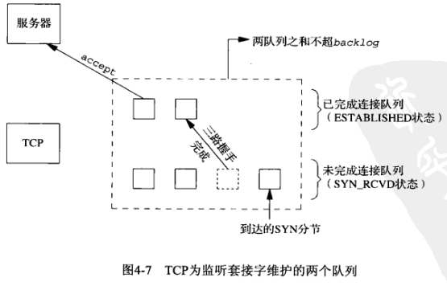
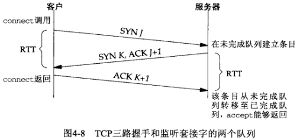
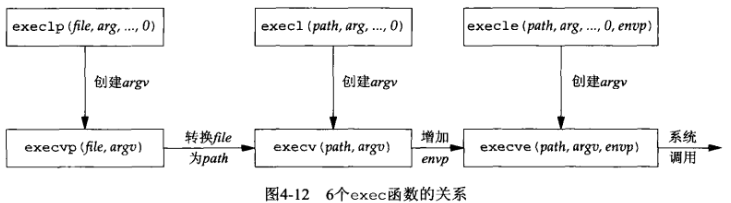
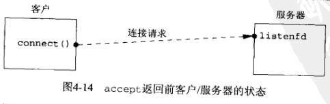
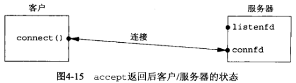
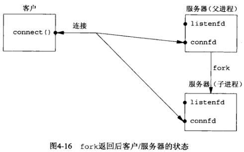
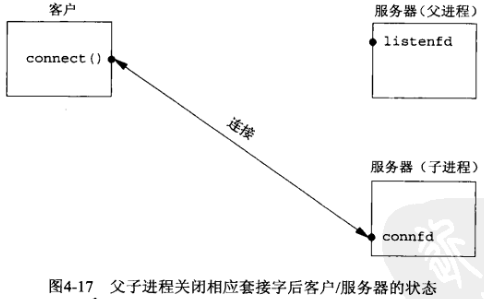
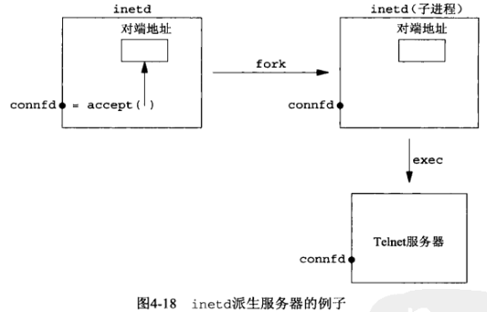

# 第四章 基本TCP套接字编程


## 概述

## socket函数



头文件`sys/socket.h`

`int socket(int family, int type, int protocol)` 创建套接字，返回套接字描述符

- family 协议族
   | family   | 说明       |
   | -------- | ---------- |
   | AF_INET  | IPv4协议   |
   | AF_INET6 | IPv6协议   |
   | AF_LOCAL | Unix域协议 |
   | AF_ROUTE | 路由套接字 |
   | AF_KEY   | 密钥套接字 |

- type 

    | type           | 说明           |
    | -------------- | -------------- |
    | SOCK_STREAM    | 字节流套接字   |
    | SOCK_DGRAM     | 数据报套接字   |
    | SOCK_SEQPACKET | 有序分组套接字 |
    | SOCK_RAW       | 原始套接字     |

- protocol

    | protocol     | 说明         |
    | ------------ | ------------ |
    | IPPROTO_TCP  | TCP传输协议  |
    | IPPROTO_UDP  | UDP传输协议  |
    | IPPROTO_SCTP | SCTP传输协议 |

 - return

    

socket函数中family和type参数的组合：

|                | AF_INET   | AF_INET6  | AF_LOCAL | AF_ROUTE | AF_KEY |
| -------------- | --------- | --------- | -------- | -------- | ------ |
| SOCK_STREAM    | TCP\|SCTP | TCP\|SCTP | 是       |          |        |
| SOCK_DGRAM     | UDP       | UDP       | 是       |          |        |
| SOCK_SEQPACKET | SCTP      | SCTP      | 是       |          |        |
| SOCK_RAW       | IPv4      | IPv6      |          | 是       | 是     |


## connect函数

头文件`sys/socket.h`

`int connect(int sockfd, const struct sockaddr *servaddr, socklen_t addrlen)` 建立与TCP服务器的连接

- sockfd: 套接字描述符
- servaddr: 指向套接字的地址
- addrlen: 套接字地址长度
- return

错误分析:

- ETIMEDOUT

    TCP客户没有收到SYN分节的响应

- ECONNREFUSED

    这是一种**硬错误（hard error）**。

    若对客户的SYN的响应是RST（表示复位），则表明该服务器主机在我们指定的端口上没有进程在等待与之连接。客户一接收到RST就马上返回ECONNREFUSED错误。RST是TCP在发生错误时发送的一种TCP分节。产生RST的三个条件:

    1. 目的地为某端口的SYN到达，然而该端口上没有正在监听的服务器
    2. TCP想取消一个已有连接
    3. TCP接收到一个根本不存在的连接上的分节

- distination unreachable

    这是一种**软错误（soft error）**。

    客户主机内核保存该消息，并按第一种情况中所述的时间间隔继续发送SYN。若在某个规定的时间（4.4BSD规定75s）后仍未收到响应，则把保存的消息（即ICMP错误）作为EHOSTUNREACH或ENETUNREACH错误返回给进程。以下两种情形也是有可能的：

    1. 按照本地系统的转发表，根本没有到达远程系统的路径
    2. connect调用根本不等待就返回

    

## bind函数

头文件`sys/socket.h`

`int bind(int sockfd, const struct sockaddr *myaddr, socklen_t addrlen)` 把一个本地协议地址赋予一个套接字

- sockfd: 套接字
- myaddr: 指向特定于协议的地址结构的指针
- addrlen: 该地址结构的长度
- return

给bind函数指定要绑定的IP地址和端口产生的结果:

| 进程指定-IP地址 | 进程指定-端口 | 结果                         |
| --------------- | ------------- | ---------------------------- |
| 通配地址        | 0             | 内核选择IP地址和端口         |
| 通配地址        | 非0           | 内核选择IP地址，进程指定端口 |
| 本地IP地址      | 0             | 进程指定IP地址，内核选择端口 |
| 本地IP地址      | 非0           | 进程指定IP地址和端口         |

错误分析：

- EADDRINUSE

    Address already in use，地址已使用


## listen函数

头文件`sys/socket.h`

**注意：此函数仅由TCP服务器调用**

`int listen(int sockfd, int backlog)` 把一个未连接的套接字转化为一个被动套接字，指示内核应接受指向该套接字的连接请求，同时设定排队的套接字队列的最大长度。

- sockfd: 套接字
- backlog: 待处理的套接字队列的最大长度
- return

内核为任何一个给定的监听套接字维护2个队列:

- 未完成队列(incomplete connection queue)
  每个这样的SYN分节对应其中一项：已由某个客户发出并到达服务器，而服务器正在等待完成相应的TCP三路握手过程，这些套接字处于SYN_RCVD状态。当一个客户SYN到达时，若队列已满，TCP就忽略该分节，即不发送RST（不同的实现有差异）。

- 已完成连接队列(completed connection queue)

  每个已完成TCP三路握手过程的客户对应其中一项。这些套接字处于ESTABLISHED状态。





不同backlog值时已排队连接的实际数目:

| backlog | MacOS 10.2.6 AIX 5.1 | Linux 2.4.7 | HP-UX 11.11 | FreeBSD 4.8<br>FreeBSD 5.1 | Solaris 2.9 |
| ------- | -------------------- | ----------- | ----------- | -------------------------- | ----------- |
| 0       | 1                    | 3           | 1           | 1                          | 1           |
| 1       | 2                    | 4           | 1           | 2                          | 2           |
| 2       | 4                    | 5           | 3           | 3                          | 4           |
| 3       | 5                    | 6           | 4           | 4                          | 5           |
| 4       | 7                    | 7           | 6           | 5                          | 6           |
| 5       | 8                    | 8           | 7           | 6                          | 8           |
| 6       | 10                   | 9           | 9           | 7                          | 10          |
| 7       | 11                   | 10          | 10          | 8                          | 11          |
| 8       | 13                   | 11          | 12          | 9                          | 13          |
| 9       | 14                   | 12          | 13          | 10                         | 14          |
| 10      | 16                   | 13          | 15          | 11                         | 16          |
| 11      | 17                   | 14          | 16          | 12                         | 17          |
| 12      | 19                   | 15          | 18          | 13                         | 19          |
| 13      | 20                   | 16          | 19          | 14                         | 20          |
| 14      | 22                   | 17          | 21          | 15                         | 22          |


## accept函数

头文件`sys/socket.h`

`int accept(int sockfd, struct sockaddr *cliaddr, socklen_t *addrlen)`  从已完成连接队列头返回下一个已完成连接，如果已完成连接队列为空，那么进程被投入睡眠。

- sockfd 监听套接字
- cliaddr 返回已连接的协议地址
- addrlen 返回已连接的协议地址长度
- return
    - 成功: 一个全新的描述符
    - 失败: 错误码

例子：值-结果参数

```c
#include "unp.h"
#include <time.h>

int
main(int argc, char **argv)
{
    int listenfd, connfd;
    socklen_t len;
    struct sockaddr_in servaddr, cliaddr;
    char buff[MAXLINE];
    time_t ticks;
    listenfd = Socket(AF_INET, SOCK_STREAM, 0);
    bzero(&servaddr, sizeof(servaddr));
    servaddr.sin_family = AF_INET;
    servaddr.sin_addr.s_addr = htonl(INADDR_ANY);
    servaddr.sin_port = htons(13);
    Bind(listenfd, (SA *)&servaddr, sizeof(servaddr));
    Listen(listenfd, LISTENQ);
    for ( ; ; ) {
        len = sizeof(cliaddr);
        connfd = Accept(listenfd, (SA *)&cliaddr, &len);
        printf("connection from %s, port %d\n",
              		 Inet_ntop(AF_INET, &cliaddr.sin_addr, buff, sizeof(buff)),
              		 ntohs(cliaddr.sin_port));
        ticks = time(NULL);
        snprintf(buff, sizeof(buff), "%.24s\r\n", ctime(&ticks));
        Write(connfd, buff, strlen(buff));
        Close(connfd);
    }
}
```


## fork和exec函数

头文件`unistd.h`

`pid_t fork(void)` 产生新进程；

- return：在子进程中为0，在父进程中为子进程ID，若出错则为-1

**调用一次，返回两次；在子进程返回0，在父进程返回新派生的进程ID。**

fork有2个典型用法：

- 一个进程创建一个自身的副本，这样每个副本都可以在另一个副本执行其他任务的同时处理各自的某个操作。这是网络服务器的典型用法。
- 一个进程想要执行另一个程序。既然创建新进程的唯一办法是调用fork，该进程于是首先调用fork创建一个自身的副本，然后其中一个副本（通常为子进程）调用exec把自身替换成新的程序。这是诸如shell之类程序的典型用法。

6个exec函数，成功则不返回，出错返回`-1`

`int execl(const char *pathname, const char *arg0, .../* (char *) 0 */)`

`int execv(const char *pathname, char *const *argv[])`

`int execle(const char *pathname, const char *arg0, ... /* (char *) 0, char *const envp[] */ )`

`int execve(const char *pathname, char *const argv[], char *const envp[])`

`int execlp(const char *filename, const char *arg0, ... /* (char *) 0 */ )`

`int execvp(const char *filename, char *const argv[])`




## 并发服务器

典型的并发服务器程序轮廓：

```c
pid_t 	pid;
int 		listenfd, connfd;
listenfd = Socket( ... );
Bind(listenfd, ... );
Listen(listenfd, LISTENQ);
for ( ; ; ) {
    connfd = Accept(listenfd, ... );
    if ( (pid = Fork()) == 0 ) {
        Close(listenfd);
        doit(connfd);
        Close(connfd);
        exit(0);
    }
    Close(connfd);
}
```










## close函数

头文件`unistd.h`

`int close(int sockfd)` 将套接字标记为关闭，使它无法再被read或write调用

- sockfd

- return
    - 成功 0
    - 出错 -1


## getsockname和getpeername函数

头文件`sys/socket.h`

`int getsockname(int sockfd, struct sockaddr *localaddr, socklen_t *addrlen)` 返回与套接字关联的本地协议地址

`int getpeername(int sockfd, struct sockaddr *peeraddr, socklen_t *addrlen)` 返回与套接字关联的外地协议地址（getpeername）

需要这两个函数的理由如下:

- 在一个没有调用`bind`的TCP客户上，`connect`成功返回后，`getsockname`用于返回由内核赋予该连接的本地IP地址和本地端口号。

- 在以端口号0调用bind（告知内核去选择本地端口号）后，`getsockname`用于返回由内核赋予的本地端口号。

- `getsockname`可用于获取某个套接字的地址族。

- 在一个以通配IP地址调用`bind`的TCP服务器上，与某个客户的连接一旦建立（`accept`成功返回），`getsockname`就可以用于返回由内核赋予该连接的本地IP地址。在这样的调用中，套接字描述符参数必须是以连接套接字的描述符，而不是监听套接字的描述符。

- 当一个服务器是由调用过`accept`的某个进程通过调用`exec`执行程序时，它能够获取客户身份的唯一途径便是调用`getpeername`。`inetd` `fork`并`exec`某个TCP服务器程序时就是如此情形，如下图所示：

    

例子：获取套接字的地址族

```c
#include "unp.h"
int
sockfd_to_family(int sockfd)
{
    struct sockaddr_storage ss;
    socklen_t len;
    len = sizeof(ss);
    if (getsockname(sockfd, (SA *) &ss, &len) < 0)
        return (-1);
    return (ss.ss_family);
}
```

