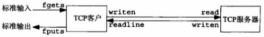
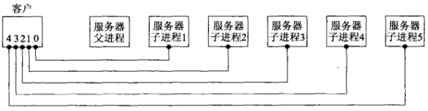
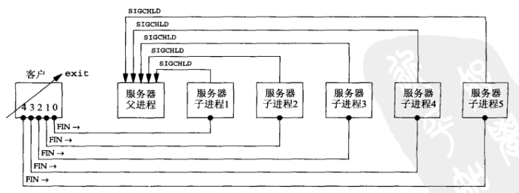
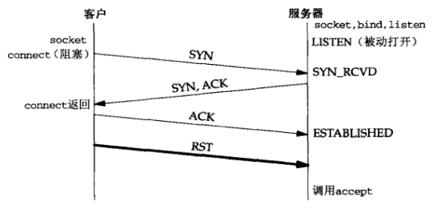
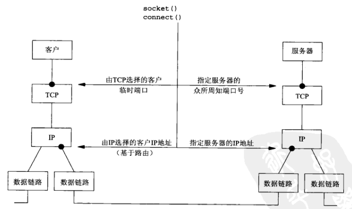
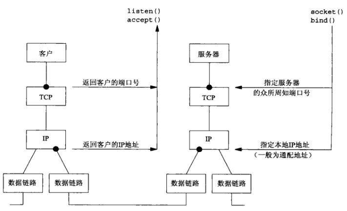

# 第五章 TCP客户/服务器程序示例

[TOC]


## 5.1 概述



*简单的回射客户/服务器*


## 5.2 TCP回射服务器程序:main函数

```c++
// TCP回射服务器程序
#include "unp.h"
int main(int argc, char **argv)
{
    int listenfd, connfd;
    pid_t childpid;
    socklen_t clilen;
    struct sockaddr_in cliaddr, servaddr;
    // 创建TCP套接字
    listenfd = Socket(AF_INET, SOCK_STREAM, 0);
    bzero(&servaddr, sizeof(servaddr));
    servaddr.sin_family = AF_INET;
    servaddr.sin_addr.s_addr = htonl(INADDR_ANY);
    servaddr.sin_port = htons(SERV_PORT);
    Bind(listenfd, (SA *)&servaddr, sizeof(servaddr));
    Listen(listenfd, LISTENQ);
    for (;;) {
        // 阻塞accept调用
        clilen = sizeof(cliaddr);
        connfd = Accept(listenfd, (SA *)&cliaddr, &clilen);
        // fork 子进程
        if ((childpid = Fork()) == 0) {
            Close(listenfd);
            str_echo(connfd);
            exit(0);
        }
        Close(connfd);
    }
}
```


## 5.3 TCP回射服务器程序:str_echo函数

```c++
// str_echo函数：在套接字上回射数据
#include "unp.h"
void
str_echo(int sockfd)
{
    ssize_t n;
    char    buf[MAXLINE];
again:
    while((n = read(sockfd, buf, MAXLINE)) > 0)
        Writen(sockfd, buf, n);
    if (n < 0 && errno == EINTR)
        goto again;
    else if (n < 0)
        err_sys("str_echo: read error");
}
```


## 5.4 TCP回射客户程序:main函数

```c++
// TCP回射客户程序
#include "unp.h"
int
main(int argc, char **argv)
{
    int sockfd;
    struct sockaddr_in servaddr;
    if (argc != 2)
        err_quit("usage: tcpcli <IPaddress>");
    sockfd = Socket(AF_INET, SOCK_STREAM, 0);
    bzero(&servaddr, sizeof(servaddr));
    servaddr.sin_family = AF_INET;
    servaddr.sin_port = htons(SERV_PORT);
    Inet_pton(AF_INET, argv[1], &servaddr.sin_addr);
    Connect(sockfd, (SA *)&servaddr, sizeof(servaddr));
    str_cli(stdin, sockfd);
    exit(0);
}
```


## 5.5 TCP回射客户程序:sr_cli函数

```c++
// str_cli函数：客户处理循环
#include "unp.h"
void str_cli(FILE *fp, int sockfd)
{
    char sendline[MAXLINE], recvline[MAXLINE];
    while (Fgets(sendline, MAXLINE, fp) != NULL) { // 读入一行
        Writen(sockfd, sendline, strlen(sendline));
        if (Readline(sockfd, recvline, MAXLINE) == 0)
            err_quit("str_cli: server terminated prematurely");
        Fputs(recvline, stdout);
    }
}
```


## 5.6 正常启动


## 5.7 正常终止


## 5.8 POSIX信号处理

`信号（signal）`就是告知某个进程发生了某个事件的通知，有时也称为`软件中断（software interrupt）`。信号通常是异步发生的，也就是说进程预先不知道信号的准确发生时刻。

```c++
// 调用POSIX sigaction函数的signal函数
#include "unp.h"
Sigfunc *signal(int signo, Sigfunc *func)
{
    struct sigaction act, oact;
    act.sa_handler = func;     // 设置回调函数
    sigemptyset(&act.sa_mask); // 设置处理函数的信号掩码
    // 设置SA_RESTART标志，由相应信号中的系统调用将由内核自动重启
    act.sa_flags = 0;
    if (signo == SIGALRM) {
#ifdef SA_INTERRUPT
    	act.sa_flags |= SA_INTERRUPT; /* SunOS 4.x */
#endif
    } else {
#ifdef SA_RESTART
    	act.sa_flags |= SA_RESTART; /* SVR4, 4.4BSD */
# endif
    }
    if (sigaction(signo, &act, &oact) < 0)
        return (SIG_ERR);
    return (oact.sa_handler);
}
```

POSIX信号处理：

- 一旦安装了信号处理函数，它便一直安装着。
- 在一个信号处理函数运行期间，正被递交的信号是阻塞的。而且，安装处理函数时传递给sigaction函数的sa_mask信号几种指定的任何额外信号也被阻塞。
- 如果一个信号在被阻塞期间产生了一次或多次，那么该信号被解阻塞之后通常只递交一次，也就是说Unix信号默认是不排队的。
- 利用sigprocmask函数选择性地阻塞或解阻塞一组信号是可能的。这使得我们可以做到在一段临界区代码执行期间，放置捕获某些信号，以此保护这段代码。


## 5.9 处理SIGCHILD信号

```c++
// 调用waitk的SIGCHLD信号处理函数
#include "unp.h"
void sig_chld(int signo)
{
    pid_t pid;
    int stat;
    pid = wait(&stat);
    printf("child %d terminated\n", pid);
    return;
}
```

适用于慢系统调用的基本规则：当阻塞于某个慢系统调用的一个进程捕获某个信号且相应信号处理函数返回时，该系统调用可能返回一个EINTR错误。有些内核自动重启某些被中断的系统调用。为了便于移植，当我们编写捕获信号的程序时，我们必须对慢系统调用返回EINTER有所准备。


## 5.10 wait和waitpid函数

```c++
#include <sys/wait.h>
pid_t wait(int *statloc);
```

- `statloc`用于返回子进程的终止状态（一个整数）

- `返回值`

  成功：进程ID

  失败：0或-1

*处理已终止的子进程，并返回其进程ID；如果没有已终止的子进程，但是有一个或多个子进程仍在执行，那么阻塞到现有子进程第一个终止为止。（阻塞）*

```c++
#include <sys/wait.h>
pid_t waitpid(pid_t pid, int *statloc, int options);
```

- `pid` 想要等待的进程ID（-1表示等待第一个终止的子进程）
- `statloc`用于返回子进程的终止状态（一个整数）
- `options` 附加选项
- `返回值`

  成功：进程ID

  失败：0或-1

处理已终止的子进程，并返回其进程ID。



*与同一个并发服务器建立了5个连接的客户*

```c++
// 与服务器建立了5个连接的TCP客户程序
#include "unp.h"
int main(int argc, char **argv)
{
    int i, sockfd[5];
    struct sockaddr_in servaddr;
    if (argc != 2)
        err_quit("usage: tcpcli <IPaddress>");
    for (i = 0; i < 5; i++) {
        sockfd[i] = Socket(AF_INET, SOCK_STREAM, 0);
        bzero(&servaddr, sizeof(servaddr));
        servaddr.sin_family = AF_INET;
        servaddr.sin_port = htons(SERV_PORT);
        Inet_pton(AF_INET, argv[1], &servaddr.sin_addr);
        Connect(sockfd[i], (SA *)&servaddr, sizeof(servaddr));
    }
    str_cli(stdin, sockfd[0]); /* do it all */
    exit(0);
}
```



*客户终止，关闭5个连接，终止5个子进程*

```c++
// 处理accept返回EINTR错误的TCP服务器程序最终（正确）版本
#include "unp.h"
int main(int argc, char **argv)
{
    int listenfd, connfd;
    pid_t childpid;
    socklen_t cl;ilen;
    struct sockaddr_in cliaddr, servaddr;
    void sig_chld(int);
    listenfd = Socket(AF_INET, SOCK_STREAM, 0);
    bzero(&servaddr, sizeof(servaddr));
    servaddr.sin_family = AF_INET;
    servaddr.sin_addr.s_addr = htonl(INADDR_ANY);
    servaddr.sin_port = htons(SERV_PORT);
    Bind(listenfd, (SA *)&servaddr, sizeof(servaddr));
    Listen(listenfd, LISTENQ);
    Signal(SIGCHLD, sig_chld);
    for (;;) {
        clilen = sizeof(cliaddr);
        if ((connfd = accept(listenfd, (SA *)&cliaddr, &clilen)) < 0) {
            if (errno == EINTR)
                continue;
            else
                err_sys("accept error");
        }
        if ((childpid = Fork()) == 0) {
            Close(listenfd);
            str_echo(connfd);
            exit(0);
        }
        Close(connfd);
    }
}
```


## 5.11 accept返回前连接中止



*ESTABLISHED状态的连接在调用accept之前收到RST*


## 5.12 服务器进程终止


## 5.13 SIGPIPE信号

当一个进程向某个已收到RST的套接字执行写操作时，内核向该进程发送一个SIGPIPE信号。该信号的默认行为是终止进程，因此进程必须捕获它以免不情愿地被终止。不论该进程是捕获了该信号并从其信号处理函数返回，还是简单地忽略该信号，写操作都将返回EPIPE错误。

```c++
// 调用writen两次的str_cli函数
#include "unp.h"
void str_cli(FILE *fp, int sockfd)
{
    char sendline[MAXLINE], recvline[MAXLINE];
    while (Fgets(sendline, MAXLINE, fp) != NULL) {
        Writen(sockfd, sendline, 1);
        sleep(1);
        Writen(sockfd, sendline + 1, strlen(sendline) - 1);
        if (Readline(sockfd, recvline, MAXLINE) == 0)
            err_quit("str_cli: server terminated prematurely");
        Fputs(recvline, stdout);
    }
}
```


## 5.14 服务器主机崩溃


## 5.15 服务器主机崩溃后重启


## 5.16 服务器主机关机

Unix系统关机时，init进程通常先给所有进程发送SIGTERM信号（可以被捕获），等待一段固定的时间（5~20s），然后给所有仍在运行的进程发送SIGKILL信号（不能被捕获），终止所有进程。


## 5.17 TCP程序例子小结



*从客户的角度总结TCP客户/服务器*



*从服务器的角度总结TCP客户/服务器*


## 5.18 数据格式

### 5.18.1 例子:在客户与服务器之间传递文本串

```c++
// 对两个数求和的str_echo函数
#include "unp.h"
void str_echo(int sockfd)
{
    long arg1, arg2;
    ssize_t n;
    char line[MAXLINE];
    for (;;) {
        if ((n = Readline(sockfd, line, MAXLINE)) == 0)
            return;
        if (sscanf(line, "%1d%1d", &arg1, &arg2) == 2)
            snprintf(line, sizeof(line), "%1d\n", arg1 + arg2);
        else
            snprintf(line, sizeof(line), "input error\n");
        n = strlen(line);
        Writen(sockfd, line, n);
    }
}
```

 ### 5.18.2 例子:在客户与服务器之间传递二进制结构

```c++
// 头文件sum.h
struct args {
    long arg1;
    long arg2;
};

struct result {
    long sum;
};
```

```c++
// 发送两个二进制整数给服务器的str_cli函数
#include "unp.h"
#include "sum.h"
void str_cli(FILE *fp, int sockfd)
{
    char sendline[MAXLINE];
    struct args args;
    struct result result;
    while (Fgets(sendline, MAXLINE, fp) != NULL) {
        if (sscanf(sendline, "%ld%ld", &args.arg1, &args.arg2) != 2) {
            printf("invalid input: %s", sendline);
            continue;
        }
        Writen(sockfd, &args, sizeof(args));
        if (Readn(sockfd, &args, sizeof(args)));
        if (Readn(sockfd, &result, sizeof(result)) == 0)
            err_quit("str_cli: server terminated prematurely");
        printf("%ld\n", result.sum);
    }
}
```

```c++
// 对两个二进制整数求和的str_echo函数
#include "unp.h"
#include "sum.h"
void str_echo(int sockfd)
{
    ssize_t n;
    struct args args;
    struct result result;
    for (;;) {
        if ((n = Readn(sockfd, &args, sizeof(args))) == 0)
            return;
        result.sum = args.arg1 + args.arg2;
        Writen(sockfd, &result, sizeof(result));
    }
}
```


## 5.19 小结

