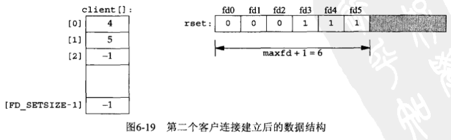

# 第六章 I/O复用：select和pool函数

- [概述](#概述)
- [`I/O模型`](#`I/O模型`)
    - [同步`I/O`和异步`I/O`对比](#同步`I/O`和异步`I/O`对比)
- [select函数](#select函数)
    - [描述符就绪条件](#描述符就绪条件)
    - [select的最大描述符数](# select的最大描述符数)
- [`str_cli函数（修订版）`](#`str_cli函数（修订版）`)
- [shutdown函数](#shutdown函数)
- [`str_cli函数（再修订版）`](#`str_cli函数（再修订版）`)
- [`TCP回射服务器程序（修订版）`](#`TCP回射服务器程序（修订版）`)
- [pselect函数](#pselect函数)
- [poll函数](#poll函数)
- [`TCP回射服务器程序（再修订版）`](#`TCP回射服务器程序（再修订版）`)


## 概述

I/O复用典型使用在下列网络应用场合：

- 当客户处理多个描述符（通常是互交式输入和网络套接字）时，必须使用I/O复用
- 一个客户同时处理多个套接字是可能的，不过比较少见
- 如果一个服务器即要处理TCP，又要处理UDP，一般就要使用I/O复用
- 如果一个服务器要处理多个服务或者多个协议，一般就要使用I/O复用


## `I/O模型`

Unix下可用的5种I/O模型：

- 阻塞式I/O

    

- 非阻塞式I/O

    

- I/O复用（select和poll）

    

- 信号驱动式I/O（SIGIO）

    

- 异步I/O（POSIX的aio_系列函数）

    

前4种模型的主要区别在于第一阶段，因为他们的第二阶段是一样的：在数据从内核复制到调用者的缓冲区期间，进程阻塞于recvfrom调用。相反，异步`I/O`模型在这两个阶段都要处理，从而不同于其他4种模型。

### 同步`I/O`和异步`I/O`对比

- 同步`I/O`操作（synchronous I/O opetation）导致请求进程阻塞，直到`I/O`操作完成。
- 异步`I/O`操作（asynchronous I/O opetation）不导致请求进程阻塞。


## select函数

头文件`sys/select.h`

`int select(int maxfdp1, fd_set *readset, fd_set *writeset, fd_set *exceptset, const struct timeval *timeout)`

- maxfdp1：指定待测试的描述符最大值+1
- readset：让内核测试读描述符
- writeset：让内核测试写描述符
- exceptset：让内核测试异常描述符
- timeout：超时时间（精确度10ms左右）
    - 空：永远等待下去
    - 非空：等待一段固定时间
    - 0：根本不等待
- return
    - 描述符数量：有就绪描述符
    - 0：超时
    - -1：出错

允许进程指示内核等待多个事件中的任何一个发生，并只在有一个或多个时间发生或经历一段指定的时间后才唤醒它。

目前支持的异常条件只有两个：

- 某个套接字的带外数据的到达
- 某个已置为分组模式的伪终端存在可从其主端读取的控制状态信息

设置fd的常用函数：

```c
void FD_ZERO(fd_set *fdset);
void FD_SET(int fd, fd_set *fdset);
void FD_CLR(int fd, fd_set *fdset);
int	   FD_ISSET(int fd, fd_set *fdset);
```

### 描述符就绪条件

套接字准备好读的条件（满足其一即可）：

- 接收缓冲区中的数据字节数大于等于套接字接收缓冲区低水位标记的当前大小
- 连接的读半部关闭（也就是接收了FIN的TCP连接）。对这样的套接字的读操作将不阻塞并返回0（也就是返回EOF）
- 是一个监听套接字且已完成的连接数不为0
- 其上有一个套接字错误待处理

套接字准备好写的条件（满足其一即可）：

- 发送缓冲区中的可用空间字节数大于等于发送缓冲区低水位标记的当前大小，并且或者该套接字已连接，或者该套接字不需要连接（如UDP套接字）
- 该连接的写半部关闭
- 使用非阻塞connect的套接字已建立连接，或者connect已经以失败告终
- 其上有一个套接字错误待处理

如果一个套接字春在带外数据或者仍处于带外标记，那么它有异常条件待处理。

**注意：当某个套接字上发生错误时，它将由select标记为即可读又可写。**

任何UDP套接字只要其发送低水位标记小于等于发送缓冲区大小（默认应该总是这种关系）就总是可写的，这是因为UDP套接字不需要连接。

select返回某个套接字就绪的条件：

| 条件                                                       | 可读？      | 可写？ | 异常？ |
| ---------------------------------------------------------- | ----------- | ------ | ------ |
| 有数据可读<br>关闭连接的读一半<br>给监听套接口准备好新连接 | Y<br>Y<br>Y |        |        |
| 有可用于写的空间<br>关闭连接的写一半                       |             | Y<br>Y |        |
| 待处理错误                                                 | Y           | Y      |        |
| TCP带外数据                                                |             |        | Y      |

### select的最大描述符数

select的最大描述符数定义在`<sys/types.h>`或`<sys/select.h>`中:

```c
#ifndef FD_SETSIZE
#define FD_SETSIZE 256
#endif
```


## str_cli函数（修订版）


客户的套接字上的三个条件处理如下：

1. 如果对端TCP发送数据，那么该套接字变为可读，并且read返回一个大于0的值（即读入数据的字节数）。
2. 如果对端TCP发送一个FIN（对端进程终止），那么该套接字变为可读，并且read返回0（EOF）。
3. 如果对端TCP发送一个RST（对端主机崩溃并重新启动），那么该套接字变为可读，并且read返回-1，而errno中含有确切的错误码。

使用select的str_cli函数的实现:

```c
#include "unp.h"
void
str_cli(FILE *fp, int sockfd)
{
    int 		maxfdp1;
    fd_set 	rset;
    char	  sendline[MAXLINE], recvline[MAXLINE];
    
    FD_ZERO(&rset);
    for ( ; ; ) {
        FD_SET(fileno(fp), &rset);
        FD_SET(sockfd, &rset);
        maxfdp1 = max(fileno(fp), sockfd) + 1;
        Select(maxfdp1, &rset, NULL, NULL, NULL);
        if (FD_ISSET(sockfd, &rset)) { /* socket is readable */
            if (Readline(sockfd, recvline, MAXLINE) == 0)
                err_quit("str_cli: server terminated prematurely");
            Fputs(recvline, stdout);
        }
        if (FD_ISSET(fileno(fp), &rset)) {	/* input is readable */
            if (Fgets(sendline, MAXLINE, fp) == NULL)
                return;
            Writen(sockfd, sendline, strlen(sendline));
        }
    }
}
```


## shutdown函数

头文件`sys/socket.h`

`int shutdown(int sockfd, int howto)`

- sockfd
- howto
    - SHUT_RD：关闭连接的读，丢弃接收缓冲区的数据
    - SHUT_WR：关闭连接的写，丢弃发送缓冲区的数据
    - SHUT_RDWR：关闭连接的读和写，类似于调用1次SHUT_RD，又调用1次SHUT——WR

使用close函数来终止网络连接时有两个限制：

1. close把描述符的引用计数减1，仅在该计数变为0时才关闭套接字
2. close会同时终止读和写两个方向的数据传送

可以使用shutdown来避免上述限制，调用shutdown关闭一半TCP连接：


## `str_cli函数（再修订版）`

```c
#include "unp.h"
void
str_cli(FILE *fp, int sockfd)
{
    int maxfdp1, stdineof;
    fd_set rset;
    char buf[MAXLINE];
    int n;
    stdineof = 0;
    FD_ZERO(&rset);
    for ( ; ; ) {
        if (stdineof == 0)
            FD_SET(fileno(fp), &rset);
        FD_SET(sockfd, &rset);
        maxfdp1 = max(fileno(fp), sockfd) + 1;
        Select(maxfdp1, &rset, NULL, NULL, NULL);
        if (FD_ISSET(sockfd, &rset)) {	/* socket is readable */
            if ( (n = Read(sockfd, buf, MAXLINE)) == 0 ) {
                if (stdineof == 1)
                    return;
                else
                    err_quit("str_cli: server terminated prematurely");
            }
            Write(fileno(stdout), buf, n);
        }
        if (FD_ISSET(fileno(fp), &rset)) {	/* input is readable */
            if ( (n = Read(fileno(fp), buf, MAXLINE)) == 0 ) {
                stdineof = 1;
                Shutdown(sockfd, SHUT_WR);	/* send FIN */
                FD_CLR(fileno(fp), &rset);
                continue;
            }
            Writen(sockfd, buf, n);
        }
    }
}
```


## `TCP回射服务器程序（修订版）`





使用单进程和select的TCP服务器程序：

```c
#include "unp.h"
int
main(int argc, char **argv)
{
    // 初始化
    int i, maxi, maxfd, listenfd, connfd, sockfd;
    int nready, client[FD_SETSIZE];
    ssize_t n;
    fd_set rset, allset;
    char buf[MAXLINE];
    socklen_t clilen;
    struct sockaddr_in cliaddr, servaddr;
    listenfd = Socket(AF_INET, OSCK_STREAM, 0);
    bzero(&servaddr, sizeof(servaddr));
    servaddr.sin_family = AF_INET;
    servaddr.sin_addr.s_addr = htonl(INADDR_ANY);
    servaddr.sin_port = htons(SERV_PORT);
    Bind(listenfd, (SA *)&servaddr, sizeof(servaddr));
    Listen(listenfd, LISTENQ);
    maxfd = listenfd;
    maxi = -1;
    for (i = 0; i < FD_SETSIZE; i++)
        client[i] = -1;
    FD_ZERO(&allset);
    FD_SET(listenfd, &allset);
    
    // 循环
    for ( ; ; ) {
        rset = allset;
        nready = Select(maxfd+1, &rset, NULL, NULL, NULL);
        if (FD_ISSET(listenfd, &rset)) {
            clilen = sizeof(cliaddr);
            connfd = Accept(listenfd, (SA *)&cliaddr, &clilen);
            for (i = 0; i < FD_SETSIZE; i++)
                if (cllient[i] < 0) {
                    client[i] = connfd;
                    break;
                }
            if (i == FD_SETSIZE)
                err_quit("too many clients");
            FD_SET(connfd, &allset);
            if (connfd > maxfd)
                maxfd = connfd;
            if (i > maxi)
                maxi = i;
            if (--nready <= 0)
                continue;
        }
        for (i = 0; i <= maxi; i++) {
            if ( (sockfd = client[i]) < 0 )
                continue;
            if (FD_ISSET(sockfd, &rset)) {
                if ( (n = Read(sockfd, buf, MAXLINE)) == 0 ) {
                    Close(sockfd);
                    FD_CLR(sockfd, &allset);
                    client[i] = -1;
                } else 
                    Writen(sockfd, buf, n);
                if (--nready <= 0)
                    break;
            }
        }
    }
}
```


## pselect函数

头文件`sys/select.h`

`int pselect(int maxfdp1, fd_set *readset, fd_set *writeset, fd_set *exceptset, const struct timespec *timeout, const sigset_t *sigmask)`

- maxfdp1

- readset

- writeset

- exceptset

- timeout：超时

    pselect使用timespec结构，而不使用tiemval。

    ```c
    struct timespec {
        time_t 	 tv_sec;
        long		tv_nsec;
    }
    ```

- sigmask：一个指向信号掩码的指针，用于select阻塞期间时处理信号。

- return

    - -1：出错
    - 0：超时
    - `>0`：有描述符就绪


## poll函数

头文件`pool.h`

`int poll(struct pollfd *fdarray, unsigned long nfds, int timeout)`

- fdarray：指向一个poolfd数组

    ```
    struct pollfd {
    	int 		fd;
    	short 	events;		// 要测试的描述符
    	short 	revents;	// 返回的描述符的状态
    }
    ```

    poll函数的输入events和返回revents：

    | 常值                                          | 作为events的输入吗？ | 作为revents的结果吗？ | 说明                                                         |
    | --------------------------------------------- | -------------------- | --------------------- | ------------------------------------------------------------ |
    | POLLIN<br>POLLRDNORM<br>POLLRDBAND<br>POLLPRI | Y<br>Y<br>Y<br>Y     | Y<br>Y<br>Y<br>Y      | 普通或优先级带数据可读<br>普通数据可读<br>优先级带数据可读<br>高优先级数据可读 |
    | POLLOUT<br>POLLWRNORM<br>POLLWRBAND           | Y<br>Y<br>Y          | Y<br>Y<br>Y           | 普通数据可写<br>普通数据可写<br>优先级带数据可写             |
    | POLLERR<br>POLLHUP<br>POLLNVAL                |                      | Y<br>Y<br>Y           | 发生错误<br>发生挂起<br>描述符不是一个打开的文件             |

    就TCP和UDP套接字而言，以下条件引起poll返回特定的revent:

    - 所有正规TCP数据和所有UDP数据都被认为是普通数据
    - TCP的带外数据被认为是优先级带数据
    - 当TCP连接的读半部关闭时，也被认为是普通数据，随后的读操作将返回0
    - TCP连接存在错误即可认为是普通数据，也可认为是错误（POLLERR）。无论哪种情况，随后的读操作将返回-1，并把errno设置成合适的值。这可用于处理诸如接收到RST或发生超时等条件。
    - 在监听套接字上有新的连接可用即可认为是普通数据，也可认为是优先级数据。大多数实现视之为普通数据。
    - 非阻塞式connect的完成被认为是使相应套接字可写。

- nfds

- timeout

    - INFTIM：永远等待（POSIX规范要求在头文件`<poll.h>`中定义INFTIM，不过许多系统仍然把它定义在头文件`<sys/stropts.h>`中）
    - 0：立即返回，不阻塞进程
    - `>0`：等待指定数目的毫秒数

- return

    - -1：发生错误
    - 0：定时器到时之前没有任何描述符就绪
    - 就绪描述符个数：成功

## `TCP回射服务器程序（再修订版）`

```c
#include "unp.h"
#include <limits.h>
int
main(int argc, char **argv)
{
    int i, maxi, listenfd, connfd, sockfd;
    int nready;
    ssize_t n;
    char buf[MAXLINE];
    socklen_t clilen;
    struct pollfd client[OPEN_MAX];
    struct sockaddr_in cliaddr, servaddr;
    listenfd = Socket(AF_INET, SOCK_STREAM, 0);
    bzero(&servaddr, sizeof(servaddr));
    servaddr.sin_family = AF_INET;
    servaddr.sin_addr.s_addr = htonl(INADDR_ANY);
    servaddr.sin_port = htons(SERV_PORT);
    Bind(listenfd, (SA *)&servaddr, sizeof(servaddr));
    Listen(listenfd, LISTENQ);
    client[0].fd = listenfd;
    client[0].events = POLLRDNORM;
    for (i = 1; i < OPEN_MAX; i++)
        client[i].fd = -1;
    maxi = 0;
    
    // 循环
    for ( ; ; ) {
        nready = Poll(client, maxi + 1, INFTIM);
        if (client[0].revents & POLLRDNORM) {
            clilen = sizeof(cliaddr);
            connfd = Accept(listenfd, (SA *)&cliaddr, &clilen);
            for (i = 1; i < OPEN_MAX; i++)
                if (client[i].fd < 0) {
                    client[i].fd = connfd;
                    break;
                }
            if (i == OPEN_MAX)
                err_quit("too many clients");
            client[i].events = POLLRDNORM;
            if (i > maxi)
                maxi = i;
            if (--nready <= 0)
                continue;
        }
        for (i = 1; i <= maxi;  i++) {
            if ( (sockfd = client[i].fd) < 0 )
                continue;
            if (client[i].revents & (POLLRDNORM | POLLERR)) {
                if ( (n = read(sockfd, buf, MAXLINE)) < 0 ) {
                    if (errno == ECONNRESET) {
                        Close(sockfd);
                        client[i].fd = -1;
                    } else
                        err_sys("read error");
                } else if (n == 0) {
                    Close(sockfd);
                    client[i].fd = -1;
                } else
                    Writen(sockfd, buf, n);
                if (--nready <= 0)
                    break;
            }
        }
    }
}
```

