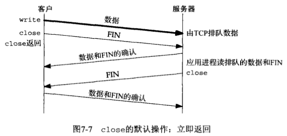
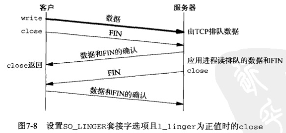
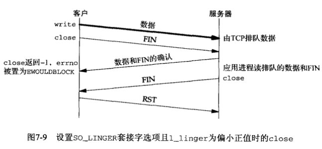
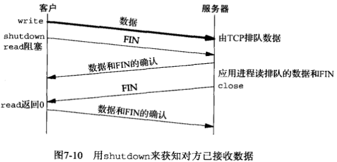
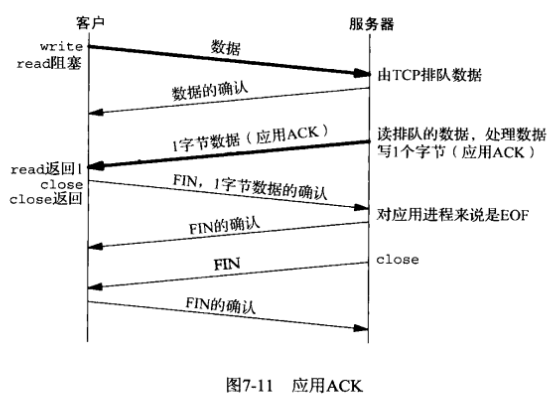

# 第七章 套接字选项


## 概述


## getsockopt和setsockopt函数

头文件`sys/socket.h`

`int getsockopt(int sockfd, int level, int optname, void *optval, socklen_t *optlen)`

- sockfd：套接字
- level：级别，指定系统中解释选项的代码或为通用套接字代码，或为某个特定于协议的代码
- optname：opt名字
- optval：指向一个变量
- optlen：指定optval的大小
- return

获得套接字选项

---

`int setsockopt(int sockfd, int level, int optname, const void *optval, socklen_t optlen)`

- sockfd
- level
- optname：opt名字
- optval：指向一个opt变量
- optlen

设置套接字选项

---

套接字层和IP层的套接字选项汇总：

| level（级别）            | optname（选项名）                                            | get                                                          | set                                                          | 说明                                                         | 标志                                                         | 数据类型                                                     |
| ------------------------ | ------------------------------------------------------------ | :----------------------------------------------------------- | ------------------------------------------------------------ | ------------------------------------------------------------ | ------------------------------------------------------------ | :----------------------------------------------------------- |
| SOL_SOCKET               | SO_BROADCAST<br>SO_DEBUG<br>SO_DONTROUTE<br>SO_ERROR<br>SO_KEEPALIVE<br>SO_LINGER<br>SO_OOBINLINE<br>SO_RCVBUF<br>SO_SNDBUF<br>SO_RCVLOWAT<br>SO_SNDLOWAT<br>SO_RCVTIMEO<br>SO_SNDTIMEO<br>SO_REUSEADDR<br>SO_REUSEPORT<br>SO_TYPE<br>SO_USELOOPBACK | Y<br>Y<br>Y<br>Y<br>Y<br>Y<br>Y<br>Y<br>Y<br>Y<br>Y<br>Y<br>Y<br>Y<br>Y<br>Y<br>Y | Y<br>Y<br>Y<br><br>Y<br>Y<br>Y<br>Y<br>Y<br>Y<br>Y<br>Y<br>Y<br>Y<br>Y<br><br>Y | - 允许发送广播数据报<br>- 开启调试跟踪<br>- 绕过外出路由表查询<br>- 获取待处理错误并清除<br>- 周期性测试连接是否仍存活<br>- 若有数据待发送则延迟关闭<br>- 让接收到的带外数据继续在线留存<br>- 接收缓冲区大小<br>- 发送缓冲区大小<br>- 接收缓冲区低水位标记<br>- 发送缓冲区低水位标记<br>- 接收超时<br>- 发送超时<br>- 允许重用本地地址<br>- 允许重用本地端口<br>- 取得套接字类型<br>- 路由套接字取得所发送数据的副本 | Y<br>Y<br>Y<br><br>Y<br><br>Y<br><br><br><br><br><br>Y<br>Y<br><br>Y<br>Y | int<br>int<br>int<br>int<br>int<br>linger<br>int<br>int<br>int<br>int<br>int<br>timeval<br>timeval<br>int<br>int<br>int<br>int |
| IPPROTO_IP               | IP_HDRINCL<br>IP_OPTIONS<br>IP_RECVDSTANDDR<br>IP_RECVIF<br>IP_TOS<br>IP_TTL<br><br>IP_MULTICAST_IF<br>IP_MULTICAST_TTL<br>IP_MULTICAST_LOOP<br>IP_ADD_MEMBERSHIP<br>IP_DROP_MEMBERSHIP<br>IP_BLOCK_SOURCE<br>IP_UNBLOCK_SOURCE<br>IP_ADD_SOURCE_MEMBERSHIP<br>IP_DROP_SOURCE_MEMBERSHIP | Y<br>Y<br>Y<br>Y<br>Y<br>Y<br><br>Y<br>Y<br>Y<br/><br/><br/><br/><br/><br/><br/> | Y<br>Y<br>Y<br>Y<br>Y<br>Y<br><br>Y<br>Y<br>Y<br>Y<br>Y<br>Y<br>Y<br>Y<br>Y | - 随数据包含的IP首部<br>- IP首部选项<br>- 返回目的IP地址<br>- 返回接收接口索引<br>- 服务类型和优先权<br>- 存活时间<br><br>- 指定外出接口<br>- 指定外出TTL<br>- 指定是否环回<br>- 加入多播组<br>- 离开多播组<br>- 阻塞多播组<br>- 开通多播组<br>- 加入源特定多播组<br>- 离开源特定多播组 | Y<br><br>Y<br>Y<br><br><br><br><br><br><br><br><br><br><br><br><br> | int<br>(见正文)<br>int<br>int<br>int<br>int<br><br>in_addr{}<br>u_char<br>u_char<br>ip_mreq{}<br>ip_mreq{}<br>ip_mreq_source{}<br>ip_mreq_source{}<br>ip_mreq_source{}<br>ip_mreq_source{} |
| IPPROTO_ICMPV6           | ICMP6_FILTER                                                 | Y                                                            | Y                                                            | - 指定待传递的ICMPv6消息类型                                 |                                                              | ivmp6_filter{}                                               |
| IPPROTO_IPV6             | IPV6_CHECKSUM<br>IPV6_DONTFRAG<br>IPV6_NEXTHOP<br>IPV6_PATHMTU<br>IPV6_RECVDSTOPTS<br>IPV6_RECVHOPLIMIT<br>IPV6_RECVHOPOPTS<br>IPV6_RECVPATHMTU<br>IPV6_RECVPKTINFO<br>IPV6_RECVRTHDR<br>IPV6_RECVTCLASS<br>IPV6_UNICAST_HOPS<br>IPV6_USE_MIN_MTU<br>IPV6_V60NLY<br>IPV6_XXX<br><br>IPV6_MULTICAST_IP<br>IPV6_MULTICAST_HOPS<br>IPV6_MULTICAST_LOOP<br>IPV6_JOIN_GROUP<br>IPV6_LEAVE_GROUP | Y<br>Y<br>Y<br>Y<br>Y<br>Y<br>Y<br>Y<br>Y<br>Y<br>Y<br>Y<br>Y<br>Y<br>Y<br><br>Y<br>Y<br>Y<br><br><br> | Y<br>Y<br>Y<br><br>Y<br>Y<br>Y<br>Y<br>Y<br>Y<br>Y<br>Y<br>Y<br>Y<br>Y<br><br>Y<br>Y<br>Y<br>Y<br>Y | - 用于原始套接字的校验和字段偏移<br>- 丢弃大的分组而非将其分片<br>- 指定下一跳地址<br>- 获取当前路径MTU<br>接收目的地址选项<br>- 接收单播跳限<br>- 接收步跳选项<br>- 接收路径MTU<br>- 接收分组信息<br>- 接收源路径<br>- 接收流通类型<br>- 默认单播跳限<br>- 使用最小MTU<br>- 禁止v4兼容<br>- 粘附性辅助数据<br><br>- 指定外出接口<br>- 指定外出跳限<br>- 指定是否环回<br>- 加入多播组<br>- 离开多播组 | <br>Y<br><br><br>Y<br>Y<br>Y<br>Y<br>Y<br>Y<br>Y<br>Y<br>Y<br>Y<br>Y<br>Y<br><br><br>Y<br><br><br> | int<br>int<br>sockaddr_in6{}<br>ip6_mtuinfo{}<br>int<br>int<br>int<br>int<br>int<br>int<br>int<br>int<br>int<br>int<br>(见正文)<br><br>u_int<br>int<br>u_int<br>ipv6_mreq{}<br>ipv6_mreq{} |
| IPPROTO_IP或IPPROTO_IPV6 | MCAST_JOIN_GROUP<br>MCAST_LEAVE_GROUP<br>MCAST_BLOCK_SOURCE<br>MCAST_UNBLOCK_SOURCE<br>MCAST_JOIN_SOURCE_GROUP<br>MCAST_LEAVE_SOURCE_GROUP |                                                              | Y<br>Y<br>Y<br>Y<br>Y<br>Y                                   | - 加入多播组<br>- 离开多播组<br>- 阻塞多播源<br>- 开通多播源<br>- 加入源特定多播组<br>- 离开源特定多播组 |                                                              | group_req{}<br>group_source_req{}<br>group_source_req{}<br>group_source_req{}<br>group_source_req{}<br>group_source_req{} |

传输层的套接字选项汇总：

| level（级别） | optname（选项名）                                            | get                                                          | set                                                          | 说明                                                         | 标志                                                         | 数据类型                                                     |
| ------------- | ------------------------------------------------------------ | ------------------------------------------------------------ | ------------------------------------------------------------ | ------------------------------------------------------------ | ------------------------------------------------------------ | ------------------------------------------------------------ |
| IPPROTO_TCP   | TCP_MAXSEG<br>TCP_NODELAY                                    | Y<br>Y                                                       | Y<br>Y                                                       | - TCP最大分节大小<br>- 禁止Nagle算法                         | <br>Y                                                        | int<br>int                                                   |
| IPPROTO_SCTP  | SCTP_ADAPTION_LAYER<br>SCTP_ASSOCINFO<br>SCTP_AUTOCLOSE<br>SCTP_DEFAULT_SEND_PARAM<br>SCTP_DISABLE_FRAGMENTS<br>SCTP_EVENTS<br>SCTP_GET_PEER_ADDR_INFO<br>SCTP_I_WANT_MAPPED_V4_ADDR<br>SCTP_INITMSG<br>SCTP_MAXBURST<br>SCTP_MAXSEG<br>SCTP_NODELAY<br>SCTP_PEER_ADDR_PARAMS<br>SCTP_PRIMARY_ADDR<br>SCTP_RTOINFO<br>SCTP_SET_PEER_PRIMARY_ADDR<br>SCTP_STATUS | Y<br>t<br>Y<br>Y<br>Y<br>Y<br>t<br>Y<br>Y<br>Y<br>Y<br>Y<br>t<br>t<br>t<br><br>t | Y<br>Y<br>Y<br>Y<br>Y<br>Y<br><br>Y<br>Y<br>Y<br>Y<br>Y<br>Y<br>Y<br>Y<br>Y<br><br/> | - 适配层指示<br>- 检查并设置关联信息<br>- 自动关闭操作<br>- 默认发送参数<br>- SCTP分片<br>- 感兴趣事件的通知<br>- 获取对端地址状态<br>- 映射对端地址状态<br>- 映射的v4地址<br>- 默认的INIT参数<br>- 最大猝发大小<br>- 最大分片大小<br>- 禁止Nagle算法<br>- 对端地址参数<br>- 主目的地址<br>- RTO信息<br>- 对端的主目的地址<br>- 获取关联状态 | <br><br><br><br>Y<br><br><br>Y<br><br><br><br>Y<br><br><br><br><br><br/> | sctp_setadaption{}<br>sctp_assocparams{}<br>int<br>sctp_sndrcvinfo{}<br>int<br>sctp_event_subscribe{}<br>sctp_paddrinfo{}<br>int<br>sctp_initmsg{}<br>int<br>int<br>int<br>sctp_paddrparams{}<br>sctp_setprim{}<br>sctp_rtoinfo{}<br>sctp_setpeerprim{}<br>sctp_status{} |


## 检查选项是否受支持并获取默认值

```c
#include "unp.h"
#include <netinet/tcp.h>

union val {
    int 						   i_val;
    long 						l_val;
    struct linger 		 linger_val;
    struct timeval    timeval_val;
} val;
static char *sock_str_flag(union val *, int);
static char *sock_str_int(union val *, int);
static char *sock_str_linger(union val *, int);
static char *sock_str_timeval(union val *, int);
struct sock_opts {
    const char *opt_str;
    int					opt_level;
    int 				opt_name;
    char			  *(*opt_val_str)(union val *, int);
} sock_opts[] = {
    { "SO_BROADCAST", SOL_SOCKET, SO_BROADCAST, sock_str_flag },
    { "SO_DEBUG", SOL_SOCKET, SO_DEBUG, sock_str_flag },
    { "SO_DONTROUTE", SOL_SOCKET, SO_DONTROUTE, sock_str_flag },
    { "SO_ERROR", SOL_SOCKET, SO_ERROR, sock_str_int },
    { "SO_KEEPALIVE", SOL_SOCKET, SO_KEEPAVLIE, sock_str_flag },
    { "SO_LINGER", SOL_SOCKET, SO_LINGER, sock_str_linger },
    { "SO_OOBINLINE", SOL_SOCKET, SO_OOBINLINE, sock_str_flag },
    { "SO_RCVBUF", SOL_SOCKET, SO_RCVBUF, sock_str_int },
    { "SO_SNDBUF", SOL_SOCKET, SO_SNDBUF, sock_str_int },
    { "SO_RCVLOWAT", SOL_SOCKET, SO_RCVLOWAT, sock_str_int },
    { "SO_SNDLOWAT", SOL_SOCKET, SO_SNDLOWAT, sock_str_int },
    { "SO_RCVTIMEO", SOL_SOCKET, SO_RCVTIMEO, sock_str_timeval },
    { "SO_SNDTIMEO", SOL_SOCKET, SO_SNDTIMEO, sock_str_timeval },
#ifdef SO_REUSEPORT
    { "SO_REUSEPORT", SOL_SOCKET, SO_REUSEPORT, sock_str_flag },
#else
    { "SO_RESUEPORT", 0, 0, NULL },
#endif
    { "SO_TYPE", SOL_SOCKET, SO_TYPE, sock_str_int },
    { "SO_USELOOPBACK", SOL_SOCKET, SO_USELOOPBACK, sock_str_flag },
    { "IP_TOS", IPPROTO_IP, IP_TOS, sock_str_int },
    { "IP_TTL", IPPROTO_IP, IP_TTL, sock_str_int },
    { "IPV6_DONTFRAG", IPPROTO_IPV6, IPV6_DONTGRAG, sock_str_flag },
    { "IPV6_UNICAST_HOPS", IPPROTO_IPV6, IPV6_UNICAST_HOPS, sock_str_int },
    { "IPV6_V6ONLY", IPPROTO_IPV6, IPV6_V6ONLY, sock_str_flag },
    { "TCP_MAXSEG", IPPROTO_TCP, TCP_MAXSEG, sock_str_int },
    { "TCP_NODELAY", IPPROTO_TCP, TCP_NODELAY, sock_str_flag },
    { "SCTP_AUTOCLOSE", IPPROTO_SCTP, SCTP_AUTOCLOSE, sock_str_int },
    { "SCTP_MAXBURST", IPPROTO_SCTP, SCTP_MAXBURST, sock_str_int },
    { "SCTP_MAXSEG", IPPROTO_SCTP, SCTP_MAXSEG, sock_str_int },
    { "SCTP_NODELAY", IPPROTO_SCTP, SCTP_DODELAY, sock_str_flag },
    { "NULL", 0, 0, NULL },
};

int
main(int argc, char **argv)
{
    int fd;
    socklen len;
    struct sock_opts *ptr;
    for (ptr = sock_opts; ptr->opt_str != NULL; ptr++) {
        printf("%s: ", ptr->opt_str);
        if (ptr->opt_val_str == NULL)
            printf("(undefined)\n");
        else {
            switch(ptr->opt_level) {
                case SOL_SOCKET:
                case IPPROTO_IP:
                case IPPROTO_TCP:
                    fd = Socket(AF_INET, SOCK_STREAM, 0);
                    break;
#iddef IPV6
                case IPPROTO_IPV6:
                    fd = Socket(AF_INET6, SOCK_STREAM, 0);
                    break;
#endif
#ifdef IPPROTO_SCTP
                case IPPROTO_SCTP:
                    fd = Socket(AF_INET, SOCK_SEQPACKET, IPPROTO_SCTP);
                    break;
#endif
                default:
                    err_quit("Can't create fd for level %d\n", ptr->opt_level);
				len = sizeof(val);
                if (getsockopt(fd, ptr->opt_level, ptr->opt_name, &val, &len) == -1) {
                    err_ret("getsockopt error");
                } else {
                    printf("default = %s\n", (*ptr->opt_val_str)(&val, len));
                }
                close(fd);
            }
        }
        exit(0);
    }
}
```


## 套接字状态

下面的套接字选项是由TCP已连接套接字从监听套接字继承来的：

- SO_DEBUG
- SO_DONTROUTE
- SO_KEEPALIVE
- SO_LINGER
- SO_OOBINLINE
- SO_RCVBUF
- SO_RCVLOWAT
- SO_SNDBUF
- SO_SNDLOWAT
- TCP_MAXSEG
- TCP_NODELAY


## 通用套接字选项

### SO_BROADCAST套接字选项

本选项开启或禁止进程发送广播信息的能力，应用进程在发送广播数据报之前必须设置本套接字选项。

### SO_DEBUG套接字选项

**仅由TCP支持**。当给一个TCP套接字开启本选项时，内核将为TCP在该套接字发送和接收的所有分组保留详细跟踪信息。

### SO_DONTROUTE套接字选项

外出的分组将绕过底层协议的正常路由机制，外出分组将被定向到适当的本地接口。

### SO_ERROR套接字选项

当一个套接字发生错误时，内核会将套接字的so_error（待处理错误， pending error）设置为格式`Exxx`的样式。内核以下面的方式之一立即通知进程这个错误：

- 如果进程阻塞在对该套接字的select调用上，那么无论是检查可读条件还是可写条件，select均返回并设置其中一个或所有两个条件。
- 如果进程使用信号驱动式`I/O`模型，那就给进程或进程组产生一个SIGIO信号。

### SO_KEEPALIVE套接字选项

给一个TCP套接字设置保持存活（keep-alive）选项后，如果2小时内在该套接字的任一方向上都没有数据交换，TCP就自动给对端发送一个保持存活探测分节（keep-alive probe）。它会导致以下三种情况之一：

- 对端以期望的ACK响应，在又经过2小时后，TCP将发送另一个探测分节。
- 对端以RST响应，它告知本端TCP：对端已崩溃且已重新启动；该套接字的待处理错误被设置为ECONNRESET，套接字本身被关闭。
- 对端对保持存活探测分节没有任何响应，该套接字的待处理错误就被设置为ETIMEOUT，套接字被关闭。

### SO_LINGER套接字选项

指定close函数对面向连接的协议如何操作，要求在用户进程与内核间传递如下结构：

头文件`sys/socket.h`

```c
struct linger {
    int l_onoff;
    int l_linger;
}
```

- `l-onoff`：
    - 0：关闭本选项，`l_linger`的值被忽略，close立即返回
    - 非0且`l_linger`为0：当close某个连接时TCP将中止该连接；即，TCP将丢弃保留在套接字发送缓冲区中的任何数据，并发送一个RST给对端，而没有通常的四分组连接终止序列
    - 非0且`l_linger`非0：当套接字关闭时内核将拖延一段时间，如果在发送缓冲区中仍残留有数据，那么进程将被投入睡眠，知道数据发送完且被确认或者延滞时间到
- `l_linger`：

检测各种TCP条件的方法：

| 情形                         | 对端进程崩溃                                                 | 对端主机崩溃                                                 | 对端主机不可达                                               |
| ---------------------------- | ------------------------------------------------------------ | ------------------------------------------------------------ | ------------------------------------------------------------ |
| 本端TCP正主动发送数据        | 对端TCP发送一个FIN，这通过使用select判断可读条件立即能检测出来。如果本端TCP发送另外一个分节，对端TCP就以RST响应。如果本端TCP收到RST之后应用进程仍试图写套接字，我们的套接字实现就给该进程发送一个SIGPIPE信号 | 本端TCP将超时，且套接字的待处理错误被设置为ETIMEDOUT         | 本端TCP将超时，且套接字的待处理错误被设置为EHOSTUNREACH      |
| 本端TCP正主动接收数据        | 对端TCP将发送一个FIN，我们将把它作为一个（可能是过早地）EOF读入 | 我们将停止接收数据                                           | 我们将停止接收数据                                           |
| 连接空闲，保持存活选项已设置 | 对端TCP发送一个FIN，这通过使用select判断可读条件立即能检测出来 | 在毫无动静2小时后，发送9个保持存活探测分节，然后套接字的待处理错误被设置为ETIMEDOUT | 在毫无动静2小时后，发送9个保持存活探测分节，然后套接字的待处理错误被设置为EHOSTUNREACH |
| 连接空闲，保持存活选项未设置 | 对端TCP发送一个FIN，这通过使用select判断可读条件立即能检测出来 | 无                                                           | 无                                                           |











shutdown和SO_LINGER各种情况的总结：

| 函数                              | 说明                                                         |
| --------------------------------- | ------------------------------------------------------------ |
| shutdown, SHUT_RD                 | 在套接字上不能再发出接收请求；进程仍可往套接字发送数据；套接字接收缓冲区中所有数据被丢弃；再接收到的任何数据由TCP丢弃；对套接字发送缓冲区没有任何影响。 |
| shutdown, SHUT_WR                 | 在套接字上不能再发出发送请求；进程仍可从套接诶子接收数据；套接字发送缓冲区中的内容被发送到对端，后跟正常的TCP连接终止序列（即发送FIN）；对套接字接收缓冲区无任何影响。 |
| close, l_onoff = 0（默认情况）    |                                                              |
| close, l_onoff = 1, l_linger = 0  |                                                              |
| close, l_onoff = 1, l_linger != 0 |                                                              |

