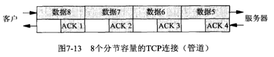
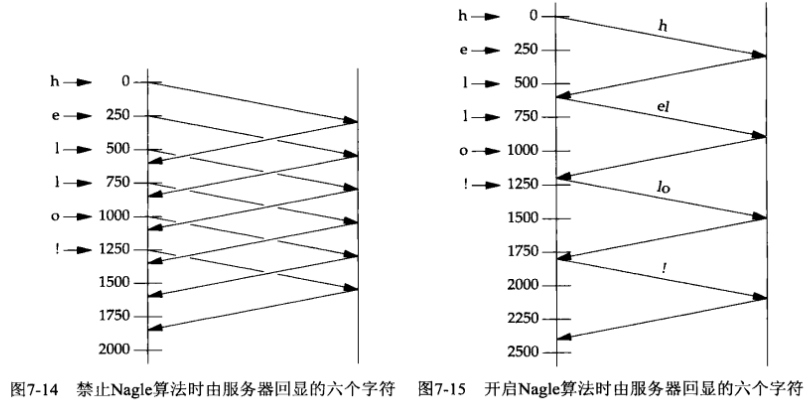

# 第七章 套接字选项

- [第七章 套接字选项](#第七章-套接字选项)
  - [概述](#概述)
  - [getsockopt和setsockopt函数](#getsockopt和setsockopt函数)
  - [检查选项是否受支持并获取默认值](#检查选项是否受支持并获取默认值)
  - [套接字状态](#套接字状态)
  - [通用套接字选项](#通用套接字选项)
    - [SO_BROADCAST](#so_broadcast)
    - [SO_DEBUG](#so_debug)
    - [SO_DONTROUTE](#so_dontroute)
    - [SO_ERROR](#so_error)
    - [SO_KEEPALIVE](#so_keepalive)
    - [SO_LINGER](#so_linger)
    - [SO_OOBINLINE](#so_oobinline)
    - [SO_RCVBUF和SO_SNFBUF](#so_rcvbuf和so_snfbuf)
    - [SO_RCVLOWAT和SO_SNDLOWAT](#so_rcvlowat和so_sndlowat)
    - [SO_RCVTIMEO和SO_SNDTIMEO](#so_rcvtimeo和so_sndtimeo)
    - [SO_REUSEADDR和SO_REUSEPORT](#so_reuseaddr和so_reuseport)
    - [SO_TYPE](#so_type)
    - [SO_USELOOPBACK](#so_useloopback)
  - [IPv4套接字选项](#ipv4套接字选项)
    - [IP_HDRINCL](#ip_hdrincl)
    - [IP_OPTIONS](#ip_options)
    - [IP_RECVDSTADDR](#ip_recvdstaddr)
    - [IP_RECVIF](#ip_recvif)
    - [IP_TOS](#ip_tos)
    - [IP_TTL](#ip_ttl)
  - [ICMPv6套接字选项](#icmpv6套接字选项)
    - [IVMP6_FILTER](#ivmp6_filter)
  - [IPv6套接字选项](#ipv6套接字选项)
    - [IPV6_CHECKSUM](#ipv6_checksum)
    - [IPV6_DONTFRAG](#ipv6_dontfrag)
    - [IPV6_NEXTHOP](#ipv6_nexthop)
    - [IPV6_PATHMTU](#ipv6_pathmtu)
    - [IPV6_RECVDSTOPTS](#ipv6_recvdstopts)
    - [IPV6_RECVHOPLIMIT](#ipv6_recvhoplimit)
    - [IPV6_RECVHOPOPTS](#ipv6_recvhopopts)
    - [IPV6_RECVPATHMTU](#ipv6_recvpathmtu)
    - [IPV6_RECVPKTINFO](#ipv6_recvpktinfo)
    - [IPV6_RECVRTHDR](#ipv6_recvrthdr)
    - [IPV6_RECVTCLASS](#ipv6_recvtclass)
    - [IPV6_UNICAST_HOPS](#ipv6_unicast_hops)
    - [IPV6_USE_MIN_MTU](#ipv6_use_min_mtu)
    - [IPV6_V6ONLY](#ipv6_v6only)
    - [IPV6_XXX](#ipv6_xxx)
  - [TCP套接字选项](#tcp套接字选项)
    - [TCP_MAXSEG](#tcp_maxseg)
    - [TCP_NODELAY](#tcp_nodelay)
  - [SCTP套接字选项](#sctp套接字选项)
    - [SCTP_ADAPTION_LAYER](#sctp_adaption_layer)
    - [SCTP_ASSOCINFO](#sctp_associnfo)
    - [SCTP_AUTOCLOSE](#sctp_autoclose)
    - [SCTP_DEFAULT_SEND_PARAM](#sctp_default_send_param)
    - [SCTP_DISABLE_FRAGMENTS](#sctp_disable_fragments)
    - [SCTP_EVENTS](#sctp_events)
    - [SCTP_GET_PEER_ADDR_INFO](#sctp_get_peer_addr_info)
    - [SCTP_I_WANT_MAPPED_V4_ADDR](#sctp_i_want_mapped_v4_addr)
    - [SCTP_INITMSG](#sctp_initmsg)
    - [SCTP_MAXBURST](#sctp_maxburst)
    - [SCTP_MAXSEG](#sctp_maxseg)
    - [SCTP_NODELAY](#sctp_nodelay)
    - [SCTP_PEER_ADDR_PARAMS](#sctp_peer_addr_params)
    - [SCTP_PRIMARY_ADDR](#sctp_primary_addr)
    - [SCTP_RTOINFO](#sctp_rtoinfo)
    - [SCTP_SET_PEER_PRIMARY_ADDR](#sctp_set_peer_primary_addr)
    - [SCTP_STATUS](#sctp_status)
  - [fcntl函数](#fcntl函数)


## 概述


## getsockopt和setsockopt函数

头文件`sys/socket.h`

`int getsockopt(int sockfd, int level, int optname, void *optval, socklen_t *optlen)`

- sockfd：套接字
- level：级别，指定系统中解释选项的代码或为通用套接字代码，或为某个特定于协议的代码
- optname：opt名字
- optval：指向一个变量
- optlen：指定optval的大小
- return

获得套接字选项

---

`int setsockopt(int sockfd, int level, int optname, const void *optval, socklen_t optlen)`

- sockfd
- level
- optname：opt名字
- optval：指向一个opt变量
- optlen

设置套接字选项

---

套接字层和IP层的套接字选项汇总：

| level（级别）            | optname（选项名）                                            | get                                                          | set                                                          | 说明                                                         | 标志                                                         | 数据类型                                                     |
| ------------------------ | ------------------------------------------------------------ | :----------------------------------------------------------- | ------------------------------------------------------------ | ------------------------------------------------------------ | ------------------------------------------------------------ | :----------------------------------------------------------- |
| SOL_SOCKET               | SO_BROADCAST<br>SO_DEBUG<br>SO_DONTROUTE<br>SO_ERROR<br>SO_KEEPALIVE<br>SO_LINGER<br>SO_OOBINLINE<br>SO_RCVBUF<br>SO_SNDBUF<br>SO_RCVLOWAT<br>SO_SNDLOWAT<br>SO_RCVTIMEO<br>SO_SNDTIMEO<br>SO_REUSEADDR<br>SO_REUSEPORT<br>SO_TYPE<br>SO_USELOOPBACK | Y<br>Y<br>Y<br>Y<br>Y<br>Y<br>Y<br>Y<br>Y<br>Y<br>Y<br>Y<br>Y<br>Y<br>Y<br>Y<br>Y | Y<br>Y<br>Y<br><br>Y<br>Y<br>Y<br>Y<br>Y<br>Y<br>Y<br>Y<br>Y<br>Y<br>Y<br><br>Y | - 允许发送广播数据报<br>- 开启调试跟踪<br>- 绕过外出路由表查询<br>- 获取待处理错误并清除<br>- 周期性测试连接是否仍存活<br>- 若有数据待发送则延迟关闭<br>- 让接收到的带外数据继续在线留存<br>- 接收缓冲区大小<br>- 发送缓冲区大小<br>- 接收缓冲区低水位标记<br>- 发送缓冲区低水位标记<br>- 接收超时<br>- 发送超时<br>- 允许重用本地地址<br>- 允许重用本地端口<br>- 取得套接字类型<br>- 路由套接字取得所发送数据的副本 | Y<br>Y<br>Y<br><br>Y<br><br>Y<br><br><br><br><br><br>Y<br>Y<br><br>Y<br>Y | int<br>int<br>int<br>int<br>int<br>linger<br>int<br>int<br>int<br>int<br>int<br>timeval<br>timeval<br>int<br>int<br>int<br>int |
| IPPROTO_IP               | IP_HDRINCL<br>IP_OPTIONS<br>IP_RECVDSTANDDR<br>IP_RECVIF<br>IP_TOS<br>IP_TTL<br><br>IP_MULTICAST_IF<br>IP_MULTICAST_TTL<br>IP_MULTICAST_LOOP<br>IP_ADD_MEMBERSHIP<br>IP_DROP_MEMBERSHIP<br>IP_BLOCK_SOURCE<br>IP_UNBLOCK_SOURCE<br>IP_ADD_SOURCE_MEMBERSHIP<br>IP_DROP_SOURCE_MEMBERSHIP | Y<br>Y<br>Y<br>Y<br>Y<br>Y<br><br>Y<br>Y<br>Y<br/><br/><br/><br/><br/><br/><br/> | Y<br>Y<br>Y<br>Y<br>Y<br>Y<br><br>Y<br>Y<br>Y<br>Y<br>Y<br>Y<br>Y<br>Y<br>Y | - 随数据包含的IP首部<br>- IP首部选项<br>- 返回目的IP地址<br>- 返回接收接口索引<br>- 服务类型和优先权<br>- 存活时间<br><br>- 指定外出接口<br>- 指定外出TTL<br>- 指定是否环回<br>- 加入多播组<br>- 离开多播组<br>- 阻塞多播组<br>- 开通多播组<br>- 加入源特定多播组<br>- 离开源特定多播组 | Y<br><br>Y<br>Y<br><br><br><br><br><br><br><br><br><br><br><br><br> | int<br>(见正文)<br>int<br>int<br>int<br>int<br><br>in_addr{}<br>u_char<br>u_char<br>ip_mreq{}<br>ip_mreq{}<br>ip_mreq_source{}<br>ip_mreq_source{}<br>ip_mreq_source{}<br>ip_mreq_source{} |
| IPPROTO_ICMPV6           | ICMP6_FILTER                                                 | Y                                                            | Y                                                            | - 指定待传递的ICMPv6消息类型                                 |                                                              | ivmp6_filter{}                                               |
| IPPROTO_IPV6             | IPV6_CHECKSUM<br>IPV6_DONTFRAG<br>IPV6_NEXTHOP<br>IPV6_PATHMTU<br>IPV6_RECVDSTOPTS<br>IPV6_RECVHOPLIMIT<br>IPV6_RECVHOPOPTS<br>IPV6_RECVPATHMTU<br>IPV6_RECVPKTINFO<br>IPV6_RECVRTHDR<br>IPV6_RECVTCLASS<br>IPV6_UNICAST_HOPS<br>IPV6_USE_MIN_MTU<br>IPV6_V60NLY<br>IPV6_XXX<br><br>IPV6_MULTICAST_IP<br>IPV6_MULTICAST_HOPS<br>IPV6_MULTICAST_LOOP<br>IPV6_JOIN_GROUP<br>IPV6_LEAVE_GROUP | Y<br>Y<br>Y<br>Y<br>Y<br>Y<br>Y<br>Y<br>Y<br>Y<br>Y<br>Y<br>Y<br>Y<br>Y<br><br>Y<br>Y<br>Y<br><br><br> | Y<br>Y<br>Y<br><br>Y<br>Y<br>Y<br>Y<br>Y<br>Y<br>Y<br>Y<br>Y<br>Y<br>Y<br><br>Y<br>Y<br>Y<br>Y<br>Y | - 用于原始套接字的校验和字段偏移<br>- 丢弃大的分组而非将其分片<br>- 指定下一跳地址<br>- 获取当前路径MTU<br>接收目的地址选项<br>- 接收单播跳限<br>- 接收步跳选项<br>- 接收路径MTU<br>- 接收分组信息<br>- 接收源路径<br>- 接收流通类型<br>- 默认单播跳限<br>- 使用最小MTU<br>- 禁止v4兼容<br>- 粘附性辅助数据<br><br>- 指定外出接口<br>- 指定外出跳限<br>- 指定是否环回<br>- 加入多播组<br>- 离开多播组 | <br>Y<br><br><br>Y<br>Y<br>Y<br>Y<br>Y<br>Y<br>Y<br>Y<br>Y<br>Y<br>Y<br>Y<br><br><br>Y<br><br><br> | int<br>int<br>sockaddr_in6{}<br>ip6_mtuinfo{}<br>int<br>int<br>int<br>int<br>int<br>int<br>int<br>int<br>int<br>int<br>(见正文)<br><br>u_int<br>int<br>u_int<br>ipv6_mreq{}<br>ipv6_mreq{} |
| IPPROTO_IP或IPPROTO_IPV6 | MCAST_JOIN_GROUP<br>MCAST_LEAVE_GROUP<br>MCAST_BLOCK_SOURCE<br>MCAST_UNBLOCK_SOURCE<br>MCAST_JOIN_SOURCE_GROUP<br>MCAST_LEAVE_SOURCE_GROUP |                                                              | Y<br>Y<br>Y<br>Y<br>Y<br>Y                                   | - 加入多播组<br>- 离开多播组<br>- 阻塞多播源<br>- 开通多播源<br>- 加入源特定多播组<br>- 离开源特定多播组 |                                                              | group_req{}<br>group_source_req{}<br>group_source_req{}<br>group_source_req{}<br>group_source_req{}<br>group_source_req{} |

传输层的套接字选项汇总：

| level（级别） | optname（选项名）                                            | get                                                          | set                                                          | 说明                                                         | 标志                                                         | 数据类型                                                     |
| ------------- | ------------------------------------------------------------ | ------------------------------------------------------------ | ------------------------------------------------------------ | ------------------------------------------------------------ | ------------------------------------------------------------ | ------------------------------------------------------------ |
| IPPROTO_TCP   | TCP_MAXSEG<br>TCP_NODELAY                                    | Y<br>Y                                                       | Y<br>Y                                                       | - TCP最大分节大小<br>- 禁止Nagle算法                         | <br>Y                                                        | int<br>int                                                   |
| IPPROTO_SCTP  | SCTP_ADAPTION_LAYER<br>SCTP_ASSOCINFO<br>SCTP_AUTOCLOSE<br>SCTP_DEFAULT_SEND_PARAM<br>SCTP_DISABLE_FRAGMENTS<br>SCTP_EVENTS<br>SCTP_GET_PEER_ADDR_INFO<br>SCTP_I_WANT_MAPPED_V4_ADDR<br>SCTP_INITMSG<br>SCTP_MAXBURST<br>SCTP_MAXSEG<br>SCTP_NODELAY<br>SCTP_PEER_ADDR_PARAMS<br>SCTP_PRIMARY_ADDR<br>SCTP_RTOINFO<br>SCTP_SET_PEER_PRIMARY_ADDR<br>SCTP_STATUS | Y<br>t<br>Y<br>Y<br>Y<br>Y<br>t<br>Y<br>Y<br>Y<br>Y<br>Y<br>t<br>t<br>t<br><br>t | Y<br>Y<br>Y<br>Y<br>Y<br>Y<br><br>Y<br>Y<br>Y<br>Y<br>Y<br>Y<br>Y<br>Y<br>Y<br><br/> | - 适配层指示<br>- 检查并设置关联信息<br>- 自动关闭操作<br>- 默认发送参数<br>- SCTP分片<br>- 感兴趣事件的通知<br>- 获取对端地址状态<br>- 映射的v4地址<br>- 默认的INIT参数<br>- 最大猝发大小<br>- 最大分片大小<br>- 禁止Nagle算法<br>- 对端地址参数<br>- 主目的地址<br>- RTO信息<br>- 对端的主目的地址<br>- 获取关联状态 | <br><br><br><br>Y<br><br><br>Y<br><br><br><br>Y<br><br><br><br><br><br/> | sctp_setadaption{}<br>sctp_assocparams{}<br>int<br>sctp_sndrcvinfo{}<br>int<br>sctp_event_subscribe{}<br>sctp_paddrinfo{}<br>int<br>sctp_initmsg{}<br>int<br>int<br>int<br>sctp_paddrparams{}<br>sctp_setprim{}<br>sctp_rtoinfo{}<br>sctp_setpeerprim{}<br>sctp_status{} |


## 检查选项是否受支持并获取默认值

```c
#include "unp.h"
#include <netinet/tcp.h>

union val {
    int 						   i_val;
    long 						l_val;
    struct linger 		 linger_val;
    struct timeval    timeval_val;
} val;
static char *sock_str_flag(union val *, int);
static char *sock_str_int(union val *, int);
static char *sock_str_linger(union val *, int);
static char *sock_str_timeval(union val *, int);
struct sock_opts {
    const char *opt_str;
    int					opt_level;
    int 				opt_name;
    char			  *(*opt_val_str)(union val *, int);
} sock_opts[] = {
    { "SO_BROADCAST", SOL_SOCKET, SO_BROADCAST, sock_str_flag },
    { "SO_DEBUG", SOL_SOCKET, SO_DEBUG, sock_str_flag },
    { "SO_DONTROUTE", SOL_SOCKET, SO_DONTROUTE, sock_str_flag },
    { "SO_ERROR", SOL_SOCKET, SO_ERROR, sock_str_int },
    { "SO_KEEPALIVE", SOL_SOCKET, SO_KEEPAVLIE, sock_str_flag },
    { "SO_LINGER", SOL_SOCKET, SO_LINGER, sock_str_linger },
    { "SO_OOBINLINE", SOL_SOCKET, SO_OOBINLINE, sock_str_flag },
    { "SO_RCVBUF", SOL_SOCKET, SO_RCVBUF, sock_str_int },
    { "SO_SNDBUF", SOL_SOCKET, SO_SNDBUF, sock_str_int },
    { "SO_RCVLOWAT", SOL_SOCKET, SO_RCVLOWAT, sock_str_int },
    { "SO_SNDLOWAT", SOL_SOCKET, SO_SNDLOWAT, sock_str_int },
    { "SO_RCVTIMEO", SOL_SOCKET, SO_RCVTIMEO, sock_str_timeval },
    { "SO_SNDTIMEO", SOL_SOCKET, SO_SNDTIMEO, sock_str_timeval },
#ifdef SO_REUSEPORT
    { "SO_REUSEPORT", SOL_SOCKET, SO_REUSEPORT, sock_str_flag },
#else
    { "SO_RESUEPORT", 0, 0, NULL },
#endif
    { "SO_TYPE", SOL_SOCKET, SO_TYPE, sock_str_int },
    { "SO_USELOOPBACK", SOL_SOCKET, SO_USELOOPBACK, sock_str_flag },
    { "IP_TOS", IPPROTO_IP, IP_TOS, sock_str_int },
    { "IP_TTL", IPPROTO_IP, IP_TTL, sock_str_int },
    { "IPV6_DONTFRAG", IPPROTO_IPV6, IPV6_DONTGRAG, sock_str_flag },
    { "IPV6_UNICAST_HOPS", IPPROTO_IPV6, IPV6_UNICAST_HOPS, sock_str_int },
    { "IPV6_V6ONLY", IPPROTO_IPV6, IPV6_V6ONLY, sock_str_flag },
    { "TCP_MAXSEG", IPPROTO_TCP, TCP_MAXSEG, sock_str_int },
    { "TCP_NODELAY", IPPROTO_TCP, TCP_NODELAY, sock_str_flag },
    { "SCTP_AUTOCLOSE", IPPROTO_SCTP, SCTP_AUTOCLOSE, sock_str_int },
    { "SCTP_MAXBURST", IPPROTO_SCTP, SCTP_MAXBURST, sock_str_int },
    { "SCTP_MAXSEG", IPPROTO_SCTP, SCTP_MAXSEG, sock_str_int },
    { "SCTP_NODELAY", IPPROTO_SCTP, SCTP_DODELAY, sock_str_flag },
    { "NULL", 0, 0, NULL },
};

int
main(int argc, char **argv)
{
    int fd;
    socklen len;
    struct sock_opts *ptr;
    for (ptr = sock_opts; ptr->opt_str != NULL; ptr++) {
        printf("%s: ", ptr->opt_str);
        if (ptr->opt_val_str == NULL)
            printf("(undefined)\n");
        else {
            switch(ptr->opt_level) {
                case SOL_SOCKET:
                case IPPROTO_IP:
                case IPPROTO_TCP:
                    fd = Socket(AF_INET, SOCK_STREAM, 0);
                    break;
#iddef IPV6
                case IPPROTO_IPV6:
                    fd = Socket(AF_INET6, SOCK_STREAM, 0);
                    break;
#endif
#ifdef IPPROTO_SCTP
                case IPPROTO_SCTP:
                    fd = Socket(AF_INET, SOCK_SEQPACKET, IPPROTO_SCTP);
                    break;
#endif
                default:
                    err_quit("Can't create fd for level %d\n", ptr->opt_level);
				len = sizeof(val);
                if (getsockopt(fd, ptr->opt_level, ptr->opt_name, &val, &len) == -1) {
                    err_ret("getsockopt error");
                } else {
                    printf("default = %s\n", (*ptr->opt_val_str)(&val, len));
                }
                close(fd);
            }
        }
        exit(0);
    }
}
```


## 套接字状态

下面的套接字选项是由TCP已连接套接字从监听套接字继承来的：

- SO_DEBUG
- SO_DONTROUTE
- SO_KEEPALIVE
- SO_LINGER
- SO_OOBINLINE
- SO_RCVBUF
- SO_RCVLOWAT
- SO_SNDBUF
- SO_SNDLOWAT
- TCP_MAXSEG
- TCP_NODELAY


## 通用套接字选项

### SO_BROADCAST

本选项开启或禁止进程发送广播信息的能力，应用进程在发送广播数据报之前必须设置本套接字选项。

### SO_DEBUG

**仅由TCP支持**。当给一个TCP套接字开启本选项时，内核将为TCP在该套接字发送和接收的所有分组保留详细跟踪信息。

### SO_DONTROUTE

外出的分组将绕过底层协议的正常路由机制，外出分组将被定向到适当的本地接口。

### SO_ERROR

当一个套接字发生错误时，内核会将套接字的so_error（待处理错误， pending error）设置为格式`Exxx`的样式。内核以下面的方式之一立即通知进程这个错误：

- 如果进程阻塞在对该套接字的select调用上，那么无论是检查可读条件还是可写条件，select均返回并设置其中一个或所有两个条件。
- 如果进程使用信号驱动式`I/O`模型，那就给进程或进程组产生一个SIGIO信号。

### SO_KEEPALIVE

给一个TCP套接字设置保持存活（keep-alive）选项后，如果2小时内在该套接字的任一方向上都没有数据交换，TCP就自动给对端发送一个保持存活探测分节（keep-alive probe）。它会导致以下三种情况之一：

- 对端以期望的ACK响应，在又经过2小时后，TCP将发送另一个探测分节。
- 对端以RST响应，它告知本端TCP：对端已崩溃且已重新启动；该套接字的待处理错误被设置为ECONNRESET，套接字本身被关闭。
- 对端对保持存活探测分节没有任何响应，该套接字的待处理错误就被设置为ETIMEOUT，套接字被关闭。

### SO_LINGER

指定close函数对面向连接的协议如何操作，要求在用户进程与内核间传递如下结构：

头文件`sys/socket.h`

```c
struct linger {
    int l_onoff;
    int l_linger;
}
```

- `l-onoff`：
    - 0：关闭本选项，`l_linger`的值被忽略，close立即返回
    - 非0且`l_linger`为0：当close某个连接时TCP将中止该连接；即，TCP将丢弃保留在套接字发送缓冲区中的任何数据，并发送一个RST给对端，而没有通常的四分组连接终止序列
    - 非0且`l_linger`非0：当套接字关闭时内核将拖延一段时间，如果在发送缓冲区中仍残留有数据，那么进程将被投入睡眠，知道数据发送完且被确认或者延滞时间到
- `l_linger`：

检测各种TCP条件的方法：

| 情形                         | 对端进程崩溃                                                 | 对端主机崩溃                                                 | 对端主机不可达                                               |
| ---------------------------- | ------------------------------------------------------------ | ------------------------------------------------------------ | ------------------------------------------------------------ |
| 本端TCP正主动发送数据        | 对端TCP发送一个FIN，这通过使用select判断可读条件立即能检测出来。如果本端TCP发送另外一个分节，对端TCP就以RST响应。如果本端TCP收到RST之后应用进程仍试图写套接字，我们的套接字实现就给该进程发送一个SIGPIPE信号 | 本端TCP将超时，且套接字的待处理错误被设置为ETIMEDOUT         | 本端TCP将超时，且套接字的待处理错误被设置为EHOSTUNREACH      |
| 本端TCP正主动接收数据        | 对端TCP将发送一个FIN，我们将把它作为一个（可能是过早地）EOF读入 | 我们将停止接收数据                                           | 我们将停止接收数据                                           |
| 连接空闲，保持存活选项已设置 | 对端TCP发送一个FIN，这通过使用select判断可读条件立即能检测出来 | 在毫无动静2小时后，发送9个保持存活探测分节，然后套接字的待处理错误被设置为ETIMEDOUT | 在毫无动静2小时后，发送9个保持存活探测分节，然后套接字的待处理错误被设置为EHOSTUNREACH |
| 连接空闲，保持存活选项未设置 | 对端TCP发送一个FIN，这通过使用select判断可读条件立即能检测出来 | 无                                                           | 无                                                           |


shutdown和SO_LINGER各种情况的总结：

| 函数                              | 说明                                                         |
| --------------------------------- | ------------------------------------------------------------ |
| shutdown, SHUT_RD                 | 在套接字上不能再发出接收请求；进程仍可往套接字发送数据；套接字接收缓冲区中所有数据被丢弃；再接收到的任何数据由TCP丢弃；对套接字发送缓冲区没有任何影响。 |
| shutdown, SHUT_WR                 | 在套接字上不能再发出发送请求；进程仍可从套接诶子接收数据；套接字发送缓冲区中的内容被发送到对端，后跟正常的TCP连接终止序列（即发送FIN）；对套接字接收缓冲区无任何影响。 |
| close, l_onoff = 0（默认情况）    | 在套接字上不能再发出发送或接收请求：套接字发送缓冲区中的内容被发送到对端。如果描述符应用计数变为0，在发送完发送缓冲区中的数据后，跟以正常的TCP连接终止序列（即发送FIN）；套接字接收缓冲区中内容被丢弃。 |
| close, l_onoff = 1, l_linger = 0  | 在套接字上不能再发出发送或接收请求。如果描述符引用计数变为0：RST被发送到对端；连接的状态被设置为CLOSED（没有TIME_WAIT状态）；套接字发送缓冲区和套接字接收缓冲区中的数据被丢弃。 |
| close, l_onoff = 1, l_linger != 0 | 在套接字上不能再发出发送或接收请求；套接字发送缓冲区中的数据被发送到对端。如果描述符引用计数变为0：在发送完发送缓冲区中的数据后，跟以正常的TCP连接终止序列（即发送FIN）；套接字接收缓冲区中数据被丢弃；如果在连接变为CLOSED状态前延滞时间到，那么close返回EWOULDBLOCK错误。 |

### SO_OOBINLINE

### SO_RCVBUF和SO_SNFBUF

这两个套接字选项允许我们改变这两个缓冲区的默认大小。

根据TCP快速恢复算法的工作机制，TCP套接字缓冲区的大小至少为MSS值的4倍。



管道的容量称为带宽-延迟积（bandwidth-delay product），它通过将带宽（bit/s）和RTT（秒）相乘，再将结果由位转换为字节计算得到。

带宽是相应于两个端点之间最慢链路的值，是已知的。

例：RTT为60ms的一条T1链路（1536000 bit/s）的带宽-延迟积为11520字节，如果套接字缓冲区小于该值，管道将不会处于满状态。

### SO_RCVLOWAT和SO_SNDLOWAT

接收低水位和发送低水位，由select函数使用；

### SO_RCVTIMEO和SO_SNDTIMEO

接收超时和发送超时。

分别影响到5个输入函数：

- read
- readv
- recv
- recvfrom
- recvmsg

和5个输出函数：

- write
- writev
- send
- sendto
- sendmsg

### SO_REUSEADDR和SO_REUSEPORT

SO_REUSEADDR套接字选项的4个用途：

- SO_REUSEADDR允许启动一个监听服务器并捆绑其众所周知的端口，即使以前建立的将该端口用作他们的本地端口的连接仍然存在。这个条件通常是这样碰到的：
    1. 启动一个监听服务器
    2. 连接请求到达，派生一个子进程来处理这个客户
    3. 监听服务器终止，但子进程继续为现有连接上的客户提供服务
    4. 重启监听服务器
    5. 重新绑定端口
- SO_REUSEADDR允许在同一端口上启动同一服务器的多个实例，只要每个实例捆绑一个不同的本地IP地址即可。
- SO_REUSEADDR允许单个进程捆绑同一个端口到多个套接字上，值啊摇每次捆绑指定不同的本地IP地址即可。
- SO_REUSEADDR允许完全重复的捆绑：当一个IP地址和端口已绑定到某个套接字上时，如果传输协议支持，同样的IP地址和端口还可以捆绑到另一个套接字上。一般来说本特性仅支持UDP套接字。

SO_REUSEPORT套接字选项的2个用途：

- 本选项允许完全重复的捆绑，不过只有在想要捆绑同一IP地址和端口的每个套接字都指定了本套接诶子选项才行。
- 如果被捆绑的IP地址是一个多播地址，那么SO_REUSEADDR和SO_REUSEPORT被认为是等效的。

### SO_TYPE

本选项返回套接字的类型，返回的整数值是一个诸如SOCK_STREAM或SOCK_DGRAM之类的值。本选项通常由启动时继承了套接字的进程使用。

### SO_USELOOPBACK

仅用于路由域（AF_ROUTE）的套接字，默认设置为打开。当打开时，相应套接诶子将接收在其上发送的任何数据报的一个副本。


## IPv4套接字选项

### IP_HDRINCL

当本选项开启时，我们构造完整的IP首部，下列情况除外：

- IP总是计算并存储IP首部校验和
- 如果我们将IP标识字段设置为0，内核将设置该字段
- 如果源IP地址是INADDR_ANY，IP将把它设置位外出接口的主IP地址
- 如何设置IP选项却绝于实现。有些实现取出我们预先使用IP_OPTIONS套接字选项设置的任何IP选项，把他们添加到我们构造的首部中，而其它实现则要求我们亲自在首部指定任何期望的IP选项。
- IP首部有些字段必须以主机字节序填写，有些字段必须以网络子节序填写，具体取决于实现。

### IP_OPTIONS

本选项的设置允许我们在IPv4首部中设置IP选项。

### IP_RECVDSTADDR

本选项导致所收到UDP数据报的目的IP地址由recvmsg函数作为辅助数据返回。

### IP_RECVIF

本选项导致所收到UDP数据报的接收接口索引由recvmsg函数作为辅助数据返回。

### IP_TOS

本选项允许我们为TCP,UDP或SCTP套接字设置IP首部中的服务类型字段(该字段包含DSCP和ECN子字段)。

### IP_TTL

使用本选项设置或获取系统用在从某个给定套接字发送的单播分组上的默认TTL值。


## ICMPv6套接字选项

### IVMP6_FILTER

本选项允许我们获取或设置一个`icmp6_filte`r结构，该结构指出256个可能的`ICMPv6`消息类型中哪些将由某个原始套接字传递给所在进程。


## IPv6套接字选项

### IPV6_CHECKSUM

本选项指定用户数据中校验和所处位置的字节偏移，默认值（-1）。

### IPV6_DONTFRAG

本选项禁止为UDP套接字或原始套接字自动插入分片首部，外出分组中大小超过发送接口MTU的那些分组将被丢弃。

### IPV6_NEXTHOP

本选项不能设置，只能获取。获取本选项时，返回值为由路径MTU发现功能确定的当前MTU。

### IPV6_PATHMTU

本选项不能设置，只能获取。获取本选项时，返回值为由路径MTU发祥功能确定的当前MTU。

### IPV6_RECVDSTOPTS

开启本选项表明，任何接收到的IP6目的地址选项都将由recvmsg作为辅助数据返回，默认关闭。

### IPV6_RECVHOPLIMIT

开启本选项表明，任何接收到的跳限字段都将由recvmsg作为辅助数据返回，默认关闭。

### IPV6_RECVHOPOPTS

开启本选项表明，任何接收到的IPv6步跳选项都将由recvmsg作为辅助数据返回，默认关闭。

### IPV6_RECVPATHMTU

开启本选项表明，某条路径的路径MTU在发生变化时将由recvmsg作为辅助数据返回（不伴随任何数据）。

### IPV6_RECVPKTINFO

开启本选项表明，接收到的IPv6数据报的以下两条信息将由recvmsg作为辅助数据返回：目的IP6地址和到达接口索引。

### IPV6_RECVRTHDR

开启本选项表明，接收到的IPv6路由首部将由recvmsg作为辅助数据返回，默认关闭。

### IPV6_RECVTCLASS

开启本选项表明，接收到的流通类别（包含DSCP和ECN字段）将由recvmsg作为辅助数据返回，默认关闭。

### IPV6_UNICAST_HOPS

设置本选项会给在相应套接字上发送的外出数据报指定默认跳限，获取本选项会返回内核用于相应套接字的跳限值。

### IPV6_USE_MIN_MTU

默认-1

- 1：路径MTU发现功能不必执行，为避免分片，分组就使用IPv6的最小MTU发送。
- 0：路径MTU发现功能对于所有目的地都得执行。
- -1：路径MTU发现功能仅对单播目的地执行，对于多播目的地就使用最小MTU。

### IPV6_V6ONLY

开启本选项将限制它只执行IP6通信，默认关闭。

### IPV6_XXX


## TCP套接字选项

### TCP_MAXSEG

本选项允许我们获取或设置TCP连接的最大分节大小（MSS）。

### TCP_NODELAY

开启本选项将禁止TCP的Nagle算法，默认开启。




## SCTP套接字选项

### SCTP_ADAPTION_LAYER

本选项允许调用者获取或设置将由本端提供给对端的适配层指示（adaption layer indication），获取本选项的值时，调用者得到的是本地套接字将提供给所有未来对端的值；要获取对端的适配层指示，应用进程必须预定适配层事件。

### SCTP_ASSOCINFO

本套接字用于以下目的：

- 获取关于某个现有关联的信息
- 改变某个已有关联的参数
- 为未来的关联设置默认信息

应该使用`sctp_opt_info`函数来获取关联信息，输入`sctp_assocparams`作为参数：

```c
struct sctp_assocparams {
    sctp_assoc_t sasoc_assoc_id;
    u_int16_t sasoc_asocmaxrxt;
    u_int16_t sasoc_number_peer_destinations;
    u_int32_t sasoc_peer_rwnd;
    u_int32_t sasoc_local_rwnd;
};
```

- `sasoc_assoc_id`：存放待访问关联的标识（即关联ID）
- `sasoc_asocmaxrxt`：存放某个关联在已发送数据没有得到确认的情况下尝试重传的最大次数。
- `sasoc_number_peer_destinations`：存放对端目的地址数，不能设置，只能获取
- `sasoc_peer_rwnd`：存放对端的当前接收窗口，表示还能发送给对端的数据子节
- `sasoc_local_rwnd`：存放本地SCTP协议栈当前通告对端的接收窗口，本字段是动态的，受SO_SNDBUF套接字选项影响；它不能设置，只能获取
- `sosoc_cookie_life`：存放送给对端的状态cookie以毫秒为单位的有效期

### SCTP_AUTOCLOSE

本选项允许我们获取或设置一个SCTP端点的自动关闭时间（一个SCTP关联在空闲时保持打开的秒数）

### SCTP_DEFAULT_SEND_PARAM

在发送大量消息时，使用此选项可以让所有消息具有相同的发送参数。本选项接收`sctp_sndrcvinfo`结构作为输入。

```c
struct sctp_sndrcvinfo {
    u_int16_t sinfo_stream;
    u_int16_t sinfo_ssn;
    u_int16_t sinfo_flags;
    u_int32_t sinfo_ppid;
    u_int32_t sinfo_context;
    u_int32_t sinfo_timetolive;
    u_int32_t sinfo_tsn;
    u_int32_t sinfo_cumtsn;
    sctp_assoc_t sinfo_assoc_id;
};
```

- sinfo_stream：指定新的默认流，所有外出消息将被发送到该流中

- sinfo_ssn：在设置默认发送参数时被忽略。当使用recvmsg或sctp_recvmsg函数接收消息时，本字段将存放由对端置于SCTP DATA块的流序号（stream sequence number， SSN）字段中的值

- sinfo_flags：指定新的默认标志，他们将应用于所有消息发送

    sinfo_flags字段允许的SCTP标志值：

    | 常值          | 说明                                                         |
    | ------------- | ------------------------------------------------------------ |
    | MSG_ABORT     | 启动中止性的关联终止过程                                     |
    | MSG_ADDR_OVER | 指定SCTP不顾主目的地址而改用给定的地址                       |
    | MSG_EOF       | 发送完本消息后启动雅致的关联终止过程                         |
    | MSG_PR_BUFFER | 开启部分可靠性特性（如果可用的话）基于缓冲区的层面（profile） |
    | MSG_PR_SCTP   | 针对本消息开启部分可靠性特性（如果可用的话）                 |
    | MSG_UNORDERED | 指定本消息使用无序的消息传递服务                             |

- sinfo_ppid：指定将置于所有外出消息中的SCTP净荷协议标识(payload protocol identifier)字段的默认值

- sinfo_context：指定新的默认上下文。本字段是个本地标志，用于检索无法发送到对端的消息

- sinfo_timetolive：指定新的默认生命期，它将应用于所有消息发送

- sinfo_tsn：在设置默认发送参数时被忽略。当使用recvmsg或sctp_recvmsg函数接收消息时，本字段将存放由对端置于SCTP DATA块的传输序号（transport sequence number, TSN）字段中的值

- sinfo_cumtsn：在设置默认发送参数时被忽略。当使用recvmsg或sctp_recvmsg函数接收消息时，本字段将存放本地SCTP协议栈已与对端挂钩的当前累积TSN。

- sinfo_assoc_id：指定请求者希望对其设置默认参数的关联标识。对于一到一式套接字，本字段被忽略。

### SCTP_DISABLE_FRAGMENTS

禁止发送端的SCTP把太大而不适合置于单个SCTP分组中的用于消息分割成多个DATA块。

### SCTP_EVENTS

本套接字选项允许调用者获取，开启或禁止各种SCTP通知。

使用本选项传递一个`sctp_event_subscribe`结构就可以预定8类事件的通知，格式如下：

```c
struct sctp_event_subscribe {
    u_int8_t sctp_data_io_event;
    u_int8_t sctp_association_event;
    u_int8_t sctp_address_event;
    u_int8_t sctp_send_failure_event;
    u_int8_t sctp_peer_error_event;
    u_int8_t sctp_shutdown_event;
    u_int8_t sctp_partial_delivery_event;
    u_int8_t sctp_adaption_layer_event;
};
```

- sctp_data_io_event：开启/禁止每次recvmsg调用返回sctp_sndrcvinfo
- sctp_association_event：开启/禁止关联建立事件通知
- sctp_address_event：开启/禁止地址事件通知
- sctp_send_failure_event：开启/禁止消息发送故障事件通知
- sctp_peer_error_event：开启/禁止对端协议出错事件通知
- sctp_shutdown_event：开启/禁止关联终止事件通知
- sctp_partial_delivery_event：开启/禁止部分递送API事件通知
- sctp_adaption_layer_event：开启/禁止适配层事件通知

### SCTP_GET_PEER_ADDR_INFO

本选项仅用于获取某个给定对端地址的相关信息，包括拥塞窗口，平滑化后的RTT和MTU等。

本选项输入的是sctp_paddrinfo结构：

```c
struct sctp_paddrinfo {
    sctp_assoc_t spinfo_assoc_id;
    struct sockaddr_storage spinfo_address;
    int32_t spinfo_state;
    u_int32_t spinfo_cwd;
    u_int32_t spinfo_srtt;
    u_int32_t spinfo_rto;
    u_int32_t spinfo_mtu;
};
```

- spinfo_assoc_id：存放关联标识，它和"communication up"（通信开始）即SCTP_COMM_UP通知中提供的信息一致。几乎所有SCTP操作都可以使用这个唯一的值作为相应关联的简明标识。

- spinfo_address：由调用者设置，用于告知SCTP套接字想要获取哪一个对端地址的信息。调用返回时其值不应该改变。

- spinfo_state：

    SCTP对端地址状态：

    | 常值                  | 说明                         |
    | --------------------- | ---------------------------- |
    | SCTP_ACTIVE           | 地址活跃且可达               |
    | SCTP_INACTIVE         | 地址当前不可达               |
    | SCTP_ADDR_UNCONFIRMED | 地址尚未由心搏或用户数据证实 |

- spinfo_cwnd：表示为所指定对端地址维护的当前拥塞窗口

- spinfo_srtt：表示就所指定对端地址而言的平滑化后RTT的当前估计值

- spinfo_rto：表示用于所指定对端地址的当前重传超时值

- spinfo_mtu：表示由路径MTU发现功能发现的通往所指定对端地址的路径MTU的当前值

### SCTP_I_WANT_MAPPED_V4_ADDR

这个标志套接字选项用于为AF_INET6类型的套接字开启或禁止IPv4映射地址，其默认状态为开启。

### SCTP_INITMSG

本套接字选项用于获取或设置某个SCTP套接字在发送INIT消息时所用的默认初始参数。

作为本选项的输入的是sctp_initmsg结构如下：

```c
struct sctp_initmsg {
    uint16_t sinit_num_ostreams;
    uint16_t sinit_max_instreams;
    uint16_t sinit_max_attempts;
    uint16_t sinit_max_init_timeo;
};
```

- sinit_num_ostreams：表示应用进程想要请求的外出SCTP流的数目。该值要等到相应关联完成初始握手后才得到确认，而且可能因为对端的限制而向下协调。
- sinit_max_instreams：表示应用进程准备允许的外来SCTP流的最大数目。如果该值大于SCTP协议栈所支持的最大允许流数，那么它将被改为这个最大数。
- sinit_max_attempts：表示SCTP协议栈应该重传多少次初始INIT消息才认为对端不可达。
- sinit_max_init_timeo：表示用于INIT定时器的最大RTO值。在初始定时器进行指数退避期间，该值将替代RTO.max作为重传RTO极限。该值以毫秒为单位。

### SCTP_MAXBURST

本套接字选项允许应用进程获取或设置用于分组发送的最大猝发大小（maximum burst size），当SCTP向对端发送数据时，一次不能发送多于这个数目的分组，以免网络被分组淹没。

### SCTP_MAXSEG

本套接字选项允许应用进程获取或设置用于SCTP分片的最大片段大小(maximum fragment size)。

### SCTP_NODELAY

本选项开启将禁止SCTP的Nagle算法，本选项默认关闭，即Nagle算法默认开启。

### SCTP_PEER_ADDR_PARAMS

本套接字选项允许应用进程获取或设置关于某个关联的对端地址的各种参数。

作为本选项的输入的是sctp_paddrparams结构：

```c
struct sctp_paddrparams {
    sctp_assoc_t spp_assoc_id;
    struct sockaddr_storage spp_address;
    u_int32_t spp_hbinterval;
    u_int16_t spp_pathmaxrxt;
};
```

- spp_assoc_id：存放在其上获取或设置参数信息的关联标识。
    - 0：所访问的是端点默认参数，而不是特定于关联的参数。
- spp_address：指定其参数待获取或待设置的对端IP地址。如果spp_assoc_id字段值为0，那么本字段被忽略。
- spp_hbinterval：表示心搏间隔时间。
    - SCTP_NO_HB：禁止心搏
    - SCTP_ISSUE_HB：按请求心搏
    - 其它：把心搏间隔重置为以毫秒为单位的新值
- spp_pathmaxrxt：标识在声明所指定对端地址为不活跃之前将尝试的重传次数。当主目的地址被声明为不活跃时，另外一个对端地址将被选为主目的地址

### SCTP_PRIMARY_ADDR

本选项用于获取或设置本地端点所用的主目的地址，主目的地址是本端发送给对端的所有消息的默认目的地址。使用sctp_setprim结构：

```c
struct sctp_setprim {
    sctp_assoc_t ssp_assoc_id;
    struct sockaddr_storage ssp_addr;
};
```

- ssp_assoc_id：存放在其上获取或设置当前主目的地址的关联标识
- ssp_addr：指定主目的地址（主目的地址必须是一个属于对端的地址）

### SCTP_RTOINFO

本套接字选项用于获取或设置各种RTO信息。

输入`sctp_rtoinfo`结构

```c
struct sctp_rtoinfo {
    sctp_assoc_t srto_assoc_id;
    uint32_t srto_initial;
    uint32_t srto_max;
    uint32_t srto_min;
};
```

- srto_assoc_id：存放感兴趣关联的标识或0。若值为0，当前函数调用会对系统的默认参数产生影响。
- srto_initial：存放用于对端地址的初始RTO值。初始RTO值在向对端发送INIT块时使用。该值以毫秒为单位且默认值为3000。
- srto_max：存放在更新重传定时器时使用的最大RTO值。
- srto_min：存放在启动重传定时器时使用的最小RTO值。

### SCTP_SET_PEER_PRIMARY_ADDR

**可选**，设置本套接字选项导致发送一个消息：请求对端把所指定的本地地址作为它的主目的地址。

使用一个`sctp_setpeerprim`作为输入，结构如下：

```c
struct sctp_setpeerprim {
    sctp_assoc_t sspp_assoc_id;
    struct sockaddr_storage sspp_addr;
};
```

- sspp_assoc_id：指定在其上想要设置主目的地址的关联标识。
- sspp_addr：存放想要对端设置为主目的地址的本地地址。

### SCTP_STATUS

本套接字选项用于获取某个SCTP关联的状态。

输入`sctp_status`结构如下：

```c
struct sctp_status {
    sctp_assoc_t sstat_assoc_id;
    int32_t sstat_state;
    u_int32_t sstat_rwnd;
    u_int16_t sstat_unackdata;
    u_int16_t sstat_penddata;
    u_int16_t sstat_instrms;
    u_int16_t sstat_outstrms;
    u_int32_t sstat_fragmentation_point;
    struct sctp_paddrinfo sstat_primary;
};
```

- sstat_assoc_id：存放关联标识

- sstat_state：存放SCTP状态之一，指出关联的总体状态

    SCTP状态：

    | 常值                   | 说明                        |
    | ---------------------- | --------------------------- |
    | SCTP_CLOSED            | 关联已关闭                  |
    | SCTP_COOKIE_WAIT       | 关联已发送INIT              |
    | SCTP_COOKIE_ECHOED     | 关联已回射COOKIE            |
    | SCTP_ESTABLISHED       | 关联已建立                  |
    | SCTP_SHUTDOWN_PENDING  | 关联期待发送SHUTDOWN        |
    | SCTP_SHUTDOWN_SENT     | 关联已发送SHUTDOWN          |
    | SCTP_SHUTDOWN_RECEIVED | 关联已收到SHUTDOWN          |
    | SCTP_SHUTDOWN_ACT_SENT | 关联在等待SHUTDOWN-COMPLETE |

- sstat_rwnd：存放本地端点对于对端接收窗口的当前估计

- sstat_unackdata：存放等着对端处理的未确认DATA块数目

- sstat_penddata：存放本地端点暂存并等着应用进程读取的未读DATA块数据

- sstat_instrms：存放对端用于向本端发送数据的流的数目

- sstat_outstrms：存放本端可用于向对端发送数据的流的数目

- sstat_fragmentation_point：存放本地SCTP端点将其用作用户消息分割点的当前值

- sstat_primary：存放当前主目的地址，主目的地址是向对端发送数据时使用的默认目的地址


## fcntl函数

头文件`fcntl.h`

`int fcntl(int fd, int cmd, ...)`

- return:
    - 成功：取决于cmd
    - 出错：-1

执行各种描述符控制操作。

fcntl，ioctl和路由套接字操作小结：

| 操作                           | fcntl               | ioctl                | 路由套接字 | POSIX      |
| ------------------------------ | ------------------- | -------------------- | ---------- | ---------- |
| 设置套接字为非阻塞式`I/O`型    | F_SETFL, O_NONBLOCK | FIONBIO              |            | fcntl      |
| 设置套接字为信号驱动式`I/O`型  | F_SETFL, O_ASYNC    | FIOASYNC             |            | fcntl      |
| 设置套接字属主                 | F_SETOWN            | SIOCSPGRP或FIOSETOWN |            | fcntl      |
| 获取套接字属主                 | F_GETOWN            | SIOCGPGRP或FIOGETOWN |            | fcntl      |
| 获取套接字接收缓冲区中的字节数 |                     | FIONREAD             |            |            |
| 测试套接字是否处于带外标志     |                     | SIOCATMARK           |            | sockatmark |
| 获取接口列表                   |                     | SIOCGIFCONF          | sysctl     |            |
| 接口操作                       |                     | `SIOC[GS]IFxxx`      |            |            |
| ARP告诉缓存操作                |                     | SIOCxARP             | RTM_xxx    |            |
| 路由表操作                     |                     | SIOCxxxRT            | RTM_xxx    |            |

fcntl函数提供了与网络编程相关的如下特性：

- 非阻塞式`I/O`：通过使用F_SETFL命令设置O_NONBLOCK文件状态标志，我们可以把一个套接字设置为非阻塞型
- 信号驱动式`I/O`：通过使用F_SETFL命令设置O_ASYNC文件状态标志，我们可以把一个套接字设置成一旦其状态发生变化，内核就产生了一个SIGIO信号。
- F_SETOWN：命令允许我们指定用于接收SIGIO和SIGURG信号的套接字属主。其中SIGIO信号是套接字被设置为信号驱动式I/O型后产生的，SIGURG信号是在新的带外数据到达套接字时产生的。F_GETOWN命令返回套接字的当前属主。