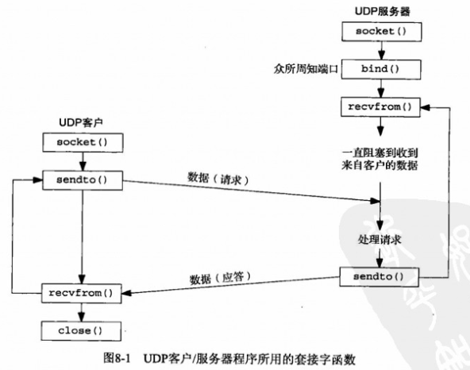
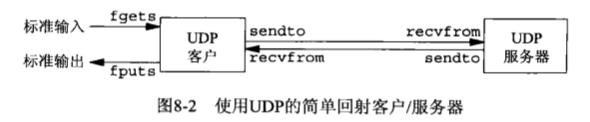

# 第八章 基本UDP套接字编程


## 概述




## recvfrom和sendto函数

所属头文件 `sys/socket.h`

- `size_t recvfrom(int sockfd, void *buff, size_t nbytes, int flags, struct sockaddr *from, socklen_t *addrlen)` 收消息
  - sockfd: 描述符
  - buff: 缓冲区指针
  - nbytes: 读/写字节数
  - from: 发送者地址
  - addrlen: 地址长度
- `ssize_t sendto(int sockfd, const void *buff, size_t nbytes, int flags, const struct sockaddr *to, socklen_t *addrlen)` 发消息
  - sockfd: 描述符
  - buff: 缓冲区指针
  - nbytes: 读/写字节数
  - flags: 
  - to: 接收者地址
  - addrlen: 地址长度


## UDP回射服务器程序：main函数



```c++
#include "udp.h"

int
main(int argc, char **argv)
{
  int sockfd;
  struct sockaddr_in servaddr, cliaddr;
  sockfd = Socket(AF_INET, SOCK_DGRAM, 0);
  bzero(&servaddr, sizeof(servaddr));
  servaddr.sin_family = AF_INET;
  servaddr.sin_addr.s_addr = htons(SERV_PORT);
  Bind(sockfd, (SA *) &servaddr, sizeof(servaddr));
  dg_echo(sockfd, (SA *) &cliaddr, sizeof(cliaddr));
}
```


## UDP回射服务器程序：dg_echo函数

```c++
#include "udp.h"

void
dg_echo(int sockfd, SA *pcliaddr, socklen_t clilen)
{
  int 			n;
  socklen_t len;
  char 			mesg[MAXLINE];
  for ( ; ; ) {
    len = clilen;
    n = Recvfrom(sockfd, mesg, MAXLINE, 0, pcliaddr, &len);
    Sendto(sockfd, mesg, n, 0, pcliaddr, len);
  }
}
```

