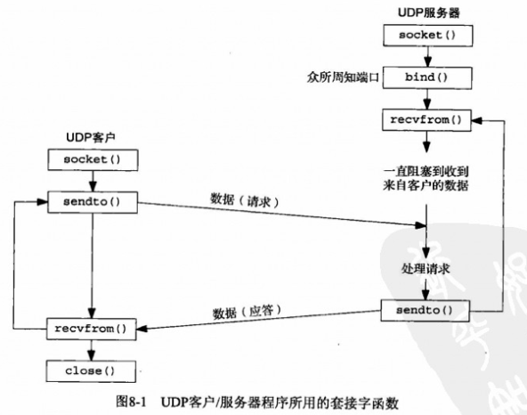
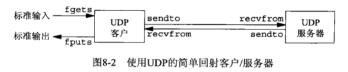
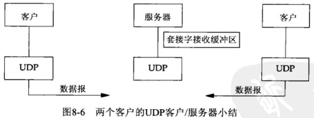
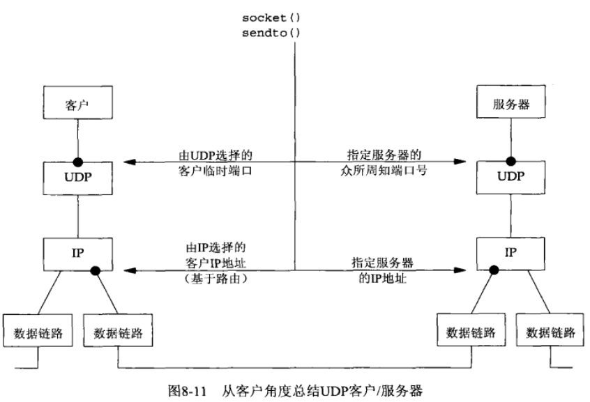
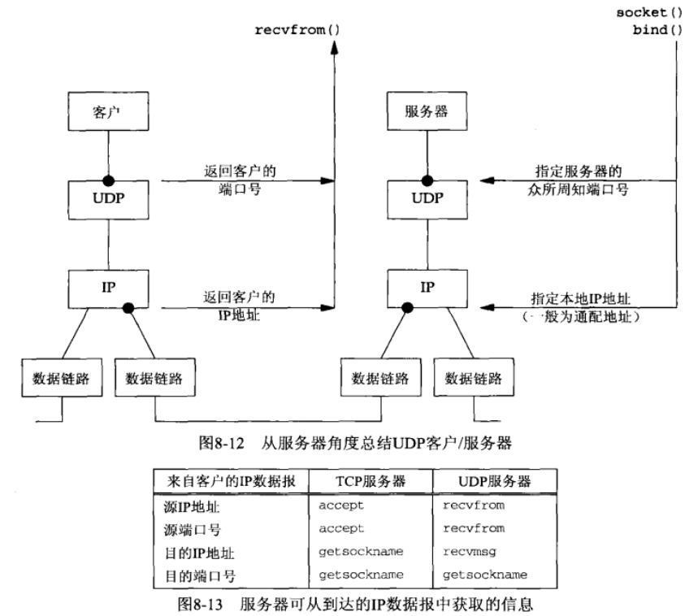
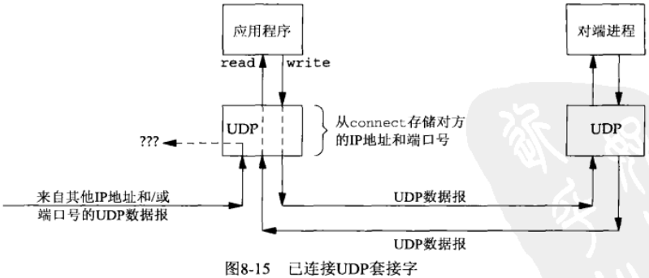
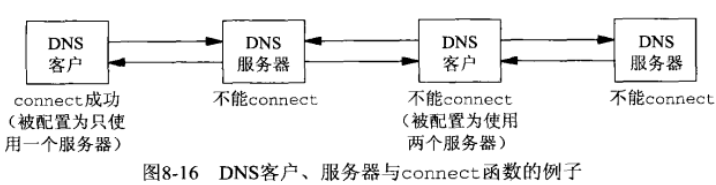

# 第八章 基本UDP套接字编程

- [概述](#概述)
- [recvfrom和sendto函数](#recvfrom和sendto函数)
- [UDP回射服务器程序](#UDP回射服务器程序)
- [UDP回射客户程序](#UDP回射客户程序)
- [数据报的丢失](#数据报的丢失)
- [验证接收到的响应](#验证接收到的响应)
- [服务器进程未运行](#服务器进程未运行)
- [UDP程序例子小结](#UDP程序例子小结)
- [UDP的connect函数](#UDP的connect函数)
  - [给一个UDP套接字多次调用connect](#给一个UDP套接字多次调用connect)
  - [性能](#性能)
- [UDP缺乏流量控制](#UDP缺乏流量控制)
- [UDP中的外出接口的确定](#UDP中的外出接口的确定)
- [使用select函数的TCP和UDP回射服务器程序](#使用select函数的TCP和UDP回射服务器程序)


## 概述




## recvfrom和sendto函数

所属头文件 `sys/socket.h`

- `size_t recvfrom(int sockfd, void *buff, size_t nbytes, int flags, struct sockaddr *from, socklen_t *addrlen)` 收消息
  - sockfd: 描述符
  - buff: 缓冲区指针
  - nbytes: 读/写字节数
  - from: 发送者地址
  - addrlen: 地址长度
- `ssize_t sendto(int sockfd, const void *buff, size_t nbytes, int flags, const struct sockaddr *to, socklen_t *addrlen)` 发消息
  - sockfd: 描述符
  - buff: 缓冲区指针
  - nbytes: 读/写字节数
  - flags: 
  - to: 接收者地址
  - addrlen: 地址长度


## UDP回射服务器程序



main函数

```c
#include "udp.h"

int
main(int argc, char **argv)
{
  int sockfd;
  struct sockaddr_in servaddr, cliaddr;
  sockfd = Socket(AF_INET, SOCK_DGRAM, 0);
  bzero(&servaddr, sizeof(servaddr));
  servaddr.sin_family = AF_INET;
  servaddr.sin_addr.s_addr = htons(SERV_PORT);
  Bind(sockfd, (SA *) &servaddr, sizeof(servaddr));
  dg_echo(sockfd, (SA *) &cliaddr, sizeof(cliaddr));
}
```

dg_echo函数

```c
#include "udp.h"

void
dg_echo(int sockfd, SA *pcliaddr, socklen_t clilen)
{
  int 			n;
  socklen_t len;
  char 			mesg[MAXLINE];
  for ( ; ; ) {
    len = clilen;
    n = Recvfrom(sockfd, mesg, MAXLINE, 0, pcliaddr, &len);
    Sendto(sockfd, mesg, n, 0, pcliaddr, len);
  }
}
```




## UDP回射客户程序

main函数

```c
#include "unp.h"
int
main(int argc, char **argv)
{
  int sockfd;
  struct sockaddr_in servaddr;
  if (argc != 2)
    err_quit("usage: udpcli <IPaddress>");
  bzero(&servaddr, sizeof(servaddr));
  servaddr.sin_family = AF_INET;
  servaddr.sin_port = htons(SERV_PORT);
  Inet_pton(AF_INET, argv[1], &servaddr.sin_addr);
  sockfd = Socket(AF_INET, SOCK_DGRAM, 0);
  dg_cli(stdin, sockfd, (SA *) &servaddr, sizeof(servaddr));
  exit(0);
}
```

dg_cli函数

```c
#include "unp.h"
void
dg_cli(FILE *fp, int sockfd, const SA *pservaddr, socklen_t servlen)
{
  int n;
  char sendline[MAXLINE], recvline[MAXLINE + 1];
  Connect(sockfd, (SA *) pservaddr, servlen);
  while (Fgets(sendline, MAXLINE, fp) != NULL) {
    Write(sockfd, sendline, strlen(sendline));
    n = Read(sockfd, recvline, MAXLINE);
    recvline[n] = 0;
    Fputs(recvline, stdout);
  }
}
```


## 数据报的丢失

recvfrom需要设置超时选项，否则会一直阻塞下去


## 验证接收到的响应

- 弱端系统模型(weak end system model): 接受目的地址为本机的数据报，而不管数据报到达的端口。
- 强端系统模型(strong end system model): 只接受目的地址与到达端口一致的数据报。


## 服务器进程未运行

一个基本规则: 对于一个UDP套接字，由它引发的异步错误却不返回给它，除非它已连接。


## UDP程序例子小结






## UDP的connect函数

POSIX规范指出，在未连接UDP套接字上不指定目的地址的输出操作应该返回ENOTCONN，而不是EDESTADDRREQ。

| 套接字类型        | write或send  | 不指定目的地址的sendto | 指定目的地址的sendto |
| ----------------- | ------------ | ---------------------- | -------------------- |
| TCP套接字         | 可以         | 可以                   | EISCONN              |
| UDP套接字，已连接 | 可以         | 可以                   | EISCONN              |
| UDP套接字，未连接 | EDESTADDRREQ | EDESTADDRREQ           | 可以                 |





### 给一个UDP套接字多次调用connect

拥有一个已连接UDP套接字的进程可出于下列两个目的之一再次调用connect:

- 指定新的IP地址和端口号
- 断开套接字

### 性能

在一个未连接的UDP套接字上给两个数据报调用sendto函数会让内核执行以下步骤:

1. 连接套接字
2. 输出第一个数据报
3. 断开套接字连接
4. 连接套接字
5. 输出第二个数据报
6. 断开套接字连接

当要给同意目的地址发送多个数据报时，显式连接套接字效率更高；调用connect后调用2次write会让内核执行以下步骤:

1. 连接套接字
2. 输出第一个数据报
3. 输出第二个数据报


## UDP缺乏流量控制

udp没有流量控制且不可靠。

由UDP给某个特定套接字排队的UDP数据报树木受限于该套接字接收缓冲区的大小，一旦缓冲区满，后来的数据报会被丢弃。


## UDP中的外出接口的确定

已连接UDP套接字可用来确定用于某个特定目的地的外出接口。

在下例中使用getsockname的到本地IP地址和端口号:

```c
#include "unp.h"
int
main(int argc, char **argv)
{
  int sockfd;
  socklen_t len;
  struct sockaddr_in cliaddr, servaddr;
  if (argc != 2)
    err_quit("usage: udpcli <IPaddress>");
  sockfd = Socket(AF_INET, SOCK_DGRAM, 0);
  bzero(&servaddr, sizeof(servaddr));
  servaddr.sin_family = AF_INET;
  servaddr.sin_port = htons(SERV_PORT);
  Inet_pton(AF_INET, argv[1], &servaddr.sin_addr);
  Connect(sockfd, (SA *) &servaddr, sizeof(servaddr));
  len = sizeof(cliaddr);
  Getsockname(sockfd, (SA *) &cliaddr, &len);
  printf("local address %s\n", Sock_ntop((SA *) &cliaddr, len));
  exit(0);
}
```


## 使用select函数的TCP和UDP回射服务器程序

```c
#include "unp.h"
int
main(int argc, char **argv)
{
  int listenfd, connfd, udpfd, nready, maxfdp1;
  char mesg[MAXLINE];
  pid_t childpid;
  fd_set rset;
  ssize_t n;
  socklen_t len;
  const int on = 1;
  struct sockaddr_in cliaddr, servaddr;
  void sig_chld(int);
  // 创建&监听TCP套接字
  listenfd = Socket(AF_INET, SOCK_STREAM, 0);
  bzero(&servaddr, sizeof(servaddr));
  servaddr.sin_family = AF_INET;
  servaddr.sin_addr.s_addr = htonl(INADDR_ANY);
  servaddr.sin_port = htons(SERV_PORT);
  Setsockopt(listenfd, SOL_SOCKET, SO_REUSERADDR, &on, sizeof(on));
  Bind(listenfd, (SA *) &servaddr, sizeof(servaddr));
  Listen(listenfd, LISTENQ);
  
  // 创建UDP套接字
  udpfd = Socket(AF_INET, SOCK_DGRAM, 0);
  bzero(&servaddr, sizeof(servaddr));
  servaddr.sin_family = AF_INET;
  servaddr.sin_addr.s_addr = htonl(INADDR_ANY);
  servaddr.sin_port = htons(SERV_PORT);
  Bind(udpfd, (SA *) &servaddr, sizeof(servaddr));
  
  Signal(SIGCHLD, sig_chld);
  FD_ZERO(&rset);
  maxfdp1 = max(listenfd, udpfd) + 1;
  for(;;) {
    FD_SET(listenfd, &rset);
    FD_SET(udpfd, &rset);
    if ( (nready = select(maxfdp1, &rset, NULL, NULL, NULL)) < 0 ) {
      if (errno == EINTR)
        continue;
      else
        err_sys("select error");
    }
    if (FD_ISSET(listenfd, &rset)) {
      len = sizeof(cliaddr);
      connfd = Accept(listenfd, (SA *) &cliaddr, &len);
      if ( (childpid = Fork()) == 0 ) {
        Close(listenfd);
        str_echo(connfd);
        exit(0);
      }
      Close(connfd);
    }
    if (FD_ISSET(udpfd, &rset)) {
      len = sizeof(cliaddr);
      n = Recvfrom(udpfd, mesg, MAXLINE, 0, (SA *) &cliaddr, &len);
      Sendto(udpfd, mesg, n, 0, (SA *) &cliaddr, len);
    }
  }
}
```

