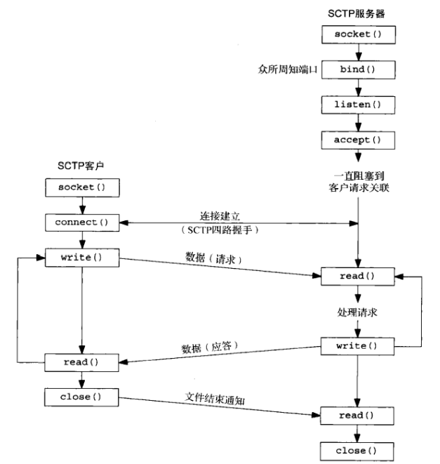
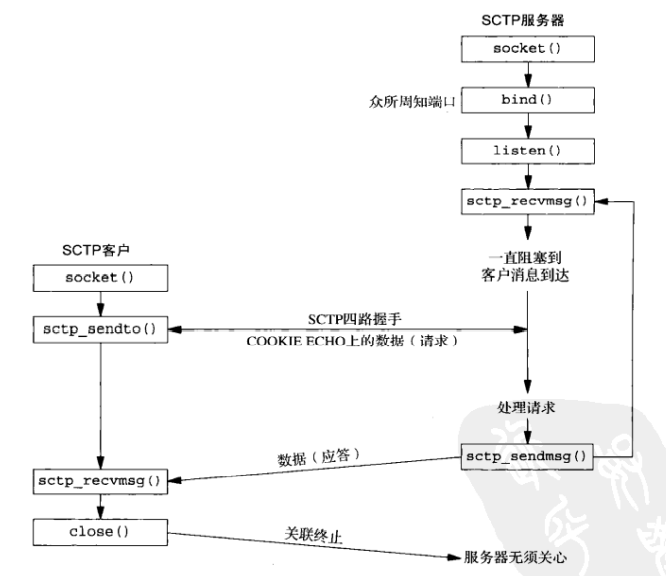

# 第九章 基本SCTP套接字编程

[TOC]


## 9.1 概述


## 9.2 接口模型

SCTP套接字分为：

- 一到一套接字
- 一到多套接字

### 9.2.1 一到一形式

将TCP应用移植到SCTP上的注意事项：

1. 任何TCP套接字选项必须转换成等效的SCTP套接字选项。
2. SCTP保存消息边界，因而应用层消息边界并非必需、
3. 有些TCP应用进程使用半关闭来告知对端去往它的数据流已经结束。将这样的应用程序移植到SCTP需要额外重写应用层协议，让应用进程在应用数据流中告知对端该传输数据流已经结束。
4. send函数能够以普通方式使用。

### 9.2.2 一到多形式

使用一到多形式编写的服务器程序无需管理大量的套接字描述符。



*SCTP一到一形式的套接字函数*



*SCTP一到多形式的套接字函数*


## 9.3 sctp_bindx函数

```c++
#include <netinet/sctp.h>
int sctp_bindx(int sockfd, const struct sockaddr *addrs, int addrcnt, int flags);
```

- `sockfd`套接字描述符

- `addrs`地址列

  

  *SCTP调用所需的紧凑地址列表格式*

- `addrcnt`地址个数

- `flags`行为标志

  | flags               | 说明               |
  | ------------------- | ------------------ |
  | SCTP_BINDX_ADD_ADDR | 往套接字中添加地址 |
  | SCTP_BINDX_REM_ADDR | 从套接字中删除地址 |

- 返回值

  - 成功：0
  - 失败：-1

*将SCTP套接字捆绑一个特定地址子集*


## 9.4 sctp_connectx函数

```c++
#include <netinet/sctp.h>
int sctp_connectx(int sockfd, const struct sockaddr *addrs, int addrcnt);
```

- `sockfd`套接字描述符
- `addrs`地址列
- `addrcnt`地址个数
- 返回值
  - 成功：0
  - 失败：-1

*连接到一个多宿对端主机*


## 9.5 sctp_getpaddrs函数

```c++
#include <netinet/sctp.h>
int sctp_getpaddrs(int sockfd, sctp_assoc_t id, struct sockaddr **addrs);
```

- `sockfd`套接字描述符
- `id`一到多式套接字的关联标识
- `addrs`地址列表
- 返回值
  - 成功：对端地址数
  - 失败：-1

*获得对端的所有地址*


## 9.6 sctp_freepaddrs函数

```c++
#include <netinet/sctp.h>
void sctp_freepaddrs(struct sockaddr *addrs);
```

- `addrs`地址数组

释放由sctp_getpaddrs函数分配的资源


## 9.7 sctp_getladdrs函数

```c++
#include <netinet/sctp.h>
int sctp_getladdrs(int sockfd, sctp_assoc_t id, struct sockaddr **addrs);
```

- `sockfd`套接字描述符
- `id`一到多式套接字的关联标识
- `addrs`地址指针

*获取属于某个关联的本地地址*


## 9.8 sctp_freeladdrs函数

```c++
#include <netinet/sctp.h>
void sctp_freeladdrs(struct sockaddr *addrs);
```

- `addrs`地址数组

*释放由`sctp_getladdrs`函数分配的资源*


## 9.9 sctp_sendmsg函数

```c++
#include <netinet/sctp.h>
ssize_t sctp_sendmsg(int sockfd, const void *msg, size_t msgsz,
                     const struct sockaddr *to, socklen_t tolen,
                     uint32_t ppid,
                     uint32_t flags, uint16_t stream,
                     uint32_t timetolive, uint32_t context);
```

- `sockfd`套接字描述符
- `msg`缓冲区
- `msgsz`缓冲区长度
- `to`接收者地址
- `tolen`接收者地址长度
- `ppid`随数据块传递的净荷协议标识符
- `flags`标识SCTP选项
- `stream`SCTP流
- `timetolive`消息的生命周期（ms，0表示无限生命）
- `context`用户上下文
- 返回值
  - 成功：所写字节数
  - 失败：-1

*发送SCTP数据*


## 9.10 sctp_recvmsg函数

```c++
#include <netinet/sctp.h>
ssize_t sctp_recvmsg(int sockfd, void *msg, size_t msgsz,
                     struct sockaddr *from, socklen_t *fromlen,
                     struct sctp_sndrcvinfo *sinfo,
                     int *msg_flags);
```

- `sockfd`套接字描述符
- `msg`缓冲区
- `msgsz`缓冲区长度
- `from`发送者地址
- `fromlen`发送者地址长度
- `sinfo`与消息相关的细节信息
- `msg_flags`标志
- 返回值
  - 成功：所写字节数
  - 失败：-1

*接收sctp数据*


## 9.11 sctp_opt_info函数

```c++
#include <netinet/sctp.h>
int sctp_opt_info(int sockfd, sctp_assoc_t assoc_id, int opt, 
                  void *arg, socklen_t *siz);
```

- `sockfd`套接字描述符
- `assoc_id`关联标识
- `opt`SCTP套接字选项
- `arg`套接字选项参数
- `siz`参数大小
- 返回值
  - 成功：0
  - 失败：-1

*SCTP的getsockopt函数的替代函数*

TODO

