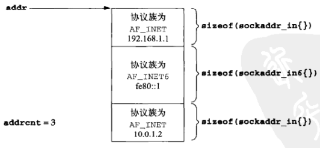

# 第九章 基本SCTP套接字编程

[TOC]


## 9.1 概述


## 9.2 接口模型

SCTP套接字分为：

- 一到一套接字
- 一到多套接字

### 9.2.1 一到一形式

将TCP应用移植到SCTP上的注意事项：

1. 任何TCP套接字选项必须转换成等效的SCTP套接字选项。
2. SCTP保存消息边界，因而应用层消息边界并非必需、
3. 有些TCP应用进程使用半关闭来告知对端去往它的数据流已经结束。将这样的应用程序移植到SCTP需要额外重写应用层协议，让应用进程在应用数据流中告知对端该传输数据流已经结束。
4. send函数能够以普通方式使用。

### 9.2.2 一到多形式

使用一到多形式编写的服务器程序无需管理大量的套接字描述符。


*SCTP一到一形式的套接字函数*


*SCTP一到多形式的套接字函数*


## 9.3 sctp_bindx函数

```c++
#include <netinet/sctp.h>
int sctp_bindx(int sockfd, const struct sockaddr *addrs, int addrcnt, int flags);
```

- `sockfd`套接字描述符

- `addrs`地址列

  

  *SCTP调用所需的紧凑地址列表格式*

- `addrcnt`地址个数

- `flags`行为标志

  | flags               | 说明               |
  | ------------------- | ------------------ |
  | SCTP_BINDX_ADD_ADDR | 往套接字中添加地址 |
  | SCTP_BINDX_REM_ADDR | 从套接字中删除地址 |

- 返回值

  - 成功：0
  - 失败：-1

*将SCTP套接字捆绑一个特定地址子集*


## 9.4 sctp_connectx函数

```c++
#include <netinet/sctp.h>
int sctp_connectx(int sockfd, const struct sockaddr *addrs, int addrcnt);
```

- `sockfd`套接字描述符
- `addrs`地址列
- `addrcnt`地址个数
- 返回值
  - 成功：0
  - 失败：-1

*连接到一个多宿对端主机*


## 9.5 sctp_getpaddrs函数

```c++
#include <netinet/sctp.h>
int sctp_getpaddrs(int sockfd, sctp_assoc_t id, struct sockaddr **addrs);
```

- `sockfd`套接字描述符
- `id`一到多式套接字的关联标识
- `addrs`地址列表
- 返回值
  - 成功：对端地址数
  - 失败：-1

*获得对端的所有地址*


## 9.6 sctp_freepaddrs函数

```c++
#include <netinet/sctp.h>
void sctp_freepaddrs(struct sockaddr *addrs);
```

- `addrs`地址数组

释放由sctp_getpaddrs函数分配的资源


## 9.7 sctp_getladdrs函数

```c++
#include <netinet/sctp.h>
int sctp_getladdrs(int sockfd, sctp_assoc_t id, struct sockaddr **addrs);
```

- `sockfd`套接字描述符
- `id`一到多式套接字的关联标识
- `addrs`地址指针

*获取属于某个关联的本地地址*


## 9.8 sctp_freeladdrs函数

```c++
#include <netinet/sctp.h>
void sctp_freeladdrs(struct sockaddr *addrs);
```

- `addrs`地址数组

*释放由`sctp_getladdrs`函数分配的资源*


## 9.9 sctp_sendmsg函数

```c++
#include <netinet/sctp.h>
ssize_t sctp_sendmsg(int sockfd, const void *msg, size_t msgsz,
                     const struct sockaddr *to, socklen_t tolen,
                     uint32_t ppid,
                     uint32_t flags, uint16_t stream,
                     uint32_t timetolive, uint32_t context);
```

- `sockfd`套接字描述符
- `msg`缓冲区
- `msgsz`缓冲区长度
- `to`接收者地址
- `tolen`接收者地址长度
- `ppid`随数据块传递的净荷协议标识符
- `flags`标识SCTP选项
- `stream`SCTP流
- `timetolive`消息的生命周期（ms，0表示无限生命）
- `context`用户上下文
- 返回值
  - 成功：所写字节数
  - 失败：-1

*发送SCTP数据*


## 9.10 sctp_recvmsg函数

```c++
#include <netinet/sctp.h>
ssize_t sctp_recvmsg(int sockfd, void *msg, size_t msgsz,
                     struct sockaddr *from, socklen_t *fromlen,
                     struct sctp_sndrcvinfo *sinfo,
                     int *msg_flags);
```

- `sockfd`套接字描述符
- `msg`缓冲区
- `msgsz`缓冲区长度
- `from`发送者地址
- `fromlen`发送者地址长度
- `sinfo`与消息相关的细节信息
- `msg_flags`标志
- 返回值
  - 成功：所写字节数
  - 失败：-1

*接收sctp数据*


## 9.11 sctp_opt_info函数

```c++
#include <netinet/sctp.h>
int sctp_opt_info(int sockfd, sctp_assoc_t assoc_id, int opt, 
                  void *arg, socklen_t *siz);
```

- `sockfd`套接字描述符
- `assoc_id`关联标识
- `opt`SCTP套接字选项
- `arg`套接字选项参数
- `siz`参数大小
- 返回值
  - 成功：0
  - 失败：-1

*SCTP的getsockopt函数的替代函数*


## 9.12 sctp_peeloff函数

```c++
#include <netinet/sctp.h>
int sctp_peeloff(int sockfd, sctp_assoc_t id);
```

- `sockfd`套接字描述符
- `id`关联标识ID
- 返回值
  - 成功：套接字描述符
  - 失败：-1

*从一个一到多式套接字中抽取一个关联，构造并返回一个新的套接字描述符*


## 9.13 shutdown函数

SCTP的shutdown函数的`howto`参数语义：

- SHUT_RD 同TCP语义
- SHUT_WR 禁止后续发送操作，激活SCTP关联终止过程，以此终止当前关联。
- SHUT_RDWR 禁止所有read操作和write操作，激活SCTP关联终止过程。传送到本地端点的任何已经排队的数据都得到确认，然后悄然丢弃。


*调用shutdown关闭一个SCTP关联*


## 9.14 通知

```c++
struct sctp_tlv {
    u_int16_t sn_type;
    u_int16_t sn_flags;
    u_int32_t sn_length;
};
/* notification event */
union sctp_notification {
    struct sctp_tlv            sn_header; // 解释类型值
    struct sctp_assoc_change   sn_assoc_change;
    struct sctp_paddr_change   sn_paddr_change;
    struct sctp_remote_error   sn_remote_error;
    struct sctp_send_failed    sn_send_failed;
    struct sctp_shutdown_event sn_shutdown_event;
    struct sctp_adaption_event sn_adaption_event;
    struct sctp_pdapi_event    sn_pdapi_event;
};
```

| sn_type                     | 预订字段                    |
| --------------------------- | --------------------------- |
| SCTP_ASSOC_ CHANGE          | sctp_association_event      |
| SCTP_PEER_ADDR_CHANGE       | sctp_address_event          |
| SCTP_REMOTE_ERROR           | sctp_peer_error_event       |
| SCTP_SEND_FAILED            | sctp_send_failure_event     |
| SCTP_SHUTDOWN_EVENT         | sctp_shutdown_event         |
| SCTP_ADAPTION_INDICATION    | sctp_adaption_layer_event   |
| SCTP_PARTIAL_DELIVERY_EVENT | sctp_partial_delivery_event |

*sn_type字段和事件预订字段*

- SCTP_ASSOC_CHANGE

  告知应用进程关联本身发生变动：一开始一个新的关联或已结束一个现有关联。

  本事件提供的信息定义如下：

  ```c++
  struct sctp_assoc_change {
      u_int16_t    sac_type;
      u_int16_t    sac_flags;
      u_int32_t    sac_length;
      u_int16_t    sac_state;
      u_int16_t    sac_error;
      u_int16_t    sac_outbound_streams;
      u_int16_t    sac_inbound_streams;
      sctp_assoc_t sac_assoc_id;
      uint8_t      sac_info[];
  };
  ```

  sac_state给出关联上发生的事件类型：

  - SCTP_COMM_UP 本状态指示某个新的关联刚刚启动。
  - SCTP_COMM_LOST 本状态指示由关联标识字段给出的关联已经关闭。
  - SCTP_RESTART 本状态指示对端已经重启。
  - SCTP_SHUTDOWN_COMP 本状态指示由本地端点激发的关联终止过程已经结束。
  - SCTP_CANT_STR_ASSOC 本状态指示对端对于本端的关联建立尝试未曾给出响应。

- SCTP_PEER_ADDR_CHANGE

  本通知告知对端的某个地址经历了状态变动。伴随地址变动的结构如下：

  ```c++
  struct sctp_paddr_change {
      u_int16_t               spc_type;
      u_int16_t               spc_flags;
      u_int32_t               spc_length;
      struct sockaddr_sotrage spc_aaddr;    // 本事件所影响的对端地址
      u_int32_t               spc_state;
      u_int32_t               spc_error;    // 用于提供关于事件更详细信息的通知错误代码
      sctp_assoc_t            spc_assoc_id; // 关联标识
  };
  ```

  SCTP对端地址状态通知：

  | spc_state             | 说明                   |
  | --------------------- | ---------------------- |
  | SCTP_ADDR_ADDED       | 地址现已加入关联       |
  | SCTP_ADDR_AVAILABLE   | 地址现已可达           |
  | SCTP_ADDR_CONFIRMED   | 地址现已证实有效       |
  | SCTP_ADDR_MADE_PRIM   | 地址现已称为主目的地址 |
  | SCTP_ADDR_REMOVED     | 地址不在术语关联       |
  | SCTP_ADDR_UNREACHABLE | 地址不再可达           |

- SCTP_REMOTE_ERROR

  远程端点可能给本地端点发送一个操作性错误消息，这些消息可以指示当前关联的各种出错条件，本消息格式如下：

  ```c++
  struct sctp_remote_error {
      u_int16_t    sre_type;
      u_int16_t    sre_flags;
      u_int32_t    sre_length;
      u_int16_t    sre_error;    // SCTP协议错误起因代码
      sctp_assoc_t sre_assoc_id; // 关联标识
      u_int8_t     sre_data[];   // 完整的错误（内嵌格式）
  };
  ```

- SCTP_SEND_FAILED

  无法递送到对端的消息通过本通知送回用户，本通知提供的结构如下：

  ```c++
  struct sctp_send_failed {
      u_int16_t              ssf_type;
      u_int16_t              ssf_flags;
      u_int32_t              ssf_length;
      u_int32_t              ssf_error;
      struct sctp_sndrcvinfo ssf_info;
      sctp_assoc_t           ssf_assoc_id;
      u_int8_t               ssf_data[];
  };
  ```

  ssf_flags可以取以下两个值之一：

  - SCTP_DATA_UNSENT：指示相应消息无法发送到对端，因此对端永远收不到该消息。
  - SCTP_DATA_SEND：指示相应消息已经至少发送到对端以此，然而对端一直没有确认。

- SCTP_SHUTDOWN_EVENT

  当对端发送一个SHUTDOWN块到本地端点时，本通知被传递给应用进程，本通知的格式如下：

  ```c++
  struct sctp_shutdown_event {
      uint16_t     sse_type;
      uint16_t     sse_flags;
      uint32_t     sse_length;
      sctp_assoc_t sse_assoc_id;
  };
  ```

- SCTP_ADAPTION_INDICATION

  用于通知对端将执行什么类型的应用适应行为，本通知的格式如下：

  ```c++
  struct sctp_adaption_event {
      u_int16_t    sai_type;
      u_int16_t    sai_flags;
      u_int32_t    sai_length;
      u_int32_t    sai_adaption_ind; // 对端在INIT或INIT-ACK消息中传递给本地主机的32位整数
      sctp_assoc_t sai_assoc_id;     // 本适应层通知的关联标识
  };
  ```

- SCTP_PARTIAL_DELIVERY_EVENT

  部分递送应用程序接口用于经由套接字缓冲区向用户传递大消息，本通知格式如下：

  ```c++
  struct sctp_pdapi_event {
      uint16_t     pdapi_type;
      uint16_t     pdapi_flags;
      uint32_t     pdapi_length;
      uint32_t     pdapi_indication; // 发生的事件
      sctp_assoc_t pdapi_assoc_id;   // 递送API事件发生的关联标识
  };
  ```


## 9.15 小结

