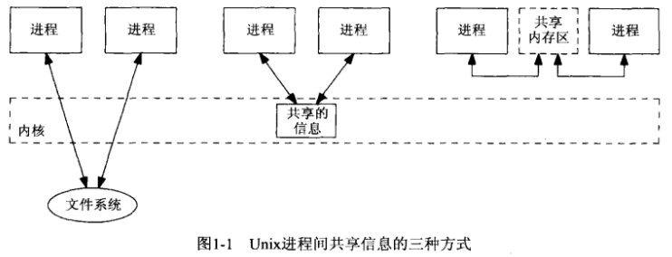
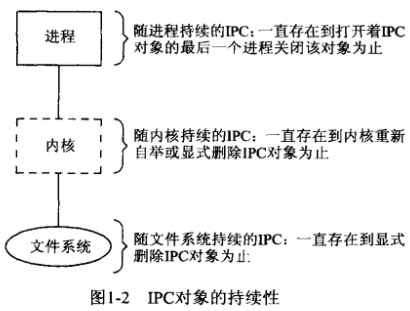
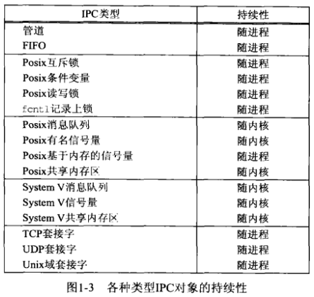
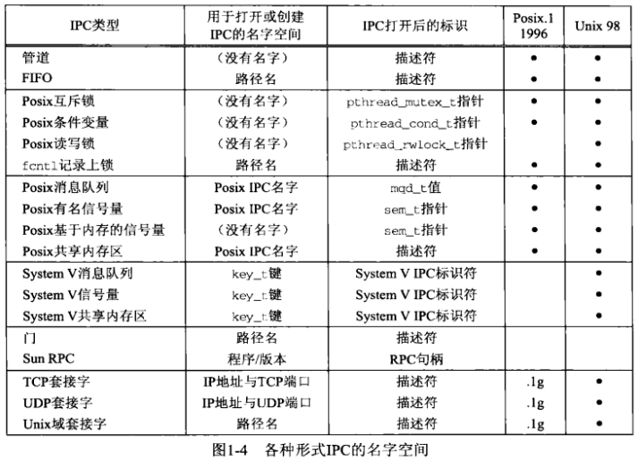
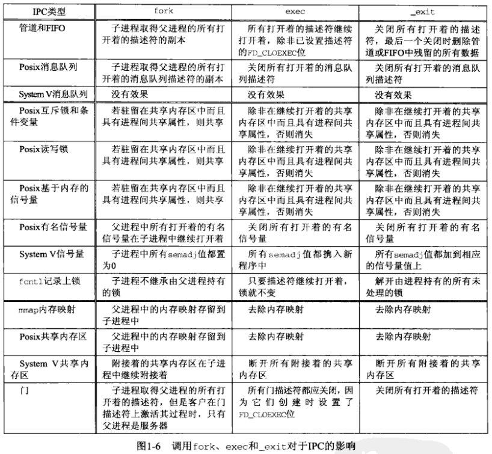

# 第1章 简介


## 1.1 概述


## 1.2 进程，线程与信息共享




## 1.3 IPC对象的持续性






## 1.4 名字空间




## 1.5 fork, exec和exit对IPC对象的影响




## 1.6 出错处理：包裹函数

```c++
void Sem_post(Sem_t *sem)
{
    if (sem_post(sem) == -1)
        err_sys("sem_post error");
}
```

*sem_post函数的包裹函数*

```c++
void Pthread_mutex_lock(pthread_mutex_t *mptr)
{
    int n;
    if ((n = pthread_mutex_lock(mptr)) == 0)
        return;
    errno = n;
    err_sys("pthread_mutex_lock error");
}
```

*给pthread_mutex_lock定义的包裹函数*


## 1.7 Unix标准

### 1.7.1 Posix

### 1.7.2 Open Group

### 1.7.3 Unix版本和移植性


## 1.8 书中IPC例子索引表


## 1.9 小结

