# 第10章 Posix信号量


## 10.1 概述

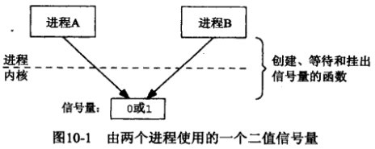

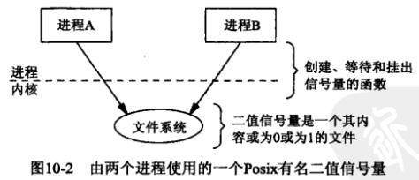

一个进程可以在某个信号量上执行的三种操作：

1. 创建（create）
2. 等待（wait）
3. 挂出（post）

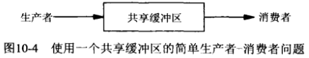

信号量，互斥锁与条件变量之间的差异：

1. 互斥锁必须总是由给它上锁的线程解锁，信号量的post却不必由执行过它的等待操作的同一线程执行。
2. 互斥锁要么被锁住，要么被解开（二值状态，类似于二值信号量）。
3. 既然信号量有一个与之关联的状态（它的计数值），那么信号量post操作总是被记住。然而当向一个条件变量发送信号时，如果没有线程等待在该条件变量上，那么该信号将丢失。

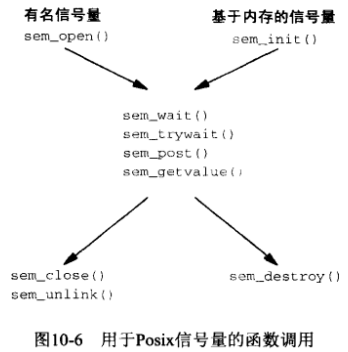

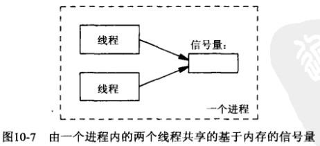

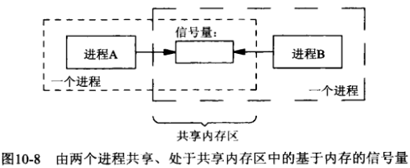


## 10.2 sem_open, sem_close和sem_unlink函数

```c++
#include <semaphore.h>
sem_t *sem_open(const char *name, int oflag, ...);
```

- `name` 信号量名

- `oflag`

  - `0`
  - `O_CREATE`
  - `O_CREATE | O_EXCL`

- `...`

- `返回值`

  成功：指向信号量的指针

  失败：`SEM_FAILED`

创建/打开一个**有名信号量**。

```c++
#include <semaphore.h>
int sem_close(sem_t *sem);
```

- `sem` 有名信号量

- `返回值`

  成功：0

  失败：-1

打开一个**有名信号量**。

```c++
#include <semaphore.h>
int sem_unlink(const char* name);
```

- `name` 信号量名

- `返回值`

  成功：0

  失败：-1

删除**有名信号量**（减一次引用计数）。


## 10.3 sem_wait和sem_trywait函数

```c++
#include <semaphore.h>
int sem_wait(sem_t *sem);
```

- `sem`信号量

- `返回值`

  成功：0

  失败：-1

测试信号量的值；如果该值>0，那么将它-1并立即返回；如果该值==0，调用线程被投入睡眠中，直到该值再次变为>0，这时再将它-1。

```c++
#include <semaphore.h>
int sem_trywait(sem_t *sem);
```

- `sem`信号量

- `返回值`

  成功：0

  失败：-1

与`sem_wait`类似，区别在于：如果该值==0，不将线程被投入睡眠中，直接返回EAGAIN错误。


## 10.4 sem_post和sem_getvalue函数

```c++
#include <semaphore.h>
int sem_post(sem_t *sem);
int sem_getvalue(sem_t *sem, int *valp);
```

- `sem`信号量

- `valp`返回信号量当前值

- `返回值`

  成功：0

  失败：-1

设置/获取信号量当前值。


## 10.5 简单的程序

### 10.5.1 semcreate程序

```c++
TODO
```

*创建一个有名信号量*

### 10.5.2 semunlink程序

```c++
TODO
```

*删除一个有名信号量的名字*

### 10.5.3 semgetvalue程序

```c++
TODO
```

*取得并输出一个信号量的值*

### 10.5.4 semwait程序

```c++
TODO
```

*等待一个信号量并输出它的值*

### 10.5.5 sempost程序

```c++
TODO
```

*挂出一个信号量*

### 10.5.6 例子


## 10.6 生产者-消费者问题

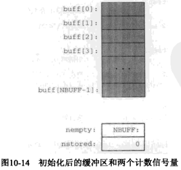

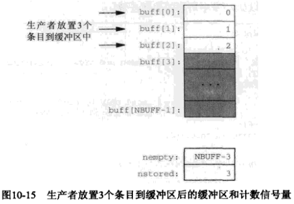

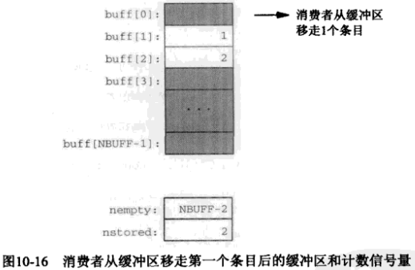

```c++
TODO
```

*生产者-消费者问题信号量解决方案的main函数*


## 10.7 文件上锁

```c++
TODO
```

*使用Posix有名信号量的文件上锁*


## 10.8 sem_init和sem_destroy函数

```c++
#include <semaphore.h>
int sem_init(sem_t *sem, int shared, unsigned int value);
```

- `sem`内存信号量（无名信号量）

- `shared` 共享方式；

  - 0：在同一进程的各个线程间共享；
  - 非0：该信号量必须存放在某种类型的共享内存中，使用它的所有进程要要能访问该共享内存；

- `value` 信号量初始值；

- `返回值`

  失败：-1

初始化**内存信号量**。

```c++
#include <semaphore.h>
int sem_destroy(sem_t *sem);
```

- `sem` 内存信号量（无名信号量）

- `返回值`

  成功：0

  失败：-1

销毁**内存信号量**。

例：

```c++
TODO
```

*使用基于内存信号量的生产者-消费者程序*


## 10.9 多个生产者，单个消费者

```c++
TODO
```


## 10.10 多个生产者，多个消费者

```c++
TODO
```


## 10.11 多个缓冲区

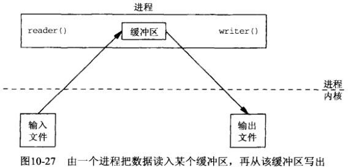

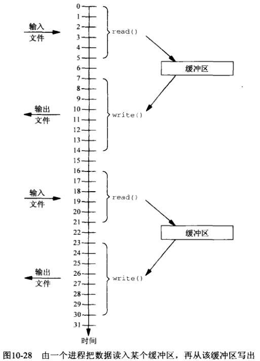

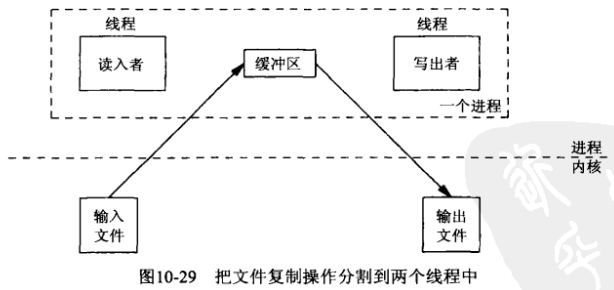

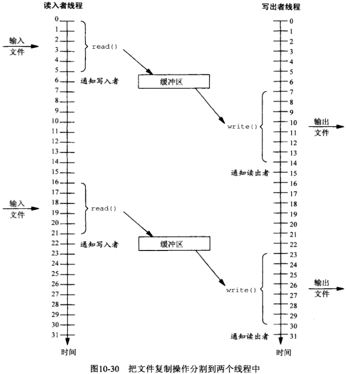

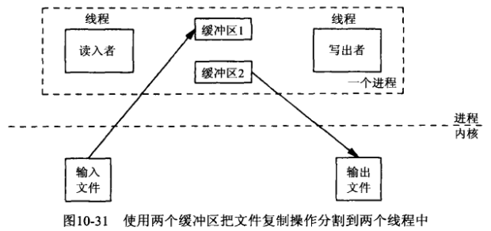

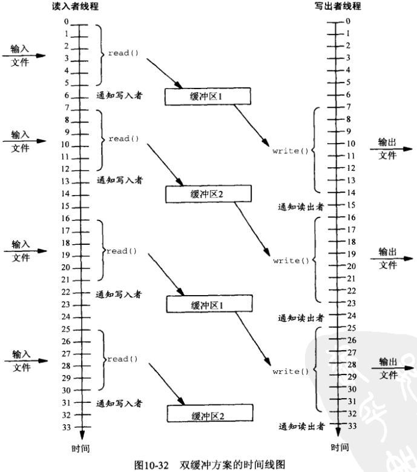


## 10.12 进程间共享信号量


## 10.13 信号量限制

Posix定义了两个信号量限制：

- `SEM_NSEMS_MAX` 一个进程可同时打开着的最大信号量（Posix要求至少为256）；
- `SEM_VALUE_MAX` 一个信号量的最大值（Posix要求至少为32767）.


## 10.14 使用FIFO实现信号量

### 10.14.1 sem_open函数

```c++
TODO
```

### 10.14.2 sem_close函数

```c++
TODO
```

### 10.14.3 sem_unlink函数

```c++
TODO
```

### 10.14.4 sem_post函数

```c++
TODO
```

### 10.14.5 sem_wait函数

```c++
TODO
```


## 10.15 使用内存映射I/O实现信号量

### 10.15.1 sem_open函数

```c++
TODO
```

### 10.15.2 sem_close函数

```c++
TODO
```

### 10.15.3 sem_unlink函数

```c++
TODO
```

### 10.15.4 sem_post函数

```c++
TODO
```

### 10.15.5 sem_wait函数

```c++
TODO
```

### 10.15.6 sem_trywait函数

```c++
TODO
```

### 10.15.7 sem_getvalue函数

```c++
TODO
```


## 10.16 使用System V信号量实现Posix信号量

### 10.16.1 sem_open函数

```c++
TODO
```

### 10.16.2 sem_close函数

```c++
TODO
```

### 10.16.3 sem_unlink函数

```c++
TODO
```

### 10.16.4 sem_post函数

```c++
TODO
```

### 10.16.5 sem_wait函数

```c++
TODO
```

### 10.16.6 sem_trywait函数

```c++
TODO
```

### 10.16.7 sem_getvalue函数

```c++
TODO
```


## 10.17 小结
