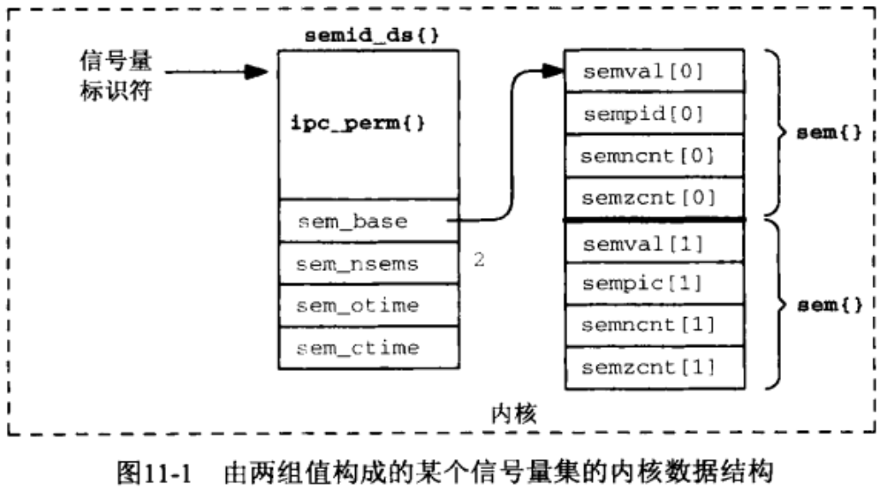

# 第11章 System V信号量

[TOC]


## 11.1 概述




## 11.2 semget函数

```cpp
#include <sys/sem.h>
int semget(key_t key, int nsems, int oflag);
```

- `key` 键
- `nsems` 集合中的信号量数
- `oflag` 标记
- 返回
  - 成功：非负信号量标识符(semaphore identifier)
  - 失败：-1

semget函数创建一个信号量集或访问一个已存在的信号量集。


## 11.3 semop函数

```c++
#include <sys/sem.h>
int semop(int semid, struct sembuf *opsptr, size_t nops);
```

- `semid` 信号量ID

- `opsptr` 指向sembuf结构

  ```c++
  struct sembuf {
    short sem_num;
    short sem_op;
    short sem_flg;
  };
  ```

- `nops` 由opsptr只想的sembuf结构数组中元素的数目

- 返回值

  - 成功：0
  - 失败：-1

使用semop函数对一个或多个信号量进行操作。


## 11.4 semctl函数

```c++
#include <sys/sem.h>
int semctl(int semid, int semmm, int cmd, ...);
```

- `semid` 带控制的信号量集标识

- `semnum` 信号量集内的某个成员标识(从0开始索引)；

- `cmd` 命令；支持以下值：

  - `GETVAL` 把semval的当前值作为函数返回值返回。既然信号量决不会是负数（semval被声明成一个unsigned short整数），那么成功的返回值总是非负数。
  - `SETVAL` 把semval值设置为arg.val。如果操作成功，那么相应信号量在所有进程中的信号量调整值（semadj）将被置为0。
  - `SETPID` 把sempid的当前值作为函数返回值返回。 
  - `GETNCNT` 把semncnt的当前值作为函数返回值返回。
  - `GETZCNT` 把semzcnt的当前值作为函数返回值返回。
  - `GETALL` 返回所制定信号量集内每个成员的semval值。这些值通过arg.array指针返回，函数本身的返回值则为0。注意，调用者必须分配一个unsigned short整数数组，该数组要足够容纳所指定信号量集内所有成员的semval值的，然后把arg.array设置成指向这个数组。
  - `SETALL` 设置所指定信号量集中每个成员的semval值。这些值是通过arg.array指针指定的。
  - `IPC_RMID` 把由semid指定的信号量集从系统中删除掉。
  - `IPC_SET` 设置所指定信号量集的semid_ds结构中的以下三个成员：sem_perm.uid, sem_perm.gid和sem_perm.mode，这些值来自由arg.buf参数指向的结构中的相应成员。semid_ds结构中的sem_ctime成员也被设置成当前时间。
  - `IPC_STAT` （通过arg.buf参数）返回所指定信号量集当前的semid_ds结构。注意，调用者必须首先分配一个semid_ds结构，并把arg.buf设置成指向这个结构。

- `...` 可选，取决于cmd

  ```c++
  union semun {
    int              val;
    struct semid_ds *buf;
    ushort          *array;
  }
  ```

- 返回

  - 成功：非负值
  - 失败：-1


## 11.5 简单的程序

### 11.5.1 semcreate程序

```c++
#include "unpipc.h"
int 
main(int argc, char **argv)
{
  int c, oflag, semid, nsems;
  oflag = SVSEM_MODE | IPC_CREAT;
  while ((c = Getopt(argc, argv, "e")) != -1) {
    switch (c) {
      case 'e':
        oflag |= IPC_EXCL;
        break;
    }
  }
  if (optind != argc - 2)
    err_quit("usage: semcreate [ -e ] <pathname> <nsems>");
  nsems = atoi(argv[optind + 1]);
  semid = Semget(Ftok(argv[optind], 0), nsems, oflag);
  exit(0);
}
```

*secreate程序*

### 11.5.2 semrmid程序

```c++
#include "unpipc.h"
int 
main(int argc, char **argv)
{
  int semid;
  if (argc != 2)
    err_quit("usage: semrmid <pathname>");
  semid = Semget(Ftok(argv[1], 0), 0, 0);
  Semctl(semid, 0, IPC_RMID);
  exit(0);
}
```

*semrmid函数*

### 11.5.3 semsetvalues程序

```c++
#include "unpipc.h"
int 
main(int argc, char **argv)
{
  int semid, nsems, i;
  struct semid_ds seminfo;
  unsigned short *ptr;
  union semun arg;
  if (argc < 2)
    err_quit("usage: semsetvalues <pathname> [ values ... ]");
  /* first get the number of semaphores in the set */
  semid = Semget(Ftok(argv[1], 0), 0, 0);
  arg.buf = &seminfo;
  Semctl(semid, 0, IPC_STAT, arg);
  nsems = arg.buf->sem_nsems;
  /* now get the values from the command line */
  if (argc != nsems + 2)
    err_quit("%d semaphores in set, %d values specified", nsems, argc - 2);
  /* allocate memory to hold all the values in the set, and store */
  ptr = Calloc(nsems, sizeof(unsigned short));
  arg.array = ptr;
  for (i = 0; i < nsems; i++)
    ptr[i] = atoi(argv[i + 2]);
  Semctl(semid, 0, SETALL, arg);
  exit(0);s
}
```

*semsetvalues函数*

### 11.5.4 semgetvalues程序

```c++
#include "unpipc.h"
int 
main(int argc, char **argv)
{
  int semid, nsems, i;
  struct semid_ds seminfo;
  unsigned short *ptr;
  union semun arg;
  if (argc != 2)
    err_quit("usage: semgetvalues <pathname>");
  /* first get the number of semaphores in the set */
  semid = Semget(Ftok(argv[1], 0), 0, 0);
  arg.buf = &seminfo;
  Semctl(semid, 0, IPC_STAT, arg);
  nsems = arg.buf->sem_nsems;
  /* allocate memory to hold all the values in the set */
  ptr = Calloc(nsems, sizeof(unsigned short));
  arg.array = ptr;
  /* fetch the values and print */
  Semctl(semid, 0, GETALL, arg);
  for (i = 0; i < nsems; i++)
    printf("semval[%d] = %d\n", i, ptr[i]);
  exit(0);
}
```

*semgetvalues程序*

### 11.5.5 semops程序

```c++
#include "unpipc.h"
int 
main(int argc, char **argv)
{
  int c, i, flag, semid, nops;
  struct sembuf *ptr;
  flag = 0;
  while ((c = Getopt(argc, argv, "nu")) != -1) {
    switch(c) {
      case 'n':
        flag |= IPC_NOWAIT;
        break;
      case 'u':
        flag |= SEM_UNDO;
        break;
    }
  }
  if (argc - optind < 2)
    err_quit("usage: semops [ -n ] [ -u ] <pathname> operation ...");
  semid = Semget(Ftok(argv[optind], 0), 0, 0);
  optind++;
  nops = argc - optind;
  /* allocate memory to hold operations, store, and perform */
  ptr = Calloc(nops, sizeof(struct sembuf));
  for (i = 0; i < nops; i++) {
    ptr[i].sem_num = i;
    ptr[i].sem_op = atoi(argv[optind + i]);
    ptr[i].sem_flg = flag;
  }
  Semop(semid, ptr, nops);
  exit(0);s
}
```

*semops程序*


## 11.6 文件上锁

```c++
TODO
```

*使用System V信号量实现的文件上锁*


## 11.7 信号量限制

| 名字   | 说明                               | DUnix 4.0B | Solaris 2.6 |
| ------ | ---------------------------------- | ---------- | ----------- |
| semmni | 系统范围最大信号量集数             | 16         | 10          |
| semmsl | 每个信号量最大信号量数             | 25         | 25          |
| semmns | 系统范围最大信号量数               | 400        | 60          |
| semopm | 每个semop调用最大操作数            | 10         | 10          |
| semmnu | 系统范围最大复旧结构数             |            | 30          |
| semume | 每个复旧结构最大复旧项数           | 10         | 10          |
| semvms | 任何信号量的最大值                 | 32767      | 32767       |
| semaem | 最大退出时调整（adjust-on-exit）值 | 16384      | 16384       |

*System V信号量的典型限制值*

```c++
TODO
```

*确定System V信号量上的系统限制值*


