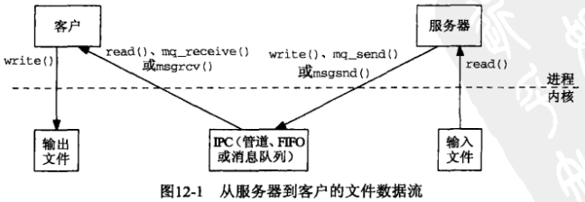
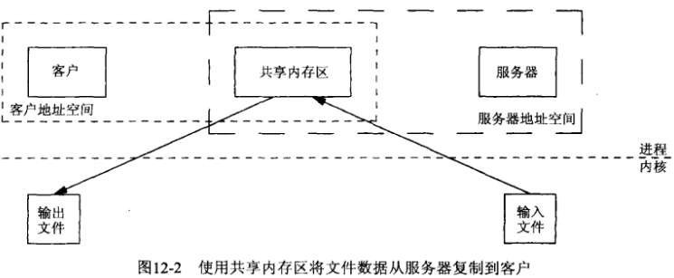
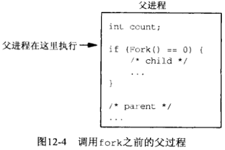
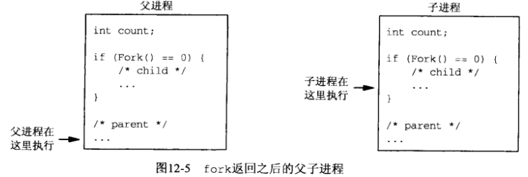
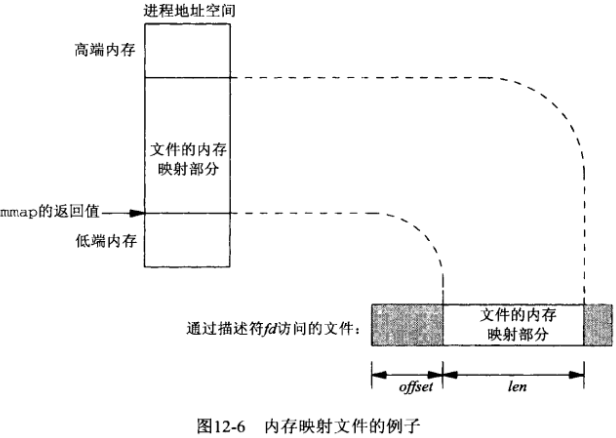
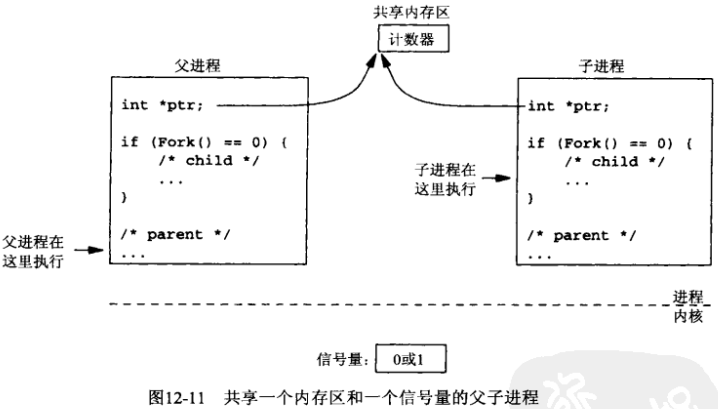
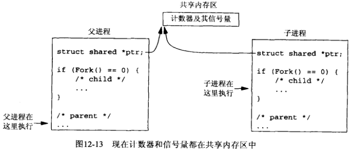
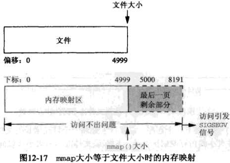
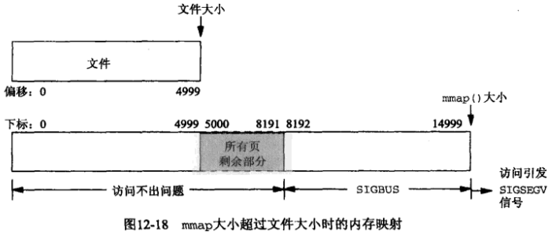

# 第12章 共享内存区介绍


## 12.1 概述





```c++
TODO
```






## 12.2 mmap, munmap和msync函数

```c++
#include <sys/mman.h>
void *mmap(void *addr, size_t len, int prot, int flags, int fd, off_t offset);
```

- `addr` 被映射到的进程内空间的起始地址；

- `len` 映射到调用进程地址空间中的字节数；

- `prot` 内存映射区操作权限

  | prot       | 说明         |
  | ---------- | ------------ |
  | PROT_READ  | 数据可读     |
  | PROT_WRITE | 数据可写     |
  | PROT_EXEC  | 数据可执行   |
  | PROT_NONE  | 数据不可访问 |

- `flags` 操作标记

  | Flags       | 说明               |
  | ----------- | ------------------ |
  | MAP_SHARED  | 变动是共享的       |
  | MAP_PRIVATE | 变动是私自的       |
  | MAP_FIXED   | 准确地解释addr参数 |

- `fd` 被映射的文件描述符；

- `offset` 被映射文件开头的字节偏移量。

- `返回值`

  - 成功：被映射区的起始地址；
  - 失败：MAP_FAILED。

mmap函数把一个文件或一个Posix共享内存取对象映射到调用进程的地址空间。使用该函数有三个目的：

1. 使用普通文件以提供内存映射I/O；
2. 使用特殊文件以提供匿名内存映射；
3. 使用`shm_open`以提供无亲缘关系进程间的Posix共享内存区。



```c++
#include <sys/mman.h>
int munmap(void *addr, size_t len);
```

- `addr` 地址空间；

- `len` 映射区大小。

- `返回值`

  成功：0

  失败：-1

从某个进程的地址空间删除一个映射关系。

```c++
#include <sys/mman.h>
int msync(void *addr, size_t len, int flags);
```

- `addr` 内存映射区；

- `len` 内存映射区大小；

- `flags` 标记

  | 常值          | 说明                 |
  | ------------- | -------------------- |
  | MS_ASYNC      | 执行异步写           |
  | MS_SYNC       | 执行同步写           |
  | MS_INVALIDATE | 使高速缓存的数据失效 |

- 返回值

  成功：0

  失败：-1

同步硬盘上的文件内容与内存映射区中的内容。


## 12.3 在内存映射文件中给计数器持续加1

```c+++
TODO
```



```c++
TODO
```




## 12.4 4.4BSD匿名内存映射

```c++
TODO
```

*4.4BSD匿名内存映射*


## 12.5 SVR4/dev/zero内存映射

```c++
TODO
```

*SVR4 /dev/zero内存映射*


## 12.6 访问内存映射的对象

```c++
TODO
```

*访问其大小可能不同于文件大小的内存映射区*





```c++
TODO
```

*允许文件大小增长的内存映射区例子*


## 12.7 小结

