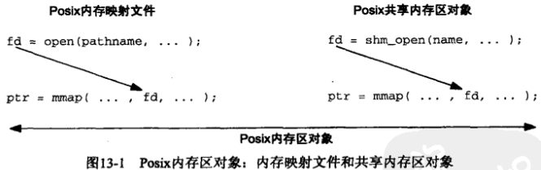
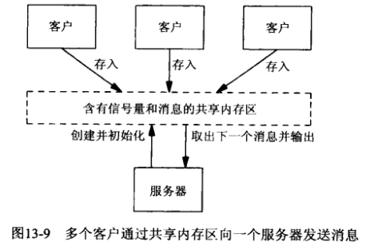

# 第13章 Posix共享内存区


## 13.1 概述

Posix.1提供了两种在无亲缘关系进程间共享内存区的方法：

1. `内存映射文件（memory-mapped file）`由open函数打开，由mmap函数把得到的描述符映射到当前进程地址空间中的一个文件。
2. `共享内存区对象（shared-memory object）`由shm_open打开一个Posix.1 IPC名字，所返回的描述符由mmap函数映射到当前进程的地址空间。




## 13.2 shm_open和shm_unlink函数

```c++
#include <sys/mman.h>
int shm_open(const char* name, int oflag, mode_t mode);
```

- `name` 内存区对象名

- `oflag` 标志

- `mode` 权限位

- `返回值`

  成功：非负描述符

  失败：-1

创建一个共享内存区对象的名。

```c++
#include <sys/mman.h>
int shm_unlink(const char* name);
```

- `name` 内存区对象名

删除一个共享内存区对象的名。


## 13.3 ftruncate和fstat函数

```c++
#include <unistd.h>
int ftruncate(int fd, off_t length);
```

- `fd` 文件描述符

- `length` 内存区对象大小

- `返回值`

  成功：0

  失败：-1

修改普通文件或共享内存区对象的大小。

```c++
#include <sys/types.h>
#include <sys/stat.h>
int fstat(int fd, struct stat *buf);

struct stat {
    ...
    mode_t st_mode;
    uid_t  st_uid;
    gid_t  st_gid;
    off_t  st_size;
    ...
}
```

- `fd` 文件描述符

- `buf` 用于返回结果的缓冲区

- `返回值`

  成功：0

  失败：-1

获取共享内存区对象信息。


## 13.4 简单的程序

### 13.4.1 shmcreate程序

```c++
TODO
```

*创建一个具有所指定大小的Posix共享内存区对象*

### 13.4.2 shmunlink程序

```c++
TODO
```

*删除一个共享内存区对象的名字*

### 13.4.3 shmwrite程序

```c++
TODO
```

*打开一个共享内存区对象，填写一个数据模式*

### 13.4.4 shmread程序

```c++
TODO
```

*打开一个共享内存区对象，验证其数据模式*

### 13.4.5 例子

### 13.4.6 例子

```c++
TODO
```

*共享内存区在不同进程中可以出现在不同的地址*


## 13.5 给一个共享的计数器持续加1

```c++
TODO
```

*创建并初始化共享内存区和信号量的程序*

```c++
TODO
```

*给存放在共享内存区中的一个计数器加1的程序*


## 13.6 向一个服务器发送消息



```c++
TODO
```

*定义共享内存区布局的头文件*

```c++
TODO
```

*从共享内存区中取得并输出消息的服务器程序*

```c++
TODO
```

*在共享内存区中给服务器存放消息的客户程序*


## 13.7 小结

