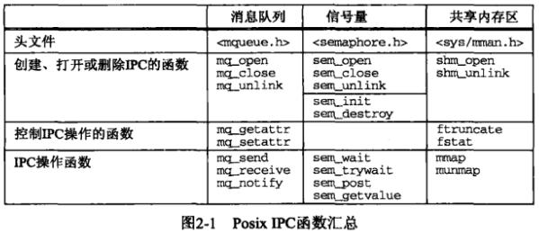
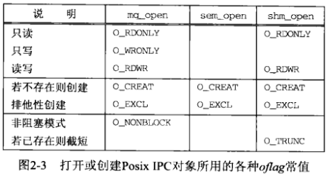
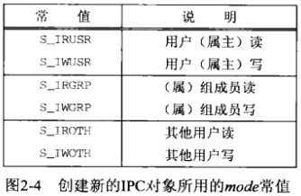
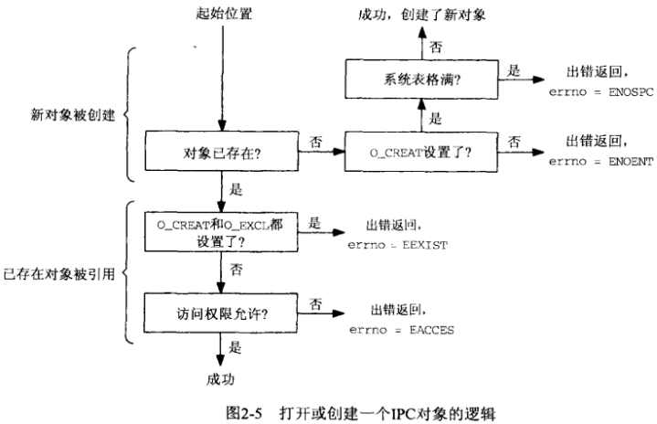
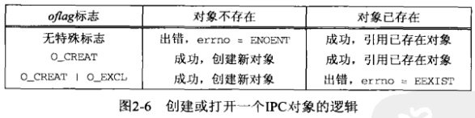

# 第2章 Posix IPC


## 2.1 概述




## 2.2 IPC名字

```c++
#include "unpipc.h"
char *px_ipc_name(const char* name);
```

- `name` IPC名字

- `返回值`

  成功：非空指针

  失败：NULL

为定位Posix IPC名字而加上正确的前缀目录。

```c++
#include "unpipc.h"
char *
px_ipc_name(const char *name)
{
  char *dir, *dst, *slash;
  if ((dst = malloc(PATH_MAX)) == NULL)
    return(NULL);
  
  if ((dir = getenv("PX_IPC_NAME")) == NULL) {
#ifdef POSIX_IPC_PREFIX
    dir = POSIX_IPC_PREFIX;
#else
    dir = "/tmp/";
#endif
  }
  
  slash = (dir[strlen(dir) - 1] == '/') ? "" : "/";
  snprintf(dst, PATH_MAX, "%s%s%s", dir, slash, name);
  return(dst);
}
```

*我们的px_ipc_name函数*


## 2.3 创建与打开IPC通道



以下标志是可选的：

- `O_CREAT` 

  若不存在则创建由函数第一个参数所指定名字的消息队列，信号量或共享内存区对象。

  创建一个新的消息队列，信号量或共享内存区对象时，至少需要另外一个称为mode的参数。该参数指定权限位：

  

- `O_EXCL`

  如果该标志和`O_CREAT`一起指定那么IPC函数只在所指定名字的消息队列，信号量或共享捏存取对象不存在时才创建新的对象。如果该对象已经存在，而且指定了`O_CREAT|O_EXCL`，那么返回一个`EEXIST`错误。

- `O_NONBLOCK`

  该标志使得一个消息队列在队列为空时的读或队列填满时的写不被阻塞。

- `O_TRUNC`

  如果以读写模式打开了一个已存在的共享内存区对象，那么该标志将使得该对象的长度被截成0.






## 2.4 IPC权限


## 2.5 小结

