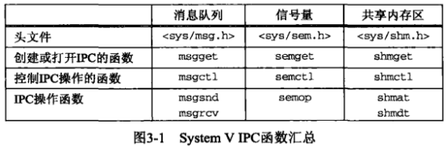
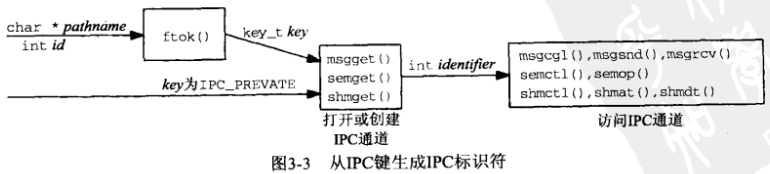
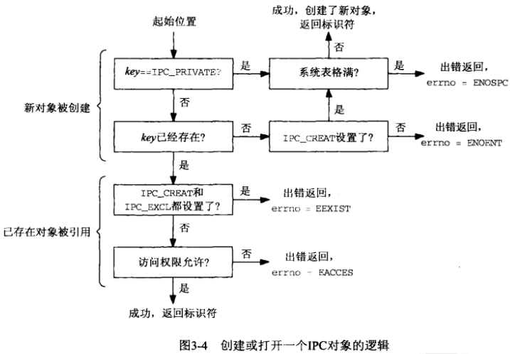
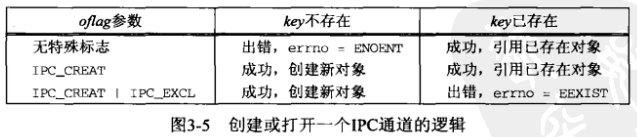
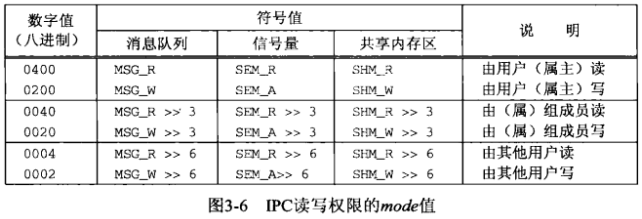

# 第3章 System V IPC


## 3.1 概述




## 3.2 key_t键和ftok函数

```c++
#include <sys/ipc.h>
key_t ftok(const char* pathname, int id);
```

- `pathname` 路径

- `id` 整数

- `返回值`

  成功：IPC键

  失败：-1

*把一个路径和一个整数标识符转换成IPC键。*

```c++
TODO
```

*获取并输出文件系统信息和IPC键*


## 3.3 ipc_perm结构

内核给每个IPC对象维护一个信息结构：

```c++
struct ipc_perm {
	uid_t   uid;
    gid_t   gid;
    uid_t   cuid;
    gid_t   cgid;
    mode_t  mode;
    ulong_t seq;
    key_t   key;
};
```


## 3.4 创建与打开IPC通道








## 3.5 IPC权限

当使用某个`getXXX`函数（指定IPC_CREAT标志）创建一个新的IPC对象时，以下信息就保存到该对象的ipc_perm结构中。

1. oflag参数种某些位初始化ipc_perm结构的mode成员:

   

2. cuid和cgid成员分别设置为调用进程的有效用户ID和有效组ID。这两个成员合称为创建者ID（creator ID）。

3. ipc_perm结构的uid和gid成员也分别设置为调用进程的有效用户ID和有效组ID。这两个成员合称为属主ID（owner ID）。


## 3.6 标识符重用

```c++
TODO
```

*连续输出由内核赋予的消息队列标识符10次*


## 3.7 ipcs和ipcm程序


## 3.8 内核限制


## 3.9 小结

