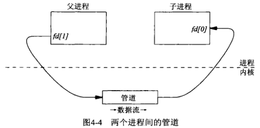
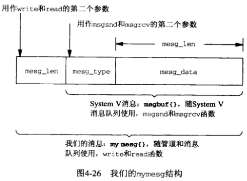

# 第4章 管道和FIFO


## 4.1 概述


## 4.2 一个简单的客户-服务器例子


## 4.3 管道

```c++
#include <unistd.h>
int pipe(int fd[2]);
```

- `fd` 返回文件描述符数组（fd[0]：读，fd[1]：写）

- `返回值`

  成功：0

  失败：-1

创建管道。





```c++
TODO
```

*使用两个管道的客户-服务器程序main函数*

```c++
TODO
```

*使用两个管道的客户-服务器程序client函数*

```c++
TODO
```

*使用两个管道的客户-服务器程序server函数*


## 4.4 全双工管道


```c++
TODO
```

*测试全双工管道的双向通信能力*


## 4.5 popen和pclose函数

```c++
#include <stdio.h>
FILE *popen(const char *command, const char *type);
```

- `command` shell命令行

- `type` 类型

  - 如果为r，那么调用进程读进command的标准输出。
  - 如果为w，那么调用进程写到command的标准输入。

- `返回值`

  成功：文件指针

  失败：NULL

创建管道并启动另一个进程。

```c++
#include <stdio.h>
int pclose(FILE *stream);
```

- `stream` 标准I/O流

- `返回值`

  成功：shell的终止状态

  失败：-1

关闭一个由popen创建的标准I/O流。

```c++
TODO
```

*使用popen的客户-服务器程序*


## 4.6 FIFO

FIFO（first in, first out）也叫做有名管道（named pipe）。

```c++
#include <sys/types.h>
#include <sys/stat.h>
int mkfifo(const char *pathname, mode_t mode);
```

- `pathname` FIFO的名字（路径名）

- `mode` 文件权限位

- `返回值`

  成功：0

  失败：-1

创建FIFO。

### 4.6.1 例子

```c++
TODO
```

*使用两个FIFO的客户-服务器程序main函数*


### 4.6.2 例子：无亲缘关系的客户与服务器

```c++
TODO
```

*独立服务器程序main函数*

```c++
TODO
```

*客户程序和服务器程序都包含的fifo.h头文件*

```c++
TODO
```

*独立客户程序main函数*


## 4.7 管道和FIFO的额外属性


下面是关于管道或FIFO的读出与写入的若干额外规则：

- 如果请求读出的数据量多余管道或FIFO中当前可用数据量，那么只返回这些可用的数据。
- 如果请求写入的数据的字节数小于或等于PIPE_BUF（一个Posix限制值），那么write操作保证是原子的。如果请求写入的数据的字节数大于PIPE_BUF，那么write操作不能保证是原子的。
- O_NONBLOCK标志的设置对write操作的原子性没有影响（原子性完全是由所请求字节数是否小于等于PIPE_BUF决定的）：
  1. 如果待写的字节数小于等于PIPE_BUF：
     - 如果该管道或FIFO中有足以存放所请求字节数的空间，那么所有数据字节都写入。
     - 如果该管道或FIFO中没有足以存放所请求字节数的空间，那么立即返回一个EAGAIN错误。
  2. 如果待写字节数大于PIPE_BUF：
     - 如果该管道或FIFO中至少有1字节空间，那么内核写入该管道或FIFO能容纳数目的数据字节，该数目同时作为来自write的返回值。
     - 如果该管道或FIFO已满，那么立即返回一个EAGAIN错误。
- 如果向一个没有为读打开着的管道或FIFO写入，那么内核将产生一个SIGPIPE信号：
  1. 如果调用进程既没有捕获也没有忽略该SIGPIPE信号，所采取的默认行为就是终止该进程。
  2. 如果调用进程忽略了该SIGPIPE信号，或者捕获了该信号并从其信号处理程序中返回，那么write返回了一个EPIPE错误。


## 4.8 单个服务器，多个客户


```c++
TODO
```

*处理多个客户请求的FIFO服务器程序*

```c++
TODO
```

*与图4-23中服务器程序协同工作的客户程序*

### 4.8.1 FIFO write的原子性

### 4.8.2 FIFO与NFS的关系


## 4.9 对比迭代服务器与并发服务器


## 4.10 字节流与消息

字节流长度截断技巧：

- 带内特殊终止序列。
- 显式长度。
- 每次连接一个记录。

```c++
TODO
```

*我们的mymesg结构及相关定义*



```c++
TODO
```

*mesg_send函数*

```c++
TODO
```

*mesg_recv函数*

```c++
TODO
```

*我们的使用消息的client函数*

```c++
TODO
```

*我们的使用消息的server函数*


## 4.11 管道的FIFO限制

系统加于管道和FIFO的唯一限制为：

- `OPEN_MAX`一个进程在任意时刻打开的最大描述符数（Posix要求至少为16）；
- `PIPE_BUF`可原子地写往一个管道或FIFO的最大数据量（Posix要求至少为512）。

```c++
TODO
```

*在运行时确定PIPE_BUF和OPEN_MAX的值*


## 4.12 小结

