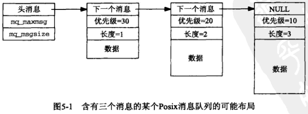
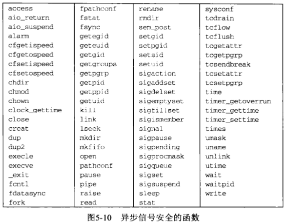
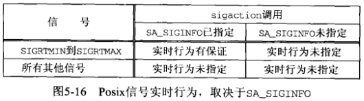
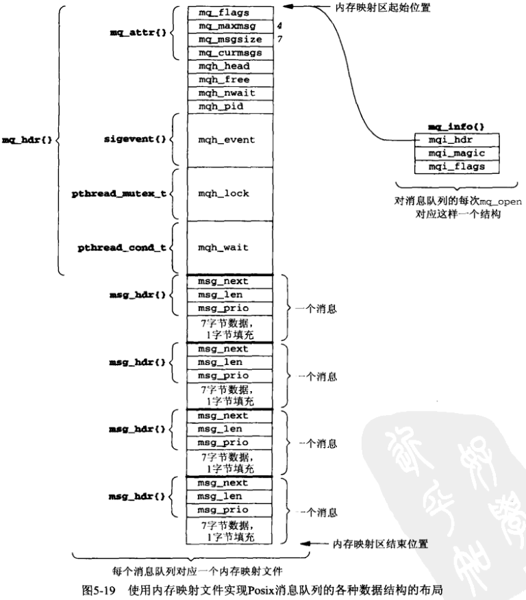

# 第5章 Posix消息队列


## 5.1 概述




## 5.2 mq_open, mq_close和mq_unlink函数

```c++
#include <mqueue.h>
mqd_t mq_open(const char *name, int oflag, ...);
```

- `name` 消息队列名

- `oflag` 标记，由`O_RDONLY, O_WRONLY或O_RDWR`按位组合。

- `返回值`

  成功：消息队列描述符

  失败：-1

*创建一个新的消息队列或打开一个已存在的消息队列*

```c++
#include <mqueue.h>
int mq_close(mqd_t mqdes);
```

- `mqdes` 消息队列描述符

- `返回值`

  成功：0

  失败：-1

关闭消息队列。

```c++
#include <mqueue.h>
int mq_unlink(const char *name);
```

- `name` 消息队列名

- `返回值`

  成功：0

  失败：-1

解绑消息队列（引用计数-1）。

### 5.2.1 例子：mqcreatel程序

```c++
TODO
```

*指定排他性创建标志，创建一个消息队列*

### 5.2.2 例子：mqunlink程序

```c++
TODO
```

*mq_unlink一个消息队列*


## 5.3 mq_getattr和mq_setattr函数

```c++
struct mq_attr {
    long mq_flags;
    long mq_maxmsg;
    long mq_msgsize;
    long mq_curmsgs;
};
```

```c++
#include <mqueue.h>
int mq_getattr(mqd_t mqdes, struct mq_attr *attr);
```

- `mqdes` 消息队列标识

- `attr` 返回属性

- `返回值`

  成功：0

  失败：-1

返回消息队列属性。

```c++
#include <mqueue.h>
int mq_setattr(mqd_t mqdes, const struct mq_attr *attr, struct mq_attr *oattr);
```

- `mqdes` 消息队列标识

- `attr` 消息队列属性

- `oattr` 返回旧的消息队列属性

- `返回值`

  成功：0

  失败：-1

设置消息队列属性。

### 5.3.1 例子：mqgetattr程序

```c++
TODO
```

### 5.3.2 例子：mqcreate程序

```c++
TODO
```


## 5.4 mq_send和mq_receive函数

```c++
#include <mqueue.h>
int mq_send(mqd_t mqdes, const char* ptr, size_t len, unsigned int prio);
```

- `mqdes` 消息队列

- `ptr` 缓冲区

- `len` 缓冲区长度

- `prio` 消息优先级（必须小于`MQ_PRIO_MAX`）

- `返回值`

  成功：0

  失败：-1

写消息到队列。

```c++
#include <mqueue.h>
ssize_t mq_receive(mqd_t mqdes, char *ptr, size_t len, unsigned int *priop);
```

- `mqdes` 消息队列

- `ptr` 缓冲区

- `len` 缓冲区长度（不能小于`mq_attr`结构的`mq_msgsize`，否则会立即返回`EMSGSIZE`错误）

- `priop` 消息优先级（必须小于`MQ_PRIO_MAX`）

- `返回值`

  成功：读到的字节数

  失败：-1

从消息队列中读消息。

### 5.4.1 例子：mqsend程序

```c++
TODO
```

### 5.4.2 例子：mqreceive程序

```c++
TODO
```


## 5.5 消息队列限制

消息队列限制：

- `mq_mqxmsg `队列中的最大消息数；
- `mq_msgsize` 给定消息的最大字节数；
- `MQ_OPEN_MAX` 一个进程能够同时拥有的打开着消息队列的最大数目（Posix要求它至少为8）；
- `MQ_PRIO_MAX` 任意消息的最大优先级值加1（Posix要求它至少为32）。

```c++
#include "unpipc.h"

int main(int argc, char **argv)
{
    printf("MQ_OPEN_MAX = %1d, MQ_PRIO_MAX = %1d\n",
           sysconf(_SC_MQ_OPEN_MAX), sysconf(_SC_MQ_PRIO_MAX));
}
```

*例：调用sysconf获取消息队列限制*


## 5.6 mq_notify函数

Posix消息队列允许异步事件通知（asynchronous event notification），以告知何时有一个消息放置到了某个空消息队列中。这种通知有两种方式可供选择：

- 产生一个信号；
- 创建一个线程来执行一个指定的函数。

```c++
union sigval {
    int sigval_int;
    void *sigval_ptr;
};
struct sigevent {
    int sigev_notify;
    int sigev_signo;
    union sigval sigev_value;
    void (*sigev_notify_function)(union sigval);
    pthread_attr_t *sigev_notify_attributes;
}
```

```c++
#include <mqueue.h>
int mq_notify(mqd_t mqdes, const struct sigevent *notification);
```

- `mqdes` 消息队列
- `notification` 异步事件
  - 如果`notification`参数非空，那么当前进程希望在有一个消息到达所指定的先前为空的队列时得到通知。
  - 如果notification参数为空指针，而且当前进程目前被注册为接收所指定队列的通知，那么已存在的注册将被撤销。
  - 任何时刻只有一个进程可以被注册为接受某个给定队列的通知。
  - 当有一个消息到达某个先前为空的队列，而且已有一个进程被注册为接收该队列的通知时，只有在没有任何线程阻塞在该队列的mq_receive调用中的前提下，通知才会发出。这就是说，在`mq_receive`调用中的阻塞比任何通知的注册的都优先。
  - 当该通知被发送给它的注册时，其注册即被撤销。该进程必须再次调用`mq_notify`以重新注册的。

为消息队列建立/删除异步事件通知。

### 5.6.1 例子：简单的信号通知

```c++
TODO
```

### 5.6.2 Posix信号：异步信号安全函数



### 5.6.3 例子：信号通知

```c++
TODO
```

### 5.6.4 例子：使用非阻塞mq_receive的信号通知

```c++
TODO
```

### 5.6.5 例子：使用sigwait代替信号处理程序的信号通知

```c++
#include <signal.h>
int sigwait(const sigset_t *set, int *sig);
```

- `set` 信号集

- `sig` 信号

- 返回值

  成功：0

  失败：错误码（正数）

等待某个指定的信号。

```c++
TODO
```

*伴随sigwait使用mq_notify*

### 5.6.6 例子：使用select的Posix消息队列

```c++
TODO
```

*伴随管道使用信号通知*

### 5.6.7 例子：启动线程

```c++
TODO
```

*启动一个新线程的mq_notify*


## 5.7 Posix实时信号

信号可划分为两个大组：

- 其值在SIGRTMIN和SIGRTMAX之间（包括两者在内）的实时信号。
- 所有其他信号，如：SIGALRM, SIGINT, SIGKILL等。



术语`实时行为（reltime behavior）`隐含如下特征：

- 信号是排队的。
- 当有多个SIGRTMIN到SIGRTMAX范围内的解阻塞信号排队时，值较小的信号先于值较大的信号递交。
- 当某个非实时信号递交时，传递给它的信号处理程序的唯一参数是该信号的值。

### 5.7.1 例子

```c++
TODO
```

### 5.7.2 signal_rt函数

```c++
TODO
```


## 5.8 使用内存映射I/O实现的Posix消息队列



```c++
TODO
```

*mqueue.h头文件*

### 5.8.1 mq_open函数

```c++
TODO
```

*mq_open函数：第一部分*

```c++
TODO
```

*mq_open函数第二部分：完成新队列的初始化*

```c++
TODO
```

*mq_open函数第三部分：打开已存在的队列*

### 5.8.2 mq_close函数

```c++
TODO
```

*mq_close函数*

### 5.8.3 mq_unlink函数

```c++
TODO
```

*mq_unlink函数*

### 5.8.4 mq_getattr函数

```c++
TODO
```

*mq_getattr函数*

### 5.8.5 mq_setattr函数

```c++
TODO
```

*mq_setattr函数*

### 5.8.6 mq_notify函数

```c++
TODO
```

*mq_notify函数*

### 5.8.7 mq_send函数

```c++
TODO
```

*mq_send函数：前半部分*

```c++
TODO
```

*mq_send函数：后半部分*

### 5.8.8 mq_receive函数

```c++
TODO
```

*mq_receive函数：前半部分*

```c++
TODO
```

*mq_receive函数：后半部分*


## 5.9 小结

