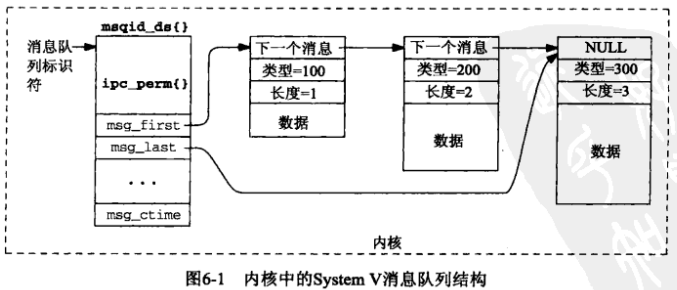
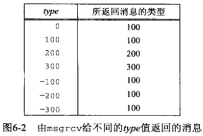
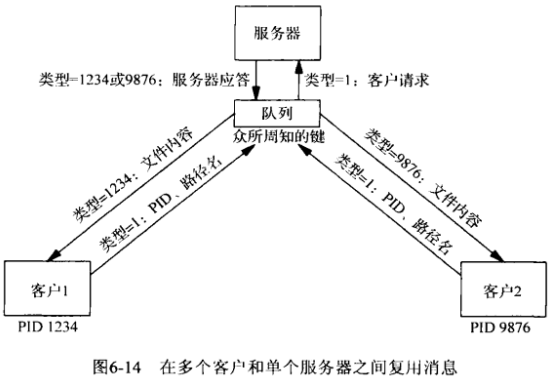
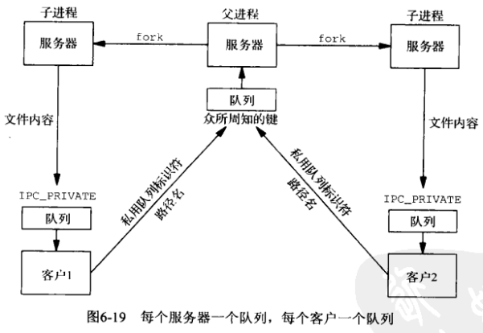
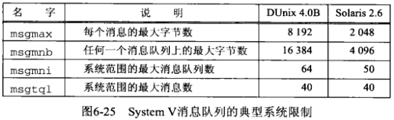

# 第6章 System V 消息队列


## 6.1 概述




## 6.2 msgget函数

```c++
#include <sys/msg.h>
int msgget(key_t key, int oflag);
```

- `key` 消息队列标识（由ftok返回或`IPC_PRIVATE`）

- `oflag` 读写权限

- `返回值`

  成功：非负标识符

  失败：-1

创建/访问一个消息队列。


## 6.3 msgsnd函数

```c++
#include <sys/msg.h>
int msgsnd(int msqid, const void *ptr, size_t length, int flag);
```

- `msqid` 消息队列ID

- `ptr` 消息

  ```c++
  struct msgbuf{
      long mtype;
      char mtext[1];
  };
  ```

- `length` 消息长度

- `flag` 标记

  - 0：
  - IPC_NOWAIT：如果没有存放新消息的可用空间，函数立即返回；如果此标记未指定，那么调用线程将被投入睡眠，直到以下条件之一被满足：
    1. 具备存放新消息的空间；
    2. 由msgqid标识的消息队列从系统中删除（这种情况返回一个EIDRM错误）；
    3. 调用线程被某个捕获的信号所中断（这种情况返回一个EINTR错误）。

- `返回值`

  成功：0

  失败：-1

向消息队列发送一个消息。


## 6.4 msgrcv函数

```c++
#include <sys/msg.h>
ssize_t msgrcv(int msqid, void *ptr, size_t length, long type, int flag);
```

- `msqid` 消息队列ID

- `ptr` 缓冲区指针

- `length` 缓冲区容量

- `type` 消息类型

  - `0`：返回队列中的第一个消息；

  - `> 0`：返回队列中**该类型**的第一个消息；

  - `< 0`：返回队列中类型值小于或等于该类型值中最小的第一个消息。

  

- `flag` 控制标记

  - `IPC_NOWAIT` 当消息不在队列中时，立即返回一个ENOMSG错误；
  - `MSG_NOERROR` 当消息长度大于length时，截断消息，不返回错误。

- `返回值`

  成功：读入的字节数

  失败：-1

从消息队列中读一条消息。


## 6.5 msgctl函数

```c++
#include <sys/msg.h>
int msgctl(int msqid, int cmd, struct msqid_ds *buff);
```

- `msqid` 消息队列

- `cmd` 控制命令

  - `IPC_RMID` 删除消息队列，该队列上的任何消息都被丢弃；
  - `IPC_SET` 设置`msqid_ds`值；
  - `IPC_STAT` 返回消息队列对应的`msqid_ds`结构。

- `buff` 命令参数

- `返回值`

  成功：0

  失败：-1

控制消息队列。

```c++
TODO
```

*使用msgctl命令的例子*


## 6.6 简单的程序

### 6.6.1 msgcreate程序

```c++
TODO
```

*创建一个System V消息队列*

### 6.6.2 msgsnd程序

```c++
TODO
```

*往一个System V消息队列中加一个消息*

### 6.6.3 msgrcv程序

```c++
TODO
```

*从一个System V消息队列中读出一个消息*

### 6.6.4 msgrmid程序

```c++
TODO
```

*删除一个System V消息队列*

### 6.6.5 例子

### 6.6.6 msgrcvid程序

```c++
TODO
```

*只知道标识符时从一个System V消息队列中读*


## 6.7 客户-服务器例子

```c++
TODO
```


## 6.8 复用消息

与一个队列中的每个消息相关联的类型字段提供了两个特性：

1. 类型字段可用于标识消息，从而允许多个进程在单个队列上`复用（multiplex）`消息。
2. 类型字段可用作优先级字段。

### 6.8.1 例子：每个应用一个队列



```c++
TODO
```

### 6.8.2 例子：每个客户一个队列



```c++
TODO
```


## 6.9 消息队列上使用select和poll


## 6.10 消息队列限制



```c++
TODO
```

*确定System V消息队列上的系统限制*


## 6.11 小结

