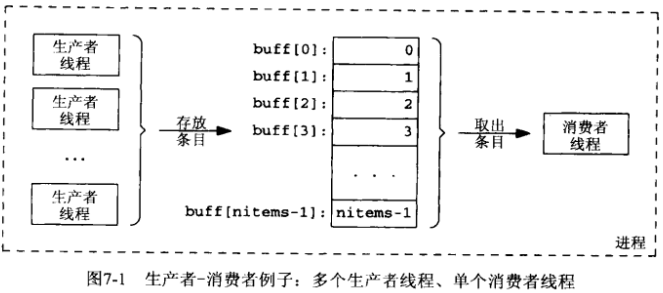

# 第7章 互斥锁和条件变量


## 7.1 概述


## 7.2 互斥锁：上锁与解锁

```c++
#include <pthread.h>
int pthread_mutex_lock(pthread_mutex_t *mptr);
```

- `mptr` 互斥量

- `返回值`

  成功：0

  失败：错误码（正数）

上锁。

```c++
#include <pthread.h>
int pthread_mutex_trylock(pthread_mutex_t *mptr);
```

- `mptr` 互斥量

- `返回值`

  成功：0

  失败：错误码（正数）

上锁（非阻塞），如果已经锁住，返回一个`EBUSY`错误。

```c++
#include <pthread.h>
int pthread_mutex_unlock(pthread_mutex_t *mptr);
```

- `mptr` 互斥量

- `返回值`

  成功：0

  失败：错误码（正数）

解锁。


## 7.3 生产者-消费者问题



```c++
TODO
```


## 7.4 对比上锁与等待

```c++
TODO
```


## 7.5 条件变量：等待与信号发送

```c++
#include <pthread.h>
int pthread_cond_wait(pthread_cond_t *cptr, pthread_mutex_t *mptr);
```

- `cptr` 条件变量

- `mptr` 互斥量

- `返回值`

  成功：0

  失败：错误码（正数）

等待条件变量唤醒。

```c++
#include <pthread.h>
int pthread_cond_signal(pthread_cond_t *cptr);
```

- `cptr` 条件变量

- `返回值`

  成功：0

  失败：错误码（正数）

唤醒条件变量上的一个线程。

```c++
TODO
```


## 7.6 条件变量：定时等待和广播

```c++
#include <pthread.h>
int pthread_codn_broadcast(pthread_cond_t *cptr);
```

- `cptr`条件变量

- `返回值`

  成功：0

  失败：错误码（正数）

唤醒阻塞在条件变量上的所有线程。

```c++
#include <pthread.h>
int pthread_cond_timedwait(pthread_cond_t *cptr, pthread_mutex_t *mptr,
                           const struct tiemspec *abstime);
```

- `cptr` 条件变量

- `mptr` 互斥量

- `abstime` 阻塞时长限制

- `返回值`

  成功：0

  失败：错误码（正数）

等待条件变量唤醒。


## 7.7 互斥锁和条件变量的属性

```c++
#include <pthread.h>
int pthread_mutexattr_init(pthread_mutexattr_t *attr);
int pthread_mutexattr_getshared(const pthread_mutexattr_t *attr, int *valptr);
int pthread_mutexattr_setshared(pthread_mutexattr_t *attr, int *valptr);
int pthread_mutexattr_destroy(pthread_mutexattr_t *attr);
```

- `attr` 互斥量属性

- `valptr` 属性值

- `返回值`

  成功：0

  失败：错误码（正数）

初始化/读/写/销毁互斥量属性。

```c++
#include <pthread.h>
int pthread_mutex_init(pthread_mutex_t *mptr, const pthread_mutexattr_t *attr);
int pthread_mutex_destroy(pthread_mutex_t *mptr);
```

- `mptr` 互斥量

- `attr` 互斥量属性

- `返回值`

  成功：0

  失败：错误码（正数）

初始化/销毁互斥量。

```c++
#include <pthread.h>
int pthread_condattr_init(pthread_contattr_t *attr);
int pthread_condattr_getshared(const pthread_contattr_t *attr, int *valptr);
int pthread_condattr_setshared(pthread_contattr_t *attr, int *valptr);
int pthread_condattr_destroy(pthread_contattr_t *attr);
```

- `attr` 条件变量属性

- `valptr` 属性值

- `返回值`

  成功：0

  失败：错误码（正数）

初始化/读/写/销毁条件变量属性。

```c++
#include <pthread.h>
int pthread_cond_init(pthread_mutex_t *mptr, const pthread_mutexattr_t *attr);
int pthread_cond_destroy(pthread_mutex_t *mptr);
```

- `mptr` 条件变量

- `attr` 条件变量属性

- `返回值`

  成功：0

  失败：错误码（正数）

初始化/销毁条件变量。


## 7.8 小结

