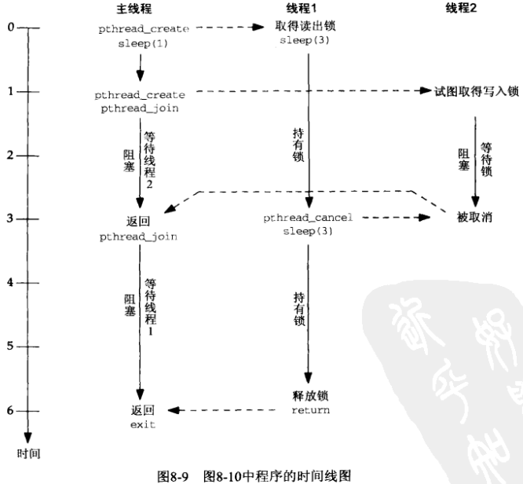

# 第8章 读写锁


## 8.1 概述

读写锁分配规则：

1. 只要没有线程持有某个给定的读写锁用于写，那么任意数目的线程可以持有该读写锁用于读。
2. 仅当没有线程持有某个给定的读写锁用于读或写时，才能分配该读写锁用于写。


## 8.2 获取与释放读写锁

```c++
#include <pthread.h>
int pthread_rwlock_rdlock(pthread_rwlock_t *rwptr);
int pthread_rwlock_wrlock(pthread_rwlock_t *rwptr);
int pthread_rwlock_unlock(pthread_rwlock_t *rwptr);
```

- `rwptr` 读/写锁

- `返回值`

  成功：0

  失败：错误码（正数）

获取/释放 读/写锁。

```c++
#include <pthread.h>
int pthread_rwlock_tryrdlock(pthread_rwlock_t *rwptr);
int pthread_rwlock_trywrlock(pthread_rwlock_t *rwptr);
```

- `rwptr` 读/写锁

- `返回值`

  成功：0

  失败：错误码（正数）

尝试获取 读/写锁。


## 8.3 读写锁属性

```c++
#include <pthread.h>
int pthread_rwlock_init(pthread_rwlock_t *rwptr, const pthread_rwlockattr_t *attr);
int pthread_rwlock_destroy(pthread_rwlock_t *rwptr);
```

- `rwptr` 读写锁

- `attr` 属性

- `返回值`

  成功：0

  失败：错误码（正数）

初始化/销毁 读写锁。

```c++
#include <pthread.h>
int pthread_rwlockattr_init(pthread_rwlockattr_t *attr);
int pthread_rwlockattr_destroy(pthread_rwlockattr_t *attr);
```

- `attr` 属性

- `返回值`

  成功：0

  失败：错误码（正数）

初始化/销毁 读写锁属性。


## 8.4 使用互斥锁和条件变量实现读写锁

### 8.4.1 pthread_rwlock_t 数据类型

```c++
TODO
```

### 8.4.2 pthread_rwlock_init函数

```c++
TODO
```

### 8.4.3 pthread_rwlock_destroy函数

```c++
TODO
```

### 8.4.4 pthread_rwlock_rdlock函数

```c++
TODO
```

### 8.4.5 pthread_rwlock_trydlock函数

```c++
TODO
```

### 8.4.6 pthread_rwlock_wrlock函数

```c++
TODO
```

### 8.4.7 pthread_rwlock_trywrlock函数

```c++
TODO
```

### 8.4.8 pthread_rwlock_unlock函数

```c++
TODO
```


## 8.5 线程取消

```c++
#include <pthread.h>
int pthread_cancel(pthread_t tid);
```

- `tid` 线程ID

- `返回值`

  成功：0

  失败：错误码（正数）

强制取消（终止）线程。

```c++
#include <pthread.h>
void pthread_cleanup_push(void (*function)(void *), void *arg);
void pthread_cleanup_pop(int execute);
```

- `function` 清理回调函数
- `arg` 回调函数参数
- `execute` 处理函数的栈位置

安装（压入）/删除（弹出）线程被清理时的回调函数。




## 8.6 小结

